# Team 2 — Database: Tables, Relations & Columns (People & Enrolment)

> Scoped slice of the Moodle 5.3dev schema covering **enrolment, roles/permissions, groups, cohorts, and completion**. Columns are from the live DB; explanations and declared foreign keys come from the XMLDB `install.xml` definitions; implicit references (Moodle has **no real DB-level foreign keys**) are inferred from column naming.

**In scope:** 28 tables · **relations mapped:** 47

## Relationship map (ER diagram)

```mermaid
erDiagram
    course ||--o{ enrol : "courseid"
    enrol ||--o{ user_enrolments : "enrolid"
    user ||--o{ user_enrolments : "userid"
    user ||--o{ role_assignments : "userid"
    role ||--o{ role_assignments : "roleid"
    context ||--o{ role_assignments : "contextid"
    role ||--o{ role_capabilities : "roleid"
    context ||--o{ role_capabilities : "contextid"
    context ||--o{ context : "parentcontextid"
    role ||--o{ role_names : "roleid"
    role ||--o{ role_context_levels : "roleid"
    role ||--o{ role_allow_assign : "roleid"
    cohort ||--o{ cohort_members : "cohortid"
    user ||--o{ cohort_members : "userid"
    course ||--o{ groups : "courseid"
    groups ||--o{ groups_members : "groupid"
    user ||--o{ groups_members : "userid"
    course ||--o{ groupings : "courseid"
    groupings ||--o{ groupings_groups : "groupingid"
    groups ||--o{ groupings_groups : "groupid"
    course ||--o{ course_modules : "courseid"
    modules ||--o{ course_modules : "module"
    course_modules ||--o{ course_modules_completion : "coursemoduleid"
    user ||--o{ course_modules_completion : "userid"
    course ||--o{ course_completions : "courseid"
    user ||--o{ course_completions : "userid"
    course ||--o{ course_completion_criteria : "courseid"
    course_completion_criteria ||--o{ course_completion_crit_compl : "criteriaid"
    user ||--o{ course_completion_crit_compl : "userid"
    course ||--o{ course_completion_aggr_methd : "courseid"
```

## All in-scope relations

| From table | Column(s) | → References | Ref col | Kind |
|---|---|---|---|---|
| `cohort` | `contextid` | `context` | `id` | declared FK |
| `cohort_members` | `cohortid` | `cohort` | `id` | declared FK |
| `cohort_members` | `userid` | `user` | `id` | declared FK |
| `course` | `originalcourseid` | `course` | `id` | declared FK |
| `course_completion_aggr_methd` | `course` | `course` | `id` | implicit |
| `course_completion_crit_compl` | `course` | `course` | `id` | implicit |
| `course_completion_crit_compl` | `criteriaid` | `course_completion_criteria` | `id` | implicit |
| `course_completion_crit_compl` | `userid` | `user` | `id` | implicit |
| `course_completion_criteria` | `course` | `course` | `id` | implicit |
| `course_completion_criteria` | `module` | `modules` | `id` | implicit |
| `course_completions` | `course` | `course` | `id` | implicit |
| `course_completions` | `userid` | `user` | `id` | implicit |
| `course_modules` | `course` | `course` | `id` | implicit |
| `course_modules` | `groupingid` | `groupings` | `id` | declared FK |
| `course_modules` | `module` | `modules` | `id` | implicit |
| `course_modules_completion` | `coursemoduleid` | `course_modules` | `id` | implicit |
| `course_modules_completion` | `userid` | `user` | `id` | implicit |
| `enrol` | `courseid` | `course` | `id` | declared FK |
| `enrol` | `roleid` | `role` | `id` | declared FK |
| `groupings` | `courseid` | `course` | `id` | declared FK |
| `groupings_groups` | `groupid` | `groups` | `id` | declared FK |
| `groupings_groups` | `groupingid` | `groupings` | `id` | declared FK |
| `groups` | `courseid` | `course` | `id` | declared FK |
| `groups_members` | `groupid` | `groups` | `id` | declared FK |
| `groups_members` | `userid` | `user` | `id` | declared FK |
| `role_allow_assign` | `allowassign` | `role` | `id` | declared FK |
| `role_allow_assign` | `roleid` | `role` | `id` | declared FK |
| `role_allow_override` | `allowoverride` | `role` | `id` | declared FK |
| `role_allow_override` | `roleid` | `role` | `id` | declared FK |
| `role_allow_switch` | `allowswitch` | `role` | `id` | declared FK |
| `role_allow_switch` | `roleid` | `role` | `id` | declared FK |
| `role_allow_view` | `allowview` | `role` | `id` | declared FK |
| `role_allow_view` | `roleid` | `role` | `id` | declared FK |
| `role_assignments` | `contextid` | `context` | `id` | declared FK |
| `role_assignments` | `modifierid` | `user` | `id` | implicit |
| `role_assignments` | `roleid` | `role` | `id` | declared FK |
| `role_assignments` | `userid` | `user` | `id` | declared FK |
| `role_capabilities` | `capability` | `capabilities` | `name` | declared FK |
| `role_capabilities` | `contextid` | `context` | `id` | declared FK |
| `role_capabilities` | `modifierid` | `user` | `id` | declared FK |
| `role_capabilities` | `roleid` | `role` | `id` | declared FK |
| `role_context_levels` | `roleid` | `role` | `id` | declared FK |
| `role_names` | `contextid` | `context` | `id` | declared FK |
| `role_names` | `roleid` | `role` | `id` | declared FK |
| `user_enrolments` | `enrolid` | `enrol` | `id` | declared FK |
| `user_enrolments` | `modifierid` | `user` | `id` | declared FK |
| `user_enrolments` | `userid` | `user` | `id` | declared FK |

## Table details by group

### ▶ People

#### `user`

*One record for each person*

| Column | Type | Null | Default | Key | Explanation |
|---|---|---|---|---|---|
| `id` | bigint(10) | NO |  | PRI | Primary key (auto-increment). |
| `auth` | varchar(20) | NO | `'manual'` | MUL |  |
| `confirmed` | tinyint(1) | NO | `0` | MUL |  |
| `policyagreed` | tinyint(1) | NO | `0` |  |  |
| `deleted` | tinyint(1) | NO | `0` | MUL |  |
| `suspended` | tinyint(1) | NO | `0` |  | suspended flag prevents users to log in |
| `mnethostid` | bigint(10) | NO | `0` | MUL |  |
| `username` | varchar(100) | NO | `''` |  |  |
| `password` | varchar(255) | NO | `''` |  |  |
| `idnumber` | varchar(255) | NO | `''` | MUL |  |
| `firstname` | varchar(100) | NO | `''` | MUL |  |
| `lastname` | varchar(100) | NO | `''` | MUL |  |
| `email` | varchar(100) | NO | `''` | MUL |  |
| `emailstop` | tinyint(1) | NO | `0` |  |  |
| `phone1` | varchar(20) | NO | `''` |  |  |
| `phone2` | varchar(20) | NO | `''` |  |  |
| `institution` | varchar(255) | NO | `''` |  |  |
| `department` | varchar(255) | NO | `''` |  |  |
| `address` | varchar(255) | NO | `''` |  |  |
| `city` | varchar(120) | NO | `''` | MUL |  |
| `country` | varchar(2) | NO | `''` | MUL |  |
| `lang` | varchar(30) | NO | `'en'` |  |  |
| `calendartype` | varchar(30) | NO | `'gregorian'` |  |  |
| `theme` | varchar(50) | NO | `''` |  |  |
| `timezone` | varchar(100) | NO | `'99'` |  |  |
| `firstaccess` | bigint(10) | NO | `0` |  |  |
| `lastaccess` | bigint(10) | NO | `0` | MUL |  |
| `lastlogin` | bigint(10) | NO | `0` |  |  |
| `currentlogin` | bigint(10) | NO | `0` |  |  |
| `lastip` | varchar(45) | NO | `''` |  |  |
| `secret` | varchar(15) | NO | `''` |  |  |
| `picture` | bigint(10) | NO | `0` |  | 0 means no image uploaded, positive values are revisions thta prevent caching problems, negative values are reserved for future use |
| `description` | longtext | YES | `NULL` |  |  |
| `descriptionformat` | tinyint(2) | NO | `1` |  |  |
| `mailformat` | tinyint(1) | NO | `1` |  |  |
| `maildigest` | tinyint(1) | NO | `0` |  |  |
| `maildisplay` | tinyint(2) | NO | `2` |  |  |
| `autosubscribe` | tinyint(1) | NO | `1` |  |  |
| `trackforums` | tinyint(1) | NO | `0` |  |  |
| `timecreated` | bigint(10) | NO | `0` |  | Unix timestamp — created. |
| `timemodified` | bigint(10) | NO | `0` |  | Unix timestamp — last modified. |
| `trustbitmask` | bigint(10) | NO | `0` |  |  |
| `imagealt` | varchar(255) | YES | `NULL` |  | alt tag for user uploaded image |
| `lastnamephonetic` | varchar(255) | YES | `NULL` | MUL | Last name phonetic |
| `firstnamephonetic` | varchar(255) | YES | `NULL` | MUL | First name phonetic |
| `middlename` | varchar(255) | YES | `NULL` | MUL | Middle name |
| `alternatename` | varchar(255) | YES | `NULL` | MUL | Alternate name - Useful for three-name countries. |

### ▶ Enrolment

#### `enrol`

*Instances of enrolment plugins used in courses, fields marked as custom have a plugin defined meaning, core does not touch them. Create a new linked table if you need even more custom fields.*

| Column | Type | Null | Default | Key | Explanation |
|---|---|---|---|---|---|
| `id` | bigint(10) | NO |  | PRI | Primary key (auto-increment). |
| `enrol` | varchar(20) | NO | `''` | MUL |  |
| `status` | bigint(10) | NO | `0` |  | 0..9 are system constants, 0 means active enrolment, see ENROL_STATUS_* constants, plugins may define own status greater than 10 |
| `courseid` | bigint(10) | NO |  | MUL | → `course.id`. |
| `sortorder` | bigint(10) | NO | `0` |  | order of enrol plugins in each course |
| `name` | varchar(255) | YES | `NULL` |  | Optional instance name |
| `enrolperiod` | bigint(10) | YES | `0` |  | Custom - enrolment duration |
| `enrolstartdate` | bigint(10) | YES | `0` |  | Custom - start of self enrolment |
| `enrolenddate` | bigint(10) | YES | `0` |  | Custom - end of enrolment |
| `expirynotify` | tinyint(1) | YES | `0` |  | Custom - notify users before expiration |
| `expirythreshold` | bigint(10) | YES | `0` |  | Custom - when should be the participants notified |
| `notifyall` | tinyint(1) | YES | `0` |  | Custom - Notify both participant and person responsible for enrolments |
| `password` | varchar(50) | YES | `NULL` |  | Custom - enrolment or access password |
| `cost` | varchar(20) | YES | `NULL` |  | Custom - enrolment cost |
| `currency` | varchar(3) | YES | `NULL` |  | Custom - cost currency |
| `roleid` | bigint(10) | YES | `0` | MUL | Custom - the default role given to participants who self-enrol |
| `customint1` | bigint(10) | YES | `NULL` |  | Custom - general int |
| `customint2` | bigint(10) | YES | `NULL` |  | Custom - general int |
| `customint3` | bigint(10) | YES | `NULL` |  | Custom - general int |
| `customint4` | bigint(10) | YES | `NULL` |  | Custom - general int |
| `customint5` | bigint(10) | YES | `NULL` |  | Custom - general int |
| `customint6` | bigint(10) | YES | `NULL` |  | Custom - general int |
| `customint7` | bigint(10) | YES | `NULL` |  | Custom - general int |
| `customint8` | bigint(10) | YES | `NULL` |  | Custom - general int |
| `customchar1` | varchar(255) | YES | `NULL` |  | Custom - general short name |
| `customchar2` | varchar(255) | YES | `NULL` |  | Custom - general short name |
| `customchar3` | varchar(1333) | YES | `NULL` |  | Custom - general short name |
| `customdec1` | decimal(12,7) | YES | `NULL` |  | Custom - general decimal |
| `customdec2` | decimal(12,7) | YES | `NULL` |  | Custom - general decimal |
| `customtext1` | longtext | YES | `NULL` |  | Custom - general text |
| `customtext2` | longtext | YES | `NULL` |  | Custom - general text |
| `customtext3` | longtext | YES | `NULL` |  | Custom - general text |
| `customtext4` | longtext | YES | `NULL` |  | Custom - general text |
| `timecreated` | bigint(10) | NO | `0` |  | Unix timestamp — created. |
| `timemodified` | bigint(10) | NO | `0` |  | Unix timestamp — last modified. |

**References:** `courseid`→`course`; `roleid`→`role`

#### `user_enrolments`

*Users participating in courses (aka enrolled users) - everybody who is participating/visible in course, that means both teachers and students*

| Column | Type | Null | Default | Key | Explanation |
|---|---|---|---|---|---|
| `id` | bigint(10) | NO |  | PRI | Primary key (auto-increment). |
| `status` | bigint(10) | NO | `0` |  | 0..9 are system constants, 0 means active participation, see ENROL_PARTICIPATION_* constants, plugins may define own status greater than 10 |
| `enrolid` | bigint(10) | NO |  | MUL | → `enrol.id` — which enrol instance/method. |
| `userid` | bigint(10) | NO |  | MUL | → `user.id` — the person. |
| `timestart` | bigint(10) | NO | `0` |  | Unix timestamp — start (0 = no limit). |
| `timeend` | bigint(10) | NO | `2147483647` |  | Unix timestamp — end (0 = no limit). |
| `modifierid` | bigint(10) | NO | `0` | MUL | → `user.id` — who made the change. |
| `timecreated` | bigint(10) | NO | `0` |  | Unix timestamp — created. |
| `timemodified` | bigint(10) | NO | `0` |  | Unix timestamp — last modified. |

**References:** `enrolid`→`enrol`; `userid`→`user`; `modifierid`→`user`

### ▶ Roles & permissions

#### `context`

*one of these must be set*

| Column | Type | Null | Default | Key | Explanation |
|---|---|---|---|---|---|
| `id` | bigint(10) | NO |  | PRI | Primary key (auto-increment). |
| `contextlevel` | bigint(10) | NO | `0` | MUL | Context level: 10 System, 40 Category, 50 Course, 70 Activity, 80 Block. |
| `instanceid` | bigint(10) | NO | `0` | MUL |  |
| `path` | varchar(255) | YES | `NULL` | MUL | Slash-delimited context ancestry path. |
| `depth` | tinyint(2) | NO | `0` |  | Depth in the context tree. |
| `locked` | tinyint(2) | NO | `0` |  | Whether this context and its children are locked |

#### `role`

*moodle roles*

| Column | Type | Null | Default | Key | Explanation |
|---|---|---|---|---|---|
| `id` | bigint(10) | NO |  | PRI | Primary key (auto-increment). |
| `name` | varchar(255) | NO | `''` |  | Empty names are automatically localised |
| `shortname` | varchar(100) | NO | `''` | UNI | Machine-friendly short name. |
| `description` | longtext | NO |  |  | Empty descriptions may be automatically localised |
| `sortorder` | bigint(10) | NO | `0` | UNI | Display/precedence order. |
| `archetype` | varchar(30) | NO | `''` |  | Role archetype is used during install and role reset, marks admin role and helps in site settings |

#### `role_assignments`

*assigning roles in different context*

| Column | Type | Null | Default | Key | Explanation |
|---|---|---|---|---|---|
| `id` | bigint(10) | NO |  | PRI | Primary key (auto-increment). |
| `roleid` | bigint(10) | NO | `0` | MUL | → `role.id`. |
| `contextid` | bigint(10) | NO | `0` | MUL | → `context.id` — where this applies. |
| `userid` | bigint(10) | NO | `0` | MUL | → `user.id` — the person. |
| `timemodified` | bigint(10) | NO | `0` |  | Unix timestamp — last modified. |
| `modifierid` | bigint(10) | NO | `0` |  | → `user.id` — who made the change. |
| `component` | varchar(100) | NO | `''` | MUL | plugin responsible responsible for role assignment, empty when manually assigned |
| `itemid` | bigint(10) | NO | `0` |  | Id of enrolment/auth instance responsible for this role assignment |
| `sortorder` | bigint(10) | NO | `0` | MUL | Display/precedence order. |

**References:** `roleid`→`role`; `contextid`→`context`; `userid`→`user`; `modifierid`→`user`

#### `role_capabilities`

*permission has to be signed, overriding a capability for a particular role in a particular context*

| Column | Type | Null | Default | Key | Explanation |
|---|---|---|---|---|---|
| `id` | bigint(10) | NO |  | PRI | Primary key (auto-increment). |
| `contextid` | bigint(10) | NO | `0` | MUL | → `context.id` — where this applies. |
| `roleid` | bigint(10) | NO | `0` | MUL | → `role.id`. |
| `capability` | varchar(255) | NO | `''` | MUL | → `capabilities.name` — the capability string. |
| `permission` | bigint(10) | NO | `0` |  | Capability value: ALLOW=1, PREVENT=−1, PROHIBIT=−1000, INHERIT=0. |
| `timemodified` | bigint(10) | NO | `0` |  | Unix timestamp — last modified. |
| `modifierid` | bigint(10) | NO | `0` | MUL | → `user.id` — who made the change. |

**References:** `roleid`→`role`; `contextid`→`context`; `modifierid`→`user`; `capability`→`capabilities`

#### `role_names`

*role names in native strings*

| Column | Type | Null | Default | Key | Explanation |
|---|---|---|---|---|---|
| `id` | bigint(10) | NO |  | PRI | Primary key (auto-increment). |
| `roleid` | bigint(10) | NO | `0` | MUL | → `role.id`. |
| `contextid` | bigint(10) | NO | `0` | MUL | → `context.id` — where this applies. |
| `name` | varchar(255) | NO | `''` |  |  |

**References:** `roleid`→`role`; `contextid`→`context`

#### `role_context_levels`

*Lists which roles can be assigned at which context levels. The assignment is allowed in the corresponding row is present in this table.*

| Column | Type | Null | Default | Key | Explanation |
|---|---|---|---|---|---|
| `id` | bigint(10) | NO |  | PRI | Primary key (auto-increment). |
| `roleid` | bigint(10) | NO |  | MUL | → `role.id`. |
| `contextlevel` | bigint(10) | NO |  | MUL | Context level: 10 System, 40 Category, 50 Course, 70 Activity, 80 Block. |

**References:** `roleid`→`role`

#### `role_allow_assign`

*this defines what role can assign what role*

| Column | Type | Null | Default | Key | Explanation |
|---|---|---|---|---|---|
| `id` | bigint(10) | NO |  | PRI | Primary key (auto-increment). |
| `roleid` | bigint(10) | NO | `0` | MUL | → `role.id`. |
| `allowassign` | bigint(10) | NO | `0` | MUL |  |

**References:** `roleid`→`role`; `allowassign`→`role`

#### `role_allow_override`

*this defines what role can override what role*

| Column | Type | Null | Default | Key | Explanation |
|---|---|---|---|---|---|
| `id` | bigint(10) | NO |  | PRI | Primary key (auto-increment). |
| `roleid` | bigint(10) | NO | `0` | MUL | → `role.id`. |
| `allowoverride` | bigint(10) | NO | `0` | MUL |  |

**References:** `roleid`→`role`; `allowoverride`→`role`

#### `role_allow_switch`

*This table stores which which other roles a user is allowed to switch to if they have one role.*

| Column | Type | Null | Default | Key | Explanation |
|---|---|---|---|---|---|
| `id` | bigint(10) | NO |  | PRI | Primary key (auto-increment). |
| `roleid` | bigint(10) | NO |  | MUL | The role the user has. |
| `allowswitch` | bigint(10) | NO |  | MUL | The id of a role that the user is allowed to switch to as a result of having this role. |

**References:** `roleid`→`role`; `allowswitch`→`role`

#### `role_allow_view`

*This table stores which which other roles a user is allowed to view to if they have one role.*

| Column | Type | Null | Default | Key | Explanation |
|---|---|---|---|---|---|
| `id` | bigint(10) | NO |  | PRI | Primary key (auto-increment). |
| `roleid` | bigint(10) | NO |  | MUL | The role the user has. |
| `allowview` | bigint(10) | NO |  | MUL | The id of a role that the user is allowed to view to as a result of having this role. |

**References:** `roleid`→`role`; `allowview`→`role`

#### `capabilities`

*this defines all capabilities*

| Column | Type | Null | Default | Key | Explanation |
|---|---|---|---|---|---|
| `id` | bigint(10) | NO |  | PRI | Primary key (auto-increment). |
| `name` | varchar(255) | NO | `''` | UNI |  |
| `captype` | varchar(50) | NO | `''` |  |  |
| `contextlevel` | bigint(10) | NO | `0` |  | Context level: 10 System, 40 Category, 50 Course, 70 Activity, 80 Block. |
| `component` | varchar(100) | NO | `''` |  | Frankenstyle component that owns this row (e.g. `enrol_manual`). |
| `riskbitmask` | bigint(10) | NO | `0` |  |  |

### ▶ Cohorts

#### `cohort`

*Each record represents one cohort (aka site-wide group).*

| Column | Type | Null | Default | Key | Explanation |
|---|---|---|---|---|---|
| `id` | bigint(10) | NO |  | PRI | Primary key (auto-increment). |
| `contextid` | bigint(10) | NO |  | MUL | Context is usually ignored in sync operations so that the cohorts may be moved freely around in the context tree without any side affects. |
| `name` | varchar(254) | NO | `''` |  | Short human readable name for the cohort, does not have to be unique |
| `idnumber` | varchar(100) | YES | `NULL` |  | Unique identifier of a cohort, useful especially for mapping to external entities |
| `description` | longtext | YES | `NULL` |  | Standard description text box |
| `descriptionformat` | tinyint(2) | NO |  |  |  |
| `visible` | tinyint(1) | NO | `1` |  | Visibility to teachers |
| `component` | varchar(100) | NO | `''` |  | Component (plugintype_pluignname) that manages the cohort, manual modifications are allowed only when set to NULL |
| `timecreated` | bigint(10) | NO |  |  | Unix timestamp — created. |
| `timemodified` | bigint(10) | NO |  |  | Unix timestamp — last modified. |
| `theme` | varchar(50) | YES | `NULL` |  |  |

**References:** `contextid`→`context`

#### `cohort_members`

*Link a user to a cohort.*

| Column | Type | Null | Default | Key | Explanation |
|---|---|---|---|---|---|
| `id` | bigint(10) | NO |  | PRI | Primary key (auto-increment). |
| `cohortid` | bigint(10) | NO | `0` | MUL | → `cohort.id`. |
| `userid` | bigint(10) | NO | `0` | MUL | → `user.id` — the person. |
| `timeadded` | bigint(10) | NO | `0` |  |  |

**References:** `cohortid`→`cohort`; `userid`→`user`

### ▶ Groups

#### `groups`

*Each record represents a group.*

| Column | Type | Null | Default | Key | Explanation |
|---|---|---|---|---|---|
| `id` | bigint(10) | NO |  | PRI | Primary key (auto-increment). |
| `courseid` | bigint(10) | NO |  | MUL | → `course.id`. |
| `idnumber` | varchar(100) | NO | `''` | MUL |  |
| `name` | varchar(254) | NO | `''` |  | Short human readable unique name for the group. |
| `description` | longtext | YES | `NULL` |  |  |
| `descriptionformat` | tinyint(2) | NO | `0` |  |  |
| `enrolmentkey` | varchar(50) | YES | `NULL` |  |  |
| `picture` | bigint(10) | NO | `0` |  |  |
| `visibility` | tinyint(1) | NO | `0` |  | Visibility of group membership |
| `participation` | tinyint(1) | NO | `1` |  | Can this group be selected when participating in activities? |
| `timecreated` | bigint(10) | NO | `0` |  | Unix timestamp — created. |
| `timemodified` | bigint(10) | NO | `0` |  | Unix timestamp — last modified. |

**References:** `courseid`→`course`

#### `groups_members`

*Link a user to a group.*

| Column | Type | Null | Default | Key | Explanation |
|---|---|---|---|---|---|
| `id` | bigint(10) | NO |  | PRI | Primary key (auto-increment). |
| `groupid` | bigint(10) | NO | `0` | MUL | → `groups.id`. |
| `userid` | bigint(10) | NO | `0` | MUL | → `user.id` — the person. |
| `timeadded` | bigint(10) | NO | `0` |  |  |
| `component` | varchar(100) | NO | `''` |  | Defines the Moodle component which added this group membership (e.g. 'auth_myplugin'), or blank if it was added manually. (Entries which are created by a Moodle component cannot be removed in the normal user interface.) |
| `itemid` | bigint(10) | NO | `0` |  | If the 'component' field is set, this can be used to define the instance of the component that created the entry. Otherwise should be left as default (0). |

**References:** `groupid`→`groups`; `userid`→`user`

#### `groupings`

*A grouping is a collection of groups. WAS: groups_groupings*

| Column | Type | Null | Default | Key | Explanation |
|---|---|---|---|---|---|
| `id` | bigint(10) | NO |  | PRI | Primary key (auto-increment). |
| `courseid` | bigint(10) | NO | `0` | MUL | → `course.id`. |
| `name` | varchar(255) | NO | `''` |  | Short human readable unique name for group. |
| `idnumber` | varchar(100) | NO | `''` | MUL |  |
| `description` | longtext | YES | `NULL` |  |  |
| `descriptionformat` | tinyint(2) | NO | `0` |  |  |
| `configdata` | longtext | YES | `NULL` |  | extra configuration data - may be used by group IU tools |
| `timecreated` | bigint(10) | NO | `0` |  | Unix timestamp — created. |
| `timemodified` | bigint(10) | NO | `0` |  | Unix timestamp — last modified. |

**References:** `courseid`→`course`

#### `groupings_groups`

*Link a grouping to a group (note, groups can be in multiple groupings ONLY in a course). WAS: groups_groupings_groups*

| Column | Type | Null | Default | Key | Explanation |
|---|---|---|---|---|---|
| `id` | bigint(10) | NO |  | PRI | Primary key (auto-increment). |
| `groupingid` | bigint(10) | NO | `0` | MUL | → `groupings.id`. |
| `groupid` | bigint(10) | NO | `0` | MUL | → `groups.id`. |
| `timeadded` | bigint(10) | NO | `0` |  |  |

**References:** `groupingid`→`groupings`; `groupid`→`groups`

### ▶ Course wiring

#### `course`

*Central course table*

| Column | Type | Null | Default | Key | Explanation |
|---|---|---|---|---|---|
| `id` | bigint(10) | NO |  | PRI | Primary key (auto-increment). |
| `category` | bigint(10) | NO | `0` | MUL |  |
| `sortorder` | bigint(10) | NO | `0` | MUL | Display/precedence order. |
| `fullname` | varchar(1333) | NO | `''` |  | Human-friendly full name. |
| `shortname` | varchar(255) | NO | `''` | MUL | Machine-friendly short name. |
| `idnumber` | varchar(100) | NO | `''` | MUL |  |
| `summary` | longtext | YES | `NULL` |  |  |
| `summaryformat` | tinyint(2) | NO | `0` |  |  |
| `format` | varchar(21) | NO | `'topics'` |  |  |
| `showgrades` | tinyint(2) | NO | `1` |  |  |
| `newsitems` | mediumint(5) | NO | `1` |  |  |
| `startdate` | bigint(10) | NO | `0` |  |  |
| `enddate` | bigint(10) | NO | `0` |  |  |
| `relativedatesmode` | tinyint(1) | NO | `0` |  | Whether to let this course display course- or activity-related dates relative to the user's enrolment date in this course. |
| `marker` | bigint(10) | NO | `0` |  |  |
| `maxbytes` | bigint(10) | NO | `0` |  |  |
| `legacyfiles` | smallint(4) | NO | `0` |  | course files are not necessary any more: 0 no legacy files, 1 legacy files disabled, 2 legacy files enabled |
| `showreports` | smallint(4) | NO | `0` |  |  |
| `visible` | tinyint(1) | NO | `1` |  |  |
| `visibleold` | tinyint(1) | NO | `1` |  | the state of visible field when hiding parent category, this helps us to recover hidden states when unhiding the parent category later |
| `downloadcontent` | tinyint(1) | YES | `NULL` |  |  |
| `groupmode` | smallint(4) | NO | `0` |  |  |
| `groupmodeforce` | smallint(4) | NO | `0` |  |  |
| `defaultgroupingid` | bigint(10) | NO | `0` |  | default grouping used in course modules, does not have key intentionally |
| `lang` | varchar(30) | NO | `''` |  | Forced language for this course. Null or '' means 'Do not force'. Otherwise a Moodle lang pack name like 'fr' or 'en_us'. |
| `calendartype` | varchar(30) | NO | `''` |  |  |
| `theme` | varchar(50) | NO | `''` |  |  |
| `timecreated` | bigint(10) | NO | `0` |  | Unix timestamp — created. |
| `timemodified` | bigint(10) | NO | `0` |  | Unix timestamp — last modified. |
| `requested` | tinyint(1) | NO | `0` |  |  |
| `enablecompletion` | tinyint(1) | NO | `0` |  | 1 = allow use of 'completion' progress-tracking on this course. 0 = disable completion tracking on this course. |
| `completionnotify` | tinyint(1) | NO | `0` |  | Notify users when they complete this course |
| `cacherev` | bigint(10) | NO | `0` |  | Incrementing revision for validating the course content cache |
| `originalcourseid` | bigint(10) | YES | `NULL` | MUL | the id of the source course when a new course originates from a restore of another course on the same site. |
| `showactivitydates` | tinyint(1) | NO | `1` |  | Whether to display activity dates to user. 0 = do not display, 1 = display activity dates |
| `showcompletionconditions` | tinyint(1) | YES | `NULL` |  | Whether to display completion conditions to user. 0 = do not display, 1 = display conditions |
| `pdfexportfont` | varchar(50) | YES | `NULL` |  |  |
| `enableaitools` | tinyint(1) | YES | `NULL` |  | Whether to allow the use of AI tools in this course. 1 = enabled, 0 = disabled. |
| `deletioninprogress` | tinyint(1) | YES | `NULL` |  | Whether the course is marked for asynchronous deletion |

**References:** `originalcourseid`→`course`

#### `course_modules`

*course_modules table retrofitted from MySQL*

| Column | Type | Null | Default | Key | Explanation |
|---|---|---|---|---|---|
| `id` | bigint(10) | NO |  | PRI | Primary key (auto-increment). |
| `course` | bigint(10) | NO | `0` | MUL | → `course.id`. |
| `module` | bigint(10) | NO | `0` | MUL | → `modules.id` (activity type). |
| `instance` | bigint(10) | NO | `0` | MUL |  |
| `section` | bigint(10) | NO | `0` |  |  |
| `idnumber` | varchar(100) | YES | `NULL` | MUL | customizable idnumber |
| `added` | bigint(10) | NO | `0` |  |  |
| `score` | smallint(4) | NO | `0` |  |  |
| `indent` | mediumint(5) | NO | `0` |  |  |
| `visible` | tinyint(1) | NO | `1` | MUL |  |
| `visibleoncoursepage` | tinyint(1) | NO | `1` |  | If stealth visibility is allowed for the course, this controls whether activity is visible on course page |
| `visibleold` | tinyint(1) | NO | `1` |  |  |
| `groupmode` | smallint(4) | NO | `0` |  |  |
| `groupingid` | bigint(10) | NO | `0` | MUL | → `groupings.id`. |
| `completion` | tinyint(1) | NO | `0` |  | Whether the completion-tracking facilities are enabled for this activity. 0 = not enabled (database default) 1 = manual tracking, user can tick this activity off (UI default for most activity types) 2 = automatic tracking, system should mark completion according to rules specified in course_moduleS_completion |
| `completiongradeitemnumber` | bigint(10) | YES | `NULL` |  | Grade-item number used to track automatic completion, if applicable. |
| `completionview` | tinyint(1) | NO | `0` |  | Controls whether a page view is part of the automatic completion requirements for this activity. 0 = view not required 1 = view required |
| `completionexpected` | bigint(10) | NO | `0` |  | Date at which students are expected to complete this activity. This field is used when displaying student progress. |
| `completionpassgrade` | tinyint(1) | NO | `0` |  | Enable completion check on passing grade. |
| `showdescription` | tinyint(1) | NO | `0` |  | Some module types support a 'description' which shows within the module pages. This option controls whether it also displays on the course main page. 0 = does not display (default), 1 = displays |
| `availability` | longtext | YES | `NULL` |  | Availability restrictions for viewing this activity, in JSON format. Null if no restrictions. |
| `deletioninprogress` | tinyint(1) | NO | `0` |  |  |
| `downloadcontent` | tinyint(1) | YES | `1` |  | Whether the ability to download course module content is enabled for this activity |
| `lang` | varchar(30) | YES | `NULL` |  | Forced language for this activity. Null or '' means 'Do not force'. Otherwise a Moodle lang pack name like 'fr' or 'en_us'. |
| `enableaitools` | tinyint(1) | YES | `NULL` |  | Whether to allow the use of AI tools in this course module. 1 = enabled, 0 = disabled. |
| `enabledaiactions` | longtext | YES | `NULL` |  | List of enabled AI actions on this course module |

**References:** `groupingid`→`groupings`; `course`→`course`; `module`→`modules`

#### `modules`

*modules available in the site*

| Column | Type | Null | Default | Key | Explanation |
|---|---|---|---|---|---|
| `id` | bigint(10) | NO |  | PRI | Primary key (auto-increment). |
| `name` | varchar(20) | NO | `''` | MUL |  |
| `cron` | bigint(10) | NO | `0` |  |  |
| `lastcron` | bigint(10) | NO | `0` |  |  |
| `search` | varchar(255) | NO | `''` |  |  |
| `visible` | tinyint(1) | NO | `1` |  |  |

### ▶ Completion / progress

#### `course_completions`

*Course completion records*

| Column | Type | Null | Default | Key | Explanation |
|---|---|---|---|---|---|
| `id` | bigint(10) | NO |  | PRI | Primary key (auto-increment). |
| `userid` | bigint(10) | NO | `0` | MUL | → `user.id` — the person. |
| `course` | bigint(10) | NO | `0` | MUL | → `course.id`. |
| `timeenrolled` | bigint(10) | NO | `0` |  |  |
| `timestarted` | bigint(10) | NO | `0` |  |  |
| `timecompleted` | bigint(10) | YES | `NULL` | MUL | Unix timestamp — when completion was recorded. |
| `reaggregate` | bigint(10) | NO | `0` |  |  |

**References:** `userid`→`user`; `course`→`course`

#### `course_completion_criteria`

*Course completion criteria*

| Column | Type | Null | Default | Key | Explanation |
|---|---|---|---|---|---|
| `id` | bigint(10) | NO |  | PRI | Primary key (auto-increment). |
| `course` | bigint(10) | NO | `0` | MUL | → `course.id`. |
| `criteriatype` | bigint(10) | NO | `0` |  | Type of criteria |
| `module` | varchar(100) | YES | `NULL` |  | Type of module (if using module criteria type) |
| `moduleinstance` | bigint(10) | YES | `NULL` |  | Course module id (if using module criteria type) |
| `courseinstance` | bigint(10) | YES | `NULL` |  | Course instance id (if using course criteria type) |
| `enrolperiod` | bigint(10) | YES | `NULL` |  | Number of days after enrolment the course is completed (if using enrolperiod criteria type) |
| `timeend` | bigint(10) | YES | `NULL` |  | Timestamp of the date for course completion (if using date criteria type) |
| `gradepass` | decimal(10,5) | YES | `NULL` |  | The minimum grade needed to pass the course (if passing grade criteria enabled) |
| `role` | bigint(10) | YES | `NULL` |  |  |

**References:** `course`→`course`; `module`→`modules`

#### `course_completion_crit_compl`

*Course completion user records*

| Column | Type | Null | Default | Key | Explanation |
|---|---|---|---|---|---|
| `id` | bigint(10) | NO |  | PRI | Primary key (auto-increment). |
| `userid` | bigint(10) | NO | `0` | MUL | → `user.id` — the person. |
| `course` | bigint(10) | NO | `0` | MUL | → `course.id`. |
| `criteriaid` | bigint(10) | NO | `0` | MUL | Completion criteria this references |
| `gradefinal` | decimal(10,5) | YES | `NULL` |  | The final grade for the course (included regardless of whether a passing grade was required) |
| `unenroled` | bigint(10) | YES | `NULL` |  | Timestamp when the user was unenroled |
| `timecompleted` | bigint(10) | YES | `NULL` | MUL | Unix timestamp — when completion was recorded. |

**References:** `userid`→`user`; `course`→`course`; `criteriaid`→`course_completion_criteria`

#### `course_completion_aggr_methd`

*Course completion aggregation methods for criteria*

| Column | Type | Null | Default | Key | Explanation |
|---|---|---|---|---|---|
| `id` | bigint(10) | NO |  | PRI | Primary key (auto-increment). |
| `course` | bigint(10) | NO | `0` | MUL | → `course.id`. |
| `criteriatype` | bigint(10) | YES | `NULL` | MUL | The criteria type we are aggregating, or NULL if complete course aggregation |
| `method` | tinyint(1) | NO | `0` |  | 1 = all, 2 = any, 3 = fraction, 4 = unit |
| `value` | decimal(10,5) | YES | `NULL` |  | NULL = all/any, 0..1 for method 'fraction', > 0 for method 'unit' |

**References:** `course`→`course`

#### `course_modules_completion`

*Stores the completion state (completed or not completed, etc) of each user on each activity.*

| Column | Type | Null | Default | Key | Explanation |
|---|---|---|---|---|---|
| `id` | bigint(10) | NO |  | PRI | Primary key (auto-increment). |
| `coursemoduleid` | bigint(10) | NO |  | MUL | Activity that has been completed (or not). |
| `userid` | bigint(10) | NO |  | MUL | ID of user who has (or hasn't) completed the activity. |
| `completionstate` | tinyint(1) | NO |  |  | Whether or not the user has completed the activity. Available states: 0 = not completed [if there's no row in this table, that also counts as 0] 1 = completed 2 = completed, show passed 3 = completed, show failed |
| `overrideby` | bigint(10) | YES | `NULL` |  | Tracks whether this completion state has been set manually to override a previous state. |
| `timemodified` | bigint(10) | NO |  |  | Time at which the completion state last changed. |

**References:** `coursemoduleid`→`course_modules`; `userid`→`user`

