# Team 2 — People & Enrolment: Consolidated Master Reference

**Project:** Four Days Inside Moodle · HTU · 2026-07-20 → 2026-07-23
**Scope:** How a person gets into a Moodle course, what they are allowed to do once they're there, who they can see, and how their progress is tracked.
**Compiled:** 2026-07-21 — consolidates **every document in the repository** (all 22 Markdown files across all branches, **plus the Arabic HTML Roles guide, read in full**) into one indexed reference, with all contradictions between documents identified and resolved.
**Moodle under investigation:** 5.3dev (`MATURITY_ALPHA`) — see [§2.1](#21-c-1--which-moodle-are-we-actually-investigating) for the two-instance situation.

> **Nothing in this document is invented.** Every statement traces back to one of the 23 source documents listed in [§1](#1-source-document-inventory), each of which was read end-to-end. Where two documents disagreed, the disagreement is recorded and resolved in [§2](#2-contradictions-found-and-how-they-are-resolved) rather than silently papered over.

---

## Table of Contents

| § | Section | What you'll find there |
|---|---|---|
| [1](#1-source-document-inventory) | **Source document inventory** | Every MD file consolidated here, its owner, branch, and status |
| [2](#2-contradictions-found-and-how-they-are-resolved) | **Contradictions & resolutions** | All conflicts between team documents, each with a verdict |
| [3](#3-project-charter-scorecard-and-environment) | **Project charter & environment** | Mission, team, deliverables, scorecard, plan, traps, local setup |
| [4](#4-executive-overview--three-systems-one-question) | **Executive overview** | The three systems, the pipeline, the six headline findings |
| [5](#5-user-accounts-and-authentication) | **User accounts & authentication** | Account states, login lifecycle, deletion/anonymization, state matrix |
| [6](#6-enrolment) | **Enrolment** | Methods, data model, manual/self/cohort/guest/meta, multi-path, lifecycle matrix |
| [7](#7-roles) | **Roles** | The 9 roles in this install, archetypes, site admin, custom roles, who-manages-whom matrices |
| [8](#8-contexts-capabilities-and-the-permission-algorithm) | **Contexts & the permission algorithm** | Context tree, permission values, `has_capability()` step by step, 10 conflict examples, overrides, switch role, risk bitmasks |
| [9](#9-permissions-capability-reference) | **Capability reference** | Every Team-2-relevant capability with type, context, default roles, risk |
| [10](#10-groups-and-groupings) | **Groups & groupings** | Group vs grouping vs cohort, DB map, modes, provenance, TA scoping, multi-group students |
| [11](#11-completion-and-progress) | **Completion & progress** | Activity states, course criteria, aggregation & cron, the progress % per screen, overrides, history |
| [12](#12-cross-system-collisions-and-who-wins) | **Cross-system collisions** | The contradiction table: suspended-but-teacher, role-without-enrolment, etc. |
| [13](#13-the-five-hard-cases) | **The five hard cases** | Current analysis and status of each |
| [14](#14-database-reference) | **Database reference** | Full-schema overview, the 28 in-scope tables, all 47 relations, unique-constraint business meaning |
| [15](#15-events-logs-and-history) | **Events, logs & history** | Event payloads, what logs can and cannot reconstruct, current-state vs history |
| [16](#16-consolidated-rules-catalogue) | **Consolidated rules catalogue** | Every rule from every document: ENR, ROL, GRP, PRG, INT, T2-PRG — one numbering scheme |
| [17](#17-rebuild-guidance--the-team-2-application) | **Rebuild guidance** | What to implement, the simplified domain model, the permission-checker API |
| [18](#18-cross-team-interfaces-teams-1-and-3) | **Cross-team interfaces** | What Team 2 needs from / provides to Teams 1 and 3 |
| [19](#19-open-questions-and-blockers) | **Open questions & blockers** | Q1–Q7 plus every per-owner open question |
| [20](#20-live-validation-plan-e-catalogue) | **Live validation plan** | The E-1…E-24 experiment catalogue |
| [21](#21-gap-register-g-01g-34) | **Gap register** | The 34 documented gaps between the first and second investigations |
| [22](#22-team-task-assignments) | **Team task assignments** | Mahmoud's Groups plan, Mahdi's Progress plan, Khaled's Roles playbook — in full |
| [23](#23-learning-path-for-the-integrator) | **Learning path** | The 12-step study order for the integration owner |
| [24](#24-honesty-ledger--unfilled-deliverables) | **Honesty ledger** | Which deliverable files are still empty stubs, and what belongs in them |
| [25](#25-constants-and-glossary-quick-reference) | **Constants & glossary** | Every constant and term in one place |
| [26](#26-appendix--file-by-file-summaries) | **Appendix: file-by-file summaries** | One paragraph per source document |

---

## 1. Source Document Inventory

This reference consolidates **all 23 documents** that exist in the repository across its branches: the 22 Markdown files plus the Arabic HTML Roles guide. The repository's branches diverge: the working branch `Dev` holds 17 Markdown files (plus the HTML guide); `main`/`staging` add two more (`07`, `08`); a docs branch adds three large investigation guides. **Every document was read end-to-end** (see the coverage statement at the end of [§26](#26-appendix--file-by-file-summaries)).

### 1.1 Files on branch `Dev` (the working tree)

| # | File | Owner | Purpose | Status at consolidation time |
|---|---|---|---|---|
| 1 | `README.md` | Team | Project charter: mission, team, deliverables, scorecard, plan, setup | Live |
| 2 | `my-design.md` | Mahmoud Sadder | Monday clean-room design exercise (Part 1 frozen; Part 2 for Wednesday) | Template + honesty notes; answers not yet written |
| 3 | `rules-catalogue.md` | Team | The evidence-backed rules catalogue (target ≥50 rules) | Framework + ID namespaces defined; **0 rules entered** |
| 4 | `classification.md` | Team | Essential / Accidental / Obsolete labels per rule | Empty template |
| 5 | `how-moodle-works.md` | Team | The model, written for an outsider to rebuild from | Empty template |
| 6 | `extraction.md` | Team | Method, dead ends, tooling | Empty template |
| 7 | `what-didnt-survive.md` | Team | What couldn't be extracted/verified, honestly | Empty template |
| 8 | `open-questions.md` | Team | Unknowns tagged by who can answer (Q1–Q7) | Live — 1 blocker open |
| 9 | `mahdi's_conclusion.md` | Mahdi | The three-systems write-up (enrolment / roles / groups) with the collision table | Substantive, confirmed findings |
| 10 | `05_mahdi_completion_conclusions.md` | Mahdi | Completion & progress conclusions (states, criteria, cron, % formula) | Substantive, confirmed findings |
| 11 | `06_mahdi_team2_permissions.md` | Mahdi | Capability reference generated from the live install | Substantive reference |
| 12 | `DATABASE_SCHEMA.md` | Auto-generated | Full Moodle DB schema: 490 tables, 4,468 columns, 611 logical FKs | Generated reference (13,091 lines) |
| 13 | `notes/groups-groupings.md` | Mahmoud (reviewer: Yaman) | Groups findings: DB map, source map, first 4 GRP rules | In progress — 4 of ≥15 rules seeded |
| 14 | `tasks/day1-testing/03-mahmoud-groups-task-guide.md` | Yaman (for Mahmoud) | The authoritative 23-section Groups & Groupings task guide | Complete guide |
| 15 | `tasks/day1-testing/03-mahmoud-groups.md` | (for Mahmoud) | Groups testing assignment: G-01–G-12 test cases, Hard Cases 3 & 4 | Complete assignment |
| 16 | `tasks/day1-testing/04-mahdi-progress.md` | (for Mahdi) | Progress testing assignment: P-01–P-14 test cases, Hard Case 5 | Complete assignment |
| 17 | `tests/hard-cases/README.md` | Team | The 5 hard cases as runnable-test specifications | Spec written; all 5 tests ⚪ not started |

### 1.2 Files only on branches `main` / `staging`

| # | File | Owner | Purpose |
|---|---|---|---|
| 18 | `07_mahdi_team2_database.md` | Mahdi | Team-2-scoped DB reference: the 28 in-scope tables, 47 relations, every column explained |
| 19 | `08_mahdi_team2_roles.md` | Mahdi | The 9 roles: capability counts, per-role responsibilities, assign/override/switch matrices, capability grid |

### 1.3 Files only on branch `docs/team2-moodle-guides-20260721`

| # | File | Purpose |
|---|---|---|
| 20 | `docs/team-2/moodle-people-enrolment-source-analysis.md` | **First report** (1,200 lines): source-code investigation — architecture, rule catalogues ENR/ROL/GRP/PRG/INT, hard cases, rebuild model |
| 21 | `docs/team-2/moodle-people-enrolment-deep-dive.md` | **Second report** (1,886 lines): corrects and extends the first — 8 role archetypes, account states, admin bypass limits, the 34-item gap register |
| 22 | `docs/team-2/moodle-people-enrolment-complete-guide.md` | **Final merged guide** (2,002 lines): the fully integrated 76-section investigation, the E-1…E-24 live-validation catalogue |

### 1.4 Non-Markdown source, read in full and consolidated

| # | File | Notes |
|---|---|---|
| 23 | `دليل الأدوار (Roles) في موودل — القصة كاملة.html` (Khaled, on `Dev`) | Arabic HTML guide, "Roles in Moodle — the full story" (4,476 lines of HTML). **Read in full.** It is two things at once: (a) a beginner-friendly Arabic explainer of the role model (the 8 roles, the power ladder, the admin-is-not-a-role warning, the context floors, a 10-action expected-defaults capability matrix, a 21-table ER map split into RBAC / Enrolment+Groups / Structure+Progress, the constants, and the polymorphic-`instanceid` note) and (b) **Khaled's execution playbook** for the Roles & Permissions domain — the ROL-001…ROL-010 experiment plan, his environment additions, rule template, evidence workflow, 13-deliverable handoff to Yaman, and proposed `evaluate_permission()` contract. Consolidated into [§7](#7-roles)–[§9](#9-permissions-capability-reference) and [§22.3](#223-khaled--roles-contexts-and-permissions-from-the-arabic-guide); its two factual conflicts with live data are resolved in C-16/C-17. |
| — | `db.sh`, `schema.sql`, `evidence/`, `queries/` | Tooling and evidence directories referenced by the documents; not prose sources. |

### 1.5 Evidence-confidence legend used throughout

The source documents use two overlapping confidence vocabularies; both are preserved here:

| Team legend | Guide legend | Meaning |
|---|---|---|
| ✅ Confirmed | `CONFIRMED_FROM_SOURCE` | Read directly from code/schema at stated line numbers, or verified in the live DB/UI |
| 🟡 Plausible | `STRONGLY_INFERRED` | Follows from confirmed code; exact runtime output not executed |
| — | `PLUGIN_SPECIFIC` | True for the named plugin only; other plugins may differ |
| ❓ Unknown | `REQUIRES_LIVE_VALIDATION` | Cannot be settled by reading source; needs a running site |
| — | `UNRESOLVED` | Open question after investigation |

All code line numbers were read at Moodle git commit `23f47c2e4349231defd8cf56935558e41242ea8e` ("weekly release 5.3dev"). Line numbers drift weekly on a dev branch; function and table names are stable.

---

## 2. Contradictions Found, and How They Are Resolved

Every material disagreement between the 23 source documents, with a verdict. **C-1 through C-6 and C-16 through C-18 matter for correctness; the rest are labeling/process inconsistencies.** C-17 is the most dangerous one — it sits directly under Hard Case 3.

### 2.1 (C-1) — Which Moodle are we actually investigating?

**The conflict.** Four different version statements appear:

| Document | Claims |
|---|---|
| `README.md`, `notes/groups-groupings.md`, `open-questions.md` (Q4) | Moodle **5.3dev, Build 20260605**, installed via `Moodle4Mac-503.dmg` (MAMP), **MySQL 8.0.35**, source at `/Applications/MAMP/htdocs2/moodle503/public` |
| `mahdi's_conclusion.md`, `05_mahdi_completion_conclusions.md`, `08_mahdi_team2_roles.md` | Moodle **5.3dev, Build 20260714**, **MariaDB**, Homebrew PHP 8.5, served with `php -S localhost:8000` |
| The three `docs/team-2/` guides | Moodle **5.3dev (Build 20260714)**, git commit `23f47c2e434`, branch `503`, `MATURITY_ALPHA` — read from `version.php` |
| `rules-catalogue.md` (header) | "Moodle **5.2.1+** (build 20260714)" |

**Resolution.** The team is running **two separate live instances, both Moodle 5.3dev**: Yaman/Mahmoud/Khaled on the Moodle4Mac snapshot (Build **20260605**, MySQL 8.0.35, db `moodle503`, prefix `mdl_` — the Arabic guide's header confirms Khaled is on `moodle503 (mysqli)`), and Mahdi on a newer weekly snapshot (Build **20260714**, MariaDB, prefix `mdl_`). The `rules-catalogue.md` header's "5.2.1+" is a **labeling error**: per `open-questions.md` Q4, version 5.2.1 was the *separately downloaded stable source* the team decided **not** to use; the catalogue header conflated that download with the running instance. Canonical statement: **all findings are from Moodle 5.3dev (alpha); two builds (20260605 and 20260714) are in play; any version-sensitive rule must name its build.** The Q4 mitigation stands: each investigator reads source from the same tree they run, so disagreements between code and observed behaviour are genuine findings, not version drift.

*Refinement:* `DATABASE_SCHEMA.md`'s own header says it was generated against a database named **`moodle`** — neither `moodle503` (Instance A) nor a name any other document records. Its table definitions match the XMLDB/`07` definitions exactly (spot-verified column-by-column for `user_enrolments`, `role_assignments`, `groups_members`, `course_modules_completion`, `capabilities`, `context`, `role`), so the content is trustworthy, but the generating database's identity should be recorded in `extraction.md`.

### 2.2 (C-2) — How many capabilities exist? 754 vs 757

`mahdi's_conclusion.md` and `08_mahdi_team2_roles.md` state **754** capabilities in `mdl_capabilities`; `open-questions.md` Q7 records a baseline of **757** rows. **Resolution:** both are honest counts from **different instances / different moments** (C-1's two installs; plugin sets and snapshot dates differ slightly). Treat the count as instance-specific. Do not quote either number without naming the instance; the *shape* of the system (one row per atomic permission, registered from each component's `db/access.php`) is what matters.

### 2.3 (C-3) — Who is on the Participants list?

`mahdi's_conclusion.md` §4 states: *"Participants list = enrolled **and** holds a role with a student-ish archetype."* The complete guide (source-anchored) states: the Participants list is built from **enrolment SQL only** (`get_enrolled_sql`, `participants_search.php:369`) — an enrolled user with *no* role still appears; role is not a filter. **Resolution: the source-anchored version wins.** The "role with student-ish archetype" condition belongs to a *different* set: the **completion-tracked users** (`get_tracked_users()`), which requires **active enrolment + the `moodle/course:isincompletionreports` capability** (student archetype only by default). Mahdi's sentence conflated the roster with the tracked-users set. Corrected statements:

- **Participants** = users with a `user_enrolments` row (the page's default filter shows *active* enrolments; suspended ones are visible only to `moodle/course:viewsuspendedusers` holders).
- **Completion-report rows** = *actively* enrolled users who hold `moodle/course:isincompletionreports`.
- **Unenrolled role-holders** (e.g. a category Manager) appear under **Other users**, never Participants.

### 2.4 (C-4) — Is there one progress-percentage formula?

`05_mahdi_completion_conclusions.md` §6 presents *the* percentage formula (`completed tracked activities / total tracked activities`, snapping to 100 on formal completion). The complete guide's headline finding #5 says: *"There is **no single progress formula** — every screen computes its own numerator and denominator."* **Resolution: both are right once scoped.** Mahdi's formula **is** the Dashboard / course-card formula (`core_completion\progress::get_course_progress_percentage()`) — correct for that screen. But it is not universal: the **completion report** includes hidden activities in its columns while the dashboard **excludes** hidden and availability-restricted activities from its denominator, and `COMPLETION_COMPLETE_FAIL` counts nowhere in the dashboard numerator. Canonical rule: **never say "the progress %"; always name the screen** ([§11.7](#117-the-progress-percentage--per-screen)).

### 2.5 (C-5) — Is course completion "cron only"?

`05` §7 states course completion is aggregated by the scheduled task `\core\task\completion_regular_task` (cron), *not instantly* — observed on the live instance. The complete guide adds that `internal_set_data()` also **queues and can run per-user reaggregation at write time**, with the global sweep done by `completion_regular_task` and `completion_daily_task`. **Resolution: no real conflict — refined statement:** activity completion is written immediately; course completion is **eventually consistent** — a per-user reaggregation is queued on each completion change and cron tasks close all remaining gaps. The practical implication both documents agree on stands: **never assume course completion is real-time**; Mahdi observed `timecompleted` populate only after running the task manually.

### 2.6 (C-6) — Suspension: does it cut off access or not?

`mahdi's_conclusion.md` §4: *"Enrolled but suspended → access cut off — suspension gates entry before capabilities matter."* The complete guide's critical finding: a **suspended user still appears in Participants lists and tracked-users at the data level** because `get_enrolled_sql()` never tests `user.suspended`. **Resolution: these describe two different switches that happen to share a name** — and keeping them apart is one of the most important facts in the whole domain:

| | Suspended **account** (`user.suspended = 1`) | Suspended **enrolment** (`user_enrolments.status = 1`) |
|---|---|---|
| Scope | Whole site — cannot log in at all; sessions destroyed instantly | One enrolment path in one course |
| Course door | Never reached (no login) | `require_login($course)` fails the active-only check |
| Roster/report queries | **Still listed** — enrolment SQL doesn't filter `user.suspended` | Hidden from default Participants; visible to `viewsuspendedusers` holders; excluded from tracked users |
| Capabilities | Would evaluate, but no session ever exists | Evaluate normally — `has_capability` never reads enrolment status |

Mahdi's sentence is correct **for enrolment suspension** (the row he was describing). The guide's finding is about **account suspension**. Both are now stated precisely in [§5.4](#54-the-account-state-matrix) and [§12](#12-cross-system-collisions-and-who-wins).

### 2.7 (C-7) — Rule ID namespace collisions

Three numbering schemes coexist and **collide**:

1. `rules-catalogue.md` mandates owner prefixes: `T2-GRP-XXX` (Mahmoud), `T2-ENR-XXX`, `T2-ROL-XXX`, `T2-PRG-XXX`.
2. Yaman's task guide and `notes/groups-groupings.md` use bare `GRP-XXX`; Mahdi used `T2-PRG-XXX` in `05`.
3. The `docs/team-2/` source-analysis uses its own bare `ENR/ROL/GRP/PRG/INT-XXX` — and its `GRP-001` ("activity group mode may be forced by course") is a **different rule** from the notes' `GRP-001` ("group identity and membership are separate records").

4. Khaled's Arabic guide instructs him to write his rules as bare `ROL-001…` (template: `## Rule ID: ROL-001`) — which will collide with the source-analysis's `ROL-001…` series exactly the way the two `GRP-001`s already collide.

**Resolution adopted in this document:** source-analysis rules are cited as `SA-ENR-*, SA-ROL-*, SA-GRP-*, SA-PRG-*, SA-INT-*`; live-instance rules keep their file's IDs (`GRP-001…` from the notes, `T2-PRG-001…` from Mahdi, and Khaled's forthcoming experiments are referred to here as `KROL-001…010` to pre-empt the collision). The consolidated catalogue in [§16](#16-consolidated-rules-catalogue) lists every rule under this disambiguated scheme. Recommendation to the team: adopt `rules-catalogue.md`'s `T2-<AREA>-XXX` scheme for all *new* rules, as originally agreed.

### 2.8 (C-8) — Evidence standards disagree

`rules-catalogue.md`: *"'I read the PHP and it looks like…' is **not** evidence… Run it. If you can't, file the rule as UNVERIFIED."* The task assignments require *"UI, database, code, and reproducible-test evidence"* for **every** rule. But `notes/groups-groupings.md` records: *"Evidence standard here (per Yaman, screenshots waived): **database + source-code evidence**"* — and the three guides are built almost entirely on `CONFIRMED_FROM_SOURCE`. **Resolution:** the project operates a **tiered standard**, made explicit here: (a) the gold standard for catalogue rules remains observed behaviour (DB/UI/observed) per `rules-catalogue.md`; (b) schema-structural facts (e.g. "no `userid` column in `groupings_groups`") are acceptable as DB+source evidence — Yaman's waiver covers these; (c) anything resting on source reading alone carries `CONFIRMED_FROM_SOURCE` *for that commit* and, where behaviour could differ at runtime, an entry in the live-validation plan ([§20](#20-live-validation-plan-e-catalogue)). No rule may silently upgrade its tier.

### 2.9 (C-9) — 8 default roles vs 9 roles

`open-questions.md` Q7: "8 roles ship by default." `08_mahdi_team2_roles.md`: "The **nine** roles in this install." **Resolution:** both true — 8 standard roles (manager, coursecreator, editingteacher, teacher, student, guest, user, frontpage) **plus one team-created custom role `teacher1`** (a clone of editingteacher, display name misspelled "techaer1", 459 allow-caps, identical assign/override/switch rows). `06` treats `teacher1` as part of the landscape; `08` flags it as a **data-hygiene risk and recommends deleting or renaming it** before it confuses the roster tool. This reference adopts `08`'s recommendation and marks `teacher1` as *(custom, slated for cleanup)* wherever it appears.

### 2.10 (C-10) — Context levels: is `CONTEXT_USER` (30) real?

`mahdi's_conclusion.md` lists context levels 10/30/40/50/70/80 including **User = 30**; `07_mahdi_team2_database.md`'s column comments enumerate only "10 System, 40 Category, 50 Course, 70 Activity, 80 Block". **Resolution:** the valid levels in this version are **10, 30, 40, 50, 70, 80** (constants in `accesslib.php:121–136`; levels 20 and 60 do not exist). `07`'s enumeration is an incomplete comment, not a competing claim. `CONTEXT_USER` (30) exists and matters for parent/mentor role assignments over a user's profile subtree.

### 2.11 (C-11) — "Prevent beats Allow" (the folk belief)

Not a conflict between documents — all three substantive sources agree — but recorded because the *common belief* contradicts them: when a user holds **two roles** in the same context, one `ALLOW` and one `PREVENT`, **ALLOW wins** (the resolver ORs allows across roles). `PREVENT` only removes a permission within the same role at a more (or equally) specific context. The **only** value that guarantees denial across roles is `PROHIBIT` (−1000), which short-circuits the whole evaluation. Verified independently in `mahdi's_conclusion.md` §2.4 (⭐), the deep-dive's 8 worked examples, and the complete guide's 10 worked examples ([§8.4](#84-ten-worked-conflict-examples)).

### 2.12 (C-12) — Deliverable status snapshots disagree

`README.md`'s status column (e.g. rules-catalogue "🔴 0/50") vs `notes/groups-groupings.md`'s tracker ("4 GRP rules seeded") vs Mahdi's completed conclusions. **Resolution:** these are snapshots from different moments of a fast-moving four-day sprint; the freshest per-area status is used in [§24](#24-honesty-ledger--unfilled-deliverables).

### 2.13 (C-13) — Team roster naming

`README.md` lists GitHub accounts: Mahmoud Sadder (`@sadder-htu`), Khaled Saleh (`@Khaled-Saleh-KL1`), `@YAMANOE`, `@psdew2ewqws`, `@mahdianagreh`. `mahdi's_conclusion.md` lists persons: *"Yaman anchor · Issa · Khaled · Mahmoud · Mahdi."* **Resolution:** the five persons are Yaman (anchor/integrator, `@YAMANOE`), Issa (enrolment owner, `@psdew2ewqws` by elimination), Khaled (roles owner), Mahmoud (groups owner), Mahdi (progress owner). Ownership map confirmed by the task guides.

### 2.14 (C-14) — `user_enrolments.timeend` semantics

`07` documents the column default as `2147483647`; other documents describe "timeend not passed (or **0** = no limit)". **Resolution:** both appear in the wild — `ENROL_MAX_TIMESTAMP = 2147483647` is the "forever" sentinel used as the schema default, and `0` is also treated as "no limit" by the active-enrolment conditions. Any consumer must treat **both** `0` and `2147483647` as unbounded. (Also note: time-window comparisons use `round(time(), -2)` — boundaries are ~100-second granular.)

### 2.15 (C-15) — Where do MySQL requirements stand?

`open-questions.md` Q6: Moodle 5.2.1's `environment.xml` requires **MySQL ≥ 8.4**, yet the Moodle4Mac instance runs happily on **MySQL 8.0.35**. Unresolved either way in the sources; recorded as an open low-priority question (Q6, [§19](#19-open-questions-and-blockers)) — either 5.3 relaxed the requirement or the installer let it through. If strange SQL behaviour appears on that instance, look here first. (Context from source-analysis §2: this version's installer enumerates `mysqli, auroramysql, mariadb, pgsql, sqlsrv` as supported drivers — it does not settle the minimum-version question.)

### 2.16 (C-16) — At which context levels is Manager assignable?

`05_mahdi_completion_conclusions.md` (finding #3 in its "Notable findings") states role assignability as *"Manager/Course creator at System/Category"*. But `08_mahdi_team2_roles.md` (live `mdl_role_context_levels`) and the Arabic guide's matrix (from `get_compatible_role_archetypes()`) both record **Manager as assignable at System, Category, AND Course**; only **Course Creator** is limited to System + Category. **Resolution: the live-data version wins** — Manager: System/Category/Course; Course Creator: System/Category. Mahdi's sentence was shorthand for the narrower (and correct) observation that *the System-level assign screen shows only Manager + Course Creator*, because those are the only two roles with a System row — it should not be read as Manager lacking a Course row.

### 2.17 (C-17) — Does the Non-editing Teacher have `accessallgroups`? (The Arabic guide's matrix error)

The Arabic guide's capability matrix marks **Non-editing Teacher = ✅ for `moodle/site:accessallgroups`** ("View all groups"). This contradicts the **live install data** (`06`: ALLOW roles are editingteacher, manager, teacher1 — *not* teacher), the archetype defaults in the code (`access.php:393`), and `08` ("teacher: ❌ not in accessallgroups → sees only their own group under Separate groups"). **Resolution: the Arabic matrix cell is wrong** — the guide itself labels its matrix "expected defaults; every cell must be confirmed on your instance", and confirmation refutes this cell. The stakes are high: **Hard Case 3's entire TA-scoping design depends on the Non-editing Teacher *not* having `accessallgroups`.** The corrected fact is what §7, §9.4 and §10 of this reference state. *(The same matrix's "View completion report — Student: own" is also imprecise: students see their own completion state on the course page, but `report/completion:view` itself is not granted to students.)*

### 2.18 (C-18) — What does the teacher's assign-role dropdown show? (Guide-vs-guide)

For live experiment E-6, the deep-dive's expected result says the editing teacher's enrol-users dropdown shows *"only Teacher/Student/NET options"*, while the complete guide (the later, merged document) corrects this to **"only Non-editing Teacher + Student (2 options)"**. **Resolution: the complete guide wins** — the default allow-assign matrix is `editingteacher → {teacher, student}`, and the *editing* Teacher role itself is **not** in the list. An editing teacher cannot hand out their own role.

### 2.19 (C-19) — Who is protected from account suspension?

The complete guide quotes the suspension guard as protecting only *yourself and site admins* (`!is_siteadmin($user) and $USER->id != $user->id`); the deep-dive's fuller reading of the same code area states you *"cannot suspend self, admins, **or guest**"*. **Resolution:** minor source-reading discrepancy between the two guides; the guest account is almost certainly also protected (it is a system account), but since the two documents quote the area differently, the guest guard is flagged for a 10-second live check rather than asserted. Either way the operative facts are undisputed: suspension requires `moodle/user:update`, destroys live sessions instantly, and cannot be applied to yourself or a site admin.

---

## 3. Project Charter, Scorecard, and Environment

*Source: `README.md`, `open-questions.md`.*

### 3.1 Mission and centrepiece

**Area:** how a person gets into a course, and what they're allowed to do once they're there.
**Stack rule:** FastAPI (Python) + React (TypeScript). **No PHP. Moodle is read, never modified.**

**The centrepiece:** `can(user, action, course) -> allowed + why` — reimplementing Moodle's permission resolution **with the reasoning exposed** rather than hidden. If only one thing works on Thursday, it's this.

### 3.2 Team

| Person | GitHub | Domain |
|---|---|---|
| Yaman | `@YAMANOE` | **Anchor / integrator** — final permission-explanation design, reviews all areas |
| Issa | `@psdew2ewqws` | Enrolment methods & lifecycle |
| Khaled Saleh | `@Khaled-Saleh-KL1` | Roles & capabilities / permission engine |
| Mahmoud Sadder | `@sadder-htu` | Groups, groupings, visibility, TA scope (Hard Cases 3 & 4) |
| Mahdi | `@mahdianagreh` | Progress & completion (Hard Case 5) |

### 3.3 Deliverables (as chartered)

| File | What it is |
|---|---|
| `my-design.md` | Monday design from scratch + Wednesday comparison |
| `rules-catalogue.md` | The rules, each with evidence (≥15 Monday, ≥50 Tuesday) |
| `classification.md` | Each rule: essential / accidental / obsolete |
| `how-moodle-works.md` | The model, written so an outsider could build from it |
| `schema.sql` | The tables that matter, annotated |
| `extraction.md` | How we found things — method, dead ends, what we'd redo |
| `what-didnt-survive.md` | What we couldn't extract, and honestly why |
| `open-questions.md` | Unknowns, tagged by who can answer |
| `api.yaml` | OpenAPI spec — generated free by FastAPI, don't hand-write |
| `backend/` + `frontend/` | FastAPI + React app |
| `tests/hard-cases/` | The 5 hard cases as runnable tests |
| `evidence/` | Screenshots and query output backing the catalogue |

### 3.4 Scorecard — where the marks are

| Weight | Criterion |
|---|---|
| 30% | App works on real Moodle data **and** connects to Teams 1 & 3 |
| 25% | Rules catalogue — depth and real evidence |
| 20% | `extraction.md` + `what-didnt-survive.md` — honesty and completeness |
| 15% | The model — could an outsider build from it? |
| 10% | Monday design vs. what was learned |
| **0%** | Presentation. No slides. |

**70% of this is writing. Budget accordingly.**

### 3.5 The four-day plan

| Day | Target |
|---|---|
| **Mon** | 90-min paper design first, untouched until Wed · Moodle running · ≥15 rules |
| **Tue** | ≥50 rules · DB map · all 5 hard cases run |
| **Wed** | Classify · compare to Monday design · **freeze interfaces with Teams 1 & 3** · app runs |
| **Thu** | AM build + real connection · early PM stop building, polish docs · late PM demo |

### 3.6 The traps (verbatim from the charter)

- Paper design **before** opening Moodle. Once you've seen their design you can't un-see it.
- Use the **messy** course. Clean test data hides the problems and breaks Thursday. ⚠️ *Not yet received — blocker Q1.*
- Connect to other teams **Wednesday**. Even hardcoded counts. Thursday morning is too late.
- One thing working completely > five half-working. Don't polish CSS.
- Broken by Thursday lunch? Write down *why*, honestly. Worth more than a demo that dodges the hard case.

### 3.7 Local environments (both instances — see C-1)

**Instance A (Yaman/Mahmoud) — Moodle4Mac (`Moodle4Mac-503.dmg`) via MAMP:**

| | |
|---|---|
| Site | `http://localhost:8888/moodle503` |
| Source to read | `/Applications/MAMP/htdocs2/moodle503/public` |
| MySQL | port **8889** (not 3306) · db `moodle503` · user `moodle` · MySQL 8.0.35 |
| mysql client | `/Applications/MAMP/Library/bin/mysql80/bin/mysql` |
| Table prefix | `mdl_` (confirmed from `config.php` — Q5 ✅) |
| moodledata | `/Applications/MAMP/data/moodle503` |
| DB helper | `./scripts/db.sh "SELECT …"` — reads credentials from `config.php` at runtime; no password in the repo (Q7 ✅) |

**Read the source at the path above, not a separately downloaded copy** — running and reading the same build keeps a genuine finding distinguishable from version drift.

⚠️ **Instance A is a blank demo install** — 2 courses, 1 real user, 0 groups at project start (live-DB check 2026-07-20: 2 courses / 1 real user / 6 enrol rows / 2 user_enrolments / 2 role assigns / **0 groups / 0 group members**). Four of the five hard cases cannot run on it — blocker Q1 ([§19](#19-open-questions-and-blockers)). A `T2-LAB` course with Groups A/B/C was created later (evidence in `notes/groups-groupings.md`).

**Instance B (Mahdi) — Homebrew:**

| | |
|---|---|
| Runtime | Homebrew PHP 8.5, MariaDB; served `php -S localhost:8000 -t public` |
| Build | 5.3dev Build 20260714, prefix `mdl_` |
| Test student | `student.a` / `Student.a1!`, enrolled in course `hello` (id 2) |
| Manual cron | `php admin/cli/scheduled_task.php --execute='\core\task\completion_regular_task'` |

---

## 4. Executive Overview — Three Systems, One Question

*Sources: `mahdi's_conclusion.md`, complete guide §1.*

### 4.1 The one-paragraph conclusion

Team 2's domain is **three independent systems** — *enrolment*, *roles/permissions*, and *groups* — plus **one question** that ties them together:

```
Enrolment  ─┐
Roles      ─┼──►  "Can THIS user do THIS action in THIS course — and why?"  ──► Progress
Groups     ─┘
```

They overlap **without being the same thing**. Membership (enrolment) is not the same as capability (roles), and neither controls visibility (groups). A rule in one system can contradict a rule in another; Moodle has a fixed precedence for resolving each clash ([§12](#12-cross-system-collisions-and-who-wins)).

### 4.2 The full decision pipeline

Moodle answers the one question with a **pipeline of independent systems**, each with its own tables, its own code, and its own failure mode:

```
User
→ Authentication      (is this really Ahmad, may he log in?)
→ Enrolment           (is Ahmad connected to this course, actively?)
→ Role                (what is Ahmad here — Student? Teacher?)
→ Context             (where exactly is "here" in the site tree?)
→ Capability          (does any of his roles allow this atomic action?)
→ Group Scope         (which subset of people/content may the action touch?)
→ Activity Rule       (is the activity visible, available, open, in the right state?)
→ Final Decision
```

Enrolment is participation (a roster fact); a role is a permission template (a policy fact); a group is a partition of participants (a scoping fact); completion is derived progress state (a tracking fact). **No single table or function combines them; every real business action consults several.** Understanding Moodle means never letting these collapse into one mental object called "access".

### 4.3 The six headline findings

1. **The Site Administrator is not a role** — a config user-id list (`$CFG->siteadmins`) bypasses the permission engine entirely ([§7.3](#73-the-site-administrator-is-not-a-role)).
2. **Account suspension and enrolment suspension are unrelated switches** with different scopes and different data effects ([§2.6](#26-c-6--suspension-does-it-cut-off-access-or-not), [§5.4](#54-the-account-state-matrix)).
3. **`role_assignments` has no unique index** — the same (user, role, context) may exist once per provenance; any external mirror must tolerate duplicates ([§8.7](#87-role-assignment-provenance), [§14.4](#144-unique-constraints-and-their-business-meaning)).
4. **Guests never get `user_enrolments` rows**, and a hard gate denies them every write/risky capability regardless of role configuration ([§6.7](#67-guest-access), [§8.5](#85-risk-bitmasks)).
5. **There is no single progress formula** — every screen computes its own numerator and denominator ([§11.7](#117-the-progress-percentage--per-screen)).
6. **Moodle keeps almost no history** — past memberships, past role assignments, past enrolment states, and deleted-course progress are unrecoverable from live tables ([§15.3](#153-current-state-vs-history)).

### 4.4 Main source directories (where each subsystem lives)

| Area | Directory / file |
|---|---|
| Login, sessions, course door | `public/lib/moodlelib.php`, `public/lib/classes/session/` |
| Roles, contexts, capabilities | `public/lib/accesslib.php`, `public/lib/db/access.php`, `public/lib/classes/context/` |
| Enrolment core + plugins | `public/lib/enrollib.php`, `public/enrol/*` |
| Cohorts | `public/cohort/` |
| Groups and groupings | `public/lib/grouplib.php`, `public/group/lib.php` |
| Completion and progress | `public/lib/completionlib.php`, `public/completion/` |
| Schema | `public/lib/db/install.xml` |
| Events | `public/lib/classes/event/` |

### 4.5 Named example users (used in the guides' walkthroughs)

```
Ahmad — Student            (member of group Lab A)
Badr  — Student            (member of group Lab B)
Sara  — Editing Teacher
Omar  — Non-editing Teacher / Teaching Assistant (member of Lab A)
Lina  — Manager
Nour  — Course Creator
```

The live-instance test users are `teacher.a`, `ta.a`, `ta.allgroups`, `student.a`, `student.b`, `student.c`, `student.multi`, `student.returning` (course `T2-LAB` / `T2-TEST`), plus `student.a` in course `hello` (id 2) on Instance B.

---

## 5. User Accounts and Authentication

*Source: complete guide Part A (§§2–5), deep-dive Part A.*

### 5.1 Five statements that sound identical but are all different

```
User exists              → a row in the user table
User can log in          → account active + confirmed + auth plugin accepts credentials
User is enrolled         → a user_enrolments row connects them to a course
User has a Role          → a role_assignments row (or a virtual role) applies somewhere
User can access a Course → the whole pipeline of §4.2 passes for that course
```

Ahmad can exist without being able to log in (suspended). He can log in without being enrolled anywhere. He can be enrolled without holding the Student role (unusual, but legal). He can hold a role in a course he cannot open ([§8.8](#88-role-without-enrolment--the-ghost)).

### 5.2 The `user` table — key facts

- **Identity:** `id`, `username`, `mnethostid` — usernames unique **per host** (composite unique index `(mnethostid, username)`).
- **Auth method:** `auth` — plugin name (`manual`, `email`, `ldap`, …); empty falls back to `manual`.
- **State flags:** `confirmed` (0 = signup unconfirmed), `suspended` ("prevents users to log in"), `deleted` (a **tombstone flag — the row is never physically removed**), `policyagreed`.
- **Timestamps:** `firstaccess`, `lastaccess` (site-wide), `lastlogin`, `currentlogin`, `timecreated`, `timemodified`, `lastip`. **Per-course** last access lives in the separate `user_lastaccess` table (unique `(userid, courseid)`) — self-enrolment's "unenrol inactive" policy reads it.
- **Guest:** a real row, `username='guest'`, id stored in `$CFG->siteguest`.
- **Site administrator:** *not* a field on `user` — a config list ([§7.3](#73-the-site-administrator-is-not-a-role)).

### 5.3 User deletion = anonymization in place (`delete_user()`, `moodlelib.php:3555`)

The row is **kept but anonymized**, in this order: plugin pre-delete callbacks → `grade_user_delete()` (grades removed but preserved in grade *history* tables) → `enrol_user_delete()` (unenrolled everywhere) → `role_unassign_all()` (every role assignment removed) → bulk deletes of `cohort_members`, `groups_members`, `user_enrolments`, preferences, `user_lastaccess`, tokens → sessions destroyed → anonymization (`username` → email-derived + timestamp, `deleted=1`, `email = md5(username)`, `idnumber=''`, `picture=0`) → `user_deleted` event fires with a full old-record snapshot.

**Survives deletion:** the anonymized `user` row; authored content (forum posts, submissions — they are course data); grade history; log rows.
**Removed:** enrolments, role assignments, group memberships, cohort memberships, preferences, sessions.
**Open point:** `course_modules_completion` rows are *not* in the delete list — strongly inferred to persist as **orphans**; requires live validation (E-20).

### 5.4 The account-state matrix

| State | Can log in | Site access | Course access | Roles retained | Enrolments retained | Groups retained | Completion retained | Submissions retained | Sessions retained |
|---|---|---|---|---|---|---|---|---|---|
| **Active** | ✓ | ✓ | per enrolment/roles | ✓ | ✓ | ✓ | ✓ | ✓ | ✓ |
| **Suspended account** | ✗ | ✗ | ✗ (cannot log in) | ✓ rows intact | ✓ rows intact (still "enrolled" in data) | ✓ | ✓ (still in tracked users — data level) | ✓ | ✗ destroyed instantly |
| **Deleted account** | ✗ | ✗ | ✗ | ✗ removed | ✗ removed | ✗ removed | ~ orphaned rows (needs live check) | ✓ content remains | ✗ destroyed |
| **Unconfirmed** | ✗ (blocked at login page) | ✗ | ✗ | possible | possible | possible | — | — | — |
| **Guest** | ✓ (guest login) | read-mostly | only guest-access courses | virtual guest role | **never any** | none | never tracked | cannot submit | ✓ |
| **Not logged in** | n/a | public pages only | ✗ | virtual not-logged-in role | — | — | — | — | — |
| **Site admin** | ✓ | everything (bypass) | everything | n/a (not a role) | only if actually enrolled | only if added | only if enrolled + capability | ✓ | ✓ |

Notes per state:

- **Suspended account** (`user.suspended=1`): set from the admin user list (requires `moodle/user:update`; the only guards are against suspending *yourself* or a *site admin*). Sessions destroyed instantly; login blocked pre- and post-auth. **Critical:** `get_enrolled_sql()` / `get_enrolled_join()` filter *enrolment* status only — they never test `user.suspended`, so an account-suspended user with an active enrolment **still appears in Participants and completion tracked-users**. Unsuspending restores everything; nothing was deleted.
- **Unconfirmed** (`confirmed=0`): `authenticate_user_login()` itself does **not** block unconfirmed users — enforcement is at the web login page. Cron task `delete_unconfirmed_users_task` **hard-deletes** accounts older than `$CFG->deleteunconfirmed` hours — demo accounts can vanish via cron.
- **Guest:** detected by `isguestuser()`; gets the guest role *virtually* (no `role_assignments` row); hard-blocked from all write/risky capabilities.
- **Authenticated user:** every non-guest logged-in user virtually holds `$CFG->defaultuserroleid` at system context — again, no `role_assignments` row.
- **Not logged in:** userid 0 evaluates with `$CFG->notloggedinroleid`; `$CFG->forcelogin` makes `has_capability()` return false outright for userid 0.

### 5.5 Authentication vs enrolment — never confuse these

```
Authentication answers:  Who are you, and can you log in?      (creates/validates the user row)
Enrolment answers:       Which Course are you connected to?     (enrol / user_enrolments rows)
```

The single most common confusion, stated plainly:

```
Email self-registration   — an AUTHENTICATION plugin: creates site accounts.
Course self-enrolment     — an ENROLMENT plugin: joins existing users to courses.
```

They are configured in different places and enabled independently. Auth plugin inventory in this tree: `manual` (primary for demo accounts), `email` (explains the `confirmed` state), `none`, `nologin` (soft-disable distinct from suspension), `ldap`, `oauth2`, `shibboleth`, `lti`, `webservice`. No CAS or MNet plugin exists in this tree. **Guest login is not an auth plugin** — it's a fixed local account auto-logged-in by `require_login()` when `$CFG->autologinguests`, or via the login-page guest button.

### 5.6 Login and session lifecycle

- **Login validation** — `authenticate_user_login()` (`moodlelib.php:3792`): user lookup requires `deleted=0` (a deleted username returns `AUTH_LOGIN_NOUSER`); suspension throws → `AUTH_LOGIN_SUSPENDED` (checked pre- **and** post-auth); loops enabled auth plugins calling `user_login()`; failure codes include `AUTH_LOGIN_SUSPENDED`, `AUTH_LOGIN_NOUSER`, `AUTH_LOGIN_LOCKOUT`.
- **Session creation** — `complete_user_login()`: session-id regeneration (anti-fixation), `update_user_login_times()` (`firstaccess` if empty; `lastlogin` = previous `currentlogin`; `currentlogin` = now; `lastaccess`, `lastip`), fires `user_loggedin`.
- **Two grains of last access** — `user_accesstime_log()`: site-wide `user.lastaccess` (throttled) *and* one `user_lastaccess` row per (user, course).
- **Session destruction:** logout; **suspension destroys active sessions immediately**; deletion does the same; password change likewise.
- **`require_login()` without a course:** enforces logged-in state, forced password change, complete profile, site policy, maintenance mode. **With a course argument it becomes the course door** ([§6.2](#62-what-active-enrolment-actually-means), [§8.8](#88-role-without-enrolment--the-ghost)).

---

## 6. Enrolment

*Sources: complete guide Part B, `mahdi's_conclusion.md` §1, source-analysis Part A.*

### 6.1 Three nested objects — name them precisely

```
Enrolment PLUGIN    — a strategy: "manual", "self", "cohort", "guest", …
Enrolment INSTANCE  — that strategy switched on in one course, with settings
                      ("this course has self-enrolment with key 'sesame'")
USER ENROLMENT      — one user connected through one instance
                      ("Ahmad joined through the self-enrolment instance")
```

Enrolling usually also assigns a role (the instance's configured default) — **a separate row in a separate system** that can drift apart from the enrolment ([§12](#12-cross-system-collisions-and-who-wins)).

### 6.2 What "active" enrolment actually means

Constants (`lib/enrollib.php`): `ENROL_INSTANCE_ENABLED=0` / `DISABLED=1`; `ENROL_USER_ACTIVE=0` / `ENROL_USER_SUSPENDED=1`; `ENROL_MAX_TIMESTAMP=2147483647`; external-removal policies `ENROL_EXT_REMOVED_UNENROL=0`, `KEEP=1`, `SUSPEND=2`, `SUSPENDNOROLES=3`.

⚠️ Note the inverted intuition: `mdl_enrol.status` **0 = enabled, 1 = disabled**; `mdl_user_enrolments.status` **0 = active, 1 = suspended**.

Four conditions must **all** hold for a path to count as active (`get_enrolled_join()` where-clauses):

1. `user_enrolments.status = 0` (active),
2. `enrol.status = 0` (instance enabled),
3. `timestart` passed (or 0),
4. `timeend` not passed (or 0 / `2147483647`). Time comparison uses `round(time(), -2)` — ~100-second granularity.

`is_enrolled($context, $user, '', $onlyactive)`: guest → always false; front-page course → everyone true; `$onlyactive=true` applies the four conditions; `$onlyactive=false` is a bare existence check that counts even suspended/expired/disabled paths.

### 6.3 The data model — three tables, not one

```
mdl_enrol            → one row per (course, method instance)
mdl_user_enrolments  → one row per (user, enrol instance)   ← the actual membership
mdl_role_assignments → one row per (user, role, context)    ← what they can do
```

**Enrolment ≠ role.** `user_enrolments` says you are *a member*; `role_assignments` says you are *a student/teacher*. The enrol plugin normally writes both, but they live in different tables and **can drift apart**.

The key design fact: `user_enrolments` is unique on **(enrolid, userid)** — participation multiplicity is **per method, not per course**. Two methods = two rows for the same user in the same course; the same method cannot double-enrol. Also: `enrol` has **no** unique `(courseid, enrol)` — several instances of the same plugin per course are legal (two self-enrol instances with different keys/roles); guest is limited to one per course **by code only**.

Shared plugin machinery (`enrol_plugin` base class): `enrol_user()` (writes/updates the row, assigns the role, fires `user_enrolment_created`), `update_user_enrol()` (status/date changes → `user_enrolment_updated`), `unenrol_user()` (deletes the row → `user_enrolment_deleted`; runs the **"last enrolment" SQL** — when the *final* path to a course goes, group memberships in that course, per-course last access, and (per policy) roles are cleaned).

### 6.4 Enrolment methods available

The codebase ships **13 enrol plugins**; **4 are enabled by default on a fresh install and site-wide on the live instance** (`mdl_config.enrol_plugins_enabled`): `manual`, `self`, `guest`, `cohort`.

| Plugin | Mechanism (one line) | Team 2 classification |
|---|---|---|
| `manual` | Human enrols users one by one; expiry sync task | **Required** ([§6.5](#65-manual-enrolment)) |
| `self` | User enrols themself; optional key / group keys / cohort gate | **Required** ([§6.6](#66-self-enrolment)) |
| `cohort` | Event-driven sync of a site cohort into a course with role+group | **Required** ([§6.8](#68-cohorts-and-cohort-sync)) |
| `guest` | No enrolment; temporary in-session course role | **Required** ([§6.7](#67-guest-access)) |
| `meta` | Mirrors a parent course's enrolments into a child course | Useful background ([§6.9](#69-meta-enrolment)) |
| `category` | Auto-enrols holders of a role with `enrol/category:synchronised` at category level | Useful background |
| `database` | Sync from an external SQL table | External-system dependent |
| `flatfile` | Scheduled CSV processing (add/del, role, user, course) | External-system dependent |
| `imsenterprise` | IMS Enterprise XML import | External-system dependent |
| `ldap` | Enrolments read from an LDAP directory | External-system dependent |
| `lti` | Publishes course/activity as an LTI tool; remote learners enrolled via launches | Too complex for four-day scope |
| `paypal` | Legacy PayPal IPN paid enrolment | Out of scope |
| `fee` | Paid enrolment on the core payment subsystem | Out of scope |

Live example — enrol instances on course "hello" (id 2): manual (enabled), guest (disabled), self (disabled). Live roster join example (enrolment ⋈ role): admin/teacher1/yamanoe as editingteacher, mahdi/yaman/student.a as student — all via manual, all active, all assigned at Course context (level 50).

### 6.5 Manual enrolment

Teacher opens Participants → Enrol users, picks the person, role (default Student), optional start/end dates. Managed **user by user, by a human** — nothing synchronizes it, nothing re-adds a removed user.

- **Enrolling:** gated by `enrol/manual:enrol` → `enrol_user()` → one `user_enrolments` row + normally one `role_assignments` row **with component `''`** — manual overrides `roles_protected()` to **false**, so its role assignments are written *without* plugin ownership and admins can freely change/remove them later. **This one flag explains most multi-path role-cleanup behaviour** ([§6.10](#610-multiple-enrolment-methods-on-one-user)).
- **Suspension:** status → `ENROL_USER_SUSPENDED` via `update_user_enrol()`. The suspend itself does not touch roles.
- **Expiry:** task `\enrol_manual\task\sync_enrolments` honours `expiredaction` (default **KEEP**): UNENROL → `role_unassign_all` + `unenrol_user`; SUSPEND / SUSPENDNOROLES → suspend, the latter also strips roles. Expiry notifications via `expirynotify`/`expirythreshold`/`expirynotifyhour`.
- **Recover grades:** `enrol_user(..., $recovergrades)` defaults to `$CFG->recovergradesdefault`; when set, `grade_recover_history_grades()` restores previous grades on re-enrolment.
- **Re-enrolment:** enrolling an already-known user **updates** the existing row (uniqueness `(enrolid, userid)`).

### 6.6 Self enrolment

The course door with a keypad: "Enrol me", optionally requiring an enrolment key. If the key typed happens to be a **group's** enrolment key, the user lands directly in that group.

Instance settings map (`enrol/self/lib.php`):

| Field | Meaning |
|---|---|
| `password` | enrolment key |
| `customint1` | "use group enrolment keys" flag |
| `customint2` | longtimenosee — unenrol after N seconds of course inactivity |
| `customint3` | max enrolled users (0 = unlimited) |
| `customint4` | send course welcome message option |
| `customint5` | restrict to members of a cohort (cohort id) |
| `customint6` | new enrolments allowed flag |
| `customtext1` | welcome message body |
| `roleid` | role granted (default student) |
| `enrolperiod` | enrolment duration from the moment of enrolling |
| `enrolstartdate`/`enrolenddate` | sign-up window |

- **Gate chain** — `can_self_enrol()`: guest denied → already-enrolled denied → instance enabled → sign-up window → `customint6` flag → maxenrolled → cohort membership → finally capability `enrol/self:enrolself` — which defaults to archetype **`user`** (the Authenticated User role), *not* Student. **Self-enrolment works because of the Authenticated User role.**
- **Group placement:** a matched **group key** → `groups_add_member()` — and **this membership carries no component**: it looks manual, is not enrol-owned, and is therefore **not cleaned** when the self-enrolment path is removed (only by last-path cleanup); re-enrolment does not restore it. (Strongly inferred; live check E-14.)
- **Unenrol inactive:** the sync task unenrols users whose last course access is older than `customint2` — enrolment silently depends on the `user_lastaccess` table.
- **Self-unenrol:** `enrol/self:unenrolself` (student default). Manual enrolments expose **no** student-side unenrol.
- **Security:** keys are shared secrets — rotate them; a leaked *group* key silently sorts strangers into that group; `customint3=0` means unlimited.

### 6.7 Guest access

Three different "guest" things exist; mixing them up causes endless confusion:

```
Guest AUTHENTICATION/session — being logged in as the shared 'guest' account
Guest ROLE                   — the permission template applied to that account
Guest ENROLMENT METHOD       — a per-course switch: "visitors may peek into this course"
```

- **No enrolment, ever:** the guest plugin's `enrol_user()` is a stub ("no real enrolments here!"). Guests never get `user_enrolments` rows, never appear in Participants or any enrolled-users SQL.
- **Access grant is per-session:** `try_guestaccess()` checks the instance password, loads a **temporary course role** (`$CFG->guestroleid`) and caches the grant in the session.
- **Why guests cannot participate — structural, not configurable:** the hard gate in `has_capability()` denies guests (and userid 0) every `write`-type capability and every capability carrying `RISK_XSS|RISK_CONFIG|RISK_DATALOSS`, *regardless of role configuration*. Submitting, posting, attempting are write caps → impossible.
- **Completion:** never tracked (tracked users require enrolment). **Groups:** no memberships. **Shared identity:** all guests are one user id — log rows are useless for per-person analytics.

### 6.8 Cohorts and cohort sync

A **cohort** is a site-wide (or category-level) *bag of people* — "Computer Science 2026". It is not attached to any course and by itself grants nothing. **Cohort sync** is a pipe attached to one course: everyone in the bag is auto-enrolled with a chosen role (optionally dropped into a chosen group); removals propagate per policy.

- **Storage:** `cohort` (contextid = system/category; `visible`; `component` for plugin-owned cohorts) + `cohort_members` (unique `(cohortid, userid)`). Capabilities: `moodle/cohort:manage` and `:assign` (manager only), `:view` (editingteacher, manager).
- **Instance:** `enrol` row `enrol='cohort'`; `customint1` = cohort id, `customint2` = group id for auto-membership, `roleid` = role to assign. A teacher can set one up (needs `moodle/course:enrolconfig` + `enrol/cohort:config` + cohort visibility).
- **Event-driven:** membership changes propagate **immediately** via event handlers (`enrol_cohort_handler::member_added/member_removed`); full reconciliation via `enrol_cohort_sync()`.
- **Member added** → `enrol_user(..., ACTIVE)`; suspended rows are reactivated; the role is assigned **with `component='enrol_cohort'`, itemid = instance id** (plugin-owned — the base class default `roles_protected()` = true).
- **Member removed** → per `unenrolaction` (default UNENROL): UNENROL → full path removal; SUSPEND → status flip only; SUSPENDNOROLES → suspend + strip the plugin-owned roles.
- **Group mapping:** `groups_sync_with_enrolment()` adds missing members to the configured group with `component='enrol_cohort'` and removes stale enrol-owned memberships pointing at other groups.
- **Plugin disabled** → `role_unassign_all(['component'=>'enrol_cohort'])` **sitewide**.

The five-concept comparison:

| Concept | Lives at | Members added by | Grants course access? | Removed when… |
|---|---|---|---|---|
| Cohort | Site/category (`cohort`) | Admin/plugin | Never by itself | Cohort deleted / member removed |
| Cohort Sync (enrol instance) | One course (`enrol`) | Automatically from the cohort | **Yes** (creates `user_enrolments`) | Instance removed → users unenrolled per policy |
| Manual bulk enrolment of cohort members | One course | A human, once | Yes | Only by hand — nothing syncs it |
| Course Group | One course (`groups`) | Manual/enrol-component | No — joining *requires* enrolment | Group deleted / member removed / last-path unenrol |
| Grouping | One course (`groupings`) | Contains groups, not users | No | Grouping deleted |

### 6.9 Meta enrolment

A meta link says: *"whoever is enrolled in the Parent Course is automatically enrolled here too."* The instance lives in the **child** course; `customint1` = the **parent** course id; `customint2` = optional group in the child. Sync mirrors the parent's enrolment **status and time window** (active if any active parent path; min timestart / max timeend) and assigns the parent's roles in the child (excluding `nosyncroleids`). Parent *meta* enrolments are ignored — **no chains**; self-links guarded. Removal follows `unenrolaction`. vs Cohort Sync: meta's source of truth is *another course's roster with its roles*; cohort's is a *site-level member list with one configured role*. Team 2 relevance: proves provenance and multi-path handling must be plugin-agnostic (`component='enrol_meta'`).

### 6.10 Multiple enrolment methods on one user

Ahmad can be connected to Programming 101 twice: manually and through cohort sync. Two doors into the same room; each door can close independently; each may have handed him a *different* role badge.

- **Two `user_enrolments` rows** (different `enrolid`s).
- **Role provenance differs:** manual → `component=''` (unowned); cohort → `component='enrol_cohort', itemid=<instance>`. Because `role_assignments` has **no unique index**, the same (user, role, context) can exist twice — once per provenance.
- **Effective access:** active if **any** path is active. Active manual + suspended cohort → in; suspended manual + active cohort → in; both suspended → door shut.
- **Effective roles:** the **union** of all roles from all paths.
- **Removing one path** (cohort, policy UNENROL): deletes the cohort row + *its owned* role assignment. The "last enrolment" SQL still finds the manual path → **no whole-course cleanup**; Ahmad stays enrolled, keeps groups and completion.
- **Removing the manual path instead:** the per-path cleanup looks for `component='enrol_manual'` role rows — but manual wrote its role with **no** component, so that role **survives** while the cohort path lives. (Strongly inferred; E-24.)
- **Removing the final path:** whole-course cleanup — course group memberships deleted, `user_lastaccess` deleted, roles removed per policy. **Completion rows remain** (state, not participation).
- **Grades:** not deleted by unenrolment; `recovergrades` can resurrect gradebook state on re-enrolment.
- **Re-enrolment:** new row (or reactivation); old completion rows are still there — **progress "resumes" because it never left**.

### 6.11 The enrolment lifecycle matrix

Legend: ✓ yes, ✗ no, ~ conditional. "Roles effective" = are the user's course-context roles evaluated by `has_capability`.

| Situation | Can log in | Can open course | In Participants | Roles effective | Groups retained | Completion retained | Submissions retained | Grades retained |
|---|---|---|---|---|---|---|---|---|
| Active account + active manual enrolment | ✓ | ✓ | ✓ | ✓ | ✓ | ✓ | ✓ | ✓ |
| Active account + suspended manual enrolment | ✓ | ✗ (fails active-only gate) | ~ only to `viewsuspendedusers` holders | ✓ (roles usually intact) | ✓ rows remain | ✓ rows remain; excluded from tracked users | ✓ | ✓ |
| Active manual + active cohort path | ✓ | ✓ | ✓ | ✓ union | ✓ | ✓ | ✓ | ✓ |
| Active manual + suspended cohort path | ✓ | ✓ (manual carries) | ✓ | ✓ | ✓ | ✓ | ✓ | ✓ |
| Suspended manual + active cohort path | ✓ | ✓ (cohort carries) | ✓ | ✓ | ✓ | ✓ | ✓ | ✓ |
| Expired enrolment (timeend past) | ✓ | ✗ (time window fails) | ~ | ✓ until sync applies `expiredaction` | ✓ | ✓ | ✓ | ✓ |
| Disabled enrolment instance | ✓ | ✗ (instance status fails) | ~ | ✓ | ✓ | ✓ | ✓ | ✓ |
| Final path removed (full unenrol) | ✓ | ✗ | ✗ | ✗ (roles removed per policy) | ✗ (course memberships deleted) | ✓ rows remain | ✓ | ✓ (recoverable via recovergrades) |
| Re-enrolled user | ✓ | ✓ | ✓ | ✓ (fresh assignment) | ✗ must rejoin groups | ✓ old rows still there — progress resumes | ✓ | ~ recovergrades option |
| Guest access | ✓ (as guest) | ✓ (temporary, per session) | ✗ never | virtual guest role only | none | never tracked | cannot submit | n/a |
| Role without enrolment | ✓ | ✗ unless `moodle/course:view` | ✗ (shown under "Other users") | ✓ | ✗ (cannot join groups) | ✗ not tracked | n/a | n/a |

---

## 7. Roles

*Sources: `08_mahdi_team2_roles.md`, complete guide Part C, deep-dive Part B.*

### 7.1 What a role actually is

A **role** is a named bundle of **capabilities** (allow/prevent decisions) that a user is granted **in a context** (System, Category, Course, Activity…). The role defines *what you can do*; the assignment context defines *where*. A role is meaningless on its own — it only takes effect once assigned to a user in a context (`mdl_role_assignments`).

```
Role        = "Student" (a reusable template of yes/no permissions)
Context     = "Course: Programming 101" (a place in the site tree)
Assignment  = "Ahmad is a Student in Programming 101"
Capability  = one atomic permission, e.g. mod/assign:submit
Override    = "in THIS forum, Students may not post" (a local exception)
```

Sara can be Teacher in Course A and simultaneously Student in Course B — roles are per-place, not per-person.

### 7.2 The nine roles in this install (live data)

| Role | Archetype | Assignable at | Allow-caps | One-line job |
|---|---|---|---|---|
| **manager** | manager | System, Category, Course | **561** | Admin-lite: runs a site/category/course, manages everything incl. people & roles |
| **editingteacher** (Teacher) | editingteacher | Course, Activity | **459** | Owns a course: builds content, enrols people, grades, manages groups |
| **teacher** (Non-editing teacher) | teacher | Course, Activity | **216** | Teaches & grades but can't change course structure or enrol people |
| **coursecreator** | coursecreator | System, Category | 26 | Can create new courses; little else |
| **student** | student | Course, Activity | 80 | Participates: views, submits, is graded |
| **guest** | guest | *(not assignable)* | 29 | Read-only visitor, cannot participate |
| **user** (Authenticated user) | user | *(not assignable)* | 137 | Baseline every logged-in user gets automatically site-wide |
| **frontpage** | frontpage | *(not assignable)* | 10 | What logged-in users can do on the site front page |
| **teacher1** *(custom, slated for cleanup)* | editingteacher | Course, Activity | **459** | Team-made clone of editing teacher (display name typo "techaer1") — see C-9 |

> `guest`, `user`, `frontpage` have **no assignable contexts** — they're applied automatically by the system, never picked in an "Assign roles" list. `manager` and `coursecreator` are the only roles assignable at **System** — which is why the site-level assign screen shows only those two (`mdl_role_context_levels`; confirmed as expected behaviour, not a bug).
>
> Allow-cap counts are against the 754-capability registry of Instance B (see contradiction C-2).

### 7.3 The Site Administrator is NOT a role

Moodle keeps a simple VIP list of user ids — config setting **`siteadmins`** (comma-separated; can be pinned in `config.php`) — and the permission engine **steps aside** for them: `is_siteadmin()` is just an `in_array` on that list; the bypass sits at the top of `has_capability()`. You cannot "deny" an administrator anything with role overrides; the check is bypassed before roles are even read.

**Where the bypass does NOT apply:**

1. **While role-switched** somewhere on the checked context's path — this is why "Switch role to Student" gives an honest preview.
2. Callers passing `$doanything = false` — checks that intentionally test real roles.
3. **Context locking**: with `$CFG->contextlocking` + `$CFG->contextlockappliestoadmin`, write capabilities in locked contexts return false even for admins.
4. Anything that is not a capability check: enrolment-existence SQL, group filtering, plugin state. An admin is not `is_enrolled()` anywhere by default — data queries like Participants simply don't include them.

| Question | Site Administrator | Manager |
|---|---|---|
| Normal role assignment? | No — user-id list in config `siteadmins` | Yes — `role_assignments` row |
| Capability evaluation? | Bypassed unless switched / `$doanything=false` | Fully evaluated, aggregated with other roles |
| Context-scoped? | No — global | Yes — system/category/course as assigned |
| Can be overridden / prohibited? | No | Yes |
| Appears in rosters? | Only if actually enrolled | Only if actually enrolled |
| Intended use | Platform operation, break-glass | Delegated administration within the rules |

There is **no ninth archetype**, no `doanything` capability, and no legacy `moodle/legacy:*` capabilities in this version. `moodle/site:config` has an **empty archetypes array** — no role gets site administration by default. (Note: `08_mahdi_team2_roles.md` casually mentions the admin "bypasses all checks via `doanything`" — that refers to the `$doanything` *parameter* of `has_capability()`, not a capability; the guides confirm no such capability exists.)

### 7.4 Archetypes — factory templates, not runtime guarantees

An archetype (`role.archetype`, exactly eight values: `manager, coursecreator, editingteacher, teacher, student, guest, user, frontpage`) is used (a) at plugin installation to seed defaults, (b) on "reset role", (c) for the allow-matrix defaults. **It is not consulted during permission evaluation.** Sites can rename, clone, and freely edit roles — never treat archetype defaults as guaranteed runtime permissions.

### 7.5 Role-by-role responsibilities (Team 2 view)

Legend per role: **Enrol** (add/remove people) · **Roles** (assign/override) · **Groups** · **Progress** · **Key limits**.

**manager** — the closest thing to an administrator without being the site admin.
- Enrol: every method incl. config-only caps (`enrol/manual:config`, `enrol/cohort:unenrol`) that even editing teachers lack.
- Roles: `role:assign`, `role:override`, `role:manage`, `role:review`, `role:switchroles`. Can assign and override every standard role.
- Cohorts: the **only** role that can `cohort:manage` / `cohort:assign`.
- Groups: `managegroups`, `accessallgroups`, `viewhiddengroups`. Progress: view + override completion, all reports.
- Limits: not the site super-admin. **Course access without enrolment:** manager is the *only* archetype with `moodle/course:view`, which powers `is_viewing()` — a category Manager opens any course in the category with zero `user_enrolments` rows, but appears under **Other users**, is never completion-tracked, and cannot join groups.

**editingteacher (Teacher)** — owns and builds a course, and manages the people in it.
- Enrol: `enrol/manual:enrol/:manage/:unenrol`, plus self/meta/cohort **config** — but **not** `enrol/manual:config` or `cohort:unenrol` (manager-only).
- Roles: `role:assign` limited by the allow matrix to **Non-editing Teacher + Student only** — never Manager, and not even the editing Teacher role itself. Plus `role:review`, `role:safeoverride` (safe = non-risky capabilities only), `role:switchroles` (→ teacher/student/guest).
- Cohorts: `cohort:view` + `enrol/cohort:config` — can **use** cohorts but **not create** them.
- Groups: `managegroups`, `accessallgroups`, `viewhiddengroups` — full group control.
- Progress: override completion, view completion/progress reports. Also: backup/restore (risk-flagged).
- Limits: cannot assign/override manager; cannot manage cohorts or roles globally; not tracked in completion reports (no `isincompletionreports`).

**teacher (Non-editing teacher)** — teach and assess within a course someone else built; the archetypal TA.
- Enrol: ❌ none — **cannot add or remove participants** (big one for the roster tool).
- Roles: ❌ no assign/override. Only `role:review` and switch → student/guest (matrix allows it, though the switch capability itself is not granted by default).
- Groups: ❌ **no `managegroups`, no `accessallgroups`** → under Separate groups sees **only their own group's** participants. ✅ `viewhiddengroups`.
- Progress: ✅ override completion, view completion & progress reports (the grading job). Grades: `grade:viewall` yes, `grade:edit` **no**.
- Also lacks: `viewsuspendedusers`, backup/restore, `manageactivities`, `course:update`.

**coursecreator** — 26 caps, essentially `moodle/course:create` (+ `viewhiddencourses`). Assignable at System/Category. **The creation flow auto-enrols the creator**: if `$CFG->creatornewroleid` is set (default: editingteacher), course creation runs `enrol_try_internal_enrol()` — the creator becomes a *genuine participant* of the new course. Cannot edit other existing courses.

**student** — participates.
- Enrol: `enrol/self:unenrolself` — can leave a self-enrolled course; cannot enrol others.
- Signature caps: `mod/assign:submit`, `mod/quiz:attempt`, forum posting; `moodle/course:viewparticipants` (yes — students can see classmates, subject to group mode); **`moodle/course:isincompletionreports`** (student-only — the capability, not the role name, selects who appears in completion reports).
- Own grades only (no `grade:viewall`). The Student role **does not grant course access by itself** — access requires enrolment.

**guest** — 29 read caps; cannot post/submit/attempt (hard write/risk gate) and cannot be enrolled. Remaining risk surface: `RISK_PERSONAL` *read* capabilities are **not** covered by the gate — a misconfigured guest role could expose personal data.

**user (Authenticated user)** — the baseline for everyone logged in, injected **virtually at system context** (no `role_assignments` rows). Grants profile/calendar/messaging plus **`enrol/self:enrolself`** and **`moodle/course:togglecompletion`** — *this* is why any logged-in user can self-enrol and tick activities done. ⚠️ Because it applies at system context, an Allow here inherits into **every course on the site** — granting `mod/assign:grade` to it would make every logged-in user a grader everywhere; any risky Allow on this role is a sitewide incident.

**frontpage** — what a logged-in user may do specifically on the site front page (10 caps); injected virtually at the site-course context from `$CFG->defaultfrontpageroleid`.

### 7.6 Who can manage whom — the delegation matrices

Having `role:assign` / `role:override` / `role:switchroles` is *necessary but not sufficient*: a **second table** limits *which* roles you may act on. This is a core Team 2 "overlap" mechanism, and it's how privilege escalation is stopped: an editing teacher can assign Student/Teacher but **cannot create a Manager**.

**`mdl_role_allow_assign`** (live data):

| Role | Can assign |
|---|---|
| manager | manager, editingteacher, teacher, coursecreator, student |
| editingteacher | teacher, student |
| teacher1 *(custom)* | teacher, student |

**`mdl_role_allow_override`**:

| Role | Can override |
|---|---|
| manager | all 8 standard roles |
| editingteacher | teacher, student, guest |
| teacher1 *(custom)* | teacher, student, guest |

**`mdl_role_allow_switch`**:

| Role | Can switch to |
|---|---|
| manager | editingteacher, teacher, student, guest |
| editingteacher | teacher, student, guest |
| teacher | student, guest |
| teacher1 *(custom)* | teacher, student, guest |

There is also `role_allow_view` (which role *names* you may see): manager → all 8; coursecreator/editingteacher/teacher/student → {coursecreator, editingteacher, teacher, student}; guest/user/frontpage → nothing.

The control capabilities gating these: `moodle/role:assign` (editingteacher, manager), `moodle/role:override` (manager only), `moodle/role:safeoverride` (editingteacher only), `moodle/role:switchroles` (editingteacher, manager), `moodle/role:manage` (manager only — role definitions and the allow-matrix UI). Admins bypass the matrices. Assignment in lower contexts works: a course-level `role:assign` holder can also assign in that course's modules ("Locally assigned roles").

### 7.7 The Team 2 capability grid (who can do the key actions)

| Action (capability) | manager | editingteacher | teacher | student | user |
|---|:--:|:--:|:--:|:--:|:--:|
| Enrol users manually (`enrol/manual:enrol`) | ✅ | ✅ | ❌ | ❌ | ❌ |
| Configure enrol methods (`course:enrolconfig`) | ✅ | ✅ | ❌ | ❌ | ❌ |
| Self-enrol (`enrol/self:enrolself`) | — | — | — | — | ✅ |
| Self-unenrol (`enrol/self:unenrolself`) | — | — | — | ✅ | — |
| Assign roles (`role:assign`) | ✅ | ✅* | ❌ | ❌ | ❌ |
| Override permissions (`role:override`) | ✅ | (safe only) | ❌ | ❌ | ❌ |
| Manage cohorts (`cohort:manage`) | ✅ | ❌ | ❌ | ❌ | ❌ |
| Manage groups (`course:managegroups`) | ✅ | ✅ | ❌ | ❌ | ❌ |
| See all groups (`site:accessallgroups`) | ✅ | ✅ | ❌ | ❌ | ❌ |
| View participants (`course:viewparticipants`) | ✅ | ✅ | ✅ | ✅ | ❌ |
| Override completion (`course:overridecompletion`) | ✅ | ✅ | ✅ | ❌ | ❌ |
| Mark own activity done (`course:togglecompletion`) | — | — | — | — | ✅ |
| View completion report (`report/completion:view`) | ✅ | ✅ | ✅ | ❌ | ❌ |

\* editing teacher's `role:assign` is limited to teacher + student ([§7.6](#76-who-can-manage-whom--the-delegation-matrices)).

**The sharpest distinction** — *editing teacher vs non-editing teacher*: both grade, view participants, override completion, and read reports; only the **editing** teacher can **enrol people, manage groups, see all groups, and assign roles**. That single line answers most "why can't this teacher do X" tickets.

### 7.8 The full default role–action matrix

Fresh-install archetype defaults — every cell can be changed by a site. Legend: **A** allowed; **–** denied; **CD** context-dependent; **PD** plugin-dependent; **V** requires validation. Admin column reflects the bypass, not role data.

| Action (capability) | Admin | Manager | Course Creator | Editing Teacher | Non-edit Teacher | Student | Guest | Auth User |
|---|---|---|---|---|---|---|---|---|
| Log in | A | A | A | A | A | A | A (guest login) | A |
| View course | A (bypass) | A via `course:view`, unenrolled | – (until creates) | A (enrolled) | A (enrolled) | A (enrolled) | CD (guest access) | – (self-enrol if offered) |
| View hidden course | A | A | A | A | A | – | – | – |
| Create course (@category) | A | A | A | – | – | – | – | – |
| Edit course (`course:update`) | A | A | – | A | – | – | – | – |
| Create/delete activity (`manageactivities`) | A | A | – | A | – | – | – | – |
| View participants | A | A | – | A | A | A | – | – |
| Enrol / unenrol user (manual) | A | A | – | A | – | – | – | – |
| Assign role (+ allow matrix) | A (all) | A (mgr, cc, t, net, s) | – | A (**net, s only**) | – | – | – | – |
| Override role | A | A (all roles) | – | A (safe; net/s/guest) | – | – | – | – |
| Switch role | A | A | – | A | V | – | – | – |
| Create group / manage membership | A | A | – | A | – | – | – | – |
| Access all groups | A | A | – | A | – | – | – | – |
| Submit assignment | A* | – | – | – | – | A | – (write gate) | – |
| Grade assignment | A | A | – | A | A | – | – | – |
| Attempt quiz | A* | – | – | – | – | A | – | – |
| View own grades | A | A | PD | A | A | A | – | – |
| View all grades | A | A | – | A | A | – | – | – |
| Post in forum | A | A | – | A | A | A | – (write gate) | – |
| View completion reports | A | A | – | A | PD/V | – | – | – |
| Override completion | A | A | – | A | A | – | – | – |
| Backup / restore course | A | A | – | A | – | – | – | – |

\* The capability bypass says yes, but the *action* still fails without enrolment/attempt state — capability ≠ business decision ([§8.3](#83-the-exact-capability-algorithm)).

### 7.9 Custom roles

Lifecycle: `create_role()` → select archetype (`''` = none) → select context levels (`role_context_levels`) → assign capabilities (`assign_capability()`; setting `CAP_INHERIT` *deletes* the row) → configure the allow matrices (needs `moodle/role:manage`) → assign to users → evaluate.

- **Clone:** copies name/permissions/archetype selectively. **Reset:** wipes the role's *system-context* rows and re-applies the archetype defaults; **lower-context overrides are untouched**; an archetype-less role resets to empty.
- **Plugin installs:** a new plugin's `db/access.php` defaults are applied **by archetype** — custom roles *with* an archetype inherit the new plugin's defaults; archetype-less roles get nothing. Re-run a risk review after every plugin install.
- **Group Teaching Assistant design sketch** (for Hard Case 3): clone Non-editing Teacher (keep `teacher` archetype); context levels course + module; keep `mod/assign:grade`, `moodle/grade:viewall`, `viewparticipants`, forum read/reply; ensure NOT set: `accessallgroups`, `course:update`, `manageactivities`, `managegroups`, `grade:edit`, all `moodle/role:*`, all `enrol/*`, backup/restore. Deploy: assign at course context; **enrol the TA** (required — role alone fails the course door); add to their group; run graded activities in separate-groups mode.

---

## 8. Contexts, Capabilities, and the Permission Algorithm

*Sources: `mahdi's_conclusion.md` §2, complete guide Part D, deep-dive Parts C–D.*

### 8.1 The context tree

A context is a *place* in the site tree. The same role means different things depending on where it is pinned. Constants (`accesslib.php:121–136`):

| Context | Constant | Value | Scope of a role assigned here | Common roles | Enrolment involved? |
|---|---|---|---|---|---|
| System | `CONTEXT_SYSTEM` | 10 | Entire site, inherited everywhere | Manager, virtual Authenticated User | Never |
| User | `CONTEXT_USER` | 30 | One user's profile subtree | Parent/mentor over a user | Never |
| Category | `CONTEXT_COURSECAT` | 40 | Category + all child categories/courses | Manager, Course Creator | Never |
| Course | `CONTEXT_COURSE` | 50 | One course + its activities/blocks | Teacher, Student, TA | Usually paired with enrolment |
| Module (activity) | `CONTEXT_MODULE` | 70 | One activity | Activity-scoped grader | No — does not enrol |
| Block | `CONTEXT_BLOCK` | 80 | One block instance | Rare | No |

(Levels 20 and 60 do not exist. The front page is the course context of SITEID — and `is_enrolled()` treats everyone as enrolled there.) Inheritance is **downward only**.

**Context fields** (`context` table, unique `(contextlevel, instanceid)`): `path` — materialized ancestry like `/1/25/311/902`; `depth`; `locked` — freeze flag (write capabilities denied in a locked context and all children). Capability evaluation does **not** query the DB per check — it string-splits `path` bottom-up and looks up preloaded role data keyed by path.

⚠️ **`context.instanceid` is polymorphic** (Arabic guide §07): its meaning changes with `contextlevel` — 50 → `course.id` · 40 → `course_categories.id` · 30 → `user.id` · 70 → `course_modules.id` · 80 → `block_instances.id` · 10 → 0. That is why there is no real FK from `context` to any single table — the join target is computed in code, never enforced by the database.

```
System (/1)
→ Category: Engineering (/1/25)
→ Course: Programming 101 (/1/25/311)
→ Assignment: Final Project (/1/25/311/902)
```

A Student role pinned at `/1/25/311` applies at the course and inside the assignment. A Prohibit pinned at `/1` applies everywhere.

### 8.2 Permission values — the four-valued logic

From `lib/accesslib.php:112–119`, stored in `role_capabilities.permission`:

```
CAP_INHERIT  =     0   "Not set" — no opinion; look further up the path
CAP_ALLOW    =     1   yes, from this context downward (for this role)
CAP_PREVENT  =    -1   no, from this context downward (for this role) — polite, local
CAP_PROHIBIT = -1000   NO, absolutely, for anyone holding this role at/below — a veto
```

Rows at **system context** = the role's definition; rows at lower contexts = **overrides** (there is no separate override table).

**The three axes of meaning:**

1. **Within one role, along the path:** the *most specific* context with any value wins (a module Prevent beats a course Allow for that role).
2. **Across roles:** each role resolves to its own final value; the user is allowed if **any** role resolved to Allow. Prevent in one role does *not* cancel Allow in another.
3. **Prohibit:** checked *while scanning*, before aggregation — any Prohibit on any role at any path segment returns false instantly and **cannot be overridden at a lower context**. Reserve it for site-edge policy.

**Prevent ≠ Prohibit:** Prevent is a *local default of no* that a more specific context or a second role can outvote. Prohibit is a *global veto* nothing outvotes. (See contradiction C-11 — the folk belief "prevent beats allow" is wrong for multi-role resolution.)

### 8.3 The exact capability algorithm

Beginner pseudocode:

```
can(user, capability, place):
  if user is site admin and not role-switched here: YES
  if user is guest/not-logged-in and capability writes or is risky: NO
  collect all roles the user has at this place or any ancestor
  for each role:
      find that role's most specific value for the capability along the path
      if any value anywhere on the path is PROHIBIT: NO (stop immediately)
  if at least one role says ALLOW: YES
  otherwise: NO
```

Technical trace — `has_capability($capability, $context, $user, $doanything=true)` (`accesslib.php:432`):

```
1  during_initial_install() special-case
2  capability must exist in the registry
3  $CFG->forcelogin && userid==0 → false
4  guest/userid0 && (captype=write || risk∩(XSS|CONFIG|DATALOSS)) → false
5  context locking: write cap in locked ctx → false (config-dependent)
6  deleted user → false
7  broken context path/depth: admin→true else false
8  if $doanything && is_siteadmin():
       other user → true; self + no role-switch on path → true;
       self + role-switch on path → fall through to normal evaluation
9  reload access data if the context is dirty
10 accessdata := USER->access (or get_user_accessdata for another user)
11 return has_capability_in_accessdata(cap, ctx, accessdata)
```

`has_capability_in_accessdata()` (`accesslib.php:788`):

```
paths := [ctx.path, each ancestor path…, '/1']   (bottom-up, string-derived)
if a role-switch matches any path (most specific first):
    roles := { switched role, $CFG->defaultuserroleid }
else:
    roles := union of role assignments over all paths
for role in roles:
    for path in paths:                     # most specific first
        perm := rdefs[role][path][capability]?
        if perm == CAP_PROHIBIT: return false     # global short-circuit
        if role's value not yet fixed: fix it     # first found wins
    allowed := allowed or (role value == CAP_ALLOW)
return allowed
```

The equivalent condensed PHP quoted in `mahdi's_conclusion.md`:

```php
if ($perm === CAP_PROHIBIT) return false;               // prohibit wins, always
$allowed = ($allowed or $roles[$roleid] === CAP_ALLOW); // any ALLOW across roles → yes
```

**Precedence:** `PROHIBIT` > (most-specific-context, per role) > **union of `ALLOW` across roles** > default deny.

**Caching:** `USER->access` is built once per session (`load_all_capabilities()`) from all `role_assignments` plus the virtual default-user/front-page/guest roles; role definitions flow through a three-tier cache (static → MUC → DB); writers `mark_dirty()`, readers `reload_if_dirty()`. Entry wrapper: `require_capability()` throws on false.

**⚠️ Capability success is NOT the final decision.** Moodle has no universal business-action decision engine. A true `has_capability` is necessary but frequently insufficient; endpoints add, in varying order: `require_login` gates, enrolment participation, group scope, availability/visibility, ownership/state (own submission? attempt open?), and plugin rules. Team 2's permission checker must model a *pipeline of independent gates*, not one function.

### 8.4 Ten worked conflict examples

Notation: one user; roles R1/R2; System ⊃ Course ⊃ Module.

| # | Setup | Evaluation | Result |
|---|---|---|---|
| 1 | R1: System **Allow**, Course **Prevent** | course value found first (bottom-up) → R1 = Prevent | **Deny** |
| 2 | R1: System **Prevent**, Course **Allow** | course value found first → R1 = Allow | **Allow** |
| 3 | R1: Course **Allow**, Module **Prevent** | module value found first → R1 = Prevent | **Deny** |
| 4 | R1: Course **Prevent**, Module **Allow** | module value found first → R1 = Allow | **Allow** |
| 5 | R1 = Allow (course), R2 = Prevent (course) | R1→Allow, R2→Prevent; any-Allow aggregation | **Allow** |
| 6 | R1 = Allow (course), R2 = **Prohibit** (course) | Prohibit seen during scan → immediate false | **Deny** |
| 7 | R1 (system role): System **Allow**; R2 (course role): Course **Prevent** | any-Allow | **Allow** — to stop a system Allow you need Prohibit, or an override *within R1* |
| 8 | R1: Course **Prohibit**, Module **Allow** | the scan sees the course-level Prohibit regardless | **Deny** — Prohibit cannot be overridden below |
| 9 | R1: no value anywhere; R2: System **Allow** | R2 = Allow inherited down | **Allow** |
| 10 | Multiple Allows / multiple Prevents with no Allow | Allows idempotent / all-Prevent | **Allow** / **Deny** |

Practical corollaries: (a) "remove the capability from Students in this one forum" = per-role module override with Prevent — works; (b) "make sure this role can never do X anywhere" = Prohibit at system — works but nukes every combination that includes the role.

### 8.5 Risk bitmasks

Constants (`accesslib.php:138–149`), stored per capability in `capabilities.riskbitmask`:

```
RISK_MANAGETRUST = 0x0001   (marked "NOT IMPLEMENTED YET")
RISK_CONFIG      = 0x0002   changes configuration
RISK_XSS         = 0x0004   can submit unfiltered HTML/scripts
RISK_PERSONAL    = 0x0008   accesses others' private data
RISK_SPAM        = 0x0010   can message/spam users
RISK_DATALOSS    = 0x0020   can destroy data
```

**The one enforced use:** the guest/anonymous gate denies guests and userid-0 any capability with `RISK_XSS|RISK_CONFIG|RISK_DATALOSS` (or captype write). **`RISK_PERSONAL` and `RISK_SPAM` are NOT enforced** — advisory UI only. Danger review: Guest → risky-read (`RISK_PERSONAL`) caps are the realistic attack surface; Authenticated User → `RISK_SPAM` here is the classic spam vector; Student → XSS-flagged caps must never be allowed; custom TA → watch `RISK_DATALOSS` and `RISK_PERSONAL` beyond the intended group.

Custom-role security checklist: (1) list every Allow with nonzero riskbitmask; (2) no `moodle/site:*`, `moodle/role:*`, `enrol/*` unless intended; (3) intended context levels only; (4) check who can assign it — assigners inherit its blast radius; (5) no Prohibits unless truly global policy; (6) re-run after every plugin install.

### 8.6 Capability definition & registration

Declared in each component's `db/access.php`; registered into the `capabilities` table (unique `name`) at install/upgrade. Entry structure: `captype` (read/write — feeds the guest gate), `contextlevel` (the *typical* level, informational), `riskbitmask`, `archetypes` (archetype → default value, applied at install/reset), `clonepermissionsfrom` (seed a new capability from an existing one's current values). Capability count: 754/757 depending on instance (C-2).

### 8.7 Role assignment provenance

Every role assignment remembers *who put it there*: `role_assignments.component` (`''` = a human; `enrol_cohort` etc. = a plugin) + `itemid` (the instance id). `enrol_plugin::enrol_user()` passes component/itemid **only when the plugin's `roles_protected()` is true** (base default true; **manual returns false** → manual enrolments create *unowned* role assignments). Selective cleanup: `role_unassign_all(['component'=>'enrol_cohort', 'itemid'=>…])` removes exactly the plugin's own work; a manually granted role on the same user survives. Because `role_assignments` has **no unique index**, the same (user, role, context) can exist twice with different provenance:

```
role_assignments:
  roleid=<student>, contextid=<course ctx>, userid=<ahmad>, component='',             itemid=0     ← manual
  roleid=<student>, contextid=<course ctx>, userid=<ahmad>, component='enrol_cohort', itemid=<enrol.id>
```

### 8.8 Role without enrolment — the "ghost"

You can pin a course role on someone without putting them on the roster (UI: "Other users"). What actually happens:

- **`require_login($course)` acceptance chain:** site admin → hidden-course check → role-switched here → `is_viewing()` (**requires `moodle/course:view`** — Manager default, *not* Student/Teacher) → session cache → active enrolment → plugin `try_autoenrol()`/`try_guestaccess()` → otherwise redirect to the enrol page. **A course-context Student or Teacher role without enrolment and without `moodle/course:view` fails the course door** — capability-rich but locked out of the course UI.
- Not in Participants (enrolment-based); appears under **Other users** (visible to `moodle/course:reviewotherusers` holders).
- Never a grade *target* (targets come from enrolled-user SQL). Not completion-tracked. **Cannot join groups** (`groups_add_member` has an `is_enrolled` guard).
- Actions gated purely by `has_capability` on pages that don't run the course door (mostly web services) may still work — endpoint-specific.

### 8.9 Multiple roles on one user

Roles add up: if any role says Allow and none says Prohibit, you can.

| Combination | Result | Notes / risks |
|---|---|---|
| Teacher + Student (same course) | Union: grade + submit + **tracked in completion reports** (Student brings `isincompletionreports`) | The teacher appears in their own completion report |
| Non-editing Teacher + Student | Grades others AND is tracked/submits | Common for lab demonstrators; group scoping still applies |
| Manager (category) + Teacher (course) | Category-wide powers + roster membership in one course | Manager caps inherit into the course anyway |
| Custom TA + Student | Depends on custom caps; a Prohibit in either role kills the capability on the whole path | Design custom roles with Prevent, never Prohibit |
| System role + Course role | System Allows inherit down and aggregate | A course role's Prevent **cannot** stop another role's system Allow — only Prohibit can |
| Course role + Module role | Module role adds capabilities only under that activity | The standard mechanism for activity-scoped TAs |

Group effects are orthogonal — they never change capability values, only which *targets* an action can touch.

### 8.10 Switch role — a pair of glasses, not a body swap

`role_switch()` writes **only session state** (`$USER->access['rsw'][contextpath] = roleid` — a "ghost role assignment"; zero DB writes). Within the switched path the role set becomes exactly `{switched role, default user role}` — all real roles are ignored; outside the path everything is normal. The **admin bypass is disabled along the switched path** — the preview is honest. What does **not** change: group memberships, enrolment (not on the roster), submissions, logs (recorded as yourself). **Why it's not the same as logging in as Ahmad:** Ahmad's view = Student capabilities **+ Ahmad's enrolment + Ahmad's groups + Ahmad's own data**; the switch replicates only the first ingredient. Targets are constrained by `role_allow_switch`; a switch cannot escalate.

### 8.11 Permission overrides

An override is a local exception ("in this forum, Students cannot post") — an ordinary `role_capabilities` row whose contextid is a course/module context (unique `(roleid, contextid, capability)` — overrides **replace**, never stack). Requires `moodle/role:override` or `safeoverride` + the target role in `role_allow_override`. Removing = set back to Inherit (deletes the row). Resetting a role definition does **not** clear lower-context overrides. Risks: overriding standard roles fragments the mental model; module-level overrides are invisible from course-level audits; a Prohibit override blocks even multi-role users.

Worked examples: (1) Student may post in Forum A but not B → Prevent `mod/forum:replypost`+`startdiscussion` for Student in B's module context. (2) TA may grade Assignment A but not B → either Prevent in B (subtracts) or grant grading only via a module-context role assignment in A (adds — prefer this for least privilege). (3) Teacher may view but not modify one activity → Prevent `manageactivities` in that module context; caveat — a teacher holding override capability there can revert it.

### 8.12 The "and why" recipe (for the app)

1. `has_capability($cap, $context, $user)` → the yes/no.
2. To explain it: walk the context path (Activity → Course → Category → System), list every role the user holds and that role's value for the capability at each level.
3. Apply precedence: **PROHIBIT anywhere → No**; else **most-specific value per role**; else **any ALLOW → Yes**; else default No.
4. For role/enrol actions, also check the *second* table (`role_allow_assign`, enrolment status) — the capability is necessary but not always sufficient.

Example explanations the app should emit:
> *Denied — role `student` has PROHIBIT on `mod/x:submit` at the activity context.*
> *Allowed — role `editingteacher` grants ALLOW at course context and no PROHIBIT exists.*

---

## 9. Permissions (Capability) Reference

*Source: `06_mahdi_team2_permissions.md` — generated from the live install. Default roles = roles with ALLOW at System context **right now on that instance** (includes the custom `teacher1`; see C-9).*

**How to read / track a permission:**
- **Type** — `read` (view only) or `write` (changes data).
- **Context** — the lowest level the capability can be set (it inherits downward).
- **Default roles** — roles with ALLOW right now. Empty = nobody by default.
- **Risk** — SPAM / PERSONAL / XSS / CONFIG / TRUST / DATALOSS flags.

Track any capability live:
- UI — *Site administration → Users → Permissions → Define roles* → pick a role → search the capability; or per course: *Course → Participants → Permissions*.
- DB — `SELECT r.shortname, rc.permission FROM mdl_role_capabilities rc JOIN mdl_role r ON r.id=rc.roleid WHERE rc.capability='<name>';`
- Code — `has_capability('<name>', $context, $user)`.

### 9.1 Enrolment-method capabilities

The pattern is consistent per plugin: `:config` (set the method up), `:enrol`/`:enrolself` (add people), `:manage` (edit existing enrolments), `:unenrol` (remove others), `:unenrolself` (leave). These control **membership**, not what a member can do.

| Capability | What it allows | Type | Context | Default roles (ALLOW) |
|---|---|---|---|---|
| `enrol/category:config` | Configure category enrol instances | write | Course | editingteacher, manager, teacher1 |
| `enrol/category:synchronised` | Role assignments synchronised to course enrolment | write | System | *(none)* |
| `enrol/cohort:config` | Configure cohort instances | write | Course | editingteacher, manager, teacher1 |
| `enrol/cohort:unenrol` | Unenrol suspended users | write | Course | manager |
| `enrol/database:config` | Configure database enrol instances | write | Course | editingteacher, manager, teacher1 |
| `enrol/database:unenrol` | Unenrol suspended users | write | Course | manager |
| `enrol/fee:config` | Configure enrolment-on-payment instances | write | Course | manager |
| `enrol/fee:manage` | Manage enrolled users | write | Course | editingteacher, manager, teacher1 |
| `enrol/fee:unenrol` | Unenrol users from course | write | Course | manager |
| `enrol/fee:unenrolself` | Unenrol self from course | write | Course | *(none)* |
| `enrol/flatfile:manage` | Manage user enrolments manually | write | Course | *(none)* |
| `enrol/flatfile:unenrol` | Unenrol users manually | write | Course | *(none)* |
| `enrol/guest:config` | Configure guest access instances | write | Course | editingteacher, manager, teacher1 |
| `enrol/imsenterprise:config` | Configure IMS Enterprise instances | write | Course | editingteacher, manager, teacher1 |
| `enrol/ldap:manage` | Manage LDAP enrol instances | write | Course | manager |
| `enrol/lti:config` | Configure 'Publish as LTI tool' instances | write | Course | editingteacher, manager, teacher1 |
| `enrol/lti:unenrol` | Unenrol users from the course | write | Course | editingteacher, manager, teacher1 |
| `enrol/manual:config` | Configure manual enrol instances | write | Course | manager |
| `enrol/manual:enrol` | **Enrol users** | write | Course | editingteacher, manager, teacher1 |
| `enrol/manual:manage` | Manage user enrolments | write | Course | editingteacher, manager, teacher1 |
| `enrol/manual:unenrol` | Unenrol users from the course | write | Course | editingteacher, manager, teacher1 |
| `enrol/manual:unenrolself` | Unenrol self from the course | write | Course | *(none)* |
| `enrol/meta:config` | Configure meta enrol instances | write | Course | editingteacher, manager, teacher1 |
| `enrol/meta:selectaslinked` | Select course as meta linked | read | Course | manager |
| `enrol/meta:unenrol` | Unenrol suspended users | write | Course | manager |
| `enrol/paypal:config` | Configure PayPal instances | write | Course | manager |
| `enrol/paypal:manage` | Manage enrolled users | write | Course | editingteacher, manager, teacher1 |
| `enrol/paypal:unenrol` | Unenrol users from course | write | Course | manager |
| `enrol/paypal:unenrolself` | Unenrol self | write | Course | *(none)* |
| `enrol/self:config` | Configure self enrol instances | write | Course | editingteacher, manager, teacher1 |
| `enrol/self:enrolself` | **Self enrol in course** | write | Course | **user** |
| `enrol/self:holdkey` | Appear as the self enrolment key holder | write | Course | *(none)* |
| `enrol/self:manage` | Manage enrolled users | write | Course | editingteacher, manager, teacher1 |
| `enrol/self:unenrol` | Unenrol users from course | write | Course | editingteacher, manager, teacher1 |
| `enrol/self:unenrolself` | **Unenrol self from course** | write | Course | **student** |

### 9.2 Roles & permissions meta-capabilities

The meta-layer: capabilities that let someone hand out or change other people's access. High risk — this is how privilege escalation happens, which is why most are Manager-only.

| Capability | What it allows | Type | Context | Default roles (ALLOW) | Risk |
|---|---|---|---|---|---|
| `moodle/role:assign` | Assign roles to users | write | Course | editingteacher, manager, teacher1 | SPAM, PERSONAL, XSS |
| `moodle/role:manage` | Create and manage roles | write | System | manager | SPAM, PERSONAL, XSS |
| `moodle/role:override` | Override permissions for others | write | Course | manager | SPAM, PERSONAL, XSS |
| `moodle/role:review` | Review permissions for others | read | Course | editingteacher, manager, teacher, teacher1 | PERSONAL |
| `moodle/role:safeoverride` | Override *safe* permissions for others | write | Course | editingteacher, teacher1 | SPAM |
| `moodle/role:switchroles` | Switch to other roles | read | Course | editingteacher, manager, teacher1 | PERSONAL, XSS |

### 9.3 Cohort capabilities

| Capability | What it allows | Type | Context | Default roles (ALLOW) | Risk |
|---|---|---|---|---|---|
| `moodle/cohort:assign` | Add and remove cohort members | write | Category | manager | — |
| `moodle/cohort:configurecustomfields` | Configure cohort custom fields | write | System | *(none)* | SPAM |
| `moodle/cohort:manage` | Create, delete and move cohorts | write | Category | manager | — |
| `moodle/cohort:view` | View site-wide cohorts | read | Course | editingteacher, manager, teacher1 | — |

### 9.4 Groups & groupings capabilities

Groups control **visibility/separation**, not permissions. `accessallgroups` is the key one — it lets a user bypass Separate-groups mode and see everyone.

| Capability | What it allows | Type | Context | Default roles (ALLOW) | Risk |
|---|---|---|---|---|---|
| `moodle/course:managegroups` | Manage groups | write | Course | editingteacher, manager, teacher1 | XSS |
| `moodle/course:viewhiddengroups` | View hidden groups | read | Course | editingteacher, manager, teacher, teacher1 | PERSONAL |
| `moodle/course:creategroupconversations` | Create group conversations | write | Course | editingteacher, manager, teacher1 | XSS |
| `moodle/group:configurecustomfields` | Configure group/grouping custom fields | write | System | *(none)* | SPAM |
| `moodle/site:accessallgroups` | **Access all groups** | read | Activity | editingteacher, manager, teacher1 | — |
| `moodle/calendar:managegroupentries` | Manage group calendar entries | write | Course | editingteacher, manager, teacher, teacher1 | SPAM |

### 9.5 Participants & user-visibility capabilities

| Capability | What it allows | Type | Context | Default roles (ALLOW) | Risk |
|---|---|---|---|---|---|
| `moodle/course:viewparticipants` | View participants | read | Course | editingteacher, manager, **student**, teacher, teacher1 | — |
| `moodle/site:viewparticipants` | View site participants | read | System | manager | — |
| `moodle/course:enrolconfig` | Configure enrol instances in courses | write | Course | editingteacher, manager, teacher1 | PERSONAL |
| `moodle/course:enrolreview` | Review course enrolments | read | Course | editingteacher, manager, teacher1 | PERSONAL |

### 9.6 Progress & completion capabilities

| Capability | What it allows | Type | Context | Default roles (ALLOW) | Risk |
|---|---|---|---|---|---|
| `moodle/course:togglecompletion` | Manually mark activities as complete | write | Activity | **user** | — |
| `moodle/course:overridecompletion` | Override activity completion status | write | Course | editingteacher, manager, teacher, teacher1 | — |
| `moodle/course:isincompletionreports` | Be shown on completion reports | read | Course | **student** | — |
| `report/completion:view` | View course completion report | read | Course | editingteacher, manager, teacher, teacher1 | PERSONAL |
| `report/progress:view` | View activity completion reports | read | Course | editingteacher, manager, teacher, teacher1 | PERSONAL |

### 9.7 Worked examples traceable on the live course "hello" (id 2)

**Example 1 — Can `student.a` enrol another person? ❌**
Capability `enrol/manual:enrol` — ALLOW roles: editingteacher, manager, teacher1 — student is not among them, no override/PROHIBIT → **Denied**.

**Example 2 — Can `student.a` see the participants list? ✅**
`moodle/course:viewparticipants` — student **is** in the ALLOW list → **Allowed**. *(But: under Separate groups the list would be filtered to their own group unless they also had `accessallgroups`.)*

**Example 3 — Can `student.a` mark an activity complete? ✅**
`moodle/course:togglecompletion` is granted to the **user** role (Authenticated User — everyone logged in) → **Allowed**. This is why manual self-completion works for any enrolled student.

**Example 4 — Can `teacher1` (an editing teacher) assign roles? ✅ with a catch**
`moodle/role:assign` → Allowed. **The catch:** which roles you may hand out is a **separate** restriction in `mdl_role_allow_assign` — an editing teacher can assign Student/Non-editing teacher but **not** Manager, even though the capability check passes. A classic "two systems overlap" case.

---

## 10. Groups and Groupings

*Sources: `notes/groups-groupings.md`, `tasks/day1-testing/03-mahmoud-groups-task-guide.md`, `mahdi's_conclusion.md` §3, complete guide Part E.*

### 10.1 Group vs Grouping vs Cohort — settled by the schema

Three different things people constantly conflate:

| Concept | Lives at | Contains | Enrols users? | Affects activity behaviour? |
|---|---|---|---|---|
| **Cohort** | Site / category | **Users** | Yes, via Cohort Sync | No, not directly |
| **Group** | One course | **Course users** | No | Yes |
| **Grouping** | One course | **Groups** (not users) | No | Yes |

**The decisive structural proof:** `mdl_groupings_groups` links `groupingid → groupid` with **no `userid` column**. A grouping therefore *cannot* contain users directly — a user's presence in a grouping is always derived: user → group (`groups_members`) → grouping (`groupings_groups`). Confirmed in code: `groups_get_grouping_members()` reaches users only by joining through `groups_members` (`lib/grouplib.php:702`).

Worked example: Cohort "Computer Science 2026" → cohort sync enrols Ahmad into Programming 101 as Student (and into Lab A if configured) → grouping "Programming Labs" = {Lab A, Lab B} → the "Lab Report" assignment restricted to that grouping in separate-groups mode → Ahmad works inside Lab A's bubble, invisible to Lab B.

### 10.2 Database map (exact columns, live-verified 2026-07-21)

- **`mdl_groups`** — group *identity*. One row per group. Key cols: `id`, `courseid`, `name`, `idnumber`, `enrolmentkey`, **`visibility`**, **`participation`**, `timecreated`, `timemodified`.
- **`mdl_groups_members`** — group *membership*. One row per (group, user). Key cols: `id`, `groupid`, `userid`, `timeadded`, **`component`**, **`itemid`**. `component` is `''` for manual membership or a plugin name (e.g. `enrol_cohort`) for **plugin-owned** membership; `itemid` ties back to the owning instance. This is how Moodle distinguishes "a human added this member" from "a sync added this member".
- **`mdl_groupings`** — grouping identity: `id`, `courseid`, `name`, `idnumber`, `configdata`.
- **`mdl_groupings_groups`** — grouping↔group link: `id`, `groupingid`, `groupid`, `timeadded`. **No `userid`.**
- Course-level config: `mdl_course.groupmode`, `.groupmodeforce`, `.defaultgroupingid`.
- Activity-level config: `mdl_course_modules.groupmode`, `.groupingid`, `.availability` (JSON).

Unique constraints: `groups_members (userid, groupid)` — one membership per user per group, **no per-course cap** → multiple groups per user by construction. No history: a removed membership row is simply gone.

### 10.3 Group modes

Constants (`lib/grouplib.php:29–39`): `NOGROUPS = 0`, `SEPARATEGROUPS = 1`, `VISIBLEGROUPS = 2`.

```
No Groups        — everyone sees everyone; groups exist but do not partition
Separate Groups  — each group is an island; you see only your own group's world
Visible Groups   — islands with glass walls; you see others, interact with your own
```

- **Effective mode:** `groups_get_activity_groupmode()` (`grouplib.php:732`) — the activity's own `groupmode`, **unless** the course sets `groupmodeforce`, in which case the course mode wins for every activity:

  ```php
  return empty($course->groupmodeforce) ? $cm->groupmode : $course->groupmode;   // grouplib.php:743
  ```

  ⚠️ The group mode a judge sees configured on an activity may not be the mode actually in force — the app's `ActivityGroupPolicy` must carry `course_mode_forced` (rule GRP-012).
- **Allowed groups:** `groups_get_activity_allowed_groups()` (`grouplib.php:1188`) — *all* course/grouping groups in Visible mode or with `moodle/site:accessallgroups`; otherwise only the user's own groups. Course-level menu equivalent (`grouplib.php:770–782`):

  ```php
  if ($groupmode == VISIBLEGROUPS or $aag) {
      $allowedgroups = groups_get_all_groups($course->id, 0, ...);          // ALL groups
  } else {
      $allowedgroups = groups_get_all_groups($course->id, $USER->id, ...);  // OWN only
  }
  ```

- **Active group** (the dropdown selection): `groups_get_activity_group()` — persisted **per session** in `$SESSION->activegroup[courseid][mode|'aag'][groupingid]`; nothing stored per user in the DB.
- **Person-level visibility:** `groups_group_visible()`, `groups_user_groups_visible()` — `accessallgroups` short-circuits both. The capability is checked at `grouplib.php` lines 767, 923, 1015, 1085.
- **Membership privacy — a separate dimension:** `groups.visibility` ∈ `GROUPS_VISIBILITY_ALL=0 / MEMBERS=1 / OWN=2 / NONE=3` and `groups.participation` — who can *see* a group vs whether it participates in activity selection. Non-ALL/MEMBERS visibility forces `participation=false`. **Do not confuse this with group mode.**
- **Assignment vs Forum (plugin-specific):** both consult the same grouplib primitives, but enforcement is module-implemented — the assignment grading table filters its user list by allowed groups; the forum restricts which discussions you may post into (separate) or lets you read all but post into your own (visible). Do not generalize one plugin's result to all activities.

### 10.4 Source-code map (functions that decide things)

File: `lib/grouplib.php` (this build):

| Function | Line | What it decides |
|---|---|---|
| `groups_get_activity_groupmode` | 732 | the **effective** group mode of an activity |
| `groups_get_all_groups` | 263 | which groups exist / a user belongs to |
| `groups_get_members` | 654 | users in a group |
| `groups_is_member` | 571 | is user X in group Y |
| `groups_get_activity_allowed_groups` | 1188 | which groups a user may act within, in an activity |
| `groups_group_visible` | 1219 | can user X see group Y |

Also: `group/lib.php` — `groups_add_member` (refuses deleted users; **refuses non-enrolled users** via `is_enrolled` guard at :68–71; fires `group_member_added`), `groups_remove_member_allowed` (component-owned memberships ask the owning plugin before removal), `groups_sync_with_enrolment` (:1194 — reconciles enrol-owned memberships).

### 10.5 Group membership provenance and cleanup

- Cleanup paths: **per-instance on unenrol** (component+itemid match), **whole-course on last-path unenrol**, **total on user deletion**.
- ⚠️ **The asymmetry to remember:** self-enrol group-*key* memberships carry **no component** — they look manual: not protected, not auto-cleaned when the self path is removed (only by last-path cleanup), and re-enrolment does not restore them. Cohort-sync memberships are plugin-owned: auto-cleaned with their path and re-added by re-sync.

### 10.6 Group visibility vs permission vs availability — five mechanisms, not one

```
Capability permits the action       — "Omar may grade" (yes/no per role+context)
Group scope limits the targets      — "…but only students he shares a group with"
Grouping selects eligible groups    — "this activity cares only about Programming Labs"
Availability controls access        — "this quiz is only FOR Lab A members"
Plugin state controls the operation — "the attempt is already closed"
```

`course_modules.groupingid` alone scopes group selection; it does **not** hide the activity — hiding requires a group/grouping *availability* condition (`course_modules.availability` JSON, evaluated by `core_availability`). A user in a group outside the activity's grouping effectively has no group there.

**Worked decision table** — Omar (TA, Lab A, no accessallgroups) tries to grade Lab B's Badr in Assignment X (separate groups):

| Gate | Question | Outcome |
|---|---|---|
| Capability | `mod/assign:grade` in X's context? | Allow (role default) |
| Availability | Is X available to Omar at all? | Yes (no restriction) |
| Group mode | X in separate groups? | Yes |
| Allowed groups | Is Lab B among Omar's allowed groups? | **No** → Badr filtered out of the grading table |
| Plugin state | — | never reached |
| **Final** | | **Cannot grade Badr** (UI/web-service enforcement: live check E-17) |

Flip any one gate — visible mode, an `accessallgroups` override, or Omar joining Lab B — and the outcome changes. **The capability never changed; the target set did.** Access-all-groups changes *visibility/scope*, not grading rights — grading still needs `mod/assign:grade`. Two separate systems; do not merge them.

### 10.7 Student in multiple groups

- Schema supports it (unique key is `(userid, groupid)` only).
- The **active group** dropdown selection is per-session; nothing per-user in the DB.
- Assignment: individual submissions belong to the user, not a group; the grading table shows the student under any group filter that includes one of their groups. Group (team) submissions pick a group via the plugin's own rules.
- Forum: in separate mode the student participates in both groups' discussions, choosing per surface.
- **Submission-time group vs current membership:** Moodle stores **no** "group at submission time" for individual work — moving a student between groups after submission does not relabel anything; group filters evaluate against *current* membership. Historical group context is unrecoverable.

### 10.8 The subtlety that ties groups to permissions

Separate-groups can **hide** a participant a role would otherwise let you see: a non-editing teacher confined to Group A won't see Group B's students — even with `moodle/course:viewparticipants` = ALLOW — unless they also have `moodle/site:accessallgroups`. Capability says "yes"; group mode says "not those people."

---

## 11. Completion and Progress

*Sources: `05_mahdi_completion_conclusions.md`, complete guide Part F, source-analysis Part D.*

### 11.1 The single most important conclusion

Moodle tracks **two different things** that people constantly confuse:

| # | Concept | Driven by | Stored in | Shown as |
|---|---|---|---|---|
| 1 | **Progress percentage** | *activity* completion only | `mdl_course_modules_completion` | the progress bar / % on the course card |
| 2 | **Course completion state** (Complete/Not) | *course completion criteria* (self, grade, date, activity, …) | `mdl_course_completions` | green tick + date in the completion report |

They are **separate systems**. A course can be "Complete" with a 0-activity setup (e.g. manual self-completion), and a course can sit at 66% and still not be "Complete". ✅ Confirmed live.

### 11.2 Prerequisites for anything to be recorded

- Site setting `enablecompletion = 1` (`mdl_config`) ✅
- Course setting `enablecompletion = 1` (`mdl_course.enablecompletion`) ✅
- Per activity: `course_modules.completion` ≠ 0 (the third layer of `completion_info::is_enabled()`).
- If completion is disabled, **no completion rows are written at all** — no Done indicators, empty reports (P-01; logic confirmed in code, UI screenshot pending).
- **A course with completion enabled but zero criteria can never be "Complete."** ✅ Observed: course `hello` had `enablecompletion=1` but an empty `mdl_course_completion_criteria`; nothing could complete until a criterion was added.

### 11.3 Activity completion states

From `lib/completionlib.php` — the `completionstate` values in `mdl_course_modules_completion` (unique `(userid, coursemoduleid)`; fields `completionstate`, `overrideby`, `timemodified`):

| Constant | Value | Meaning |
|---|---|---|
| `COMPLETION_INCOMPLETE` | 0 | not complete (a missing row also counts as 0) |
| `COMPLETION_COMPLETE` | 1 | complete (no pass/fail signal) |
| `COMPLETION_COMPLETE_PASS` | 2 | complete + passing grade |
| `COMPLETION_COMPLETE_FAIL` | 3 | complete + failing grade |
| `COMPLETION_COMPLETE_FAIL_HIDDEN` | 4 | failing, but the grade item is hidden — the fail is concealed from the student |
| `COMPLETION_UNKNOWN` / `COMPLETION_GRADECHANGE` | −1 / −2 | transient signals, never stored |

*(Mahdi's `05` lists states 0–3; the guides add state 4 and the transient values from the newer build — complementary, not conflicting.)*

⚠️ **Version note:** in this build the **viewed** flag is a separate table — `course_modules_viewed` (unique `(userid, coursemoduleid)`, `timecreated`). Older Moodle versions stored it as a column on `course_modules_completion`; extraction code must handle both.

### 11.4 Completion modes and transitions

- `course_modules.completion`: `COMPLETION_TRACKING_NONE=0 / MANUAL=1 / AUTOMATIC=2`.
- **Manual:** the student ticks "Mark as done" — only COMPLETE/INCOMPLETE are accepted.
- **Automatic:** the AND of every configured condition — *Require view* (`completionview=1`, recorded via `set_module_viewed()`), *Require grade* (`completiongradeitemnumber`), *Require passing grade* (`completionpassgrade=1` → PASS/FAIL variants), plus plugin custom rules. Reducer: any INCOMPLETE → INCOMPLETE; else any FAIL → FAIL; else prefer PASS.
- **Override lock:** an overridden state is written with `overrideby = <user id>` and **resists automatic downgrade**; changing it again requires the capability again (`moodle/course:overridecompletion` — teacher, editingteacher, manager).
- `completionexpected` is an advisory date (dashboard/timeline); it never changes state.
- `FAIL_HIDDEN` is produced only when a failing score sits on a **hidden grade item**; with a passgrade condition it counts as INCOMPLETE for that criterion.

Per-activity custom rules (all funnel through the same core API):

| Module | Trigger | Rule |
|---|---|---|
| **Page** | student views | `completionview` (no custom rules) |
| **Assignment** | student submits | `completionsubmit` — submission ≠ graded |
| **Quiz** | attempts/grades | `completionpassorattemptsexhausted`, `completionminattempts` |
| **Forum** | posting | `completiondiscussions` / `completionreplies` / `completionposts` thresholds |

Teachers can override a student's activity completion in the report.

### 11.5 Course-completion criteria and aggregation

Criteria types (`completion/criteria/completion_criteria.php`):

| Constant | Value | How the course completes |
|---|---|---|
| `..._TYPE_SELF` | 1 | student clicks "Complete course" (manual self) |
| `..._TYPE_DATE` | 2 | a set date passes |
| `..._TYPE_UNENROL` | 3 | student is unenrolled |
| `..._TYPE_ACTIVITY` | 4 | required activities are complete |
| `..._TYPE_DURATION` | 5 | N days after enrolment |
| `..._TYPE_GRADE` | 6 | course grade reaches a set value |
| `..._TYPE_ROLE` | 7 | a role holder (teacher/manager, via `moodle/course:markcomplete`) marks the student complete |
| `..._TYPE_COURSE` | 8 | other prerequisite course(s) completed |

Aggregation: `COMPLETION_AGGREGATION_ALL = 1` (all criteria required) · `COMPLETION_AGGREGATION_ANY = 2` (any one) — stored in `course_completion_aggr_methd`, overall and per criteria type.

Storage chain:

```
Trigger (view/submit/grade/pass/self/manual)
   └─> mdl_course_modules_completion    (per-activity; completionstate 0..4, timemodified)
          └─(feeds)→ Activity-completion criterion
   └─> mdl_course_completion_crit_compl (per-criterion per-user, timecompleted, gradefinal, unenroled)
          └─(aggregated)→ mdl_course_completions.timecompleted = "Complete"
```

Config tables: `course_completion_criteria` (definitions), `course_completion_aggr_methd` (ALL/ANY), `course_completion_defaults` (site per-module defaults).

### 11.6 Aggregation timing — the cron delay (P-08) ✅

- **Activity** completion is written **immediately** when the condition is met.
- **Course** completion is **eventually consistent**: each completion change queues per-user reaggregation, and the scheduled tasks `\core\task\completion_regular_task` (criteria crons + global aggregate) and `completion_daily_task` (marks users enrolled/started) close the gaps. Observed live: `mdl_course_completions.timecompleted` populated **only after** running the task (manually: `php admin/cli/scheduled_task.php --execute='\core\task\completion_regular_task'`).
- The completion moment: `completion_completion::mark_complete()` sets `timecompleted`, fires `course_completed`, sends the message. **Completion time never changes once set** (`mark_complete()` returns early if already set).
- **Implication for the app:** course completion has an eventual-consistency delay; don't assume it is real-time. (See C-5.)

### 11.7 The progress percentage — per screen

**"73% complete" is not one number in the database.** Never say "the progress %"; name the screen (see C-4):

**A. Dashboard / course cards** — `core_completion\progress::get_course_progress_percentage()`:

```
if course is formally complete            -> 100
else percentage = (completed tracked activities / total tracked activities) * 100
if no activities have completion tracking -> null (no bar shown)
```

- **Denominator:** tracking-enabled activities **minus** those hidden from the user **minus** those excluded by group/grouping availability.
- **Numerator:** counts only `COMPLETE (1)` and `COMPLETE_PASS (2)` — **`COMPLETE_FAIL` does not count**; SQL also requires `cm.visible = 1`.
- Consequence: only **activity** completion moves the bar incrementally; course criteria (self/grade/date/…) don't nudge the % — they snap it to 100 on formal completion. This is why course `hello` never showed a partial %: its only activity (a forum) had completion disabled.

**B. Course completion report** (`report/progress`): users = *actively* enrolled + `isincompletionreports`; activities = **includes hidden activities** (no user-visibility filter). The report's columns ≠ the dashboard's denominator, by design — two screens can honestly disagree.

**C. Course page per-activity indicators:** per-activity state only; no percentage.

**D. Web services:** `core_completion_get_activities_completion_status`, `core_completion_get_course_completion_status` mirror the per-activity/criteria records.

Verified live via API: for course `hello`, `is_course_complete` returned **true** for `student.a` and **false** for other enrolled users — completion is strictly per-user. ✅

### 11.8 Where completion shows in the UI (live instance)

| View | URL (Instance B) | Shows |
|---|---|---|
| Student Dashboard | `/my/` | course overview bar + In-progress/Completed filter |
| Course page | `/course/view.php?id=2` | per-activity Done indicators |
| Completion report | `/report/completion/index.php?id=2` | grid of students × activities/criteria, ticks + dates |

### 11.9 Self-completion notable findings

- 🟡 **Provenance gap (open lead):** after completing a course via the self-completion **API** path, `course_completions.timecompleted` was set **but `course_completion_crit_compl` stayed empty** — bearing on the task question *"does Moodle store WHY, or only the final state?"*. Must be re-checked through the block-driven UI flow before treating as final.
- ✅ **The "Self completion" block is disabled on new installs by design** — `blocks/selfcompletion/db/install.php` sets `block.visible=0`. The manual "Complete course" button is hidden until an admin enables the block; the control is also surfaced by the enabled-by-default **Course completion status** block. Governed by `mdl_block.visible`.

### 11.10 Historical progress — what survives what

| Event | Effect on progress data |
|---|---|
| Account suspended | Nothing deleted; still in tracked users at data level — practically frozen |
| User unenrolled | Completion rows **remain**; user drops out of tracked users (no active enrolment) |
| User re-enrolled | Old completion rows still there — progress resumes seamlessly |
| Activity hidden | Dashboard % excludes it; report still shows it; rows untouched |
| Activity deleted | `course_modules_completion`, `course_modules_viewed`, related criteria rows **deleted** |
| Course deleted | All completion tables cascade away (`remove_course_contents`) |
| User account deleted | enrolments/roles/groups deleted; completion rows likely orphaned (needs live check E-20) |

**What cannot be reconstructed from live tables:** any past state — who was in which group in March, a deleted course's progress, previous enrolment statuses, previous role assignments. Events in `logstore_standard_log` allow *partial* replay if retention kept them — never the primary model.

**Recommendation (Hard Case 5):** Team 2 must maintain an **external append-only Progress Snapshot** store — keyed (user, course, activity, timestamp), fed by completion/enrolment events plus periodic reconciliation, snapshotting *before* any deletion. A foreign key to a live course is insufficient because the course row disappears on deletion.

### 11.11 Completion only tracks enrolled, active, role-capable users

Completion tracking requires **enrolment** (guests and unenrolled role-holders are never tracked), the enrolment to be **active**, and the `moodle/course:isincompletionreports` capability (student archetype only by default — which is why teachers don't clutter their own reports).

---

## 12. Cross-System Collisions, and Who Wins

*Source: `mahdi's_conclusion.md` §4 (✅ confirmed), extended by the guides.*

| Contradiction | Resolution |
|---|---|
| **Enrolled but suspended** (`user_enrolments.status=1`) while role = teacher | Access **cut off** — enrolment suspension gates the course door before capabilities matter. Role is irrelevant while suspended. *(Account suspension is a different switch — see C-6.)* |
| **Role but no enrolment** (e.g. teacher assigned at Category) | Can act via capability where no course door runs, but is **not "enrolled"** → absent from roster/gradebook as a participant, no completion tracking; usually can't even open the course page without `moodle/course:view`. `is_enrolled()`=false, `has_capability()`=true. |
| **Enrolled but no role** | Member (roster, completion-tracked) but may **lack capabilities** — sees the course, can't participate. |
| **Two roles, ALLOW vs PREVENT** (same context) | **ALLOW wins** (union), unless a PROHIBIT exists. |
| **ALLOW at course vs PREVENT at activity** (same role) | **Most specific wins** → PREVENT at the activity. |
| **Any PROHIBIT anywhere in the path** | **Hard deny**, overrides everything. |
| **"See participants" capability vs Separate groups** | Group separation **hides** them, unless `moodle/site:accessallgroups`. |

Four look-alike checks that are **not** the same:

- `is_enrolled($context, $user)` → membership (any state).
- `is_enrolled($context, $user, '', true)` → **active** membership (four conditions of [§6.2](#62-what-active-enrolment-actually-means)).
- `has_capability($cap, $context, $user)` → permission (independent of enrolment).
- **Participants list** = enrolment-based query (see contradiction C-3 for the precise definition).

Stored state vs effective state — the general pattern:

| Case | Stored state | Effective state |
|---|---|---|
| Suspended enrolment | `user_enrolments` row remains | excluded by active-only checks |
| Enrol-owned role removed on policy | `role_assignments` row gone | capability disappears though the user still exists |
| Group membership after suspend | `groups_members` row may remain | activity access still blocked by enrolment |
| Completion rows after unenrol | rows persist | report visibility changes with enrolment/capability filters |
| Submission after unenrol | module rows not deleted by core unenrol | may be hidden if user unreachable in context |
| Capability allow configured | `role_capabilities` says allow | final operation may still fail on group/plugin checks |
| Deleted course | rows removed | no live reconstruction without external snapshots |

---

## 13. The Five Hard Cases

*Sources: `tests/hard-cases/README.md`, source-analysis Part F, `open-questions.md` Q1.*

Each becomes a runnable test asserting the behaviour **observed in Moodle** — not the behaviour we think is correct. If our app disagrees with Moodle, the test documents the gap rather than hiding it. Status at consolidation: **all 5 tests ⚪ not started**; four of five were blocked on missing messy data (Q1) at project start.

### Hard Case 1 — Manual + auto-sync enrolment; sync then removed. Still enrolled?

*Probes: do methods touch each other's rows? What happens to the role the method granted?*
**Analysis:** two `user_enrolments` rows (per-method uniqueness). Removing the cohort path (policy UNENROL) deletes its row and *its owned* role assignment; the "last enrolment" SQL still finds the manual path → **the user stays enrolled**, keeps groups and completion. Edge: role sets change if the removed path owned distinct roles. Live check: E-13/E-23/E-24. *Blocked initially: no cohort-sync instance existed on Instance A.*

### Hard Case 2 — Drops week 10, re-enrols week 12. What happened to the work in between?

*Probes: suspend vs unenrol vs delete; does data survive a gap?*
**Analysis:** submissions and forum posts are **not** deleted by core unenrolment; grades survive (and `recovergrades` can restore gradebook state); completion rows persist and **progress resumes because it never left**; group memberships are lost on last-path unenrol and must be rejoined. The three "leave" meanings — suspend (row kept, access off), unenrol (row deleted, content kept), account delete (anonymized tombstone) — produce different gaps. Live check: gradebook recalculation details, module-by-module visibility after re-enrolment.

### Hard Case 3 — TA can mark group A, not B, can't see C. What combination produces that?

*Probes: capability × group mode × membership × accessallgroups. The messiest — the intersection of all three systems.* Owner: Mahmoud (groups) + Khaled (capabilities) + Yaman (integrated explanation).
**Analysis:** requires combined mechanisms — grading capability, separate-groups mode, TA membership in A only, **no** accessallgroups; the third state (invisible C) likely needs `groups.visibility`/availability restrictions or separate activities/groupings. **A single standard activity may not express the exact three-level rule — if so, document that honestly; do not fake it** (task instruction). Target explanation table (G-07): per group — can view members? / can view submissions? / can grade? / why?

### Hard Case 4 — Student in two groups; activity set to separate groups. Who sees what?

*Probes: what does each side see when membership isn't clean?* Owner: Mahmoud.
**Analysis:** schema allows it; the active-group dropdown is session state; behaviour is **plugin-specific** (assignment vs forum must be tested separately — G-08/GRP-008); one individual submission is not duplicated per group; teachers filter by any containing group. Membership changes after submission re-filter by *current* membership.

### Hard Case 5 — 3 years of progress across all courses, including deleted ones. What survives?

*Probes: what survives deletion? Feeds `what-didnt-survive.md`.* Owner: Mahdi (P-13/P-14).
**Conclusion (consistent across all sources):** live Moodle tables **cannot** provide full deleted-course history — course deletion removes modules, contexts, and completion rows. What remains: log events (subject to retention), backups/recycle bin (operational artifacts, not queryable), grade history tables. **The only reliable answer is an external immutable snapshot store, written *before* deletion** ([§11.10](#1110-historical-progress--what-survives-what)). The feasibility report must state: what live Moodle can show, what survives deletion, what exists only in logs/backups, what cannot be reconstructed, which snapshot/tombstone the app must store, and why a foreign key to a live course is insufficient.

---

## 14. Database Reference

*Sources: `DATABASE_SCHEMA.md` (full schema), `07_mahdi_team2_database.md` (Team-2 slice), complete guide Part I.*

### 14.1 The full schema at a glance

`DATABASE_SCHEMA.md` is the auto-generated reference for the local 5.3dev install: **490 tables, 4,468 columns, 611 logical foreign-key relations**, organized as (a) all FK relations, (b) tables by component, (c) per-table column details.

> **Moodle has NO real database-level foreign keys.** Referential integrity is enforced in the application layer; relations are declared logically in each component's `db/install.xml` (XMLDB). Conventions: every table has a `bigint` auto-increment `id` PK; columns ending in `id` are logical references; `timecreated`/`timemodified` are Unix timestamps; table prefix `mdl_`.

### 14.2 The 28 Team-2 in-scope tables

Scoped slice covering **users, enrolment, roles/permissions, cohorts, groups, completion** — 28 tables, 47 relations mapped.

**People:** `user` (identity, auth, state flags, timestamps — [§5.2](#52-the-user-table--key-facts)), `user_lastaccess`, `sessions`.

**Enrolment:** `enrol` (one row per method instance per course: `enrol` plugin name, `status`, `courseid`, `roleid` default role, `password`, `enrolperiod`, `enrolstartdate/enddate`, expiry-notify fields, `cost`/`currency`, `customint1..8`, `customchar1..3`, `customdec1..2`, `customtext1..4`), `user_enrolments` (`status`, `enrolid`, `userid`, `timestart`, `timeend` [default 2147483647 — see C-14], `modifierid`).

**Roles & permissions:** `context` (`contextlevel`, `instanceid`, `path`, `depth`, `locked`), `role` (`shortname` unique, `sortorder` unique, `archetype`), `role_assignments` (`roleid`, `contextid`, `userid`, `component`, `itemid`, `sortorder` — **no unique index**), `role_capabilities` (`contextid`, `roleid`, `capability`, `permission` — unique `(roleid, contextid, capability)`), `role_names` (per-context display names), `role_context_levels` (where assignable), `role_allow_assign` / `role_allow_override` / `role_allow_switch` / `role_allow_view`, `capabilities` (`name` unique, `captype`, `contextlevel`, `component`, `riskbitmask`).

**Cohorts:** `cohort` (`contextid`, `name`, `idnumber`, `visible`, `component`, `theme`), `cohort_members` (`cohortid`, `userid`, `timeadded`).

**Groups:** `groups`, `groups_members`, `groupings`, `groupings_groups` — details in [§10.2](#102-database-map-exact-columns-live-verified-2026-07-21).

**Course wiring:** `course` (incl. `groupmode`, `groupmodeforce`, `defaultgroupingid`, `enablecompletion`, `completionnotify`, `visible`, `visibleold`, `originalcourseid`, `showcompletionconditions`, `deletioninprogress`), `course_modules` (incl. `groupmode`, `groupingid`, `completion` 0/1/2, `completiongradeitemnumber`, `completionview`, `completionexpected`, `completionpassgrade`, `availability` JSON, `visible`, `visibleoncoursepage`, `deletioninprogress`), `modules`.

**Completion:** `course_completions` (`userid`, `course`, `timeenrolled`, `timestarted`, `timecompleted`, `reaggregate`), `course_completion_criteria` (`criteriatype`, `module`, `moduleinstance`, `courseinstance`, `enrolperiod`, `timeend`, `gradepass`, `role`), `course_completion_crit_compl` (`userid`, `course`, `criteriaid`, `gradefinal`, `unenroled`, `timecompleted`), `course_completion_aggr_methd` (`course`, `criteriatype`, `method` 1=all/2=any/3=fraction/4=unit, `value`), `course_modules_completion` (`coursemoduleid`, `userid`, `completionstate`, `overrideby`, `timemodified`), plus (this build) `course_modules_viewed` and `course_completion_defaults`.

**Audit:** `logstore_standard_log` (`eventname`, `component`, `crud`, `edulevel`, `contextid`, `userid`, `courseid`, `relateduserid`, `realuserid`, `other` JSON, `timecreated`, `origin`, `ip`).

### 14.3 The relationship map (ER)

```mermaid
erDiagram
    course ||--o{ enrol : "courseid"
    enrol ||--o{ user_enrolments : "enrolid"
    user ||--o{ user_enrolments : "userid"
    user ||--o{ role_assignments : "userid"
    role ||--o{ role_assignments : "roleid"
    context ||--o{ role_assignments : "contextid"
    role ||--o{ role_capabilities : "roleid"
    context ||--o{ role_capabilities : "contextid"
    context ||--o{ context : "parentcontextid"
    role ||--o{ role_names : "roleid"
    role ||--o{ role_context_levels : "roleid"
    role ||--o{ role_allow_assign : "roleid"
    cohort ||--o{ cohort_members : "cohortid"
    user ||--o{ cohort_members : "userid"
    course ||--o{ groups : "courseid"
    groups ||--o{ groups_members : "groupid"
    user ||--o{ groups_members : "userid"
    course ||--o{ groupings : "courseid"
    groupings ||--o{ groupings_groups : "groupingid"
    groups ||--o{ groupings_groups : "groupid"
    course ||--o{ course_modules : "courseid"
    modules ||--o{ course_modules : "module"
    course_modules ||--o{ course_modules_completion : "coursemoduleid"
    user ||--o{ course_modules_completion : "userid"
    course ||--o{ course_completions : "courseid"
    user ||--o{ course_completions : "userid"
    course ||--o{ course_completion_criteria : "courseid"
    course_completion_criteria ||--o{ course_completion_crit_compl : "criteriaid"
    user ||--o{ course_completion_crit_compl : "userid"
    course ||--o{ course_completion_aggr_methd : "courseid"
```



The 47 in-scope relations (declared-FK vs implicit) are enumerated in full in `07_mahdi_team2_database.md`; notable implicit ones (no XMLDB declaration, inferred from naming): all `course_completion*` links, `course_modules_completion.*`, `course_modules.course/module`, `role_assignments.modifierid`.

### 14.4 Unique constraints and their business meaning

1. **`user_enrolments (enrolid, userid)`** — one enrolment per plugin instance; participation multiplicity is per *method*, not per course.
2. **`role_assignments` — NO unique index** — deliberate: the same (user, role, context) may exist once per provenance. Any mirror must key on (userid, roleid, contextid, component, itemid) or tolerate duplicates.
3. **`groups_members (userid, groupid)`** — one membership per user per group; no per-course cap.
4. **`role_capabilities (roleid, contextid, capability)`** — exactly one opinion per role per context per capability; overrides replace, never stack.
5. **`course_modules_completion (userid, coursemoduleid)`** / **`course_modules_viewed (userid, coursemoduleid)`** — completion is a *state machine*, not a log.
6. **`course_completions (userid, course)`**, **`course_completion_crit_compl (userid, course, criteriaid)`** — one current course status; one satisfaction record per criterion.
7. **`user (mnethostid, username)`** — usernames unique per host; explains `delete_user`'s username mangling (frees the name for reuse).
8. **`context (contextlevel, instanceid)`** — one context per instance.
9. **`enrol` has NO unique `(courseid, enrol)`** — several instances of the same plugin per course are legal; guest limited to one per course by code only.

### 14.5 Read-only SQL templates (from the task guide)

```sql
-- Course group policy
SELECT id, fullname, shortname, groupmode, groupmodeforce, defaultgroupingid
FROM mdl_course WHERE shortname = 'T2-TEST';

-- Groups in a course
SELECT id, courseid, name, idnumber, timecreated, timemodified
FROM mdl_groups WHERE courseid = :course_id ORDER BY id;

-- Memberships with provenance
SELECT gm.id, g.name AS group_name, u.username, gm.component, gm.itemid, gm.timeadded
FROM mdl_groups_members gm
JOIN mdl_groups g ON g.id = gm.groupid
JOIN mdl_user u ON u.id = gm.userid
WHERE g.courseid = :course_id ORDER BY g.name, u.username;

-- Groups inside groupings
SELECT gg.id, grping.name AS grouping_name, grp.name AS group_name, gg.timeadded
FROM mdl_groupings_groups gg
JOIN mdl_groupings grping ON grping.id = gg.groupingid
JOIN mdl_groups grp ON grp.id = gg.groupid
WHERE grping.courseid = :course_id ORDER BY grping.name, grp.name;

-- Activity group configuration
SELECT id, course, instance, groupmode, groupingid, visible, availability
FROM mdl_course_modules WHERE course = :course_id ORDER BY id;

-- Who allows a capability
SELECT r.shortname, rc.permission FROM mdl_role_capabilities rc
JOIN mdl_role r ON r.id = rc.roleid WHERE rc.capability = 'enrol/manual:enrol';

-- Assignable-roles matrix for a role
SELECT a.shortname AS can_assign FROM mdl_role_allow_assign ra
JOIN mdl_role src ON src.id = ra.roleid
JOIN mdl_role a ON a.id = ra.allowassign
WHERE src.shortname = 'editingteacher';
```

**Rule:** never `INSERT`, `UPDATE`, `DELETE`, or schema commands against the Moodle DB — Moodle is read, never modified.

---

## 15. Events, Logs, and History

*Source: complete guide §§66–68, source-analysis §42.*

### 15.1 Events worth syncing on

| Event | Fired from | Payload highlights | Sync value / caveats |
|---|---|---|---|
| `user_created` / `user_updated` / `user_deleted` | user APIs / `delete_user` | `user_updated` has **no field diff** (includes suspension flips — must re-read); `user_deleted` carries a full old-record snapshot | Re-fetch on `user_updated`; no dedicated "user_suspended" event |
| `user_loggedin` / `user_loggedout` / `user_login_failed` | login pipeline | username | Presence signals only |
| `user_enrolment_created` | `enrol_user()` | relateduserid, other.enrol (method) | **Primary roster trigger** |
| `user_enrolment_updated` | `update_user_enrol()` | same | **No previous state** — cannot distinguish suspend vs date change without re-read |
| `user_enrolment_deleted` | `unenrol_user()` | full deleted row incl. lastenrol | Excellent — carries prior state |
| `role_assigned` / `role_unassigned` | `role_assign()` / `role_unassign()` | roleid, relateduserid, component/itemid, context | Good |
| `group_member_added` / `group_member_removed` | `groups_add_member()` / `remove` | groupid, relateduserid, component/itemid | **Primary group trigger** |
| `cohort_member_added/removed` | cohort lib | cohortid, relateduserid | Upstream of the enrol events — prefer those |
| `course_module_completion_updated` | `internal_set_data()` | completionstate, overrideby, relateduserid | **Primary progress trigger**; no previous state |
| `course_completed` | `mark_complete()` | relateduserid | Good |
| `course_module_deleted` / `course_deleted` | deletion flows | snapshots | **Fire as history is being destroyed — too late for detail capture**; the deletion contract with Team 1 must be *before* deletion |

**Ordering risk:** events fire synchronously in bursts (a cohort change → `cohort_member_added → user_enrolment_created → role_assigned → group_member_added`); do not depend on relative order; the only sequence number is the logstore autoincrement id. **Every cross-team event needs an idempotency key so duplicates don't double-count progress.**

### 15.2 What the standard log can and cannot answer

**Answerable** (given retention + store enabled): when was a user enrolled (method in `other.enrol`); when was a role assigned; when did group membership change; the completion-state *timeline*; what course was deleted (name in payload).

**Not answerable:** a deleted course's per-user progress detail; criteria configuration at each moment; group structures over time; percentages (derived, never stored).

**Limitations as a source of truth:** `loglifetime` trimming (default 0 = keep forever, but sites change it); the `logguests` toggle; events added mid-history; per-event unversioned `other` schema; logging can be disabled; bulk operations may bypass expected granularity. **Treat the log as recovery of last resort — never the primary model.**

### 15.3 Current state vs history

- **Current-state-only — history destroyed on change:** `user_enrolments.status` (no status log), `role_assignments` (no unassignment record), `groups_members` (no leave record), `course_modules_completion` (overwritten in place), group/grouping structures, capability overrides.
- **Historical by accident:** anonymized `user` rows persist; grade history tables (Team 3's domain); `logstore_standard_log` events subject to retention.
- **Missing history Team 2 must snapshot externally if needed:** (1) enrolment status transitions; (2) past role assignments and overrides; (3) past group membership; (4) deleted-activity completion; (5) deleted-course progress.

---

## 16. Consolidated Rules Catalogue

*All rules from every source document, under the disambiguated ID scheme of contradiction C-7. The team's own `rules-catalogue.md` remains the canonical home for **new** evidence-backed rules (target ≥50); it defines: a rule = "a decision the system makes that affects a real person and was never written down" — behaviour, not schema; every rule needs DB/UI/observed evidence specific enough to reproduce, plus a "Who this hurts" field.*

### 16.1 Live-instance rules — Groups (`GRP-`, owner Mahmoud, from `notes/groups-groupings.md`)

**GRP-001 — Group identity and group membership are separate records ✅**
A group exists as one row in `mdl_groups`; each member is a separate row in `mdl_groups_members`. Removing a member deletes only the membership row, never the group. *Evidence (live, T2-LAB):* `mdl_groups` holds 3 rows (A id=1, B id=2, C id=3); Group C exists with **zero** member rows — identity persists with no membership. *Open:* does removing the last member change anything on the group row? (expected: no).

**GRP-002 — A grouping contains groups, not users ✅**
`mdl_groupings_groups` columns are `(id, groupingid, groupid, timeadded)` — no `userid`; no table links a grouping to a user. Code: `groups_get_grouping_members()` joins through `groups_members`.

**GRP-006 — Access-all-groups widens which groups you see; Separate hides the rest ✅🟡**
With Visible groups *or* `accessallgroups`, a user is offered **all** groups (plus "All participants"); under Separate groups without the capability, only **their own** groups. ✅ for the course-level menu (source quoted in [§10.3](#103-group-modes)); 🟡 the activity-level equivalent (`groups_get_activity_allowed_groups`) read next. **Important:** access-all-groups changes *visibility/scope*, not grading rights.

**GRP-012 — A forced course group mode overrides the activity's own mode ✅**
When `course.groupmodeforce` is set, the course mode is used for every activity and the activity's own `groupmode` is ignored (`grouplib.php:743`). Live flip-check pending. *Why it matters:* the configured activity mode may differ from the effective mode.

*(GRP-003, 004, 005, 007–011, 013–015 await the activities/extra users environment — see [§24](#24-honesty-ledger--unfilled-deliverables).)*

### 16.2 Live-instance rules — Progress (`T2-PRG-`, owner Mahdi, from `05`)

**T2-PRG-001 — Course completes by Manual self completion**
Criterion SELF (type 1), aggregation ANY; trigger: student clicks "Complete course" (or API equivalent). Observed: no `course_completions` row → row with `timecompleted` set **after cron**. Code: `completion_criteria_self::complete()` → `completion_completion::mark_complete()`; aggregated by `completion_regular_task`. Historical effect: completion time never changes once set. Integration impact: treat course completion as delayed (cron) and per-user. Confidence: ✅ API path; 🟡 UI-button path still to screenshot.

**T2-PRG-002 — Progress % is activity-based, not criteria-based**
`% = completed_tracked_activities / total_tracked_activities` (`core_completion\progress::get_course_progress_percentage()`). Integration impact: to show a meaningful %, the app's data model needs per-activity completion, not just course state. Confidence: ✅ (code). *(Scoped to the dashboard formula — see C-4.)*

### 16.3 Source-analysis rules — Enrolment (`SA-ENR-`)

| ID | Rule | Confidence | Live check? |
|---|---|---|---|
| SA-ENR-001 | Active and suspended are distinct per user-enrolment row | High | No |
| SA-ENR-002 | Multiple enrolment paths per course are possible | High | No |
| SA-ENR-003 | One path removal does not imply full course unenrolment | High | No |
| SA-ENR-004 | Last path removal triggers broader cleanup (roles/groups/lastaccess) | High | No |
| SA-ENR-005 | Enrolment can create role assignments | High | No |
| SA-ENR-006 | Enrolment-owned roles can be removed by component/itemid | High | No |
| SA-ENR-007 | Suspension keeps or removes roles depending on plugin/action | High | **Yes** |
| SA-ENR-008 | Cohort member-add event can enrol and add to group automatically | High | No |
| SA-ENR-009 | Cohort member removal can suspend or unenrol based on config | High | **Yes** |
| SA-ENR-010 | Self-enrolment sync can auto-unenrol inactive users | High | **Yes** |
| SA-ENR-011 | `is_enrolled(onlyactive=true)` enforces enabled instance + time windows | High | No |
| SA-ENR-012 | `is_enrolled(onlyactive=false)` accepts inactive paths (presence checks) | High | No |
| SA-ENR-013 | Group memberships linked to an enrol path are removed on that path's unenrolment | High | No |
| SA-ENR-014 | Grades can be recovered during enrol_user depending on `recovergrades` | Medium | **Yes** |
| SA-ENR-015 | User access caches are invalidated after enrol updates/deletes | High | No |

### 16.4 Source-analysis rules — Roles & permissions (`SA-ROL-`)

| ID | Rule | Confidence | Live check? |
|---|---|---|---|
| SA-ROL-001 | Capability checks require a valid context path/depth | High | No |
| SA-ROL-002 | Site-admin bypass applies unless a role switch affects the path | High | No |
| SA-ROL-003 | Guest/not-logged-in cannot obtain risky write caps | High | No |
| SA-ROL-004 | Any CAP_PROHIBIT in evaluated roles denies access | High | No |
| SA-ROL-005 | Any CAP_ALLOW without prohibit grants access | High | No |
| SA-ROL-006 | Role assignments are context-scoped | High | No |
| SA-ROL-007 | Role-assignment provenance supports plugin ownership | High | No |
| SA-ROL-008 | `role_unassign_all` can target component-owned assignments | High | No |
| SA-ROL-009 | Context hierarchy is parent-chain based via `path` | High | No |
| SA-ROL-010 | Course and module contexts are distinct permission scopes | High | No |
| SA-ROL-011 | Access data is cached and may need dirty reload | High | No |
| SA-ROL-012 | `require_capability` throws on failure (hard gate) | High | No |
| SA-ROL-013 | A role can exist independently of enrolment | High | No |
| SA-ROL-014 | Enrolment-managed roles can be removed without touching manual roles | High | No |
| SA-ROL-015 | A permission may still fail after Allow due to later module/group/business checks | High | **Yes** |

### 16.5 Source-analysis rules — Groups (`SA-GRP-`)

| ID | Rule | Confidence | Live check? |
|---|---|---|---|
| SA-GRP-001 | Activity group mode may be forced by the course setting | High | No |
| SA-GRP-002 | Separate groups require allowed-group resolution | High | No |
| SA-GRP-003 | Access-all-groups widens visibility | High | No |
| SA-GRP-004 | Group membership add requires enrolment in the course | High | No |
| SA-GRP-005 | Group membership rows can be plugin-owned | High | No |
| SA-GRP-006 | Plugin-owned memberships may be non-removable from the normal UI | Medium | **Yes** |
| SA-GRP-007 | Unenrolment removes enrol-instance-linked memberships | High | No |
| SA-GRP-008 | Last enrolment removal removes all course memberships | High | No |
| SA-GRP-009 | Cohort sync can add/remove memberships in bulk | High | No |
| SA-GRP-010 | A user can belong to multiple groups concurrently | High | No |
| SA-GRP-011 | A grouping links many groups | High | No |
| SA-GRP-012 | Visible mode may still allow all participants in activity filtering | High | No |
| SA-GRP-013 | Assignment applies additional group-target restrictions beyond capability | High | **Yes** |
| SA-GRP-014 | No-groups mode bypasses group restriction checks | High | No |
| SA-GRP-015 | Group membership history is not persisted as a temporal log | Medium | **Yes** |

### 16.6 Source-analysis rules — Progress (`SA-PRG-`)

| ID | Rule | Confidence | Live check? |
|---|---|---|---|
| SA-PRG-001 | Completion states include pass/fail variants | High | No |
| SA-PRG-002 | `set_module_viewed` updates completion when the view rule is enabled | High | No |
| SA-PRG-003 | Manual tracking accepts explicit complete/incomplete only | High | No |
| SA-PRG-004 | Automatic tracking computes from core + plugin custom rules | High | No |
| SA-PRG-005 | Assignment submit-rule depends on submission status | High | No |
| SA-PRG-006 | Forum completion uses posts/replies/discussions counters | High | No |
| SA-PRG-007 | Quiz completion pass/attempt logic may require grade and attempts | High | No |
| SA-PRG-008 | Tracked users = enrolled users + capability filter | High | No |
| SA-PRG-009 | Completion rows can remain while user visibility changes | Medium | **Yes** |
| SA-PRG-010 | Module deletion removes activity completion rows | High | No |
| SA-PRG-011 | Course deletion removes course content and completion rows | High | No |
| SA-PRG-012 | Completion-expected dates create/update calendar events | Medium | **Yes** |
| SA-PRG-013 | Override completion requires the override capability | High | No |
| SA-PRG-014 | Completion cache is invalidated per user-course key | High | No |
| SA-PRG-015 | Deleted-course progress is not guaranteed in live tables | High | No |

### 16.7 Source-analysis rules — Cross-system (`SA-INT-`)

| ID | Rule | Confidence |
|---|---|---|
| SA-INT-001 | Capability allow is necessary but not always sufficient for an action | High |
| SA-INT-002 | Enrolment participation and capability checks are jointly used in many flows | High |
| SA-INT-003 | Enrolment-owned role provenance enables targeted cleanup | High |
| SA-INT-004 | Last-enrolment removal triggers cross-domain cleanup (roles/groups/grades) | High |
| SA-INT-005 | Group add enforces course participation | High |
| SA-INT-006 | Completion reports use enrolled-user SQL + capability filter | High |
| SA-INT-007 | Activity completion rules are plugin-specific over a core framework | High |
| SA-INT-008 | Deleting activities or courses removes completion-related records | High |
| SA-INT-009 | Multiple enrolment methods coexist and independently affect roles and groups | High |
| SA-INT-010 | The final decision path is endpoint-specific, not one monolithic engine call | High |

### 16.8 Classification framework (from `classification.md` — to be applied)

Every rule gets exactly one label:

| Label | Means | Test |
|---|---|---|
| **Essential** | Any system solving this problem needs this | Would you rebuild it from scratch? |
| **Accidental** | A real decision, but it could have gone another way | Could a competent team have chosen differently and still been correct? |
| **Obsolete** | Solves a problem that no longer exists | What year did this stop mattering? |

*Obsolete is the interesting column — it's where twenty years of history shows. An obsolete rule with a plausible date attached is worth more than three essential ones.*

The source-analysis's preliminary classification: **Essential** — context-scoped authorization with explicit capability keys; enrolment status lifecycle (active/suspended/removed); group segmentation with optional activity-level restrictions; separate activity and course completion models. **Accidental** — specific component/itemid conventions and some plugin sync internals; mixed responsibility between enrolment and role cleanup routines. **Obsolete/historically constrained (cautious)** — legacy compatibility branches and broad cleanup patterns shaped by long-term backwards compatibility. *(The per-rule table in `classification.md` is still empty — [§24](#24-honesty-ledger--unfilled-deliverables).)*

---

## 17. Rebuild Guidance — the Team 2 Application

*Sources: complete guide Part J, source-analysis Part H, task guide §§16–17.*

### 17.1 What to implement (scope decisions)

| Feature | Classification | Rationale |
|---|---|---|
| Manual + self + cohort enrolment methods | **Required for demo** | Covers the three provenance patterns: unowned, self-service, plugin-owned |
| Guest access (session-only, no roster) | Useful but optional | Cheap to fake; high explanatory value |
| Meta/category/database/LDAP/LTI/paid methods | Explicit non-goal | Document as unsupported |
| Active/suspended/removed enrolment + time windows | **Required for correctness** | The four active-conditions are the heart of `is_enrolled` |
| Account states distinct from enrolment states | **Required for correctness** | The §12/C-6 confusion is the #1 domain bug risk |
| Default roles (8 archetypes; at least Manager, Teacher, NET, Student, Guest, AuthUser) | **Required for demo** | The role matrix drives every scenario |
| Custom roles | Useful but optional | One "Group TA" suffices to demonstrate |
| Full Moodle context tree (user/block contexts) | Too complex | — |
| Simplified context tree (system→category→course→activity) | **Required for demo** | Inheritance is non-negotiable |
| Allow/Prevent/Prohibit + Inherit | **Required for correctness** | Including cross-role any-Allow and the Prohibit veto |
| Permission explanations (evidence output) | **Required for demo** | The project's differentiator |
| Group modes (none/separate/visible) | **Required for demo** | The TA scenario depends on it |
| Groupings | Useful but optional | Model as an activity→group-set filter |
| Access-all-groups | **Required for demo** | The single most instructive flip |
| Activity completion (manual + auto with 2–3 rules) | **Required for demo** | — |
| Course completion criteria + ALL/ANY | Useful but optional | One criteria type (activities) suffices |
| Progress snapshots (append-only) | **Required for correctness** | The only answer to deleted history |
| Course Creator flow | Useful but optional | One config value + auto-enrol |
| Administrator simulation | **Required for demo** — as a bypass *flag*, never a role | [§7.3](#73-the-site-administrator-is-not-a-role) |
| Deleted-course history | Via snapshots only | Live-table reconstruction is impossible by design |

### 17.2 The simplified domain model

Design principles: (a) account state split from enrolment state; (b) provenance first-class; (c) virtual roles synthesized (no rows exist in Moodle either); (d) permission values four-valued; (e) snapshots append-only; (f) contexts with materialized paths exactly like Moodle.

Entities (→ Moodle mapping):

- **User**: id, username, state(active|suspended|deleted|unconfirmed), auth_method, created_at, deleted_at → `user` (+ tombstone semantics).
- **Context**: id, level(system|category|course|activity), instance_id, path, depth → `context`. Unique (level, instance_id).
- **Role**: id, shortname unique, archetype nullable, is_virtual (authuser/guest/frontpage) → `role` + virtual injection.
- **Capability**: name, captype, risk_flags → `capabilities`.
- **RoleCapability**: role_id, context_id, capability, value(inherit|allow|prevent|prohibit) → `role_capabilities`. Unique (role_id, context_id, capability).
- **RoleAssignment**: id, user_id, role_id, context_id, component, item_id, assigned_at → `role_assignments`. **No uniqueness** across (user, role, context) — mirror Moodle.
- **EnrolmentMethod**: id, course_id, type(manual|self|cohort|guest), enabled, default_role_id, config(json: key, group_key_flag, cohort_id, group_id, max, window) → `enrol` incl. the customint map.
- **UserEnrolment**: id, method_id, user_id, status(active|suspended), time_start, time_end → `user_enrolments`. Unique (method_id, user_id).
- **Cohort / CohortMember** → `cohort`, `cohort_members`. Unique (cohort_id, user_id).
- **Group**: id, course_id, name, enrolment_key, visibility, participation, source → `groups`.
- **GroupMembership**: group_id, user_id, source_component, source_item_id, joined_at, *(optionally: left_at, active — Mahmoud's proposal adds membership history Moodle lacks)* → `groups_members`. Unique (user_id, group_id).
- **Grouping / GroupingGroup** → `groupings`, `groupings_groups`.
- **Activity**: id, course_id, type, visible, group_mode, grouping_id, availability(json), completion_mode, completion_rules(json) → `course_modules` (Team 1 interface).
- **ActivityGroupPolicy**: activity_id, group_mode, grouping_id, **course_mode_forced**, availability_requires_membership — carries the forced-mode fact (rule GRP-012).
- **ActivityCompletionRule**: activity_id, rule(view|grade|passgrade|submit|custom), config → `course_modules.completion*`.
- **ActivityCompletion**: activity_id, user_id, state(0..4), overridden_by, viewed_at, modified_at → `course_modules_completion` + `course_modules_viewed`. Unique (user_id, activity_id).
- **CourseCompletion**: course_id, user_id, time_enrolled, time_started, time_completed, reaggregate → `course_completions`. Unique (user_id, course_id).
- **ProgressSnapshot** (append-only): id, user_id, course_id, activity_id nullable, state, percent_by_view(json), taken_at, reason(event|scheduled|pre_delete) → **no Moodle source; Team 2 addition**.
- **PermissionDecision / GroupAccessDecision** (audit): actor, target, activity, allowed_groups, actor_groups, target_groups, access_all_groups, visibility_result, action_scope_result, reasons.

Accepted mismatches: no block/user contexts; no role_allow_* matrices (hardcode assigner rules); single host; limited criteria types; session-state features (active group, tempguest, role switch) modeled as request parameters, not server session.

### 17.3 The permission checker — the centrepiece

```http
POST /permissions/check
```

**Input** (essential fields): actor_user_id, target_user_id (required for grading-like actions), action, capability, course_id, activity_id, context, timestamp, require_active_enrolment, require_shared_group, resource_state.

**Output** (essential fields): allowed, decision ALLOW/DENY, supporting_reasons[], blocking_reasons[], enrolment_paths[] (method/status/window), roles_considered[] (role/context/provenance), contexts_considered[], capability_values{} (value + decided_at per role), prohibits_found[], group_scope{} (mode, actor_groups, target_groups, shared, access_all_groups), activity_specific_checks[], confidence, source_evidence[], live_validation_flag.

**Gate order** (mirrors the pipeline of [§4.2](#42-the-full-decision-pipeline)):
(1) actor account state → (2) admin-bypass flag (with switched-role suppression) → (3) guest write/risk gate → (4) course door (visibility, enrolment/viewing/guest) → (5) capability resolution over the context path (Prohibit veto → per-role most-specific → any-Allow) → (6) target participation → (7) group scope → (8) activity availability/visibility → (9) resource state. **Every gate appends evidence whether it passed or failed.**

Example — the group-access check from the task guide:

```json
Request: { "actor_user_id": "ta.a", "target_user_id": "student.b",
           "course_id": "T2-TEST", "activity_id": "assignment-sg", "action": "grade" }
Response: {
  "visible": false, "action_allowed": false,
  "group_mode": "separate_groups",
  "actor_groups": ["Group A"], "target_groups": ["Group B"],
  "access_all_groups": false,
  "reasons": [
    "The activity uses Separate Groups.",
    "The actor and target do not share an allowed Group.",
    "The actor does not have access-all-groups."
  ]
}
```

Six reference responses (decisive fields): (1) student submits own assignment → ALLOW; (2) student attempts quiz → ALLOW + plugin-gate note; (3) TA grades same-group student → ALLOW (shared=true); (4) TA grades cross-group student → **DENY with capability_values still showing allow** — demonstrating capability ≠ decision; (5) teacher edits course → ALLOW at course context; (6) manager opens non-enrolled course → ALLOW for view via category inheritance, with caveats (not in Participants, not tracked).

### 17.4 API surface (design)

| Area | Endpoints (sketch) | Notes |
|---|---|---|
| Users | `GET/POST /users`, `PATCH /users/{id}/state` | deletion = tombstone |
| Course roster | `GET /courses/{id}/participants`, `GET /courses/{id}/other-users` | participants = active-enrolment query; other-users = role-without-enrolment |
| Enrolments | `GET/POST/PATCH/DELETE /courses/{id}/enrolments` | per-method instances + user enrolments; suspend ≠ delete |
| Roles | `GET/POST /roles`, `POST /role-assignments` | assignments carry provenance; duplicates legal |
| Capabilities | `GET /roles/{id}/capabilities`, `PUT` overrides per context | four-valued |
| Groups | `GET/POST /courses/{id}/groups`, `POST /groups/{id}/members`, `GET /groups/{id}/members`, `GET /users/{user_id}/courses/{course_id}/groups` | membership requires active enrolment |
| Groupings | `GET/POST /courses/{id}/groupings` | optional |
| Activity group policy | `GET /activities/{id}/group-policy` | includes `course_mode_forced` |
| Permission checks | `POST /permissions/check`, `POST /group-access/check` | the centrepiece |
| Completion | `GET/PUT /activities/{id}/completion/{user}`, `GET /courses/{id}/completion/{user}` | override sets overridden_by |
| Progress | `GET /users/{id}/progress`, `GET /courses/{id}/progress`, `GET /progress/snapshots?user=&course=&from=&to=` | snapshots = append-only reads |

`api.yaml` is generated free by FastAPI — don't hand-write it.

### 17.5 Suggested automated tests (from the task guide)

```
test_separate_groups_limits_ta_scope.py
test_visible_groups_differs_from_separate_groups.py
test_student_can_belong_to_two_groups.py
test_grouping_excludes_group_c.py
test_membership_change_after_submission.py
test_unenrolment_removes_group_membership.py
```

Pattern: Given (TA in Group A, student in Group B, Separate Groups, TA can grade, no access-all-groups) → Then (target outside the TA's group scope; the decision explains the group mismatch).

### 17.6 Extraction strategy (how the app gets Moodle's data)

*Source: source-analysis §49 — the five options, evaluated:*

| Option | Benefits | Risks | Suitability (4-day sprint) |
|---|---|---|---|
| **A. Direct read-only DB access** | Complete structural coverage; fast | Plugin semantics and caches not represented; schema coupling | **High** — if read-only and scoped |
| B. Moodle Web Services | Stable contracts; permission-aware responses | Incomplete coverage for provenance/internal state | Medium |
| C. Backup/export files | Portable snapshots | Heavy and indirect for real-time decisions | Low |
| **D. Custom read-only extraction script** | Targeted, explainable mappings | Maintenance burden; must avoid writes | **High** |
| E. Event-based sync | Incremental near-real-time | Ordering/replay complexity; missed-event recovery needed | Medium-high with periodic reconciliation |

**Recommendation adopted:** start with read-only direct DB extraction + an explicit decision service; add event-driven incremental updates only for key tables if time permits.

### 17.7 What will not survive the rebuild (accepted fidelity losses)

*Source: source-analysis §50 — feeds `what-didnt-survive.md`:*

| Loss | Why | User impact | Preserve? | Hard-case blocker? |
|---|---|---|---|---|
| Full context-inheritance edge semantics | Role-switch/admin nuances are complex | Occasional mismatch in rare paths | Partially, with explainability | Medium |
| Plugin-specific side effects | Distributed callbacks and hooks | Lifecycle edge-case differences | Core plugins only | Medium |
| Historical group-membership timeline | No native temporal history | Cannot attribute past groups precisely | Add external audit table | Medium |
| Deleted-course detailed progress | Source rows removed on deletion | No long-term deleted-course history | **Must snapshot externally** | **High** |
| Cache-derived transient states | Runtime-only caches | Minor decision-latency drift | Recompute from source of truth | Low |
| Some module-specific grading filters | Plugin-specific complexity | Action mismatch in corner cases | Prioritize assign/forum/quiz | Medium |
| Manual UI-only constraints | Not always represented in the DB | UX mismatch | Optional | Low |
| Component-callback extensibility breadth | Too broad for a short rebuild | Unsupported plugin behaviour | Explicit non-goal | Medium |

---

## 18. Cross-Team Interfaces (Teams 1 and 3)

*Sources: `tasks/day1-testing/04-mahdi-progress.md` §6, complete guide §73, source-analysis §§47–48, `open-questions.md` Q3.*

**⏰ The contract must be frozen Wednesday, not Thursday** — the brief says leaving the connection to Thursday morning is what kills teams. Agree on user and course **identifiers** early: if they key on Moodle's internal ids and we key on something else, nothing connects (Q3).

### 18.1 Required from Team 1 (Courses & Content)

```
course_id · course title · course state · activity_id · activity title · activity type
visibility · deleted/archived state · completion configuration
required earlier activity · group mode (+ grouping restriction)
```

Plus a **deletion contract**: notification *before* activity/course deletion so progress snapshots can be taken — after deletion it is too late (the `course_deleted` event fires as history is being destroyed).

### 18.2 Required from Team 3 (Assessment & Grades)

```
event_id · user_id · course_id · activity_id · submission status
grade status · grade · passed · occurred_at · source
```

Candidate events:

```
activity_viewed · submission_created · submission_finalised · grade_received
assessment_passed · assessment_failed · activity_deleted · course_deleted
```

**Every event needs an idempotency key so duplicates do not double-count progress.** Also needed: grade *visibility* (hidden grade items) — required to model `FAIL_HIDDEN`.

### 18.3 Team 2 provides back

- The **permission checker** — Team 3 must call it before any grade write (is the grader allowed? is the target in group scope?).
- Roster and group-scope queries (who may see whom), with explanations.
- Completion state and progress snapshots for reporting.
- The "capability true but action fails" distinction encoded in API responses so downstream teams don't shortcut the pipeline.

---

## 19. Open Questions and Blockers

*Source: `open-questions.md` (Q1–Q7), plus per-owner questions from the notes and guides.*

### 19.1 For the organiser

**🔴 Q1 — Where is the messy course? (BLOCKING)**
The brief says to use the provided messy course; inventing clean test data hides the exact problems the hard cases are about and breaks Thursday's cross-team demo. Searched `moodle-project/`, `hackathon-files/`, and inside `hackathon-files.zip`: no `.sql`, `.sql.gz`, `.dump`, or `.mbz` (the only `.mbz` on the machine are Moodle's own PHPUnit fixtures). Live-DB check (2026-07-20) confirms a blank demo install: 2 courses, 1 real user, 6 enrol rows, 2 user_enrolments, 2 role assigns, **0 groups, 0 group members**. Concretely: Hard Cases 3 & 4 (group visibility) cannot run at all; Hard Case 1 needs an auto-sync method that has no instance; Hard Case 5 needs three years of history. Ask specifically: shared Moodle instance (URL + admin credentials)? or a DB dump / course backup to restore? if local, which DB engine (so all three teams match)? *We cannot manufacture messy data convincingly, and invented data won't match Teams 1/3 on Thursday.*

**🟡 Q2 — Which brief is live?**
`hackathon-files/` is the reference pack for a *different* brief (`Course-Production-OS_Hackathon-Brief.pdf` — 6-phase workflow, 12 roles, AI/QM scoring); its dates are unfilled `[INSERT]` placeholders. Working assumption: **the Moodle sprint is live** (it has real Mon–Thu dates). Worth one message to confirm — the two briefs share almost nothing.

**🟡 Q3 — Interface contract with Teams 1 and 3** — see [§18](#18-cross-team-interfaces-teams-1-and-3); needs answering **Wednesday**.

### 19.2 For the code

**🟡 Q4 — We are investigating a pre-release build. Does it matter?**
Decision recorded 2026-07-20: running Moodle 5.3dev (`MATURITY_ALPHA`; GA not until 2026-10-05) instead of the also-downloaded 5.2.1 stable. Risk: documented behaviour could change before 5.3 ships and may not match what Teams 1/3 run. Mitigations: read source from the same tree we run; enrolment/roles/groups are the oldest, most stable subsystems — alpha churn lands on new features, not `lib/accesslib.php`. Open: if the shared instance runs 5.2 or older, re-check version-sensitive rules; standing up 5.2.1 alongside for differential testing is ~15 minutes, and any behavioural difference would itself be a catalogue entry.

**🟢 Q6 — Why did MySQL 8.0.35 install cleanly** when 5.2.1's `environment.xml` demands MySQL ≥ 8.4? Unresolved; low priority; first suspect if strange SQL behaviour appears (see C-15).

### 19.3 Answered

- **✅ Q5 — Table prefix** → `mdl_` (from `config.php`, 2026-07-20). Still a per-install choice — re-check before trusting queries against the organiser's shared instance.
- **✅ Q7 — DB access** → `./scripts/db.sh` wraps MAMP's non-standard port/client and reads credentials from `config.php` at runtime ([§3.7](#37-local-environments-both-instances--see-c-1)). Baseline recorded: 757 `mdl_capabilities` rows (see C-2), 8 default roles.

### 19.4 Per-owner open questions (cross-team, from the notes and guides)

**For Issa (enrolment):** does suspending an enrolment keep the `groups_members` row? does final unenrolment delete it? how is a plugin-owned membership cleaned up? does Cohort Sync restore membership? what happens when one of two enrolment paths is removed? does a disabled enrolment instance affect group visibility? *(plus the 16-question deep list in the complete guide §75)*

**For Khaled (roles):** exact capabilities on `ta.a` — `mod/assign:grade`? in which context? `accessallgroups`? can a module override reduce access? can the TA view a group without grading it? which capability manages groups? *(plus the 21-question deep list)*

**For Mahmoud (groups):** does a grouping-restricted activity a student can't access still count in their completion denominator (GRP-015)? *(plus the 16-question deep list)*

**For Mahdi (progress):** does an excluded activity count in progress? does group removal change displayed progress? which progress screen is authoritative? does a hidden activity affect the denominator? *(plus the 16-question deep list)*

**For Yaman (design/integration):** should the permission checker return group evidence in its reasons array? must the app support a user in multiple groups? store membership history? how will Team 1 expose activity group settings? how will Team 3 request grader-to-student checks? *(plus the 21-question deep list)*

**Open leads from `mahdi's_conclusion.md`:** ❓ exact interaction of meta enrolment + suspension propagation from the parent course; ❓ whether `role_assignments` left behind after unenrolment cause "ghost" roster entries; 🟡 confirm separate-groups hiding vs `accessallgroups` with a live 2-group test; ❓ how guest access interacts with capability checks (no enrolment row).

---

## 20. Live Validation Plan (E-Catalogue)

*Source: complete guide §76. Common setup pool: users `admin1, lina(mgr), nour(cc), sara(teach), omar(net), ahmad(stud), badr(stud), guestv`; course `P101` in category `ENG` with assignment A1, quiz Q1, forum F1; groups `LabA(ahmad, omar)`, `LabB(badr)`; grouping `Labs`. Observation via read-only SELECTs. Risk: L = read-only, M = state changes in a test course, H = deletions (run last, on disposable clones, after snapshots).*

| ID | Question | Expected from source | Risk | Owner |
|---|---|---|---|---|
| E-1 | Manager vs Admin: does a Prohibit stop each? | Manager blocked; admin unaffected | M | Khaled |
| E-2 | `require_login` chain order for a suspended enrolment | Redirect to the enrol page | L | Issa |
| E-3 | Authenticated user, not enrolled | Can browse the course list; cannot enter the course | L | Khaled |
| E-4 | Guest access with key | Enters with key; never in roster; cannot post | L | Issa |
| E-5 | Course Creator creates a course | Auto-enrolled as editingteacher (`creatornewroleid`) | M | Issa |
| E-6 | Teacher-assignable roles limited | Enrol-users role dropdown shows **only Non-editing Teacher + Student** | L | Khaled |
| E-7 | Module-level role assignment | Grading surface only in that activity; course view still blocked without enrolment | M | Khaled |
| E-8 | Module override | Prevent `mod/forum:replypost` for Student @ one forum blocks only there | M | Khaled |
| E-9 | Prevent vs second-role Allow | Allowed (any-Allow) | M | Khaled |
| E-10 | Prohibit beats module Allow | Denied | M | Khaled |
| E-11 | Teacher+Student dual role | Appears in own completion report; can submit | M | Mahdi |
| E-12 | Admin switch-role honesty | Editing gone; hidden activity invisible | L | Khaled |
| E-13 | Duplicate `role_assignments` rows | 1–2 rows depending on provenance | L | Yaman |
| E-14 | Self-enrol: key, group key, re-enrol | Group key → membership **with `component=''`** | M | Issa |
| E-15 | Suspended account vs suspended enrolment | Account-suspended: no login **but still listed**; enrolment-suspended: logs in, filtered per capability | M | Issa |
| E-16 | TA grades own group (separate groups) | Succeeds | M | Mahmoud |
| E-17 | TA cross-group grading blocked — **UI and web service** `mod_assign_save_grade` | Target absent from table; WS denied. *WS accepting would be a critical boundary hole* | M | Mahmoud |
| E-18 | `accessallgroups` flips the scope | The other group becomes gradeable | M | Mahmoud |
| E-19 | Completion: override, FAIL, hidden, % | FAIL_HIDDEN appears; `overrideby` set; dashboard excludes hidden, report shows it; FAIL not counted in % | M | Mahdi |
| E-20 | Deletion orphans | Deleted activity's completion rows gone; deleted user's rows orphaned(?) | **H** | Mahdi |
| E-21 | Deleted-course history via log | Events remain; detail lost | **H** | Yaman |
| E-22 | Two groups, one student | Active-group dropdown persists per session | L | Mahmoud |
| E-23 | Cohort removal with a manual path | Manual path survives; cohort role gone | M | Issa |
| E-24 | Manual-path removal with cohort active | Student role survives (manual role assignment is unowned) | M | Issa |

The highest-priority validations: cross-group grading enforcement in web services (E-17); suspended-account roster visibility (E-15); Prevent-vs-Prohibit outcomes (E-9/E-10); FAIL_HIDDEN and hidden-activity progress (E-19); dual-path unenrolment role survival (E-23/E-24); deletion orphans (E-20).

---

## 21. Gap Register (G-01…G-34)

*Source: deep-dive Part L — the explicit record of what the first investigation missed or oversimplified, all corrected in the sections above. Kept because the scorecard rewards honesty about method.*

| Gap | Missing/oversimplified topic | Why it matters | Covered now in |
|---|---|---|---|
| G-01 | Administrator treated as a normal role | Prohibits/overrides don't touch admins | §7.3 |
| G-02 | Admin bypass OFF while role-switched | Testing-as-student actually works | §7.3, §8.10 |
| G-03 | Manager role absent | Category managers are the main non-admin power users | §7.5 |
| G-04 | Course Creator absent | Creator auto-enrolment surprises rebuilds | §7.5 |
| G-05 | Authenticated User role absent | System-context Allows leak everywhere | §7.5 |
| G-06 | Front-page role absent | Site-home behaviour differs | §7.5 |
| G-07 | Guest triple-distinction absent | Session/role/method conflated | §6.7 |
| G-08 | Guest write/risk hard gate not mentioned | Explains why guest misconfig is less fatal | §6.7, §8.5 |
| G-09 | Account vs enrolment suspension conflated | Two unrelated switches | §2.6, §5.4 |
| G-10 | `user.suspended` NOT filtered by enrolled SQL | Suspended-account users still on rosters | §5.4 |
| G-11 | Deleted-user anonymization flow absent | Rebuild must model tombstones | §5.3 |
| G-12 | Unconfirmed accounts + purge task absent | Demo data can vanish via cron | §5.4 |
| G-13 | Role-switching mechanics absent | Session-only ghost role; zero DB writes | §8.10 |
| G-14 | Risk bitmasks omitted | Security review of custom roles impossible | §8.5 |
| G-15 | role_allow_* matrices omitted | Who may hand out which role | §7.6 |
| G-16 | Prevent vs Prohibit semantics thin | −1 vs −1000; within-role vs across-role | §8.2–8.4 |
| G-17 | `role_assignments` has NO unique index | Duplicate rows legal per provenance | §8.7, §14.4 |
| G-18 | Role-without-enrolment behaviour vague | "Other users", course-door denial | §8.8 |
| G-19 | `require_login` decision chain not traced | The actual course-door algorithm | §8.8 |
| G-20 | Enrolment plugin inventory incomplete | 13 plugins; defaults manual/guest/self/cohort | §6.4 |
| G-21 | Self-enrol settings map absent | Group keys, cohort gate, maxenrolled, inactivity | §6.6 |
| G-22 | Self-enrol group-key membership has NO component | Cleanup asymmetry vs cohort groups | §6.6, §10.5 |
| G-23 | Meta enrolment absent | Roles/status mirrored from parent | §6.9 |
| G-24 | Cohort vs Group vs Grouping not contrasted | Constant team confusion | §10.1 |
| G-25 | `groups.visibility`/`participation` unmentioned | Membership privacy ≠ group mode | §10.3 |
| G-26 | Completion criteria types + aggregation absent | Course completion is criteria-driven | §11.5 |
| G-27 | `viewed` moved to `course_modules_viewed` | Stale schema knowledge breaks extraction | §11.3 |
| G-28 | FAIL_HIDDEN semantics absent | Hidden-grade failures leak otherwise | §11.3 |
| G-29 | Progress formula not screen-specific | Dashboard vs report disagree by design | §11.7 |
| G-30 | Completion override lock + `overrideby` audit absent | Overridden COMPLETE resists auto-downgrade | §11.4 |
| G-31 | Tracked-users definition | Enrolled(active) + `isincompletionreports` | §11.11 |
| G-32 | Event payloads/ordering not analyzed | Sync design needs previous-state awareness | §15.1 |
| G-33 | Log-based reconstruction limits not catalogued | History strategy | §15.2 |
| G-34 | Context locking unmentioned | Freezing contexts blocks writes even for teachers | §7.3, §8.1 |

*(The first report's core enrolment lifecycle, prohibit semantics, group-mode basics, and deletion-destroys-history findings were adequate; no gaps were invented for them.)*

---

## 22. Team Task Assignments

The full task documents remain the operational checklists; everything material is preserved here.

### 22.1 Mahmoud — Groups, Groupings, and Visibility (Hard Cases 3 & 4)

*Sources: `tasks/day1-testing/03-mahmoud-groups-task-guide.md` (23 sections), `tasks/day1-testing/03-mahmoud-groups.md`.*

**Mission:** discover how Moodle uses Groups to organise or restrict access inside a course, and prove the difference:

```
Enrolment: Is the user a member of the course?
Role:      What actions can the user perform?
Group:     Which subset of users or records can the action apply to?
```

**Effort split:** 20% understand enrolment/roles/progress dependencies · 80% investigate groups deeply. Coordinate with Issa (enrolment changes), Khaled (capabilities), Mahdi (completion), Yaman (final permission explanation).

**Controlled environment** (course `T2-TEST` / `T2-LAB`, Topics format, completion on, default No Groups, force off):

| Users | Groups |
|---|---|
| `teacher.a` (Teacher), `ta.a` (group-limited TA), `ta.allgroups` (TA with wider access), `student.a`, `student.b`, `student.c`, `student.multi` (in two groups), `student.returning` (lifecycle) — all manual, active | **A:** ta.a, student.a, student.multi · **B:** student.b, student.multi · **C:** student.c |

Grouping "Assignment Groups" = {A, B}; C kept outside initially. Activities: Assignment NG/SG/VG and Forum NG/SG/VG (No/Separate/Visible groups, otherwise identical), plus one grouping-restricted activity. Completion: assignment=submit, forum=post, page=view. **Baseline verification before any experiment** (memberships correct, `student.c` blocked from the restricted activity, etc.) — do not continue until the baseline is correct.

**Concepts that must be kept distinct:** group · membership · no/separate/visible modes · force group mode · grouping · access-all-groups · **group submission (team assignment) — not the same as Separate groups**.

**The ten questions to answer:** multiple groups per user? how do the three modes differ? does a TA see only their own group? what does access-all-groups change? do groups affect Participants/Forum/Assignment/Gradebook/completion/logs identically? group mode vs grouping restriction vs group submission? membership change after submission? which group applies with two memberships? is membership history preserved? can past membership be reconstructed?

**Experiments** (each has step-by-step instructions in the guide; the testing file's G-xx map to the guide's GRP-xx):

| # | Experiment | Required rule / outcome |
|---|---|---|
| GRP-001 / G-01 | Group baseline (create A/B/C; add/remove a disposable member; query before/after) | Group identity and membership are separate records |
| GRP-002 / G-02 | Grouping baseline (add/remove Group C from the grouping) | A grouping contains groups, not users |
| GRP-003 / G-03 | No-groups assignment (submissions by A/B/C; grading views as teacher and TA) | Baseline scopes — do not assume before testing |
| GRP-004 / G-04 | Separate-groups assignment (all roles, all students) | Record course-page/participant/submission/grade/selector/forum behaviour separately |
| GRP-005 / G-05 | Visible-groups assignment | Separate "can view" from "can act" |
| GRP-006 / G-06 | Access-all-groups (compare `ta.a` vs `ta.allgroups`) | Role permits grading + separate mode + AAG setting = final visible set; AAG widens scope, not grading rights |
| GRP-007 / G-07 | **Hard Case 3** — three-outcome TA | If one activity can't express the three-level rule, document that honestly; complete the per-group can-view/can-grade/why table |
| GRP-008 / G-08 | **Hard Case 4** — student in two groups (assignment AND forum) | Compare plugins; check duplicate records, teacher filters |
| GRP-009 | Grouping-restricted activity (test A/B/C; add C; remove B) | Separate invisible / visible-but-inaccessible / accessible-but-filtered |
| GRP-010 / G-09 | Membership change after submission (move, remove all, re-add) | Current membership vs submission-time group vs plugin logic |
| GRP-011 | Same lifecycle with the forum | Compare with assignment |
| GRP-012 / G-12 | Forced course group mode | Configured mode ≠ effective mode when forced |
| GRP-013 | Suspension and membership (with Issa) | Row may remain while access is blocked |
| GRP-014 | Unenrol/re-enrol (with Issa) | Manual vs plugin-owned membership behaviour; last-path cleanup; re-sync |
| GRP-015 | Completion × group restrictions (with Mahdi) | Does an excluded activity count in the denominator? No universal formula |

**Required matrices** (to fill): Group-mode matrix (11 behaviours × 3 modes), Grouping matrix (4 users × visibility/access/data-scope), Membership-lifecycle matrix (6 lifecycle actions × 4 outcomes). **Cross-activity comparison:** at least Assignment and Forum (recommended Quiz + one more) — separate/visible/multi-membership/TA-restriction/historical-link per plugin. **PHP investigation:** trace `groups_get_*`, `accessallgroups`, `SEPARATEGROUPS` etc.; per function document inputs, return, tables read, capabilities checked, settings used, session state, callers, plugin-delegated decisions.

**Rules quota:** ≥15 strong GRP rules (recommended 18–25), across all the required categories (identity, membership, multi-membership, grouping, modes, forced mode, AAG, per-plugin behaviour, restriction, lifecycle, plugin-owned membership, progress interaction, historical limitations).

**Quality gate — reject a rule when:** no reproducible setup; no evidence; confuses group with grouping or cohort with group; treats capability and group restriction as the same thing; assumes Assignment and Forum behave identically; ignores enrolment status; generalizes from one screen; hides unresolved behaviour.

**The final explanation Mahmoud must be able to give** (the scenario of an actively-enrolled grading-capable TA in Group A vs a student in Group B under Separate Groups without AAG): *the role grants the general ability to grade; the activity's Separate Groups policy limits reachable students; the target is outside the permitted scope; therefore the capability may be allowed while the specific grader-to-student operation is denied or filtered — exact UI/API behaviour to be confirmed per plugin on the investigated version.*

**Deliverables (20):** the notes document · ≥15 rules · group/grouping/cohort explanation · source map · DB map · three matrices · Hard Case 3 & 4 evidence · assignment-vs-forum comparison · AAG findings · multi-membership findings · membership-after-submission findings · enrolment-lifecycle findings · FastAPI entity proposal · API recommendations · automated tests · open questions · honest limitations. (Tracker status in [§24](#24-honesty-ledger--unfilled-deliverables).)

### 22.2 Mahdi — Activity and Course Progress (Hard Case 5)

*Source: `tasks/day1-testing/04-mahdi-progress.md`.*

**Mission:** discover how Moodle decides a student has completed an activity or course. Do not reduce progress to one percentage — Moodle tracks viewing, submitting, grading, passing, manual completion, course criteria, recalculation, and historical records. Owns Hard Case 5 and defines the progress data needed from Teams 1 & 3.

**Setup:** course `T2-LAB`; users `student.a`, `student.b`, `teacher.a`; activities — Page (complete-by-view), Assignment (by submission), Assignment/Quiz (by grade), Quiz (by passing grade), manual-completion activity. Completion enabled globally and in-course; record the exact settings required.

**The ten questions:** which settings before anything is recorded? view vs submit vs grade vs pass? does Moodle store *why* or only final state? is event history preserved? what happens after suspension/unenrolment/re-enrolment/hiding/deletion/reset/course deletion? can deleted-course progress be reconstructed? which fields from Team 1? which events from Team 3? does Moodle recalculate after settings change? can a reliable 3-year history be shown? *(Status so far: Q1 ✅, Q2 ✅ code + 🟡 UI matrix pending, Q3 🟡 provenance-gap lead, Q4 ❓, Q9 ✅ partial, Q10 ❓ — from `05` §12.)*

**Test cases:**

| # | Test | Key question |
|---|---|---|
| P-01 | Completion tracking disabled | What is missing when tracking is off? (nothing is written) |
| P-02 | Page completed by view | Does re-viewing change the timestamp/state? |
| P-03 | Assignment completed by submission | Does a draft count? Does deletion reverse completion? |
| P-04 | Completion by grade | "Receive a grade" vs "pass"; grade change/removal/override |
| P-05 | Completion by passing grade | Below/equal/above pass; regrade fail↔pass; recalculation |
| P-06 | Manual completion | Who may act; timestamps; is source/reason stored? |
| P-07 | Multiple conditions | Event order (view→grade, grade→view); ALL vs ANY; condition changed after completion |
| P-08 | Course completion | None/some/all complete; one reverts; required activity deleted; immediate vs cron |
| P-09 | Suspend / unenrol / re-enrol (with Issa) | The 6-row × 3-state progress-data matrix |
| P-10 | Hidden activity | Invisible vs excluded vs incomplete vs still counted |
| P-11 | Delete an activity | Capture before; recycle bin; restore; what survives |
| P-12 | Course reset | Each reset option separately (back up first) |
| P-13 | Hidden / ended / archived / deleted / recycle-bin / permanently-deleted course | Per state: student sees? teacher sees? reports? reconstruction? names/timestamps retained? |
| P-14 | **Hard Case 5** — three-year progress | The feasibility report of [§13](#13-the-five-hard-cases) |

**DB focus:** the completion tables + course_modules/course/user/enrolment/grade/assignment/quiz/log/recycle-bin tables; for every completion type map `Trigger → source record/event → completion state row → timestamp → report display`. Required discoveries: exact state values ✅ ([§11.3](#113-activity-completion-states)), provenance storage 🟡, deletion cascades, course-deletion effect, cron involvement ✅.

**Deliverables:** completion enabled + verified; page/assignment tests; ≥5 rules Monday with UI evidence; grade/pass tests; enrolment-change matrix with Issa; course-completion behaviour; deletion & historical limitations; Hard Case 5 feasibility report; ≥12 strong rules Tuesday; Wednesday handoff to Yaman (minimum progress entities, state-transition rules, Team 1 fields, Team 3 events, idempotency requirements, historical course-reference design, what doesn't survive extraction, honest limits on deleted-course history).

### 22.3 Khaled — Roles, Contexts, and Permissions (from the Arabic guide)

*Source: `دليل الأدوار (Roles) في موودل — القصة كاملة.html` Part 2 ("Execution Playbook"), read in full. The guide's Part 1 (the role explainer) is consolidated into §§7–9; its two factual errors are resolved in C-16/C-17.*

**Working rule — 80/20:** Khaled builds the full shared environment on his local Moodle but investigates deeply **only the permissions domain**. "Build all the dependencies; verify deeply only in your own area; don't repeat another owner's verification unless your experiment needs cross-domain confirmation."

**Environment additions beyond the shared T2-TEST setup:**

| Addition | Purpose |
|---|---|
| Custom role `group_ta` (archetype `teacher`) | The Group-TA scenario for Hard Case 3 |
| Custom role `permission_test` (disposable) | A burner role for dangerous/confusing override experiments so standard roles are never touched |
| Second course `T2-PERM` | Test the *same person* in two different contexts |
| `Assignment 2 — Restricted Grading` inside T2-TEST | Compare capability behaviour at activity level |

Shared activities (with completion conditions): Page 1 (view), Quiz 1 (2+ questions, pass grade, complete-on-pass), Assignment 1 (submit, starts No-groups), Forum 1 (post/reply), Page 2 (reserved for later restriction tests). Baseline checks before any experiment: teacher.a can edit; ta.a and all students can enter; students can view/attempt/submit/post; completion indicators appear; group memberships correct. Local passwords only — no secrets committed to Git.

**Method (verbatim rule):** *"You may not write 'I think Moodle works like this.' Write: we made this setup and this action → this happened → these rows changed → this code supports it → therefore this is the rule."* Pipeline: `Setup → Action → Expected → Actual → Evidence (UI + DB + code + test + logs) → Business Rule`. DB safety steps before any experiment: record affected row IDs → save current values → perform exactly one UI action → re-query the same rows → write the exact diff → never batch multiple changes.

**The ten experiments** (IDs disambiguated as `KROL-*` per C-7):

| # | Experiment | Proves |
|---|---|---|
| KROL-001 | Same person, two courses (teacher.a = Teacher in T2-TEST, Student/none in T2-PERM; inspect `role_assignments` + `context`) | A role is contextual, not global |
| KROL-002 | Multiple roles in one course (ta.a = Non-editing + Student; remove each role separately) | How capabilities aggregate |
| KROL-003 | Course-level override (override a capability in T2-TEST; inspect `role_capabilities`; remove and retest) | A course changes a permission locally |
| KROL-004 | Activity-level override (allow grade in Assignment 1, prevent it in Assignment 2 — module context) | Each activity can behave differently |
| KROL-005 | Allow vs Prevent (disposable role: Allow above, Prevent below; then reverse) | Inheritance and which wins |
| KROL-006 | Prohibit (disposable role only: Prohibit above, try Allow below — it will fail; restore the environment) | Whether Prohibit is absolute |
| KROL-007 | Role without normal enrolment (assign a course-context role administratively with no enrolment; inspect both tables) — *coordinate with Issa* | `role_assignment` without `user_enrolment` |
| KROL-008 | Suspend the enrolment, watch the role (suspend ta.a's enrolment — does the role row remain? test the capability; reactivate; then full unenrol) — *coordinate with Issa* | Stored state ≠ effective access |
| KROL-009 | `accessallgroups` (Assignment 1 = Separate Groups, ta.a in Group A; try A and B; toggle accessallgroups; repeat) — *coordinate with Mahmoud* | Capability × group restriction = the second gate |
| KROL-010 | Decision-explanation model (≥5 checks emitted as structured JSON) | The shape of the API output |

KROL-010's proposed output shape:

```json
{
  "user": "ta.a",
  "capability": "mod/assign:grade",
  "context": "Assignment 1",
  "allowed": true,
  "roles": ["Group Teaching Assistant"],
  "overrides": [],
  "group_effect": "Group A only",
  "reasons": [
    "The user is actively enrolled.",
    "The role allows assignment grading.",
    "The activity uses separate groups.",
    "The user belongs to Group A."
  ]
}
```

**Hard Case 3 ownership split (Khaled's side):** he owns the required capabilities, role configuration, context, `accessallgroups` behaviour, and the decision explanation; Mahmoud owns group setup and visibility; the case also feeds Hard Case 4.

**Focus tables:** core `mdl_role`, `mdl_role_assignments`, `mdl_role_capabilities`, `mdl_context`; supporting `user/course/course_modules/enrol/user_enrolments/groups/groups_members`. **Code search terms:** `has_capability`, `require_capability`, `get_user_roles`, `role_assign/role_unassign`, `assign_capability/unassign_capability`, `context_system/context_course/context_module`, `CAP_ALLOW/CAP_PREVENT/CAP_PROHIBIT`, `is_enrolled`, `groups_is_member`.

**Handoff to Yaman — 13 deliverables:** context-hierarchy diagram · Role-vs-Capability explanation · Allow/Prevent/Prohibit table · multiple-roles results · course-override results · activity-override results · role-without-enrolment results · permission-evaluator pseudocode · structured JSON explanation examples · database map · Moodle code paths · Hard Case 3 requirements · open questions.

**Proposed evaluator and entities:**

```python
evaluate_permission(user_id, capability, context_id,
                    target_user_id=None, activity_id=None)
# returns: allowed · decision · capability · context ·
#          roles_considered · overrides_considered ·
#          group_restrictions · reasons
```

Entities: `Role`, `Capability`, `RoleCapability`, `RoleAssignment`, `Context`, **`PermissionOverride`**, `PermissionDecision`, **`PermissionReason`** — the last two make the "why" a first-class stored object (compatible with §17.2's model; `PermissionOverride`/`PermissionReason` are Khaled's additions).

**Definition of done:** shared environment works · custom roles created · different course contexts tested · multiple roles tested · course + activity overrides tested · Allow/Prevent/Prohibit tested · role-without-enrolment tested · group capability tested · **12–15 written rules** · complete context diagram · Hard Case 3 contribution complete · reviewed by Yaman. **Output files:** `notes/ROL-permissions.md` (rules + evidence + table map + code paths — *not yet created*, see §24), `evidence/` subfolders, `tests/hard-cases/` contribution. Closing reminder from the guide: *"Don't verify as a mere user. For every important behaviour connect: Moodle's visible behaviour + the database state + the code's decision = a confirmed business rule — and state what is not preserved outside Moodle."*

### 22.4 Rule templates (for new catalogue entries)

The four templates in use — kept so new rules stay uniform:

**`rules-catalogue.md` format:** `### R-000 — one-sentence rule` · Area (enrolment|roles|groups|progress) · Confidence (confirmed|probable|UNVERIFIED) · Surprising? (yes/no — and to whom) · Evidence (DB/UI/observed) · How to reproduce (exact steps) · **Who this hurts** (the human consequence — the field that separates a real catalogue from trivia) · Related (rules, hard case #).

**Groups guide format:** Question · Setup (course/actor/target/role/capability/membership/activity/mode/grouping) · Action · Expected · Actual · Business rule (one precise sentence) · Beginner explanation · UI evidence · DB evidence (before/after) · Source-code evidence · Confidence · Open questions.

**Progress format:** Completion target (activity|course) · Configuration · User state (enrolment/role/group/submission/grade) · Trigger · Observed transition (before → after) · UI evidence (student + teacher views) · DB evidence · Code evidence · Historical effect (what survives later changes) · Integration impact (what Teams 1/3/our app must provide) · Confidence.

**Khaled's roles format (Arabic guide):** Rule ID · Title/Question · Preconditions/Setup (course, users, roles, groups, activities) · Action · Expected · Actual · Business Rule (one clear sentence) · Why It Matters · UI evidence (page + screenshot) · DB evidence (tables, row IDs, before/after) · Code evidence (PHP file, function, capability) · Related domains · Confidence (Confirmed/Partial/Open) · Open questions. Evidence filenames like `ROL-001-same-user-diff-courses.png` under `evidence/{screenshots,database,code-paths,experiment-notes}/`.

---

## 23. Learning Path for the Integrator

*Source: complete guide §74 (the 12-step order, condensed; each step has files, tables, a simple and an advanced example, a UI experiment, and a "you understand it when…" test).*

1. **User** — account states, tombstones. *Understood when you can fill the §5.4 matrix from memory.*
2. **Authentication** — the login pipeline, auth vs enrolment. *Understood when you can name the failure code for each account state.*
3. **Enrolment** — instance vs user enrolment, the four active-conditions, multi-path. *Understood when you can predict `is_enrolled(onlyactive=true)` from raw rows.*
4. **Roles** — definitions vs assignments, archetypes, provenance. *Understood when the §7.8 matrix makes sense line by line.*
5. **Contexts** — the tree, paths, inheritance. *Understood when you can hand-compute the algorithm's `paths` array.*
6. **Capabilities** — the resolver. *Understood when you can replay the ten conflict examples unaided.*
7. **Overrides** — role_capabilities below system. *Understood when you choose Prevent vs Prohibit correctly first try.*
8. **Groups** — modes vs membership vs visibility vs availability. *Understood when you can complete the §10.6 decision table for any actor.*
9. **Completion** — states, modes, criteria, aggregation. *Understood when you can reproduce §11.7 per screen.*
10. **Activity rules** — plugin gates after capability. *Understood when you stop expecting one decision engine.*
11. **Integrated decision** — trace one worked scenario end-to-end in code with file:line evidence.
12. **Rebuild model** — justify every simplification in §17 to the specialists.

Worked scenarios to trace (complete guide Part H): normal student · non-editing teacher · editing teacher · manager not enrolled · course creator creates a course · administrator switches to student · two enrolment methods · suspended account vs suspended enrolment · group teaching assistant.

---

## 24. Honesty Ledger — Unfilled Deliverables

*The scorecard gives 20% for honesty and completeness of method notes. This is the truthful status of every chartered deliverable at consolidation time (2026-07-21, day 2 of 4).*

| Deliverable | Status | What still belongs in it |
|---|---|---|
| `my-design.md` Part 1 | 🟡 Template + honesty disclosures written; answers **not yet written** | The 90-minute clean-room design (entities, getting in, permission, visibility, the 5 predictions). **Honesty note recorded:** the author had already received a verbal sketch of Moodle's model (enrolment vs role rows, context hierarchy, prohibit, group modes) — Part 1 is *not* clean-room; contaminated ideas must be tagged `[contaminated]`. Part 2 (what I got wrong) must wait for Wednesday. |
| `rules-catalogue.md` | 🔴 0 rules entered (framework + namespaces ready) | The ≥50 evidence-backed rules; candidates are ready throughout [§16](#16-consolidated-rules-catalogue) but must be entered with live evidence per the C-8 tiering |
| `classification.md` | ⚪ Empty table | One Essential/Accidental/Obsolete label per rule; the seed classification is in §16.8 |
| `how-moodle-works.md` | ⚪ Empty headings (short version, three systems, getting in, permission resolution, visibility & groups, progress, diagrams) | §§4–12 of this reference are the material to distill |
| `extraction.md` | ⚪ Empty headings (method, what worked, dead ends, tools, what we'd redo) | Write as you go; "reconstructing it Thursday afternoon produces something obviously fake." Known content so far: the db.sh tooling story (Q7), the version decision (Q4), the missing-messy-course dead end (Q1), the two-instance split (C-1), the first-report→deep-dive correction cycle (§21) |
| `what-didnt-survive.md` | ⚪ Empty headings (couldn't verify · verified as lost · model thinner than reality · known bugs) | Hard Case 5 lives here; §11.10/§15.3's unrecoverable-history list; every 🟡/❓ item |
| `schema.sql` | ⚪ Not started | The annotated tables-that-matter (the §14.2 slice is the source) |
| `api.yaml` / `backend/` / `frontend/` | ⚪ Not started | FastAPI + React per §17 |
| `tests/hard-cases/` | ⚪ Spec written; all 5 tests not started | §13 |
| `evidence/` | Partially populated (groups screenshots dir created) | Screenshots and query output backing each rule |
| Groups deliverables (of guide §20) | 1 in progress · #3/#4/#5 ✅ · #2 4/15 rules · #6–15 ❓ blocked on environment · #16–18 ⚪ | See the tracker in `notes/groups-groupings.md` |
| Mahdi's progress deliverables | Conclusions written (`05`); UI screenshot matrix pending; P-09–P-14 pending | See §22.2 |
| `notes/ROL-permissions.md` (Khaled's output file) | ⚪ **Not yet created** | The 12–15 ROL rules + evidence + table map + code paths from the KROL-001…010 experiments (§22.3); custom roles `group_ta`/`permission_test` and course `T2-PERM` also not yet observed in any evidence file |

**Honest limitations recorded by the team so far:** findings are from a 5.3dev alpha (re-check 🟡/❓ rules if the team standardises on another version); most group rules below the four seeded ones lack the test environment (no groupings/activities, 4 of 8 users at the time); no UI screenshots for groups (waived — DB+source evidence instead); the self-completion provenance finding was API-triggered and needs the UI-flow re-check.

---

## 25. Constants and Glossary Quick Reference

### 25.1 All constants in one table

| Group | Constant | Value |
|---|---|---|
| Permission | `CAP_INHERIT` / `CAP_ALLOW` / `CAP_PREVENT` / `CAP_PROHIBIT` | 0 / 1 / −1 / **−1000** |
| Context | SYSTEM / USER / COURSECAT / COURSE / MODULE / BLOCK | 10 / 30 / 40 / 50 / 70 / 80 |
| Group mode | `NOGROUPS` / `SEPARATEGROUPS` / `VISIBLEGROUPS` | 0 / 1 / 2 |
| Group visibility | `GROUPS_VISIBILITY_ALL` / `MEMBERS` / `OWN` / `NONE` | 0 / 1 / 2 / 3 |
| `enrol.status` | enabled / disabled | 0 / 1 *(inverted from intuition)* |
| `user_enrolments.status` | `ENROL_USER_ACTIVE` / `ENROL_USER_SUSPENDED` | 0 / 1 |
| Enrol misc | `ENROL_MAX_TIMESTAMP` | 2147483647 |
| External removal | `ENROL_EXT_REMOVED_UNENROL` / `KEEP` / `SUSPEND` / `SUSPENDNOROLES` | 0 / 1 / 2 / 3 |
| Completion state | INCOMPLETE / COMPLETE / COMPLETE_PASS / COMPLETE_FAIL / COMPLETE_FAIL_HIDDEN | 0 / 1 / 2 / 3 / 4 |
| Completion tracking | NONE / MANUAL / AUTOMATIC | 0 / 1 / 2 |
| Course criteria | SELF / DATE / UNENROL / ACTIVITY / DURATION / GRADE / ROLE / COURSE | 1–8 |
| Aggregation | `COMPLETION_AGGREGATION_ALL` / `ANY` | 1 / 2 (aggr_methd.method also: 3 fraction, 4 unit) |
| Risk | MANAGETRUST / CONFIG / XSS / PERSONAL / SPAM / DATALOSS | 0x1 / 0x2 / 0x4 / 0x8 / 0x10 / 0x20 |

### 25.2 Glossary

- **Archetype** — factory template a role is shaped from; used at install/reset, never at evaluation time.
- **Capability** — one atomic yes/no permission with a fully qualified name (`mod/assign:grade`).
- **Cohort** — site/category-level bag of users; grants nothing by itself; feeds cohort-sync enrolment.
- **Context** — a place in the site tree (system → category → course → module); roles are assigned *in* contexts; permissions inherit downward.
- **Enrolment instance** — one enrolment method switched on in one course with settings (`mdl_enrol` row).
- **Group** — course-internal partition of enrolled users; affects visibility/scope, never capabilities.
- **Grouping** — a named set of groups (never of users) used to scope activities.
- **Override** — a `role_capabilities` row below system context; a local exception for one role in one place.
- **Participants** — the enrolment-based course roster (see C-3).
- **Prohibit** — the −1000 veto; un-overridable, short-circuits evaluation.
- **Provenance** — `component` + `itemid` on role assignments and group memberships: who created the row (human = empty, plugin = its name + instance).
- **Role switch** — session-only "ghost" role for previewing; zero DB writes; disables the admin bypass on that path.
- **Tracked users** — actively enrolled holders of `moodle/course:isincompletionreports`; the completion-report population.
- **Other users** — role-holders without enrolment, listed on a separate page, absent from the roster.
- **Tombstone** — Moodle's user deletion: the row is anonymized in place, never removed.

---

## 26. Appendix — File-by-File Summaries

1. **`README.md`** — the charter: mission ("how a person gets into a course and what they're allowed to do"), the `can(user, action, course) → allowed + why` centrepiece, team table, deliverables with statuses, the 30/25/20/15/10/0 scorecard, Mon–Thu plan, the five traps, the Moodle4Mac setup (site/ports/prefix/db.sh) and the blank-demo-install warning.
2. **`my-design.md`** — Mahmoud's Monday design-from-scratch frame: two honesty disclosures (not opened Moodle yet; partial contamination via a verbal sketch), the 90-minute clock, four design sections (entities; getting in; permission — the centrepiece; visibility), the five hard-case prediction table, and the frozen-until-Wednesday Part 2 comparison scaffold.
3. **`rules-catalogue.md`** — defines what counts as a rule (behaviour, not schema) and as evidence (DB/UI/observed; code-reading is not evidence), the owner ID namespaces (T2-GRP/ENR/ROL/PRG), and the entry format with the "Who this hurts" field. Zero rules entered yet.
4. **`classification.md`** — the Essential/Accidental/Obsolete framework and empty per-rule table; "obsolete is the interesting column."
5. **`how-moodle-works.md`** — empty skeleton for the outsider-buildable model (worth 15%).
6. **`extraction.md`** — empty skeleton for method/dead-ends/tools (worth 20% jointly with #7); "write it as you go."
7. **`what-didnt-survive.md`** — empty skeleton: couldn't verify / verified as lost (Hard Case 5 lives here) / model thinner than reality / known bugs.
8. **`open-questions.md`** — Q1 messy course (🔴 blocking, with the live-DB emptiness proof), Q2 which brief is live, Q3 team interfaces, Q4 the 5.3dev-alpha decision and mitigation, Q6 MySQL version puzzle, answered Q5 (prefix) and Q7 (db.sh + baseline numbers).
9. **`mahdi's_conclusion.md`** — the three-systems write-up: enrolment (13 plugins, 4 enabled; the three-table model; status/time gotchas; live examples), roles (754 caps; context tree; the four permission values; the verified `has_capability` resolution; the ⭐ ALLOW-beats-PREVENT-across-roles rule), groups (modes; forced mode; the separate-groups-hides-people subtlety), the collision table, the app mapping, constants, open leads.
10. **`05_mahdi_completion_conclusions.md`** — progress vs course-completion as two systems; prerequisites; state values; the 8 criteria types + ALL/ANY; activity conditions; the dashboard % formula; the cron aggregation timing (P-08); the DB chain; UI locations; the self-completion provenance gap and the disabled-by-design self-completion block; draft rules T2-PRG-001/002; task-question status; reproducibility notes.
11. **`06_mahdi_team2_permissions.md`** — the capability reference reproduced in [§9](#9-permissions-capability-reference), including how to track any capability in UI/DB/code, and the four worked examples with the `role_allow_assign` catch.
12. **`DATABASE_SCHEMA.md`** — auto-generated full-schema reference (490 tables / 4,468 columns / 611 logical FKs; no real DB-level foreign keys; conventions), organized as relations → tables-by-component → per-table details.
13. **`notes/groups-groupings.md`** — Mahmoud's findings document: the 20-deliverable tracker, the group/grouping/cohort proof, the exact live schema columns, the grouplib source map with line numbers, rules GRP-001/002/006/012, open questions per teammate, honest limitations.
14. **`tasks/day1-testing/03-mahmoud-groups-task-guide.md`** — Yaman's 23-section authoritative guide: mission, scope rule (20/80), core concepts, cohort/group/grouping comparison, full environment spec, baseline verification, evidence standard + rule template, DB tables and fields, read-only SQL templates, source-code investigation targets (incl. per-function documentation demands and assignment/forum/core-vs-plugin comparisons), experiments GRP-001–015, the three matrices, rule quotas and categories, hard cases 3 & 4 ownership split, questions for each teammate, the FastAPI model and API endpoints (incl. the group-access check example), suggested automated tests, the 4-day work order, the 20 deliverables, the quality gate, definition of done, and the final explanation.
15. **`tasks/day1-testing/03-mahmoud-groups.md`** — the compact testing assignment: controlled setup, concepts to distinguish, 10 questions, test cases G-01–G-12 (incl. Hard Cases 3 & 4 with the per-group outcome table), cross-activity comparison, DB and PHP investigation checklists, the rule template, and Mon/Tue/Wed deliverables incl. the Wednesday handoff list.
16. **`tasks/day1-testing/04-mahdi-progress.md`** — the progress testing assignment: setup, concepts, 10 questions, P-01–P-14 (incl. Hard Case 5), the cross-team integration requirements (Team 1 fields, Team 3 events, idempotency), DB and PHP investigation lists, the rule template, and deliverables incl. the Wednesday handoff.
17. **`tests/hard-cases/README.md`** — the five hard cases as test specifications with the "assert what Moodle actually does" philosophy and status table.
18. **`07_mahdi_team2_database.md`** *(main/staging)* — the Team-2-scoped DB reference: 28 tables, the mermaid ER map, all 47 relations (declared vs implicit), and every column of every in-scope table with type/null/default/key/explanation from XMLDB comments.
19. **`08_mahdi_team2_roles.md`** *(main/staging)* — the 9-role reference: what a role is, the role table with allow-cap counts and assignable contexts, role-by-role responsibilities and limits, the three allow-matrices, the Team 2 capability grid, the teacher1 cleanup recommendation, and verification instructions.
20. **`docs/team-2/moodle-people-enrolment-source-analysis.md`** *(docs branch)* — the first source investigation: executive summary, architecture, enrolment/roles/groups/completion analyses, the five SA rule catalogues, stored-vs-effective state, hard-case analyses, DB and code maps, the rebuild model, extraction strategy, and the Yaman action plan.
21. **`docs/team-2/moodle-people-enrolment-deep-dive.md`** *(docs branch)* — the correction pass: what the first report missed (roles beyond Student, admin bypass limits, account states, plugin inventories, criteria types, per-screen progress, event payloads, schema uniqueness facts), the confirmed/corrected table, 8 conflict examples, scenario walkthroughs, and the G-01–G-34 gap register.
22. **`docs/team-2/moodle-people-enrolment-complete-guide.md`** *(docs branch)* — the merged 76-section final guide that this reference draws most heavily on: Parts A–K covering accounts, enrolment, roles, contexts/permissions, groups, completion, the role-action matrix, nine worked scenarios, database/events/history, rebuild guidance, per-teammate question banks, and the E-1–E-24 live-experiment catalogue with its closing confidence summary.
23. **`دليل الأدوار (Roles) في موودل — القصة كاملة.html`** *(Dev, Khaled)* — the Arabic "Roles in Moodle — the full story" guide. Part 1: what a role is (name + archetype + context levels), the power ladder from Site Admin (a bypass, not a role) down to guest, the 8 real roles of the install with who-they-are descriptions, the admin special-case warning, the role-per-context-level matrix, a 10-action expected-defaults capability matrix (two cells corrected in C-16/C-17), the three-overlapping-systems picture (enrolment/roles/groups joined only by user + context), the 21-table ER map in three clusters, the constants, the polymorphic-`instanceid` warning, the four evidence sources, and a 30-second elevator explanation. Part 2: Khaled's execution playbook — the 80/20 rule, shared-environment build list, his custom additions, the experiment-driven method with DB-safety steps, KROL-001…010, focus tables and code search terms, Hard Case 3 ownership, the 13-deliverable handoff, the `evaluate_permission()` contract with `PermissionOverride`/`PermissionReason` entities, and the definition of done (§22.3).

---

**Coverage statement.** Every source above was read end-to-end for this compilation: all 17 `Dev`-branch Markdown files, both `main`/`staging`-only files, all three `docs`-branch guides (100% of `source-analysis.md`, `deep-dive.md`, and `complete-guide.md`), and the full text of the Arabic HTML guide. `DATABASE_SCHEMA.md` (13,091 lines, 490 tables) was read for its overview, conventions, relations and component structure, and its **Team-2-relevant table definitions were verified column-by-column** against `07_mahdi_team2_database.md` (exact match); the remaining ~460 out-of-scope plugin tables (badges, bigbluebutton, analytics, …) are catalogued there and were not relevant to any claim in this reference.

*End of consolidated reference. Compiled from the repository's document corpus without modifying any pre-existing repository file. When a statement here matters for a decision, follow its section's source pointer and re-verify on the instance you are targeting — that arbitration procedure (file:line + live test) is itself the team's agreed standard.*


