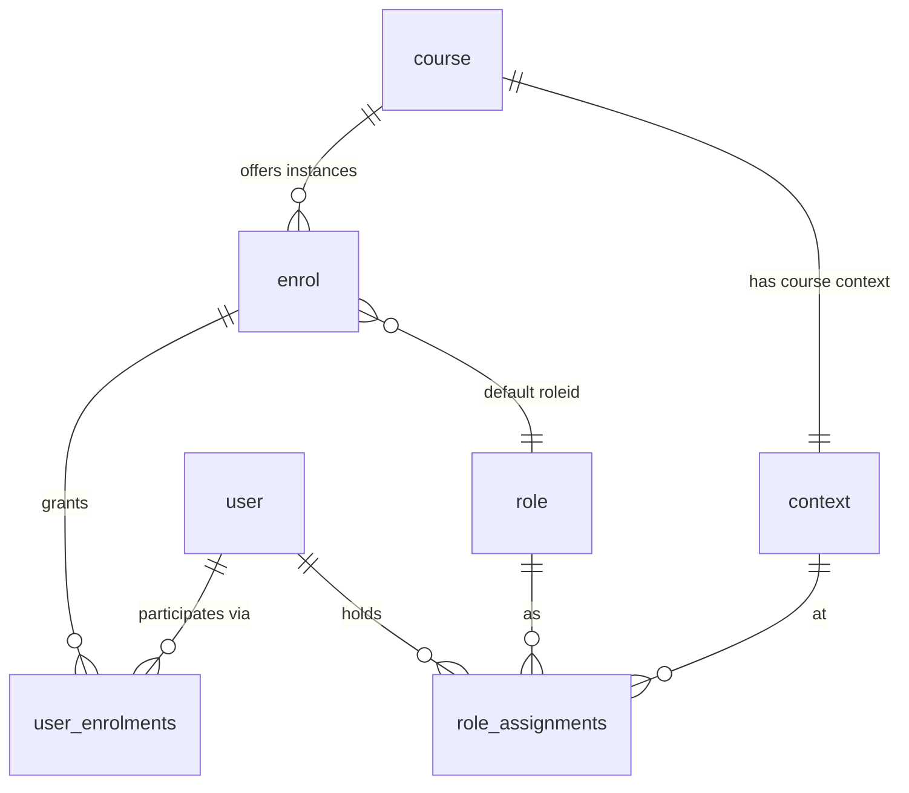
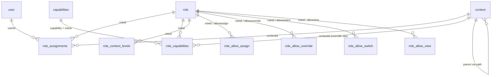
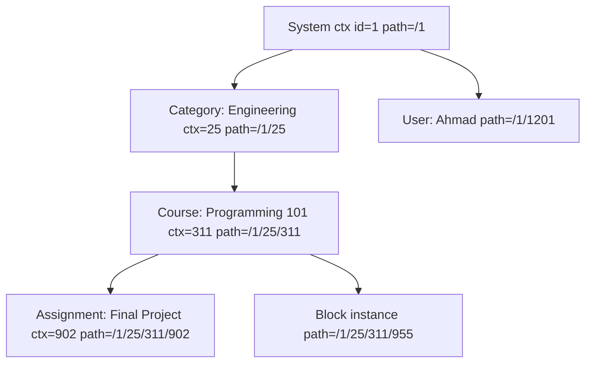
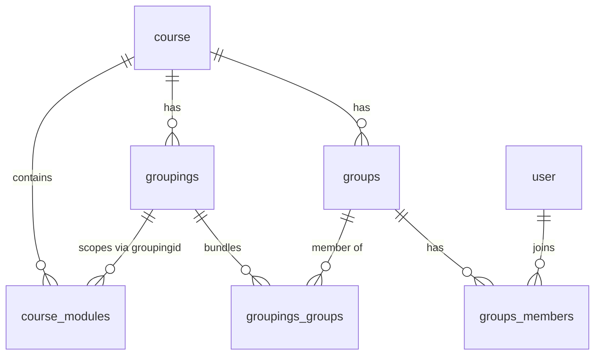
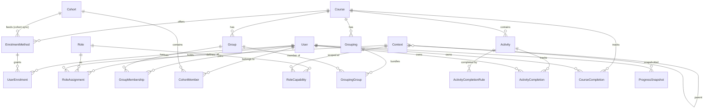

# Moodle People, Enrolment, Roles, Groups, and Progress — Complete Guide

A standalone source-code investigation of Moodle's People and Enrolment domain, written for Team 2.
All file paths are relative to the repository root; Moodle source lives under `public/`.
All line numbers were read at commit `23f47c2e4349231defd8cf56935558e41242ea8e`.

Named users used throughout:

```text
Ahmad — Student            (member of group Lab A)
Badr  — Student            (member of group Lab B)
Sara  — Editing Teacher
Omar  — Non-editing Teacher / Teaching Assistant (member of Lab A)
Lina  — Manager
Nour  — Course Creator
```

Evidence classification used throughout:

```text
CONFIRMED_FROM_SOURCE      — read directly from code/schema at the stated line numbers
STRONGLY_INFERRED          — follows from confirmed code; exact runtime output not executed
PLUGIN_SPECIFIC            — true for the named plugin only; other plugins may differ
REQUIRES_LIVE_VALIDATION   — cannot be fully settled by reading source; needs a running site
UNRESOLVED                 — open question after investigation
```

---

## 1. Executive Overview

### What this domain controls

The People and Enrolment domain answers one question in many disguises:

> **Can this user perform this exact action in this exact place against this exact target — and why?**

Moodle does not answer it with one system. It answers it with a **pipeline of independent systems**, each with its own tables, its own code, and its own failure mode:

```text
User
→ Authentication      (is this really Ahmad, may he log in?)
→ Enrolment           (is Ahmad connected to this course, actively?)
→ Role                (what is Ahmad here — Student? Teacher?)
→ Context             (where exactly is "here" in the site tree?)
→ Capability          (does any of his roles allow this atomic action?)
→ Group Scope         (which subset of people/content may the action touch?)
→ Activity Rule       (is the activity visible, available, open, in the right state?)
→ Final Decision
```

Enrolment, roles, groups, and completion are **separate systems on purpose**: enrolment is participation (a roster fact), a role is a permission template (a policy fact), a group is a partition of participants (a scoping fact), and completion is derived progress state (a tracking fact). No single table or function combines them; every real business action consults several. Understanding Moodle means never letting these collapse into one mental object called "access".

### Main source directories

| Area | Directory / file |
|---|---|
| Login, sessions, course door | `public/lib/moodlelib.php`, `public/lib/classes/session/` |
| Roles, contexts, capabilities | `public/lib/accesslib.php`, `public/lib/db/access.php`, `public/lib/classes/context/` |
| Enrolment core + plugins | `public/lib/enrollib.php`, `public/enrol/*` |
| Cohorts | `public/cohort/` |
| Groups and groupings | `public/lib/grouplib.php`, `public/group/lib.php` |
| Completion and progress | `public/lib/completionlib.php`, `public/completion/` |
| Schema | `public/lib/db/install.xml` |
| Events | `public/lib/classes/event/` |

### Repository baseline (CONFIRMED_FROM_SOURCE)

- Version `$version = 2026071400.00`, release `5.3dev (Build: 20260714)`, branch `503`, maturity `MATURITY_ALPHA` — `public/version.php:32–37`.
- Git branch `main`, commit `23f47c2e434` ("weekly release 5.3dev").
- **This is a development branch, not a stable release.** Function and table names are stable; exact line numbers drift weekly. Every CONFIRMED_FROM_SOURCE claim is confirmed *for this commit*; before Team 2 freezes any contract, re-verify against the actual demo target version.
- Database prefix convention: `mdl_` (`config-dist.php` template default).

### Main findings (previewed, developed throughout)

1. **The Site Administrator is not a role** — a config user-id list bypasses the permission engine (§18).
2. **Account suspension and enrolment suspension are unrelated switches** with different scopes and different data effects (§5, §62).
3. `role_assignments` has **no unique index** — the same (user, role, context) may exist once per provenance; any external mirror must tolerate duplicates (§29, §65).
4. **Guests never get `user_enrolments` rows**, and a hard gate denies them every write/risky capability regardless of role configuration (§12, §24, §35).
5. **There is no single progress formula** — every screen computes its own numerator and denominator (§52).
6. **Moodle keeps almost no history**: past memberships, past role assignments, past enrolment states, and deleted-course progress are unrecoverable from live tables (§66, §53).

### Highest-priority runtime validations still required

Cross-group grading enforcement in web services; suspended-account roster visibility; Prevent-vs-Prohibit conflict outcomes; FAIL_HIDDEN and hidden-activity progress; dual-path unenrolment role survival; deletion orphans. Full catalogue in §76.

---

# Part A — User Accounts and Authentication

## 2. User Account Model

### Layer 1 — Beginner explanation

A user account is only a statement that a person *exists on the site*. Five statements that sound identical are all different:

```text
User exists          → a row in the user table
User can log in      → account active + confirmed + auth plugin accepts credentials
User is enrolled     → a user_enrolments row connects them to a course
User has a Role      → a role_assignments row (or a virtual role) applies somewhere
User can access a Course → the whole pipeline of §1 passes for that course
```

Ahmad can exist without being able to log in (suspended). He can log in without being enrolled anywhere. He can be enrolled without holding the Student role (unusual, but legal). He can hold a role in a course he cannot open (§30).

### Layer 2 — The `user` table (CONFIRMED_FROM_SOURCE, `public/lib/db/install.xml` ~L870–940)

- **Identity**: `id`, `username`, `mnethostid` — unique composite index `(mnethostid, username)` (L924): usernames are unique per host.
- **Authentication method**: `auth` — the plugin name (`manual`, `email`, `ldap`, ...); empty falls back to `manual` (`moodlelib.php:3880`).
- **State flags**: `confirmed` (0 = signup not yet confirmed), `suspended` (schema comment: "suspended flag prevents users to log in", L877), `deleted` (tombstone flag — the row is never physically removed), `policyagreed`.
- **Timestamps**: `firstaccess`, `lastaccess` (site-wide), `lastlogin`, `currentlogin`, `timecreated`, `timemodified`, `lastip`. Per-course last access lives in the separate `user_lastaccess` table (§4).
- **Guest**: a real row, `username='guest'`, created at install (`public/lib/db/install.php:204–221`), id stored in `$CFG->siteguest`.
- **Site administrator**: *not* a field on `user` — a config list (§18).

### User deletion and anonymization — `delete_user()` (`public/lib/moodlelib.php:3555`)

The row is **kept but anonymized**, in this order (CONFIRMED_FROM_SOURCE):

1. Plugin `pre_user_delete` callbacks + `before_user_deleted` hook (L3587–3599).
2. `grade_user_delete()` — grades removed but preserved in grade *history* tables (L3608).
3. `enrol_user_delete()` — unenrolled everywhere via each plugin (L3616).
4. `role_unassign_all(['userid' => …])` — every role assignment removed (L3620).
5. Bulk deletes: `cohort_members`, `groups_members`, `user_enrolments`, `user_preferences`, `user_lastaccess`, tokens, private keys (L3628–3666).
6. `\core\session\manager::destroy_user_sessions()` (L3674).
7. Anonymization: `username` → email-derived + timestamp (collision-looped), `deleted=1`, `email = md5(username)`, `idnumber=''`, `picture=0` (L3676–3713).
8. User-context *content* deleted, but the context row is retained; `\core\event\user_deleted` fires with a full old-record snapshot (L3716–3738).

**Survives deletion**: the anonymized `user` row; authored content (forum posts, submissions as course data); grade history; log rows.
**Removed by deletion**: enrolments, role assignments, group memberships, cohort memberships, preferences, sessions. `course_modules_completion` rows are *not* in the delete list — STRONGLY_INFERRED they persist as orphans; REQUIRES_LIVE_VALIDATION (§76 E-20).

## 3. Authentication vs Enrolment

### Layer 1 — Beginner explanation

```text
Authentication answers:  Who are you, and can you log in?
Enrolment answers:       Which Course are you connected to?
```

Sara can authenticate through the university's LDAP server yet be enrolled in Programming 101 manually. Ahmad can have a manual account yet self-enrol using an enrolment key. The two systems never share tables: authentication decides the `user` row and the login; enrolment decides `enrol`/`user_enrolments` rows.

The single most common confusion, stated plainly:

```text
Email self-registration   — an AUTHENTICATION plugin: creates site accounts.
Course self-enrolment     — an ENROLMENT plugin: joins existing users to courses.
```

They are configured in different places and enabled independently.

### Layer 2 — Auth plugin inventory (CONFIRMED_FROM_SOURCE, `public/auth/` listing)

| Plugin | Mechanism | Team 2 relevance |
|---|---|---|
| `manual` | Admin-created accounts, local passwords; fallback when `user.auth` is empty (`moodlelib.php:3880`) | **Primary** — demo accounts |
| `email` | Self-registration with email confirmation; the default registration auth (`lib/db/install.php:121`) | Explains the `confirmed` state |
| `none` | Accepts any credentials, auto-creates accounts (testing only) | Avoid |
| `nologin` | Blocks login for the account — a soft-disable pattern distinct from suspension | Worth knowing |
| `ldap` | External directory bind; user record synced on login (`moodlelib.php:3996–3999`) | Background |
| `oauth2` | External identity providers (Google/Microsoft) | Background |
| `shibboleth` | SSO via SAML environment variables | Background |
| `lti` | Accounts for users arriving through LTI launches | Background |
| `webservice` | Web-service-only accounts; exempt from the site-policy check (`moodlelib.php:2468`) | Background |

No CAS or MNet auth plugin exists in this tree. **Guest login is not an auth plugin**: the guest is a fixed local account auto-logged-in by `require_login()` when `$CFG->autologinguests`, or via the login-page guest button (`public/login/index.php:152`).

From Team 2's perspective every auth plugin ends at the same point: a `user` row and `AUTH_LOGIN_OK`. The handshake internals of LDAP/OAuth2/Shibboleth are out of scope; the *state semantics* (confirmed/suspended/deleted) are in scope because they gate everything downstream.

## 4. Login and Session Lifecycle

### Layer 1 — Beginner explanation

Logging in is a short pipeline: check who you are → kill and recreate the session id → stamp the login times → from then on, every page you touch refreshes "last access". Logging out (or being suspended, or deleted, or changing password) destroys the session. Moodle remembers your last access twice: once site-wide, once per course.

### Layer 2 — Source trace (CONFIRMED_FROM_SOURCE)

- **Login validation** — `authenticate_user_login()` (`public/lib/moodlelib.php:3792`): looks up the user (lookup requires `deleted=0` — a deleted username returns `AUTH_LOGIN_NOUSER`, L3905–3911), validates login token/recaptcha, runs `\core_auth\validate_user::validate_before_web_login()` (suspension throws `user_suspended_exception` → `AUTH_LOGIN_SUSPENDED`, L3888–3894; auth-disabled checks), loops the enabled auth plugins calling `user_login()`, re-checks suspension post-auth (L4027), returns the user or a failure code (`AUTH_LOGIN_SUSPENDED`, `AUTH_LOGIN_NOUSER`, `AUTH_LOGIN_LOCKOUT`, ...).
- **Session creation** — `complete_user_login()` (`moodlelib.php:4071`): calls `\core\session\manager::login_user()` (session-id regeneration against fixation), then `update_user_login_times()` (`moodlelib.php:2993`: sets `firstaccess` if empty, `lastlogin` = previous `currentlogin`, `currentlogin` = now, `lastaccess`, `lastip`), fires `\core\event\user_loggedin` (:4087).
- **Session storage**: the `sessions` table when DB sessions are configured, otherwise files — handler selection in `public/lib/classes/session/manager.php:345`.
- **Last access, two grains** — `user_accesstime_log()` (`public/lib/datalib.php:1588`): updates site-wide `user.lastaccess/lastip` (throttled by `LASTACCESS_UPDATE_SECS`) *and* upserts one `user_lastaccess` row per (userid, courseid) — unique index `(userid, courseid)`. Per-course "last access" columns in reports read this table; self-enrolment's "unenrol inactive" policy reads it too (§9).
- **Session destruction**: logout (`user_logout()` fires `user_loggedout`, `moodlelib.php:2738`); **suspension destroys active sessions immediately** (`admin/user.php:134` calls `destroy_user_sessions()`) — suspension is not merely "no future logins"; deletion does the same (§2); password change likewise.
- **Guest sessions**: `require_login()` can auto-login guests (`moodlelib.php:2329–2338`); the guest session is a normal session on the shared guest account.
- **`require_login()` without a course** (`moodlelib.php:2259`): enforces logged-in state, forced password change, complete profile, site policy (`policyagreed`, L2461–2479), maintenance mode. With a course argument it becomes the course door (§6, §30).

## 5. User Account State Matrix

### Layer 1 — Beginner explanation

Two different "suspended" concepts exist and they are **not** the same thing:

```text
Suspended user ACCOUNT     — Ahmad cannot log in to the site at all.
Suspended course ENROLMENT — Ahmad can log in, but one course treats him as inactive.
```

A suspended account with an active enrolment stays "enrolled" in the database. An active account with a suspended enrolment is a fully functional site citizen everywhere else.

### Layer 2 — State-by-state (all CONFIRMED_FROM_SOURCE unless marked)

**Active account** — `deleted=0, suspended=0, confirmed=1`. Everything downstream follows roles/enrolment.

**Suspended account** — `user.suspended=1`. Set from the admin user list (`public/admin/user.php:127–138`, requires `moodle/user:update`; the code guards only against suspending *yourself* or a *site admin* — `!is_siteadmin($user) and $USER->id != $user->id`, L130–131). Sessions destroyed instantly (L134). Login blocked pre- and post-auth (§4). **Critical finding:** `get_enrolled_sql()`/`get_enrolled_join()` (`enrollib.php:1536/1570`) filter *enrolment* status only — they never test `user.suspended`. An account-suspended user with an active enrolment **still appears in Participants lists and completion "tracked users"**; only specific queries exclude them explicitly (e.g. the expiry-notification task joins `u.suspended = 0`, `enrollib.php:3194`). Nothing is deleted; unsuspending restores everything.

**Deleted account** — anonymized in place (§2). Login impossible; enrolments/roles/groups gone; authored content and grade history remain.

**Unconfirmed account** — `confirmed=0`. `authenticate_user_login()` itself does **not** block unconfirmed users; enforcement is at the web login page (`public/login/index.php:190–203`) and `validate_is_confirmed()` for token logins. Cron task `core\task\delete_unconfirmed_users_task` (`public/lib/classes/task/delete_unconfirmed_users_task.php:45–74`) hard-deletes accounts older than `$CFG->deleteunconfirmed` hours via `delete_user()` — demo accounts can vanish via cron.

**Guest account** — real row, id `$CFG->siteguest`; detected by `isguestuser()` (`accesslib.php:1863`). Gets the guest role *virtually* (§12, §24) — no `role_assignments` row. Hard-blocked from all write/risky capabilities (`accesslib.php:481–485`).

**Authenticated user** — every non-guest logged-in user virtually holds `$CFG->defaultuserroleid` at system context (`accesslib.php:920–924`) — again no `role_assignments` row (§25).

**Not-logged-in user** — userid 0 evaluates with `$CFG->notloggedinroleid` (`accesslib.php:992–994`); `$CFG->forcelogin` makes `has_capability()` return false outright for userid 0 (`accesslib.php:476–478`); the guest write/risk gate applies equally.

**Site administrator** — not a role; see §18.

### The matrix

| State | Can log in | Site access | Course access | Roles retained | Enrolments retained | Groups retained | Completion retained | Submissions retained | Sessions retained |
|---|---|---|---|---|---|---|---|---|---|
| Active | ✓ | ✓ | per enrolment/roles | ✓ | ✓ | ✓ | ✓ | ✓ | ✓ |
| Suspended account | ✗ | ✗ | ✗ (cannot log in) | ✓ rows intact | ✓ rows intact (still "enrolled" in data) | ✓ | ✓ (still in tracked users — data level) | ✓ | ✗ destroyed |
| Deleted account | ✗ | ✗ | ✗ | ✗ removed | ✗ removed | ✗ removed | ~ orphaned rows (REQUIRES_LIVE_VALIDATION) | ✓ content remains | ✗ destroyed |
| Unconfirmed | ✗ (blocked at login page) | ✗ | ✗ | possible | possible | possible | — | — | — |
| Guest | ✓ (guest login) | read-mostly | only guest-access courses | virtual guest role | never any | none | never tracked | cannot submit | ✓ |
| Not logged in | n/a | public pages only | ✗ | virtual not-logged-in role | — | — | — | — | — |
| Site admin | ✓ | everything (bypass) | everything | n/a (not a role) | only if actually enrolled | only if added | only if enrolled+capability | ✓ | ✓ |

Suspended **enrolment** (`user_enrolments.status=1`) is deliberately absent from this table — it is not an account state. Side-by-side comparison in §62.

---

# Part B — Enrolment

## 6. What Enrolment Means

### Layer 1 — Beginner explanation

Enrolment connects Ahmad to a course. Three nested objects are involved, and naming them precisely prevents most confusion:

```text
Enrolment PLUGIN    — a strategy: "manual", "self", "cohort", "guest", ...
Enrolment INSTANCE  — that strategy switched on in one course, with settings
                      ("this course has self-enrolment with key 'sesame'")
USER ENROLMENT      — one user connected through one instance
                      ("Ahmad joined through the self-enrolment instance")
```

A user enrolment can be **active** or **suspended**, and carries an optional **time window** (start/end). It becomes ineffective if it expires, if its instance is disabled, or if it is suspended — and each of those failure modes looks different in the UI. Unenrolment deletes the user-enrolment row; re-enrolment creates or reactivates it. Enrolling usually also assigns a role (the instance's configured default), which is a *separate row in a separate system* (§29).

Beginner walk-through: Sara enrols Ahmad manually as Student. That writes one `user_enrolments` row (participation) and one `role_assignments` row (permissions). If Sara later *suspends* the enrolment, the participation row flips to suspended — the role row usually stays. If she *unenrols* him, both go away (with subtleties — §11).

### Layer 2 — Effective ("active") enrolment (CONFIRMED_FROM_SOURCE)

Constants (`public/lib/enrollib.php`): `ENROL_INSTANCE_ENABLED=0` / `DISABLED=1` (:31/:34); `ENROL_USER_ACTIVE=0` / `ENROL_USER_SUSPENDED=1` (:37/:40); `ENROL_MAX_TIMESTAMP=2147483647` (:46); external-removal policies `ENROL_EXT_REMOVED_UNENROL=0`, `KEEP=1`, `SUSPEND=2`, `SUSPENDNOROLES=3` (:49–68).

Four conditions must **all** hold for a path to count as active (`get_enrolled_join()` where-clauses, `enrollib.php:1596–1597`):

1. `user_enrolments.status = 0` (active),
2. `enrol.status = 0` (instance enabled),
3. `timestart` passed (or 0),
4. `timeend` not passed (or 0). (Time comparison uses `round(time(), -2)` — boundaries are ~100-second granular.)

`is_enrolled($context, $user, '', $onlyactive)` (`enrollib.php:1385`): guest → always false; front-page course → everyone true (:1407); `$onlyactive=true` uses the four conditions via `enrol_get_enrolment_end()`; `$onlyactive=false` is a bare existence check that counts even suspended/expired/disabled paths.

## 7. Enrolment Database Model

### Layer 2 — Tables (CONFIRMED_FROM_SOURCE, `public/lib/db/install.xml`)

| Table | Purpose | PK | FKs | Unique | Status fields | Time fields | Provenance | Nature | Deletion behavior |
|---|---|---|---|---|---|---|---|---|---|
| `enrol` | one row per enrolment *instance* in a course | id | courseid, roleid | **none** — several instances of the same plugin per course are legal | `status` (instance enabled), `enrol` (plugin name), `password`, `customint1..8`, `customtext1..4` | enrolstartdate/enddate, timecreated/modified | plugin name in `enrol` | configuration | removed with course or by hand; removal unenrols its users |
| `user_enrolments` | one row per user per instance | id | enrolid, userid | **(enrolid, userid)** | `status` (0 active / 1 suspended) | timestart, timeend, timecreated, timemodified | via `enrol.enrol` | current state | unenrol / user delete; **no history of past states** |
| `user` | identities | id | — | (mnethostid, username) | confirmed, suspended, deleted | §2 | auth | current | anonymized, never removed |
| `course` | courses | id | category | — | visible, groupmode, enablecompletion | timecreated/modified | — | current/config | full cascade on delete |
| `role_assignments` | who-is-what-where | id | roleid, contextid, userid | **none** | — | timemodified | **component, itemid** | current | per-path + last-path + user-delete cleanup (§29) |
| `context` | scope tree | id | — | (contextlevel, instanceid) | locked | — | — | current | with instance |

The **(enrolid, userid)** uniqueness is the key design fact: participation multiplicity is **per method, not per course**. Two methods = two rows for the same user in the same course; the same method cannot double-enrol.



Shared machinery every plugin uses — `enrol_plugin` base class (`public/lib/enrollib.php`): `enrol_user()` (:2112 — writes/updates the row, assigns the role, fires `user_enrolment_created`), `update_user_enrol()` (:2214 — status/date changes, fires `user_enrolment_updated`), `unenrol_user()` (:2294 — deletes the row, fires `user_enrolment_deleted`; "last enrolment" SQL at :2332–2336 and whole-course cleanup at :2340–2353 — when the **final** path to a course goes, group memberships in that course, per-course last access, and (per policy) roles are cleaned).

## 8. Manual Enrolment

### Layer 1 — Beginner explanation

Sara opens Participants → Enrol users, picks Ahmad, picks a role (default Student), optionally sets start/end dates, clicks Enrol. Later she can suspend him (kept on the roster, locked out), change his role, extend dates, or remove him. Manual enrolment is managed **user by user, by a human** — nothing synchronizes it, nothing re-adds a removed user. That is both its simplicity and its cost.

### Layer 2 — Source workflow (CONFIRMED_FROM_SOURCE; `public/enrol/manual/lib.php`)

- **Instance**: courses get one `enrol` row (`enrol='manual'`) by default; default role from setting `enrol_manual/roleid` (student). Config gated by `enrol/manual:config`.
- **Enrolling**: UI (`enrol/manual/manage.php`; link built by `get_manual_enrol_link()` :59, gated `enrol/manual:enrol` :71) → `enrol_user()`. Manual overrides `roles_protected()` to **false** (:32–35) — its role assignments are written *without* component ownership, so admins can freely change/remove those roles later (`allow_enrol/unenrol/manage` all true, :37–47). This one flag explains most multi-path role-cleanup behavior (§11, §61).
- **Rows**: one `user_enrolments` (status 0, timestart/timeend) + normally one `role_assignments` (component `''`).
- **Suspension**: status → `ENROL_USER_SUSPENDED` via `update_user_enrol()`; UI "Edit enrolment". The suspend itself does not touch roles.
- **Expiry**: task `\enrol_manual\task\sync_enrolments` runs `sync()` (:254) honoring `expiredaction` (default **KEEP** :276): UNENROL → `role_unassign_all` + `unenrol_user` (:278–298); SUSPEND / SUSPENDNOROLES → suspend, the latter also strips roles (:300–326). Expiry notifications via a separate task with `expirynotify/expirythreshold/expirynotifyhour`.
- **Bulk operations**: `get_bulk_operations()` (:376) — edit-selected / delete-selected, gated `enrol/manual:manage`.
- **Recover grades**: `enrol_user(..., $recovergrades)` defaults to `$CFG->recovergradesdefault`; when set, `grade_recover_history_grades()` restores previous grades on re-enrolment (`enrollib.php:2187–2190`).
- **Re-enrolment**: enrolling an already-known user updates the existing row (uniqueness (enrolid, userid)).
- **Events**: `user_enrolment_created/updated/deleted` (§67).

## 9. Self Enrolment

### Layer 1 — Beginner explanation

The course door with a keypad. Ahmad clicks "Enrol me"; if the course demands an enrolment key he must type it; if the key he types happens to be a *group's* enrolment key, he lands directly in that group. Remember §3: this is **not** email self-registration — self-enrolment only joins *existing* users to courses.

### Layer 2 — Instance settings map (CONFIRMED_FROM_SOURCE; `public/enrol/self/lib.php`, defaults :421–426)

| Field | Meaning |
|---|---|
| `password` | enrolment key |
| `customint1` | "use group enrolment keys" flag |
| `customint2` | longtimenosee — unenrol after N seconds of course inactivity |
| `customint3` | max enrolled users (0 = unlimited) |
| `customint4` | send course welcome message option |
| `customint5` | restrict to members of a cohort (cohort id) |
| `customint6` | new enrolments allowed flag |
| `customtext1` | welcome message body |
| `roleid` | role granted (default student) |
| `enrolperiod` | enrolment duration from the moment of enrolling |
| `enrolstartdate`/`enrolenddate` | sign-up window |

- **Gate chain** — `can_self_enrol()` (:275): guest denied → already-enrolled denied → `is_self_enrol_available()` (:310): instance enabled → sign-up window → `customint6` new-enrolments flag → maxenrolled (:334–341) → cohort membership (:343–353) → finally capability `enrol/self:enrolself` (archetype `user` — i.e. the Authenticated User role, not Student, is what allows self-enrolling; `enrol/self/db/access.php:77`).
- **Key check**: form validation compares `password`; with `customint1`, `enrol_self_check_group_enrolment_key()` (`enrol/self/locallib.php:38`) accepts any course group's `enrolmentkey`.
- **Group placement**: a matched group key → `groups_add_member($group->id, $USER->id)` (`lib.php:193–207`). **This membership carries no component** — it looks manual, is not enrol-owned, and is therefore not cleaned when the self-enrolment path is removed (only by last-path cleanup). STRONGLY_INFERRED consequence; REQUIRES_LIVE_VALIDATION (§76 E-14).
- **Duration**: `enrol_user(..., $timestart, $timeend)` with timeend = now + `enrolperiod` (:188–189).
- **Unenrol inactive**: `sync()` (:459) unenrols users whose `user.lastaccess` / `user_lastaccess.timeaccess` is older than `customint2` (:484–517) — enrolment silently depends on the last-access table.
- **Self-unenrol**: `enrol/self:unenrolself` (`db/access.php:58`), page `enrol/self/unenrolself.php`. Manual enrolments expose no student-side unenrol.
- **Re-enrolment**: allowed whenever the gate chain passes again; the row is re-created or reactivated.
- **Security**: keys are shared secrets — rotate them; a leaked *group* key silently sorts strangers into that group; `customint3=0` means unlimited.

## 10. Cohorts and Cohort Sync

### Layer 1 — Beginner explanation

A **cohort** is a site-wide (or category-wide) *bag of people* — "Computer Science 2026". It is not attached to any course and by itself grants nothing. **Cohort sync** is a pipe attached to one course: everyone in the bag is automatically enrolled with a chosen role (optionally dropped into a chosen group); people removed from the bag are automatically removed or suspended, per policy.

### Layer 2 — Source trace (CONFIRMED_FROM_SOURCE)

- **Cohort storage**: `cohort` (contextid = system or category, `visible`, `component` for plugin-owned cohorts — install.xml L2438–2456) + `cohort_members` (UNIQUE `(cohortid, userid)`, `timeadded`). API `cohort_add_member/remove_member` (`public/cohort/lib.php:189/218`) fire `cohort_member_added/removed`. Capabilities: `moodle/cohort:manage` (manager default, `access.php:763`), `moodle/cohort:assign` (:773), `moodle/cohort:view` (:783 — editingteacher, manager).
- **Instance**: `enrol` row `enrol='cohort'`; `customint1` = cohort id (`enrol/cohort/locallib.php:195`), `customint2` = group id for auto-membership, `roleid` = role to assign. Creating one requires `moodle/course:enrolconfig` + `enrol/cohort:config` (`enrol/cohort/lib.php:95–102`) — a teacher can set it up if the cohort is visible to them.
- **Event-driven sync**: `enrol/cohort/db/events.php:30–40` registers legacy-style handler callbacks `enrol_cohort_handler::member_added` / `::member_removed` (class in `public/enrol/cohort/locallib.php:37`, methods at :43/:94) with includefile `/enrol/cohort/locallib.php` — membership changes propagate immediately. **Full sync** `enrol_cohort_sync()` (`locallib.php:167`) reconciles everything and runs when instances change.
- **Member added** → `enrol_user(..., ENROL_USER_ACTIVE)`; suspended existing rows are reactivated via `update_user_enrol` (:191–217); the role is assigned with **component `'enrol_cohort'`, itemid = instance id** (the base-class default `roles_protected()` = true governs this).
- **Member removed** → per `unenrolaction` (default `ENROL_EXT_REMOVED_UNENROL`, :188): UNENROL → `unenrol_user()` (full path removal); SUSPEND → status flip only; SUSPENDNOROLES → suspend + `role_unassign_all(component='enrol_cohort', itemid=instance)` (:237–249).
- **Group mapping**: `groups_sync_with_enrolment('cohort', $courseid)` (:302) — adds missing members to group `customint2` with `component='enrol_cohort', itemid=<instance>`, removes stale enrol-owned memberships pointing at other groups (`group/lib.php:1194–1236`).
- **Plugin disabled** → `role_unassign_all(['component' => 'enrol_cohort'])` sitewide (:172–176).
- **Re-addition**: putting the user back into the cohort re-fires the handler → re-enrol/reactivate; group membership re-added by sync.

### The five-concept comparison

| Concept | Lives at | Members added by | Grants course access? | Removed when… |
|---|---|---|---|---|
| Cohort | Site/category (`cohort`) | Admin/plugin (`cohort_members`) | Never by itself | Cohort deleted / member removed |
| Cohort Sync (enrol instance) | One course (`enrol`) | Automatically from the cohort | **Yes** (creates `user_enrolments`) | Instance removed → users unenrolled per policy |
| Manual bulk enrolment of cohort members | One course | A human, once | Yes | Only by hand — nothing syncs it |
| Course Group | One course (`groups`) | Manual/enrol-component (`groups_members`) | No — joining *requires* enrolment (`groups_add_member` guard, `group/lib.php:68–71`) | Group deleted / member removed / last-path unenrol |
| Grouping | One course (`groupings`) | Contains groups, not users | No | Grouping deleted |

## 11. Multiple Enrolment Methods

### Layer 1 — Beginner explanation

Ahmad can be connected to Programming 101 twice: once manually (Sara enrolled him), once through cohort sync (he is in "CS 2026"). Two doors into the same room. He can walk in while at least one door is open; each door can close independently; and each door may have handed him a *different* role badge.

### Layer 2 — Row-level behavior (CONFIRMED_FROM_SOURCE unless marked)

- **Two `user_enrolments` rows** — different `enrolid`s; uniqueness is `(enrolid, userid)`, so per-method rows coexist.
- **Role provenance differs**: manual → `role_assignments.component=''` (manual's `roles_protected()` = false); cohort → `component='enrol_cohort', itemid=<instance>`. Because `role_assignments` has **no unique index**, the same (user, role, context) can exist twice — once per provenance (§29).
- **Effective access**: active if *any* path is active. Active manual + suspended cohort → in; suspended manual + active cohort → in; both suspended → course door shut.
- **Effective roles**: the union of all roles from all paths (aggregation semantics §33).
- **Removing one path** (e.g. cohort member removed, policy UNENROL): deletes the cohort `user_enrolments` row and *its owned* role assignment. The "last enrolment" SQL (`enrollib.php:2332–2336`) still finds the manual path → **no whole-course cleanup**; Ahmad stays enrolled as Student, keeps groups and completion.
- **Removing the manual path instead**: the manual row is deleted; the per-path role cleanup looks for `component='enrol_manual'` rows — but manual wrote its role assignment with **no** component, so that role survives the per-path branch and falls only to the **last-path** branch. With the cohort path still active, Ahmad keeps the manually-assigned role. STRONGLY_INFERRED from `unenrol_user()` ordering (`enrollib.php:2319–2353`); REQUIRES_LIVE_VALIDATION (§76 E-24).
- **Removing the final path**: whole-course cleanup — group memberships in the course deleted (`groups_delete_group_members`, `group/lib.php:715` path), `user_lastaccess` row deleted, roles removed per policy. Completion rows **remain** (state, not participation).
- **Grades**: not deleted by unenrolment; `recovergrades` can resurrect gradebook state on re-enrolment (§8).
- **Re-enrolment effects**: a new `user_enrolments` row (or reactivation); completion rows are still there from before — progress "resumes" because it never left.

Worked examples:

1. *Manual Student + cohort Student*: possibly two identical-looking role rows with different provenance. Remove the cohort → one row disappears, role intact via the manual row.
2. *Manual Student + cohort TA-role*: union Student ∪ TA while both live; drop the cohort (UNENROL) → TA role goes (component-owned), Student stays.
3. *Suspend manual, keep cohort active*: door open via cohort; the suspended row sits inert; Participants shows him active (any-path logic in the roster query).

## 12. Guest Access

### Layer 1 — Beginner explanation

Three different "guest" things exist; mixing them up causes endless confusion:

```text
Guest AUTHENTICATION/session — being logged in as the shared 'guest' account
Guest ROLE                   — the permission template applied to that account
Guest ENROLMENT METHOD       — a per-course switch: "visitors may peek into this course"
```

A guest can walk through a course that enabled guest access and read pages — but cannot submit, post, attempt, or be remembered. An anonymous window-shopper.

### Layer 2 — Source trace (CONFIRMED_FROM_SOURCE; `public/enrol/guest/lib.php`)

- **No enrolment, ever**: `enrol_user()` is a stub — "no real enrolments here!" (:72). Guests never get `user_enrolments` rows, never appear in Participants or any enrolled-users SQL.
- **Access grant is per-session**: `try_guestaccess()` (:95) checks the instance password (empty = open; else the session-entered key kept in `$USER->enrol_guest_passwords`), loads a **temporary course role** `load_temp_course_role($context, $CFG->guestroleid)` and returns `ENROL_MAX_TIMESTAMP` (:123–127). `require_login()` calls this in its plugin loop and caches the grant in `$USER->enrol['tempguest'][courseid]` (`moodlelib.php:2607–2621`); `can_access_course()` re-runs the same loop for navigation (`accesslib.php:2070–2087`).
- **One instance per course**, enforced by code, not schema (:135–144); config capability `enrol/guest:config`.
- **Why guests cannot participate**: the hard gate in `has_capability()` — guests (and userid 0) are denied every `write`-type capability and every capability carrying `RISK_XSS|RISK_CONFIG|RISK_DATALOSS`, *regardless of role configuration* (`accesslib.php:481–485`). Submitting, posting, attempting are write caps → structurally impossible. Additional scattered `isguestuser()` checks exist in modules (e.g. `mod/forum/lib.php:544, 3545`) — PLUGIN_SPECIFIC.
- **Completion**: never tracked — tracked users require enrolment (`completionlib.php:1445–1472`).
- **Groups**: guests hold no memberships; group-restricted content treats them as a non-member.
- **Shared identity**: all guests are user `$CFG->siteguest`; log rows exist (logstore `logguests` setting) but are attributed to the shared account — useless for per-person analytics.

## 13. Meta Enrolment

### Layer 1 — Beginner explanation

A meta link says: "whoever is enrolled in the Parent Course is automatically enrolled here too". Useful for umbrella courses — a 'Department Lounge' fed by every department course.

### Layer 2 — Source trace (CONFIRMED_FROM_SOURCE, `public/enrol/meta/lib.php` + `locallib.php`)

- The instance lives in the **child** course; `customint1` = the **parent** course id (name lookup :56; sync :97–112); `customint2` = optional group in the child for synced users (via `groups_sync_with_enrolment`; auto-create option `ENROL_META_CREATE_GROUP`).
- Sync (`sync_with_parent_course()` :81) mirrors the parent's enrolment **status and time window** (active if any active parent path; min timestart / max timeend :145–176) and assigns the parent's roles in the child (excluding `nosyncroleids` :117–128). Parent *meta* enrolments are ignored (`e.enrol <> 'meta'` :100) — no chains; self-link guarded (:87).
- Removal follows `unenrolaction` (UNENROL / SUSPEND / SUSPENDNOROLES), driven by observers on `user_enrolment_*`, `role_assigned/unassigned`, `course_deleted` (`db/events.php:32–52`).
- **vs Cohort Sync**: meta's source of truth is *another course's roster with its roles*; cohort's is a *site-level member list with one configured role*.
- Team 2 relevance: background — but it proves provenance and multi-path handling must be plugin-agnostic (`component='enrol_meta'`).

## 14. Core Enrolment Plugin Inventory

CONFIRMED_FROM_SOURCE (directory listing + `lib.php` inspection). Default-enabled set on a fresh install: `manual,guest,self,cohort` (`lib/db/install.php:122`).

| Plugin | Mechanism (one line) | Team 2 classification |
|---|---|---|
| `manual` | Human enrols users one by one; expiry sync task | **Required for Team 2** (§8) |
| `self` | User enrols themself; optional key / group keys / cohort gate | **Required for Team 2** (§9) |
| `cohort` | Event-driven sync of a site cohort into a course with role+group | **Required for Team 2** (§10) |
| `guest` | No enrolment; temporary in-session course role | **Required for Team 2** (§12) |
| `meta` | Mirrors a parent course's enrolments into a child course | Useful background (§13) |
| `category` | Auto-enrols holders of a role with `enrol/category:synchronised` at category level | Useful background; observer-based (`enrol/category/db/events.php:31`) |
| `database` | Sync from an external SQL table | External-system dependent |
| `flatfile` | Scheduled CSV processing (add/del, role, user, course) | External-system dependent |
| `imsenterprise` | IMS Enterprise XML import | External-system dependent |
| `ldap` | Enrolments read from an LDAP directory | External-system dependent |
| `lti` | Publishes course/activity as an LTI tool; remote learners enrolled via launches | High complexity — not suitable for four-day scope |
| `paypal` | Legacy PayPal IPN paid enrolment | Not suitable for four-day scope |
| `fee` | Paid enrolment on the core payment subsystem | Not suitable for four-day scope |

No `mnet` or `apply` plugin exists in this tree.

## 15. Enrolment Lifecycle Matrix

Legend: ✓ yes, ✗ no, ~ conditional. "Roles effective" = are the user's course-context roles evaluated by `has_capability`.

| Situation | Can log in | Can open course | In Participants | Roles effective | Groups retained | Completion retained | Submissions retained | Grades retained | Live validation? |
|---|---|---|---|---|---|---|---|---|---|
| Active account + active manual enrolment | ✓ | ✓ | ✓ | ✓ | ✓ | ✓ | ✓ | ✓ | — |
| Active account + suspended manual enrolment | ✓ | ✗ (fails active-only gate) | ~ only to holders of `viewsuspendedusers` | ✓ (roles usually intact) | ✓ rows remain | ✓ rows remain; excluded from tracked users (onlyactive) | ✓ | ✓ | display details |
| Active manual + active cohort path | ✓ | ✓ | ✓ | ✓ union | ✓ | ✓ | ✓ | ✓ | — |
| Active manual + suspended cohort path | ✓ | ✓ (manual carries) | ✓ | ✓ | ✓ | ✓ | ✓ | ✓ | — |
| Suspended manual + active cohort path | ✓ | ✓ (cohort carries) | ✓ | ✓ | ✓ | ✓ | ✓ | ✓ | — |
| Expired enrolment (timeend past) | ✓ | ✗ (time window fails) | ~ | ✓ until sync applies `expiredaction` | ✓ | ✓ | ✓ | ✓ | ✓ per-plugin policy |
| Disabled enrolment instance | ✓ | ✗ (instance status fails) | ~ | ✓ | ✓ | ✓ | ✓ | ✓ | ✓ |
| Final path removed (full unenrol) | ✓ | ✗ | ✗ | ✗ (roles removed per policy) | ✗ (course memberships deleted) | ✓ rows remain | ✓ | ✓ (recoverable via recovergrades) | — |
| Re-enrolled user | ✓ | ✓ | ✓ | ✓ (fresh assignment) | ✗ must rejoin groups | ✓ old rows still there — progress resumes | ✓ | ~ recovergrades option | ✓ |
| Guest access | ✓ (as guest) | ✓ (temporary, per session) | ✗ never | virtual guest role only | none | never tracked | cannot submit | n/a | — |
| Role without enrolment | ✓ | ✗ unless `moodle/course:view` (§30) | ✗ (shown under "Other users") | ✓ | ✗ (cannot join groups) | ✗ not tracked | n/a | n/a | ✓ endpoint specifics |

Evidence anchors: active-only conditions `enrollib.php:1596–1597`; participants forced-active filter `participants_search.php:582–600`; suspended-account non-filtering §5; `groups_add_member` guard `group/lib.php:68–71`; tracked users `completionlib.php:1445–1472`; last-path cleanup `enrollib.php:2340–2353`.

---

# Part C — Complete Role Model

## 16. What a Moodle Role Really Is

### Layer 1 — Beginner explanation

A role is a **named bundle of permission defaults** — nothing more. It becomes meaningful only when *assigned to a person in a place*:

```text
Role        = "Student" (a reusable template of yes/no permissions)
Context     = "Course: Programming 101" (a place in the site tree)
Assignment  = "Ahmad is a Student in Programming 101"
Capability  = one atomic permission, e.g. mod/assign:submit
Override    = "in THIS forum, Students may not post" (a local exception)
```

Sara can be Teacher in Course A and simultaneously Student in Course B — roles are per-place, not per-person.

### Layer 2 — Tables (CONFIRMED_FROM_SOURCE, `public/lib/db/install.xml`)

| Table | Purpose | Key uniqueness facts |
|---|---|---|
| `role` | role definitions: `shortname`, `name`, `description`, `sortorder`, `archetype` | UNIQUE `shortname`, UNIQUE `sortorder` (L1184–1200). Standard roles have empty `name`/`description` — localized from lang packs |
| `role_assignments` | who has which role where: `roleid, contextid, userid, component, itemid, timemodified, sortorder` | **No unique index at all** — only non-unique composites incl. `(userid, contextid, roleid)` and `(component, itemid, userid)` (L1304–1328). Duplicates differing only in provenance are legal |
| `role_capabilities` | permission values per role per context (defaults at system context; overrides below) | UNIQUE `(roleid, contextid, capability)` (L1347) |
| `role_context_levels` | at which context levels a role may be assigned | UNIQUE `(contextlevel, roleid)` (L1374) |
| `role_allow_assign` | which roles a holder of role X may assign | UNIQUE `(roleid, allowassign)` (L1256) |
| `role_allow_override` | which roles X may override | UNIQUE `(roleid, allowoverride)` (L1271) |
| `role_allow_switch` | which roles X may switch to | UNIQUE `(roleid, allowswitch)` (L1286) |
| `role_allow_view` | which role names X may see | UNIQUE `(roleid, allowview)` (L1301) |
| `capabilities` | registry: `name, captype, contextlevel, component, riskbitmask` | UNIQUE `name` (L1241) |
| `context` | scope tree: `contextlevel, instanceid, path, depth, locked` | UNIQUE `(contextlevel, instanceid)` (L1214) |

Vocabulary mapped to storage:

- **Archetype** = `role.archetype`, one of exactly eight values from `get_role_archetypes()` (`accesslib.php:1171–1181`): `manager, coursecreator, editingteacher, teacher, student, guest, user, frontpage`. Used (a) at plugin installation to seed defaults, (b) on "reset role", (c) for the allow-matrix defaults. **Not consulted during permission evaluation.**
- **Capability defaults** = `role_capabilities` rows at the **system context**; anything at a lower context is an **override**.
- **Role provenance** = `role_assignments.component` (`''` = manual; `enrol_cohort`, ... = plugin-owned) + `itemid` (instance id).
- **Assignable / overrideable / switchable / viewable** = the four `role_allow_*` matrices, resolved by `get_assignable_roles()` (`accesslib.php:3321`), `get_overridable_roles()` (:3517), `get_switchable_roles()` (:3406), `get_viewable_roles()` (:3461) — each additionally gated by a capability (§36).
- **Role ordering** = `role.sortorder` (display) and `role_assignments.sortorder` (legacy; permission math is order-independent except the Prohibit veto).



## 17. Role Archetypes

### Layer 1 — Beginner explanation

An archetype is a **factory template**. At install time each capability declares "roles shaped like a Teacher get Allow by default". Sites can rename, clone, and freely edit the resulting roles — so **never treat archetype defaults as guaranteed runtime permissions**. Everything below is CONFIRMED_FROM_SOURCE *for fresh-install defaults* and REQUIRES_LIVE_VALIDATION for any specific site.

The default roles created at install (`public/lib/db/install.php:256–263`) map 1:1 to the eight archetypes.

### Archetype summaries (deep dives follow in §18–25)

| Role | Purpose | Typical context | Assigned by | Enrolment creates it? | Participant role? | Signature capabilities | Main risk |
|---|---|---|---|---|---|---|---|
| Manager | Delegated administration *inside* the rules | System / category | Manually | No | No | `moodle/course:view`, `moodle/role:manage`, `moodle/cohort:manage` | Near-admin power, often forgotten at category level |
| Course Creator | May create courses | Category | Manually | No (but creation auto-enrols — §20) | No | `moodle/course:create`, `viewhiddencourses` | Course sprawl + creator role in each |
| Editing Teacher | Owns and runs a course | Course | Usually via enrolment | Usually (default role of manual enrolment) | Yes | `course:update`, `manageactivities`, grading, groups | Backup/restore, enrolment control |
| Non-editing Teacher | Grade/facilitate, no structure changes | Course | Via enrolment | Sometimes | Yes | grading + viewing, **no** editing/groups/accessallgroups | Sees all participants by default |
| Student | Participate and be tracked | Course | Via enrolment | Yes (typical default) | Yes | `mod/assign:submit`, `mod/quiz:attempt`, `isincompletionreports` | XSS-flagged caps must never be added |
| Guest | Minimal read access | Virtual | Never assigned | Never | No | read-only; hard write/risk gate | RISK_PERSONAL read caps |
| Authenticated User | Everyone logged in, sitewide | System (virtual) | Automatic | No | No | profile, calendar, messaging, `enrol/self:enrolself` | Any Allow leaks into every course |
| Authenticated User on Front Page | Everyone logged in, front page only | Front-page course (virtual) | Automatic | No | No | site-home tuning | Low |

Common mistakes to avoid: treating Manager as "the admin role" (§18–19); expecting Course Creator to edit existing courses (§20); expecting a role assignment alone to open a course (§30); forgetting that every logged-in user carries the Authenticated User role *in addition to* course roles (§25).

There is **no ninth archetype**, no `doanything` capability, and no legacy `moodle/legacy:*` capabilities in this version (grep-confirmed). `moodle/site:config` has an **empty archetypes array** (`access.php:58`) — no role gets site administration by default; that is not how admin works at all (§18).

## 18. Site Administrator

### Layer 1 — Beginner explanation

Lina the Manager has a very powerful *role*. The Site Administrator has **no role at all** — Moodle keeps a simple VIP list of user ids, and the permission engine steps aside for them. You cannot "deny" an administrator anything with role overrides; the check is bypassed before roles are even read.

### Layer 2 — Source trace (CONFIRMED_FROM_SOURCE)

- **Storage**: config setting `siteadmins`, a comma-separated user-id list. Managed by `public/admin/roles/admins.php` (`set_config('siteadmins', ...)` at L116/140/165); can be pinned in `config.php` (admins.php:42).
- **Check**: `is_siteadmin()` — `accesslib.php:702` — `in_array($userid, explode(',', $CFG->siteadmins))` (L730–731). No role tables involved.
- **Bypass** inside `has_capability()` (`accesslib.php:432`), applied only when the caller passes `$doanything = true` (the default 4th parameter):
  - checking *another* user who is admin → `true` immediately (L543–545);
  - current user, admin, **no active role switch** → `true` (L547–549);
  - current user, admin, **role-switched somewhere on this context's path** → falls through to normal evaluation (L550–563).
- **Where the bypass does NOT apply**:
  1. While role-switched in the context path (above) — this is why "Switch role to Student" gives an honest preview (§37).
  2. Callers passing `$doanything = false` — checks that intentionally test real roles.
  3. Context locking: with `$CFG->contextlocking` and `$CFG->contextlockappliestoadmin`, write capabilities in locked contexts return false even for admins (`accesslib.php:488–500`).
  4. Anything that is not a capability check: enrolment-existence SQL, group filtering, plugin state. An admin is not `is_enrolled()` anywhere by default — `require_login()` has its own admin fast-path (`moodlelib.php:2437–2457`), but data queries like Participants simply don't include them.

| Question | Site Administrator | Manager |
|---|---|---|
| Normal role assignment? | No — user-id list in config `siteadmins` | Yes — `role_assignments` row |
| Capability evaluation? | Bypassed (`has_capability` L541–565) unless switched / `$doanything=false` | Fully evaluated, aggregated with other roles |
| Context-scoped? | No — global | Yes — system/category/course as assigned |
| Can be overridden / prohibited? | No | Yes |
| Appears in rosters? | Only if actually enrolled | Only if actually enrolled |
| Intended use | Platform operation, break-glass | Delegated administration within the rules |
| Security risk | Total; cannot be constrained inside Moodle | High but auditable and constrainable |

## 19. Manager

### Layer 1 — Beginner explanation

```text
Lina has the Manager Role at the Engineering Category.
Lina is not enrolled in Programming 101.
```

Lina can open any course in the category, create courses, fix enrolments, and change roles — but she is *not on any course roster*. Teachers see her under "Other users", not "Participants". If Lina should get grades or completion tracking, someone must actually enrol her.

### Layer 2 — Source trace (CONFIRMED_FROM_SOURCE unless marked)

- **Assignment contexts**: system or category, per `role_context_levels` defaults (`get_default_contextlevels()`, `install.php:281–287`).
- **Course access without enrolment**: `moodle/course:view` (manager is the *only* archetype with it — `access.php:857`) powers `is_viewing()` (`accesslib.php:1948`), which `require_login()` consults before any enrolment check (`moodlelib.php:2547–2549`). A category Manager opens any course in the category with zero `user_enrolments` rows.
- **Course creation / management**: `moodle/course:create` (:807), `moodle/course:update` (:845) inherit from the category context down.
- **User / role / enrolment management**: `moodle/role:manage` (manager only), `moodle/role:assign`, `moodle/role:override` (manager only, :677), `moodle/cohort:manage` (:763), `moodle/site:viewparticipants` (:1143).
- **Participants behavior**: the list is built from `get_enrolled_sql` (`participants_search.php:369`) — an unenrolled Manager does **not** appear. She surfaces in **Other users** (`course_enrolment_manager::get_other_users()`, `enrol/locallib.php:340` — role assignments in the course context or any parent where `ue.id IS NULL`), page `public/enrol/otherusers.php`, gated by `moodle/course:reviewotherusers`.
- **Grading**: capability-wise yes (`moodle/grade:viewall`, `moodle/grade:edit`, `mod/assign:grade` include manager — `mod/assign/db/access.php:49`). Whether each grading UI behaves fully for a non-participant grader is endpoint-specific — REQUIRES_LIVE_VALIDATION.
- **Completion tracking**: never tracked unless enrolled — tracked users require enrolment *and* `moodle/course:isincompletionreports` (`completionlib.php:1445–1472`), which defaults to student only.
- **vs Administrator**: everything Lina does is evaluated and deniable; a Prohibit stops her; `moodle/site:config` is not hers.
- **vs Teacher**: Manager adds role management, course creation, cohort management, cross-course scope; Teacher is course-scoped and roster-based.

## 20. Course Creator

### Layer 1 — Beginner explanation

Nour can *make* courses in a category, like an architect who may add new rooms but not rearrange existing ones. The moment she creates a course, Moodle typically enrols her into it with a configurable role (default: Editing Teacher) so she can build it.

### Layer 2 — The full flow (CONFIRMED_FROM_SOURCE)

```text
Nour holds moodle/course:create at category    (access.php:807 — coursecreator, manager)
→ creates course                               (course/edit.php)
→ course + course context created
→ course/edit.php:174–179: if $CFG->creatornewroleid is set
    and she is not already viewing with moodle/role:assign
    and not already enrolled with moodle/role:assign
  → enrol_try_internal_enrol($courseid, $USER->id, $CFG->creatornewroleid)
→ result: a manual enrolment + role assignment (default role: editingteacher)
```

- The assignment goes through **enrolment** (`enrol_try_internal_enrol`), so Nour becomes a genuine participant of the new course — unlike Manager access.
- Site admins are governed by `$CFG->enroladminnewcourse` instead (`course/edit.php:168–169`).
- The same logic runs in the course-request approval flow (`public/course/classes/course_request.php:356–360`) and `course/pending.php:110`.
- Pre-creation preview: `guess_if_creator_will_have_course_capability()` (`accesslib.php:650`) simulates the future role so the creation UI can predict the outcome.
- **Course Creator cannot edit other courses**: the archetype has no `moodle/course:update`; only the courses where the post-creation role lands. It does get `moodle/course:viewhiddencourses` (:929).
- Risk: `moodle/course:create` high in the category tree = unlimited course sprawl plus the creator role in each — treat as semi-privileged.

## 21. Editing Teacher

### Layer 1 — Beginner explanation

Sara owns her course: she changes its structure, adds and deletes activities, enrols students, forms groups, grades everything, and reads every report. She cannot create *new* courses, touch other courses, or manage the site.

### Layer 2 — Capabilities by business responsibility (fresh-install defaults; evidence in `public/lib/db/access.php` unless stated)

- **Edit course / activities**: `moodle/course:update` (:845), `moodle/course:manageactivities` (:983, CONTEXT_MODULE — creation *and* deletion), `moodle/course:viewhiddencourses` (:929).
- **People**: `moodle/course:viewparticipants` (:1016), `moodle/course:enrolreview` (:867), `moodle/course:viewsuspendedusers` (:1216), `moodle/course:reviewotherusers` (:892), `moodle/user:viewdetails` (:519).
- **Enrol / unenrol**: `enrol/manual:enrol` / `enrol/manual:unenrol` (`enrol/manual/db/access.php:39+`), self-enrol config (`enrol/self:config`), cohort-sync config via `moodle/course:enrolconfig` + `enrol/cohort:config`.
- **Assign roles**: `moodle/role:assign` (:651) — constrained by the allow matrix: an editing teacher may assign only the **Non-editing Teacher and Student** roles by default (`get_default_role_archetype_allows()`, `accesslib.php:2206`: `'editingteacher' => array('teacher', 'student')` — the *editing* Teacher role itself is not in the list).
- **Override permissions**: `moodle/role:safeoverride` only (:690) — *safe* override, not full `moodle/role:override`; may override teacher/student/guest (§36).
- **Switch role**: `moodle/role:switchroles` (:712); may switch to teacher/student/guest.
- **Grade**: `moodle/grade:viewall` (:1658), `moodle/grade:edit` (:1724), `mod/assign:grade`, `mod/quiz:grade` (plugin access files).
- **Groups**: `moodle/course:managegroups` (:1182), `moodle/site:accessallgroups` (:393).
- **Completion**: `moodle/course:overridecompletion` (:2040), `moodle/course:markcomplete` (:2031), completion report via `report/progress:view`.
- **Backup / restore**: `moodle/backup:backupcourse` (:151), `moodle/restore:restorecourse` (:255) — RISK-flagged.
- **Question bank / gradebook / forums / messaging**: plugin- and subsystem-specific (`moodle/question:*`, `gradereport/*:view`, forum caps, `moodle/course:bulkmessaging` :903) — PLUGIN_SPECIFIC.

Context dependence: all of it evaluates along the context path; module-level overrides can remove any of it per-activity (§38). **Not to copy into Team 2's simplified app**: backup/restore, question bank, safeoverride mechanics, bulk messaging — orthogonal to the people/enrolment domain. Core to keep: edit flag, participant visibility, enrol/unenrol, group management, grading flag, completion override.

## 22. Non-Editing Teacher

### Layer 1 — Beginner explanation

Omar helps Sara: he grades, moderates, watches progress — but the course structure is read-only to him. He is the archetypal Teaching Assistant.

### Layer 2 — Default differences vs Editing Teacher (CONFIRMED_FROM_SOURCE from archetype arrays)

| Action | Editing Teacher | Non-editing Teacher | Evidence |
|---|---|---|---|
| Edit course settings | Allow | **Not set** | `moodle/course:update` :845 |
| Create/delete activities | Allow | **Not set** | `moodle/course:manageactivities` :983 |
| Grade assignments/quizzes | Allow | Allow | `mod/assign:grade`, `mod/quiz:grade` |
| Edit gradebook grades | Allow | **Not set** | `moodle/grade:edit` :1724 |
| View all grades | Allow | Allow | `moodle/grade:viewall` :1658 |
| View participants | Allow | Allow | :1016 |
| View suspended participants | Allow | **Not set** | :1216 |
| Manage groups | Allow | **Not set** | :1182 |
| Access all groups | Allow | **Not set** | `moodle/site:accessallgroups` :393 |
| Override completion | Allow | Allow | :2040 |
| Mark course complete for others | Allow | Allow | :2031 |
| Moderate forum | Allow | mostly Allow | `mod/forum/db/access.php` |
| Assign roles | Allow (NET + Student only) | **Not set** | :651 + `accesslib.php:2206` |
| Enrol/unenrol users | Allow | **Not set** | `enrol/manual/db/access.php` |
| Backup/restore | Allow | **Not set** | :151/:255 |
| Switch role | Allow (→ teacher/student/guest) | matrix allows → student/guest, but the capability itself is not granted by default | `accesslib.php:2223–2231` |

The most consequential default: **Non-editing Teacher has neither `accessallgroups` nor group management** — in separate-groups activities Omar sees only his own groups. That makes the archetype a natural group-scoped TA *if* he is placed in the right groups (§45, §63). Caveats: he still sees *all* participants in the roster (viewparticipants is course-wide), and group filtering inside activities is module-implemented (PLUGIN_SPECIFIC).

## 23. Student

### Layer 1 — Beginner explanation

Ahmad can enter the course he is enrolled in, do the activities, see his own grades, and appear in his teacher's progress reports. Student is a *participation* role — nothing about it manages other people.

Four statements that sound identical but are all different:

```text
User is Enrolled          → user_enrolments row exists
User has Student Role     → role_assignments row (could exist without enrolment!)
User is Active            → enrolment exists, status active, in window, instance enabled
User can access Activity X→ all of the above AND visibility AND availability AND group rules
```

### Layer 2 — What the archetype grants (defaults, CONFIRMED_FROM_SOURCE)

- **Do the work**: `mod/assign:submit` (`mod/assign/db/access.php:40` — student *only*), `mod/quiz:attempt` (`mod/quiz/db/access.php:57` — student only), `mod/forum:startdiscussion` / `replypost` (`mod/forum/db/access.php:66/80`).
- **Be tracked**: `moodle/course:isincompletionreports` (`access.php:1152` — **student only**). The *capability*, not the role name, selects who appears in completion reports (`get_tracked_users()`, `completionlib.php:1445–1472`) — which is why teachers don't clutter their own reports.
- **See people**: `moodle/course:viewparticipants` (:1016), `moodle/user:viewdetails` (:519).
- **Grades**: own grades via the user report (`gradereport/user:view` includes student); `moodle/grade:viewall` absent → others' grades invisible.
- **Self-unenrol**: only where the plugin allows it — `enrol/self:unenrolself`; manual enrolments expose no student-side unenrol.
- **Groups**: membership constrains activity scope in separate-groups mode; no `accessallgroups`.
- **What Student does NOT grant**: course access by itself. Access requires *enrolment*; the role usually rides along with `enrol_user()`. A Student role at course context **without** enrolment fails `require_login($course)` — no branch accepts it (§30).
- **Profile and messaging**: come from the Authenticated User role, not Student (§25).

## 24. Guest

Summarized here for completeness; the mechanics live in §12 (guest access) and §35 (the risk gate).

- Guest **account**: one shared row, id `$CFG->siteguest` (§2, §5).
- Guest **role**: archetype `guest`; found via `get_guest_role()` (`accesslib.php:388`); applied *on the fly* in `get_user_accessdata()` (`accesslib.php:1000–1006`) — **no `role_assignments` row exists**.
- Guest **access**: per-course, per-session temporary role; no `user_enrolments`, no roster row (§12).
- **Read-only behavior structurally guaranteed**: the write/risk gate (`accesslib.php:481–485`) denies every write capability and every `RISK_XSS|RISK_CONFIG|RISK_DATALOSS` capability regardless of role configuration. **No completion** (never enrolled → never tracked). Shared identity → no per-person records worth analyzing.
- Remaining risk surface: `RISK_PERSONAL` *read* capabilities are **not** covered by the gate — a misconfigured guest role could expose personal data (§35).

## 25. Authenticated User

### Layer 1 — Beginner explanation

```text
Ahmad is logged in. Ahmad is not enrolled anywhere.
He still holds the "Authenticated user" role — automatically, everywhere.
He can: edit his profile, message people (if allowed), use the calendar,
browse course listings — and SELF-ENROL where a course permits it.
He cannot: do anything inside a course that requires participation.
```

### Layer 2 — Source trace (CONFIRMED_FROM_SOURCE)

- Role `user` created at install (`install.php:262`); its id becomes `$CFG->defaultuserroleid`.
- Injection: `get_user_roles_sitewide_accessdata()` (`accesslib.php:920–924`) adds it **at system context** for every non-guest user — **no `role_assignments` rows**. The front-page companion role (`$CFG->defaultfrontpageroleid`) is injected at the site-course context the same way (L927–932) — it lets sites tune what logged-in users can do on the site home without touching the system role.
- Because it applies at system context, an Allow here **inherits into every course and module on the site**. Classic foot-gun: granting `mod/assign:grade` to Authenticated User makes every logged-in user a grader everywhere. Any risky Allow on this role is a sitewide incident (§35).
- It combines with Student/Teacher by normal multi-role aggregation (§31, §33).
- Role switching keeps it: after a switch, evaluation uses "switched role + default user role" (`accesslib.php:806–816`).
- `enrol/self:enrolself` defaults to this archetype (`enrol/self/db/access.php:77`) — self-enrolment works because of *this* role, not Student.

## 26. Custom Roles

### Layer 1 — Beginner explanation

A custom role is a house blend: start from an archetype (or nothing), tick the capabilities you want, say where it may be assigned and who may hand it out. Example designed (not built) below and in §63: a **Group Teaching Assistant** who grades only their own lab group.

### Layer 2 — Lifecycle with source anchors (CONFIRMED_FROM_SOURCE unless marked)

```text
Create role         create_role($name,$shortname,$desc,$archetype) — accesslib.php:1303
→ select archetype  role.archetype; '' = no archetype
→ select context levels    role_context_levels rows (admin/roles/define.php)
→ assign capabilities      assign_capability($cap,$perm,$roleid,$contextid) — accesslib.php:1411
                           (CAP_INHERIT → unassign_capability, :1425–1428)
→ configure assign/override/switch   role_allow_* rows (admin/roles/allow.php, needs moodle/role:manage)
→ assign to user           role_assign(...) — accesslib.php:1579 → role_assigned event
→ evaluate                 has_capability(...) — §34
```

- **Clone**: `force_duplicate()` (`admin/roles/classes/define_role_table_advanced.php:194`) copies name/permissions/archetype selectively.
- **Reset**: `reset_role_capabilities($roleid)` (`accesslib.php:2272`) wipes the role's *system-context* rows and re-applies `get_default_capabilities($archetype)` (:2144). **Lower-context overrides are untouched.** A role with no archetype resets to empty.
- **Archetype change**: editable (`force_archetype()`, define_role_table_advanced.php:303); affects future resets and future plugin installs, not current permissions.
- **Plugin installation/upgrade**: a new plugin's `db/access.php` archetype defaults are applied **by archetype** — custom roles *with* an archetype inherit the new plugin's defaults; roles without archetype get nothing (only `clonepermissionsfrom` at capability creation). STRONGLY_INFERRED from the `update_capabilities()` flow; upgrade edge cases REQUIRES_LIVE_VALIDATION.
- **Risk review**: run the checklist in §35 after every plugin install — new capabilities arrive with archetype defaults.

**Group Teaching Assistant — design sketch** (final values REQUIRES_LIVE_VALIDATION):

- Base: clone of Non-editing Teacher, `teacher` archetype kept (so plugin updates track it).
- Context levels: course and module only.
- Keep: `mod/assign:grade`, `moodle/grade:viewall`, `moodle/course:viewparticipants`, forum read/reply.
- Ensure NOT set: `moodle/site:accessallgroups`, `moodle/course:update`, `manageactivities`, `managegroups`, `moodle/grade:edit`, all `moodle/role:*`, all `enrol/*`, backup/restore.
- Deploy: assign at course context; enrol the TA (required — §30); put them in their group; run graded activities in separate-groups mode. Full scenario in §63.

---

# Part D — Contexts and Permissions

## 27. Context Hierarchy

### Layer 1 — Beginner explanation

A context is a *place* in the site tree. The same role means different things depending on where it is pinned: Student pinned at a course = a course student; Teacher pinned at a single assignment = grader for that one activity only; Manager pinned at a category = administrator of every course inside.

### Layer 2 — Context levels (constants CONFIRMED_FROM_SOURCE, `public/lib/accesslib.php:121–136`; class mirrors in `public/lib/classes/context/*.php`)

| Context | Constant | Value | Scope of a role assigned here | Common roles | Risk | Enrolment involved? |
|---|---|---|---|---|---|---|
| System | `CONTEXT_SYSTEM` | 10 | Entire site, inherited everywhere | Manager, virtual Authenticated User | Extreme blast radius | Never |
| User | `CONTEXT_USER` | 30 | One user's profile subtree | "Parent/mentor" over a child user | Personal-data exposure | Never |
| Category | `CONTEXT_COURSECAT` | 40 | Category + all child categories/courses | Manager, Course Creator | Wide, often forgotten | Never |
| Course | `CONTEXT_COURSE` | 50 | One course + its activities/blocks | Teacher, Student, TA | Standard | Usually paired with enrolment |
| Module | `CONTEXT_MODULE` | 70 | One activity | Activity-scoped grader/moderator | Confusing UX | No — does not enrol |
| Block | `CONTEXT_BLOCK` | 80 | One block instance | Rare | Rare | No |
| Front page | course context of SITEID | 50 | Site home "course" | virtual front-page role | Low | Front page counts everyone as enrolled (`is_enrolled` SITEID branch, `enrollib.php:1407`) |

(Levels 20 and 60 do not exist in this version.) Inheritance is **downward only**: an assignment is visible to its context and all descendants, never upward.

Example of one user with three simultaneous assignments: Omar = `teacher` at course "Programming 101" (grades everything there), `student` at course "Machine Learning" (participates), plus `teacher` at one module context "Final Project" inside a third course (grader for that single assignment; elsewhere in that course he is whatever his other roles say — possibly nothing).

## 28. Context Fields

### Layer 1 — Beginner explanation

Every place knows its full address, like a filesystem path. Moodle answers "which roles apply here?" by walking that address from the most specific place up to the root:

```text
System (/1)
→ Category: Engineering (/1/25)
→ Course: Programming 101 (/1/25/311)
→ Assignment: Final Project (/1/25/311/902)
```

A Student role pinned at `/1/25/311` applies at the course and inside the assignment. A Prohibit pinned at `/1` applies everywhere.

### Layer 2 — Fields and traversal (CONFIRMED_FROM_SOURCE)

`context` table (`install.xml` L1201–1218; class fields `public/lib/classes/context.php:55–92`):

- `id` — the contextid referenced by `role_assignments`/`role_capabilities`.
- `contextlevel` + `instanceid` — what kind of place and which instance (UNIQUE pair). `instanceid` is the course id, cm id, user id, ... depending on level.
- `path` — materialized ancestry, e.g. `/1/25/311/902`.
- `depth` — number of path segments.
- `locked` — freeze flag: with `$CFG->contextlocking`, write capabilities are denied in a locked context and all children (`has_capability`, `accesslib.php:488–500`; recursion via `is_locked()`, `context.php:705–711`).

Traversal helpers: `get_parent_context_ids()` (`context.php:892`), `get_parent_context_paths()` (:912). Crucially, capability evaluation does **not** query the DB per check — it string-splits `path` bottom-up inside `has_capability_in_accessdata()` (`accesslib.php:792–800`) and looks up preloaded role data keyed by path.



A check at the assignment examines paths `/1/25/311/902`, `/1/25/311`, `/1/25`, `/1` — collecting role assignments from `accessdata['ra'][path]` and permission values from `rdefs[roleid][path][capability]`, most-specific-first (§34).

## 29. Role Assignment Provenance

### Layer 1 — Beginner explanation

Every role assignment remembers *who put it there*: a human (empty component) or a plugin (e.g. `enrol_cohort` + instance id). That lets Moodle clean up exactly its own work: when the cohort sync is removed, only the cohort's role assignments disappear — a manually granted role on the same user survives.

### Layer 2 — Source trace (CONFIRMED_FROM_SOURCE)

- Fields: `role_assignments.component` ("plugin responsible… empty when manually assigned" — schema comment) + `itemid` (enrol instance id); non-unique index `(component, itemid, userid)`.
- Writer: `role_assign($roleid, $userid, $contextid, $component = '', $itemid = 0)` — `accesslib.php:1579`. `enrol_plugin::enrol_user()` passes `component='enrol_<name>', itemid=$instance->id` **only when the plugin's `roles_protected()` is true** (`enrollib.php:2177–2184`). Base default = true (`enrollib.php:1993–1995`); **manual returns false** (`enrol/manual/lib.php:32–35`) → manual enrolments create *unowned* role assignments; cohort/meta create owned ones.
- Selective cleanup: `role_unassign_all(['userid'=>…, 'contextid'=>…, 'component'=>'enrol_cohort', 'itemid'=>$instance])` in `unenrol_user()` (`enrollib.php:2325`); `role_unassign_all()` itself at `accesslib.php:1720` (component-filtered or blanket; `$includemanual` flag).
- Because `role_assignments` has **no unique index**, the same (user, role, context) can exist twice with different provenance:

```text
role_assignments:
  roleid=<student>, contextid=<course ctx>, userid=<ahmad>, component='',             itemid=0    ← manual
  roleid=<student>, contextid=<course ctx>, userid=<ahmad>, component='enrol_cohort', itemid=<enrol.id>
```

Removing the cohort path deletes only its row; Ahmad keeps the role. Final-path cleanup (§7, §11) is the only mechanism that removes the unowned rows automatically.

## 30. Role Without Enrolment

### Layer 1 — Beginner explanation

You can pin a course role on someone without putting them on the roster. They become a ghost: permissions work, but participation features ignore them — and, surprisingly, most such ghosts can't even open the course page.

### Layer 2 — What exactly happens (CONFIRMED_FROM_SOURCE unless marked)

- **Possible?** Yes — `role_assign()` has no enrolment dependency; the UI is "Other users" (`enrol/otherusers.php`).
- **Does `require_login($course)` require enrolment?** Not strictly. Its acceptance chain (`moodlelib.php:2437–2644`): site admin → hidden-course check → role-switched here → `is_viewing()` (**requires `moodle/course:view`** — Manager default, *not* Student/Teacher) → session cache → active enrolment → plugin `try_autoenrol()` / `try_guestaccess()` → otherwise "Not enrolled" redirect to `/enrol/index.php`. **A course-context Student or Teacher role without enrolment and without `moodle/course:view` fails `require_login`** — capability-rich but locked out of the course UI.
- **Which actions still work?** Anything gated purely by `has_capability` on pages that don't run the course door — mostly web services and non-course pages. Endpoint-specific; REQUIRES_LIVE_VALIDATION per action.
- **Participants?** No — enrolment-based (`participants_search.php:369`). Appears under **Other users** (`enrol/locallib.php:340`, `ue.id IS NULL` condition), visible to `moodle/course:reviewotherusers` holders.
- **Grading lists?** Student *targets* come from enrolled-user SQL — a role-only user is never a grade target. As a *grader*, capability may suffice; endpoint-specific. STRONGLY_INFERRED.
- **Completion?** Not tracked (enrolment required — `completionlib.php:1445–1472`). **Groups?** Cannot join (`groups_add_member` is_enrolled guard, `group/lib.php:68–71`). **Active participant?** No — `is_enrolled()` false.

## 31. Multiple Roles

### Layer 1 — Beginner explanation

Roles add up. If any of your roles says Allow and none says Prohibit, you can. Sara who is Teacher *and* Student in the same course can both grade and submit — usually a configuration smell, not a feature.

### Layer 2 — Combination analysis (aggregation semantics in §33–34)

| Combination | Result | Notes / risks | Live test |
|---|---|---|---|
| Teacher + Student (same course) | Union: grade + submit + **tracked in completion reports** (Student brings `isincompletionreports`) | Confusing UI; the teacher appears in their own completion report | E-11 |
| Non-editing Teacher + Student | Grades others AND is tracked/submits | Common for lab demonstrators; group scoping still applies | E-11 |
| Manager (category) + Teacher (course) | Category-wide powers + roster membership in one course | Manager caps inherit into the course anyway; Teacher mostly adds participation | E-1 |
| Custom TA + Student | Depends on custom caps; a Prohibit in either role kills the capability on the whole path | Design custom roles with Prevent, never Prohibit | E-16 |
| System role + Course role | System Allows inherit down and aggregate with course roles | A course role's Prevent **cannot** stop another role's system Allow — only Prohibit can (§33 ex. 7) | E-9/E-10 |
| Course role + Module role | Module role adds capabilities only under that activity; within one role, module value beats course value | The standard mechanism for activity-scoped TAs | E-7 |

Contexts considered are always the full path; roles considered are all assignments on any path segment plus the virtual default/guest/front-page roles. Group effects are orthogonal — they never change capability values, only which *targets* an action can touch (§44).

## 32. Capability Definition

### Layer 1 — Beginner explanation

A capability is one atomic permission with a fully qualified name: `mod/assign:grade` = "component mod_assign, action grade". Plugins bring their own capabilities, declare how risky they are, and say which archetypes get them by default.

### Layer 2 — Registration (CONFIRMED_FROM_SOURCE)

- Declared in each component's `db/access.php` (`$capabilities` array); loaded by `load_capability_def()` (`accesslib.php:2093–2110`); registered into the `capabilities` table (UNIQUE `name`) during install/upgrade.
- Entry structure (observed throughout `lib/db/access.php`):
  - `captype`: `'read'` or `'write'` — feeds the guest/not-logged-in gate (§24 of pipeline, §35);
  - `contextlevel`: the *typical* level (informational — checks can run at any level at/below);
  - `riskbitmask`: OR of `RISK_*` flags (§35);
  - `archetypes`: archetype → `CAP_ALLOW|CAP_PREVENT|CAP_PROHIBIT`, applied at install/reset;
  - `clonepermissionsfrom`: seed a *new* capability from an existing one's current values on first install (e.g. `moodle/course:reviewotherusers` clones `moodle/role:assign` — `access.php:900`).
- Deprecation: `deprecated` markers / `get_deprecated_capability_info()` — not central to Team 2 (UNRESOLVED in detail).

## 33. Permission Values

### Layer 2 first — the numbers matter (CONFIRMED_FROM_SOURCE, `accesslib.php:112–119`)

```text
CAP_INHERIT  =     0   "Not set" in UI — no opinion; look further up the path
CAP_ALLOW    =     1   yes, from this context downward (for this role)
CAP_PREVENT  =    -1   no, from this context downward (for this role) — polite, local
CAP_PROHIBIT = -1000   NO, absolutely, for anyone holding this role at/below — a veto
```

Storage: `role_capabilities.permission` (int). Rows at system context = the role's definition; rows at lower contexts = overrides. UI words map exactly onto these constants.

### The three axes of meaning

1. **Within one role, along the path**: the *most specific* context with any value wins. A module Prevent beats a course Allow for that role. Implemented by the first-found-wins guard walking paths bottom-up (`accesslib.php:830–848`).
2. **Across roles**: each role resolves to its own final value; the user is allowed if **any** role resolved to Allow. Prevent in one role does *not* cancel Allow in another.
3. **Prohibit**: checked *while scanning*, before aggregation — any Prohibit on any role at any path segment returns false instantly (`accesslib.php:837–839`). It cannot be overridden at a lower context. This is why Prohibit is dangerous: it silently defeats every other configuration; reserve it for site-edge policy ("this role must never post anywhere").

**Prevent ≠ Prohibit**: Prevent is a *local default of no* that a more specific context or a second role can outvote. Prohibit is a *global veto* for the path and its descendants that nothing outvotes.

### Ten worked conflict examples

Notation: one user; roles R1/R2; System ⊃ Course ⊃ Module; stored values are per (role, context).

| # | Setup | Evaluation | Result |
|---|---|---|---|
| 1 | R1: System **Allow**, Course **Prevent** | Within R1, course value found first (bottom-up) → R1 = Prevent; no other role | **Deny** |
| 2 | R1: System **Prevent**, Course **Allow** | Course value found first → R1 = Allow | **Allow** |
| 3 | R1: Course **Allow**, Module **Prevent** | Module value found first → R1 = Prevent | **Deny** |
| 4 | R1: Course **Prevent**, Module **Allow** | Module value found first → R1 = Allow | **Allow** |
| 5 | R1 = Allow (course), R2 = Prevent (course) | R1→Allow, R2→Prevent; any-Allow aggregation | **Allow** |
| 6 | R1 = Allow (course), R2 = **Prohibit** (course) | Prohibit seen during scan → immediate false | **Deny** |
| 7 | R1 (system role): System **Allow**; R2 (course role): Course **Prevent** | R1=Allow, R2=Prevent → any-Allow | **Allow** — to stop a system Allow you need Prohibit, or an override *within R1* |
| 8 | R1: Course **Prohibit**, Module **Allow** | The scan sees the course-level Prohibit regardless of the deeper Allow | **Deny** — Prohibit cannot be overridden below |
| 9 | R1: no value anywhere; R2: System **Allow** | R1 contributes nothing; R2 = Allow inherited down | **Allow** |
| 10 | R1: System **Allow**, R2: Course **Allow** (multiple Allows) / R1: Course **Prevent**, R2: Module **Prevent** (multiple Prevents) | Allows are idempotent → Allow; all-Prevent with no Allow → Deny | **Allow** / **Deny** |

Practical corollaries: (a) "remove the capability from Students in this one forum" = per-role module override with Prevent — works; (b) "make sure this role can never do X anywhere" = Prohibit at system — works but nukes every combination that includes the role.

## 34. Exact Capability Algorithm

### Layer 1 — Beginner pseudocode

```text
can(user, capability, place):
  if user is site admin and not role-switched here: YES
  if user is guest/not-logged-in and capability writes or is risky: NO
  collect all roles the user has at this place or any ancestor
  for each role:
      find that role's most specific value for the capability along the path
      if any value anywhere on the path is PROHIBIT: NO (stop immediately)
  if at least one role says ALLOW: YES
  otherwise: NO
```

### Layer 2 — Technical pseudocode with anchors (CONFIRMED_FROM_SOURCE)

`has_capability($capability, $context, $user = null, $doanything = true)` — `public/lib/accesslib.php:432`:

```text
1  during_initial_install() special-case                          (L435–446)
2  capability must exist in the registry (get_capability_info)    (L457–460)
3  $CFG->forcelogin && userid==0 → false                          (L476–478)
4  guest/userid0 && (captype=write || risk∩(XSS|CONFIG|DATALOSS)) → false   (L481–485)
5  context locking: write cap in locked ctx → false (config-dep.) (L488–500)
6  deleted user → false                                           (L503–516)
7  broken context path/depth: admin→true else false               (L519–527)
8  if $doanything && is_siteadmin():
       other user → true; self + no rsw on path → true;
       self + rsw on path → fall through                          (L541–565)
9  $context->reload_if_dirty()  — cache-consistency reload        (L568)
10 accessdata := USER->access (load_all_capabilities if unset)
       or get_user_accessdata(other user)                         (L570–580)
11 return has_capability_in_accessdata(cap, ctx, accessdata)      (L582)
```

`has_capability_in_accessdata()` — `accesslib.php:788`:

```text
paths := [ctx.path, each ancestor path..., '/1']  (bottom-up, string-derived)  (L792–800)
if accessdata['rsw'] matches any path (most specific first):
    roles := { switched role, $CFG->defaultuserroleid }                        (L806–816)
else:
    roles := union of accessdata['ra'][path] over all paths                    (L818–827)
rdefs := get_role_definitions(roles)   # cached role_capabilities keyed by path (L830)
for role in roles:
    for path in paths:                              # most specific first
        perm := rdefs[role][path][capability]?
        if perm == CAP_PROHIBIT: return false       # global short-circuit     (L837–839)
        if role's value not yet fixed: fix it       # first found wins         (L840–842)
    allowed := allowed or (role value == CAP_ALLOW)                            (L846)
return allowed
```

**Cache behavior**: `USER->access` is built once per session by `load_all_capabilities()` (:1033) from `get_user_roles_sitewide_accessdata()` (:915 — all `role_assignments` plus the virtual default-user and front-page roles). Role definitions flow through a three-tier cache (static → MUC `core/roledefs` → DB, :303–377). Invalidation: writers `mark_dirty()` contexts/users; `reload_if_dirty()` (`context.php:1000`) compares dirty flags against `USER->access['time']` and rebuilds.

Entry wrapper: `require_capability()` (`accesslib.php:872`) throws `required_capability_exception` on false.

### Capability success is NOT the final decision

Moodle has **no universal business-action decision engine**. A true `has_capability` is necessary but frequently insufficient; endpoints add, in varying order: session/`require_login` gates (§4, §30), enrolment participation (`is_enrolled`, `get_enrolled_sql`), group scope (§44), availability/visibility (`course_modules.availability`, `visible`), ownership/state (own submission? attempt open? workflow state? grade state? target user?), and plugin rules (e.g. `mod_assign`'s view/grade checks combine several). Team 2's permission checker must model a *pipeline of independent gates*, not one function (§71).

## 35. Risk Bitmasks

### Layer 2 — Constants (CONFIRMED_FROM_SOURCE, `accesslib.php:138–149`)

```text
RISK_MANAGETRUST = 0x0001   (marked "NOT IMPLEMENTED YET")
RISK_CONFIG      = 0x0002   changes configuration
RISK_XSS         = 0x0004   can submit unfiltered HTML/scripts
RISK_PERSONAL    = 0x0008   accesses others' private data
RISK_SPAM        = 0x0010   can message/spam users
RISK_DATALOSS    = 0x0020   can destroy data
```

Stored per capability in `capabilities.riskbitmask`. **The one enforced use**: the guest/anonymous gate in `has_capability` denies guests and userid-0 any capability with `RISK_XSS|RISK_CONFIG|RISK_DATALOSS` (or captype write) — `accesslib.php:481–485`. **RISK_PERSONAL and RISK_SPAM are NOT in that gate** — a misconfigured guest role *could* read personal data; those flags are advisory UI only.

Danger review for the vulnerable roles:

- **Guest**: risky-read caps (`RISK_PERSONAL`, e.g. grade viewing) are the realistic attack surface; writes are hard-blocked.
- **Authenticated User**: any Allow is sitewide (§25); `RISK_SPAM` caps here are the classic spam vector.
- **Student**: XSS-flagged caps (unfiltered HTML) must never be allowed.
- **Teaching Assistant (custom)**: watch `RISK_DATALOSS` (backup/restore/manageactivities) and `RISK_PERSONAL` beyond the intended group.

Custom-role security checklist:

1. List every Allow with nonzero `riskbitmask` (query `capabilities` JOIN `role_capabilities`).
2. Confirm no `moodle/site:*`, `moodle/role:*`, `enrol/*` caps unless explicitly intended.
3. Confirm intended context levels only (`role_context_levels`).
4. Confirm who can assign it (`role_allow_assign`) — assigners inherit its blast radius.
5. No Prohibits unless truly global policy.
6. Re-run after every plugin install (new caps arrive with archetype defaults).

## 36. Assign, Override, Switch, and View Role Matrices

### Layer 1 — Beginner explanation

Being allowed to *hand out* a role is itself a permission — and a separate matrix says *which* roles you may hand out. Sara can make someone a Student; she cannot make anyone a Manager. And crucially:

```text
Having permission to assign a role
does not mean
having every capability that role grants.
```

### Layer 2 — Control capabilities and default matrices (CONFIRMED_FROM_SOURCE)

- `moodle/role:assign` (defaults: editingteacher, manager — `access.php:651`) gates `get_assignable_roles()` (`accesslib.php:3321–3360`), filtered through `role_allow_assign` + `role_context_levels`; admins bypass the matrix (L3350–3352).
- `moodle/role:override` (manager only — :677) and `moodle/role:safeoverride` (editingteacher only — :690) gate `get_overridable_roles()` (:3517), filtered through `role_allow_override`. "Safe" restricts to non-risky capabilities.
- `moodle/role:switchroles` (editingteacher, manager — :712) gates `get_switchable_roles()` (:3406), filtered through `role_allow_switch`.
- `moodle/role:manage` (manager only — :701) gates role definitions and the allow-matrix UI (`admin/roles/allow.php:43`).
- `role_allow_view` / `get_viewable_roles()` (:3461) controls which role *names* are visible; hidden-assignment review is governed by this plus `moodle/role:review` (STRONGLY_INFERRED).
- Default matrices (`get_default_role_archetype_allows()` — `accesslib.php:2187–2243`):
  - **assign**: manager → {manager, coursecreator, editingteacher, teacher, student}; **editingteacher → {teacher, student}** (i.e. Non-editing Teacher + Student — *not* the editing Teacher role itself); everyone else → nothing.
  - **override**: manager → all 8; editingteacher → {teacher, student, guest}; else nothing.
  - **switch**: manager → {editingteacher, teacher, student, guest}; editingteacher → {teacher, student, guest}; teacher → {student, guest}; else nothing.
  - **view**: manager → all 8; coursecreator/editingteacher/teacher/student → {coursecreator, editingteacher, teacher, student}; guest/user/frontpage → nothing.
- Assignment in lower contexts: the capability is checked *in the target context*, so a course-level `role:assign` holder can also assign in that course's modules ("Locally assigned roles").

## 37. Switch Role

### Layer 1 — Beginner explanation

"Switch role to Student…" lets Sara preview her course as a student would see it — without logging out and without any database change. A pair of glasses, not a body swap.

### Layer 2 — Source trace (CONFIRMED_FROM_SOURCE)

- Entry: `public/course/switchrole.php` — sesskey + `moodle/role:switchroles` + target in `get_switchable_roles()` (:58–63) → `role_switch($roleid, $context)`; `switchrole=0` switches back (:52).
- `role_switch()` (`accesslib.php:4481`) writes **only session state**: `$USER->access['rsw'][$context->path] = $roleid` (L4499 — the code comment calls it a "ghost role assignment"). **Zero `role_assignments` writes.**
- Effect (`has_capability_in_accessdata` L806–816): within the switched path the role set becomes exactly `{switched role, default user role}` — all real roles are ignored. Outside the path everything is normal.
- Admin while switched: the bypass is disabled along the switched path (`has_capability` L550–563) — the preview is honest.
- `can_access_course()` grants course access to anyone switched inside it — you can't lock yourself out by switching.
- Persistence: session-only; survives capability reloads (`reload_all_capabilities()` re-applies switches, `accesslib.php:1069–1093`); logout ends it.
- **What does NOT change**: group memberships (you have none you didn't have), enrolment (you're not on the roster), submissions (none), messaging/notifications, events/logs (recorded as yourself — no `realuserid`; that belongs to the separate "log in as" feature, event `user_loggedinas`).
- **Why it is not the same as logging in as Ahmad**: Ahmad's view = Student capabilities **+ Ahmad's enrolment + Ahmad's groups + Ahmad's own data**. The switch replicates only the first ingredient.
- Security: cannot escalate (targets constrained by `role_allow_switch`); the risk is *believing* the preview is exact.

## 38. Permission Overrides

### Layer 1 — Beginner explanation

An override is a local exception: "in this forum, Students cannot post". Pick a place, pick a role, flip individual capabilities to Allow/Prevent/Prohibit *for that place and below*.

### Layer 2 — Mechanics (CONFIRMED_FROM_SOURCE)

- Storage: ordinary `role_capabilities` rows whose `contextid` is the course/module context (UNIQUE `(roleid, contextid, capability)`). **There is no separate override table** — an override *is* a role_capabilities row below system.
- UI: `admin/roles/override.php` / the permissions page; requires `moodle/role:override` or `safeoverride` and the target role in `role_allow_override`. Safe override cannot touch risky capabilities; full override can.
- Evaluation: exactly the within-role most-specific-wins rule (§33 axis 1). Inheritance: an override applies to its context and everything below.
- Removing an override: set back to Inherit — `assign_capability()` with `CAP_INHERIT` deletes the row (`accesslib.php:1425–1428`). Resetting a role definition does **not** clear lower-context overrides (§26).
- Risks: overriding standard roles fragments the mental model ("Student" stops meaning one thing); module-level overrides are invisible from course-level audits; a Prohibit override blocks even multi-role users.

Worked examples:

1. **Student may post in Forum A but not Forum B**: override in Forum B's module context — role Student, `mod/forum:replypost` + `startdiscussion` → Prevent. Forum A untouched; module value beats course Allow within the Student role.
2. **TA may grade Assignment A but not Assignment B**: either (a) Prevent `mod/assign:grade` for the TA role in B's context, or (b) don't grant grading at course level and add a module-context *role assignment* in A. (a) subtracts, (b) adds — prefer (b) for least privilege.
3. **Teacher may view but not modify one activity**: Prevent `moodle/course:manageactivities` for Teacher in that module context. Caveat: a teacher holding override capability there can revert it — overrides do not protect against the overridden role's own admins.

---

# Part E — Groups and Groupings

## 39. Group vs Grouping vs Cohort

### Layer 1 — Beginner explanation with the worked example

```text
Cohort:   "Computer Science 2026"  — a site-level bag of people
Course:   "Programming 101"
Groups:   "Lab A", "Lab B"         — inside the course
Grouping: "Programming Labs"       — a labelled set {Lab A, Lab B} inside the course
```

Ahmad's journey through all four: he is put into the cohort → cohort sync enrols him into Programming 101 as Student (and, if configured, into Lab A) → Sara creates the grouping "Programming Labs" containing Lab A and Lab B → the "Lab Report" assignment is restricted to that grouping in separate-groups mode → Ahmad submits inside Lab A's bubble, invisible to Badr's Lab B.

| Concept | Scope | Contains | Main purpose | Affects enrolment? | Affects activity visibility? | Membership storage | Synchronized? |
|---|---|---|---|---|---|---|---|
| Cohort | Site or category | Users | Bulk people administration across courses | Only via cohort-sync instances | Never directly | `cohort_members` | By admins/plugins |
| Group | One course | Enrolled users | Segment participants inside the course | Never (joining *requires* enrolment) | Yes — group mode + restrictions | `groups_members` (with provenance) | Optionally by enrol plugins |
| Grouping | One course | Groups | Name a set of groups for activity scoping | Never | Yes — `course_modules.groupingid` / restrictions | `groupings_groups` | No |

Historical behavior: none of the three keeps membership history — a removed membership row is simply gone (§66).

## 40. Group Database Model

CONFIRMED_FROM_SOURCE (`public/lib/db/install.xml`):

| Table | Purpose | PK | FKs | Unique | Provenance | Time fields | Deletion behavior |
|---|---|---|---|---|---|---|---|
| `groups` | course groups; fields incl. `enrolmentkey`, `visibility`, `participation` | id | courseid | none | — | timecreated/modified | with course; deleting a group deletes memberships |
| `groups_members` | membership | id | groupid, userid | **(userid, groupid)** | **component, itemid** | timeadded | unenrol paths / user delete / group delete |
| `groupings` | named group sets | id | courseid | none | — | timecreated/modified | with course |
| `groupings_groups` | grouping ↔ group links | id | groupingid, groupid | — | — | timeadded | with grouping |
| `course` | course-wide group policy: `groupmode`, `groupmodeforce`, `defaultgroupingid` (install.xml L93–95) | id | — | — | — | — | — |
| `course_modules` | per-activity policy: `groupmode`, `groupingid` | id | course, module, groupingid | — | — | — | — |

Missing history: no record of past memberships, no membership audit trail beyond events (§66, §68).



## 41. Group Modes

### Layer 1 — Beginner explanation

```text
No Groups        — everyone sees everyone; groups exist but do not partition
Separate Groups  — each group is an island; you see only your own group's world
Visible Groups   — islands with glass walls; you see others, interact with your own
```

### Layer 2 — Mechanics (CONFIRMED_FROM_SOURCE)

- Constants: `NOGROUPS=0, SEPARATEGROUPS=1, VISIBLEGROUPS=2` (`public/lib/grouplib.php:29–39`).
- **Effective mode**: `groups_get_activity_groupmode()` (:732) — the activity's own `groupmode`, unless the course sets `groupmodeforce`, in which case the course mode wins (:743; exposed as `cm_info->effectivegroupmode`).
- **Allowed groups**: `groups_get_activity_allowed_groups()` (:1188) — *all* course/grouping groups in visible mode or when the user holds `moodle/site:accessallgroups` (:1201); otherwise only the user's own groups (:1205).
- **Active group** (the dropdown selection): `groups_get_activity_group()` (:1131), persisted per session in `$SESSION->activegroup[courseid][mode|'aag'][groupingid]` (:1166–1176).
- **Person-level visibility**: `groups_group_visible()` (:1219), `groups_user_groups_visible()` (:1615) — `accessallgroups` short-circuits both (:1233/:1625).
- **Membership privacy — a separate dimension**: `groups.visibility` ∈ `GROUPS_VISIBILITY_ALL=0 / MEMBERS=1 / OWN=2 / NONE=3` (`grouplib.php:64–79`) and `groups.participation` — who can *see* a group vs whether it participates in activity selection. Non-ALL/MEMBERS visibility forces `participation=false` (`group/lib.php:280–283`). Do not confuse this with group *mode*.
- **Assignment vs Forum** (PLUGIN_SPECIFIC): both consult the same grouplib primitives, but enforcement is module-implemented — the assignment grading table filters its user list by allowed groups; forum restricts which discussions you may post into (separate) or lets you read all but post into your own (visible). The *pattern* is core; the exact filtering per surface REQUIRES_LIVE_VALIDATION (§76 E-16/E-17).

## 42. Grouping

### Layer 1 — Beginner explanation

A grouping is a *labelled subset of the course's groups*. Activities can say "I care only about Programming Labs" — members of groups outside the grouping are treated as having no group there.

### Layer 2 — Mechanics (CONFIRMED_FROM_SOURCE unless marked)

- An activity references a grouping via `course_modules.groupingid`; `groups_get_activity_allowed_groups()` then draws only from the grouping's groups.
- **Grouping as an access restriction** is a different feature: a group/grouping *availability* condition (`course_modules.availability` JSON, evaluated by `core_availability`) can hide or block the activity entirely for non-members. `groupingid` alone scopes group selection; it does not by itself hide the activity (the "restrict access" condition does).
- A user in a group outside the activity's grouping: for that activity they effectively have no group — in separate mode they see nothing group-scoped. STRONGLY_INFERRED; UI details REQUIRES_LIVE_VALIDATION.
- Multiple groups: a user can be in several groups of the same grouping; the active-group dropdown chooses among them (§41).
- Changing the grouping after the activity has been used does not rewrite any data — submissions keep their rows; only future filtering changes. STRONGLY_INFERRED.

## 43. Group Membership Provenance

CONFIRMED_FROM_SOURCE:

- `groups_members.component` + `itemid` mirror role-assignment provenance (§29). UNIQUE `(userid, groupid)` — one membership per user per group, however created.
- `groups_add_member($group, $user, $component=null, $itemid=0)` (`group/lib.php:41`): refuses deleted users; **refuses non-enrolled users** (`is_enrolled` guard :68–71); validates component names (:85–99); fires `group_member_added` with component/itemid in the payload (:116–127).
- **Removal protection**: `groups_remove_member_allowed()` (:155) — component-owned memberships ask the owning plugin via `component_callback($component, 'allow_group_member_remove', ...)` (:184–185); no component → always removable.
- **Cleanup paths**: per-instance on unenrol (`enrollib.php:2319–2323`, component+itemid match); whole-course on last-path unenrol (`group/lib.php:715` path); total on user deletion (`moodlelib.php:3637`).
- **Re-synchronization**: `groups_sync_with_enrolment($enrolname, $courseid, 'customint2')` (`group/lib.php:1194`) removes enrol-owned memberships pointing at the wrong group and adds missing ones with `component='enrol_x', itemid=<instance>`.
- **Watch out**: self-enrol group-*key* memberships carry **no component** (§9) — they look manual: not protected, not auto-cleaned when the self path is removed, only by last-path cleanup. Re-enrolment does not restore them.

## 44. Group Visibility vs Permission vs Availability

### Layer 1 — Beginner explanation

Five different mechanisms are commonly mistaken for one another:

```text
Capability permits the action     — "Omar may grade" (yes/no per role+context)
Group scope limits the targets    — "…but only students he shares a group with"
Grouping selects eligible groups  — "this activity cares only about Programming Labs"
Availability controls access      — "this quiz is only FOR Lab A members"
Plugin state controls the operation — "the attempt is already closed"
```

### Layer 2 — Worked decision table

Scenario: **Omar (TA, in Lab A, no accessallgroups) tries to grade Lab B's Badr in Assignment X (separate groups)**:

| Gate | Question | Outcome |
|---|---|---|
| Capability | `mod/assign:grade` in X's context? | Allow (role default) |
| Availability | Is X available to Omar at all? | Yes (no restriction) |
| Group mode | X in separate groups? | Yes |
| Allowed groups | Is Lab B among Omar's allowed groups? | **No** → Badr filtered out of the grading table |
| Plugin state | — | never reached |
| **Final** | | **Cannot grade Badr** (STRONGLY_INFERRED; exact UI/WS enforcement REQUIRES_LIVE_VALIDATION — §76 E-17) |

Flip any one gate — visible mode, an `accessallgroups` override, or Omar joining Lab B — and the outcome changes. Grading Ahmad (also Lab A) passes every gate and succeeds. That is the essence of "group scope limits which subset the action applies to": the capability never changed; the *target set* did.

## 45. Teaching Assistant Group Scenario

```text
Omar: Non-editing Teacher · in Lab A · has mod/assign:grade · no accessallgroups
Ahmad: Student · Lab A          Badr: Student · Lab B
```

- **Grading Ahmad** (same group): capability ✓, groups shared ✓ → succeeds in the grading UI. (§44 top path.)
- **Grading Badr** (cross-group): in **separate groups**, Badr is not in Omar's allowed groups → filtered out of the grading table. In **visible groups**, Omar can *see* Lab B's work; whether he can grade it is module-implemented (PLUGIN_SPECIFIC). In **no groups**, filtering vanishes — Omar grades everyone.
- **Forum behavior**: separate → Omar reads/posts only in Lab A discussions; visible → reads all, posts in Lab A. PLUGIN_SPECIFIC details.
- **The single most instructive flip**: grant Omar `moodle/site:accessallgroups` (role edit or module override) → all group filtering dissolves ('aag' mode, `grouplib.php:1145–1147`).
- **Required live validation**: E-16 (in-group grading succeeds), E-17 (cross-group blocked in UI *and* web service `mod_assign_save_grade` — the web-service boundary is the critical unknown), E-18 (accessallgroups flips it). §76.

## 46. Student in Multiple Groups

```text
Ahmad: member of Lab A AND Lab B
```

- **Schema support**: fine — `groups_members` unique key is `(userid, groupid)`; nothing caps memberships per course (CONFIRMED_FROM_SOURCE).
- **Active group**: activity pages show a group dropdown; the selection is per-session (`$SESSION->activegroup`, §41) — nothing is stored per user in the DB.
- **Assignment behavior**: individual submissions belong to the user, not a group; group *submissions* (team assignments) pick a group via the plugin's own rules (PLUGIN_SPECIFIC). The grading table shows Ahmad under any group filter that includes one of his groups.
- **Forum**: in separate mode he participates in both labs' discussions, choosing per post surface.
- **Submission-time group vs current membership**: Moodle stores no "group at submission time" for individual work — moving Ahmad from Lab A to Lab B after he submits does not relabel anything; group filters evaluate against *current* membership. Historical group context is unrecoverable (§66). STRONGLY_INFERRED for per-module display details; REQUIRES_LIVE_VALIDATION (§76 E-22).

---

# Part F — Completion and Progress

## 47. Activity Completion States

### Layer 1 — Beginner explanation

Each activity remembers, per student, one of a few states: not done, done, done-and-passed, done-but-failed — plus a special "failed, but the grade is still hidden, so don't tell them yet".

### Layer 2 — Constants and storage (CONFIRMED_FROM_SOURCE, `public/lib/completionlib.php`)

| Constant | Value | Line | Meaning |
|---|---|---|---|
| `COMPLETION_INCOMPLETE` | 0 | 73 | not complete |
| `COMPLETION_COMPLETE` | 1 | 79 | complete (no pass/fail signal) |
| `COMPLETION_COMPLETE_PASS` | 2 | 84 | complete with passing grade |
| `COMPLETION_COMPLETE_FAIL` | 3 | 89 | complete with failing grade |
| `COMPLETION_COMPLETE_FAIL_HIDDEN` | 4 | 94 | failing, but the grade item is hidden — the fail is concealed |
| `COMPLETION_UNKNOWN` / `COMPLETION_GRADECHANGE` | -1 / -2 | 100/106 | transient signals, never stored |

- Row: `course_modules_completion` — UNIQUE `(userid, coursemoduleid)`; fields `completionstate`, `overrideby` (user id of the overrider or NULL), `timemodified`.
- **Viewed state is a separate table in this version**: `course_modules_viewed`, UNIQUE `(userid, coursemoduleid)`, `timecreated` (`install.xml` L4851–4865). There is no `viewed` column on `course_modules_completion`; older Moodle versions stored it there — extraction code must handle both.
- `FAIL_HIDDEN` is produced only by `internal_get_grade_state()` (:1584–1618): failing score on a **hidden grade item** → FAIL_HIDDEN (:1603–1604); with a passgrade condition it counts as INCOMPLETE for that criterion (:1164–1173).
- **Transitions** — `update_state()` (:575–673): tracking must be enabled at all three layers (`is_enabled()` :296–321: `$CFG->enablecompletion` → `course.enablecompletion` → `course_modules.completion`); manual mode accepts only COMPLETE/INCOMPLETE (:639–647); automatic mode recomputes via `internal_get_state()`; an overridden state is **locked** — automatic tracking will not downgrade an overridden COMPLETE (:633–636).
- Writes go through `internal_set_data()` (:1238–1322): upserts the row, maintains `course_modules_viewed`, updates the completion cache, queues course-completion reaggregation, fires `course_module_completion_updated` (payload: `completionstate`, `overrideby`, `relateduserid` — :1310–1321).

## 48. Completion Modes

CONFIRMED_FROM_SOURCE — `course_modules` fields (install.xml L335–347) + constants:

- `completion`: `COMPLETION_TRACKING_NONE=0 / MANUAL=1 / AUTOMATIC=2` (`completionlib.php:56–67`).
- **Manual**: the student ticks the box; `update_state($cm, COMPLETION_COMPLETE|INCOMPLETE)`.
- **Automatic** = AND of every configured condition (`internal_get_state()` :685–739 reduces: any INCOMPLETE → INCOMPLETE; else any FAIL → FAIL; else prefer PASS — :725–734):
  - *View-based*: `completionview=1`; recorded by `set_module_viewed()` (:791–816) into `course_modules_viewed`, then the state updates.
  - *Grade-based*: `completiongradeitemnumber` set → any grade completes; *pass-grade*: `completionpassgrade=1` → PASS/FAIL variants (:1148–1185).
  - *Plugin custom rules* (`FEATURE_COMPLETION_HAS_RULES` → `mod/*/classes/completion/custom_completion.php`): §49.
- `completionexpected`: an advisory date on `course_modules` (dashboard/timeline); it never changes state.
- Site-wide per-module defaults live in `course_completion_defaults` (managed by `core_completion\manager`).

## 49. Activity-Specific Completion

| Module | Trigger | Rule source | Stored state | Notes |
|---|---|---|---|---|
| **Page** | student views the page | no custom rules — `FEATURE_COMPLETION_TRACKS_VIEWS` (`mod/page/lib.php:39`) + `completionview` | `course_modules_viewed` row → COMPLETE | the archetypal view-based activity |
| **Assignment** | student submits | `completionsubmit` (`mod/assign/classes/completion/custom_completion.php:59–68`) | COMPLETE on submission; grade/passgrade conditions add PASS/FAIL | submission ≠ graded |
| **Quiz** | attempts/grades | `completionpassorattemptsexhausted` (pass OR attempts used up), `completionminattempts` (`mod/quiz/classes/completion/custom_completion.php:47–111`) | PASS/FAIL via grade state | quiz access rules are separate gates |
| **Forum** | posting activity | `completiondiscussions`, `completionreplies`, `completionposts` thresholds (`mod/forum/classes/completion/custom_completion.php:60–67`) | COMPLETE at threshold | counts posts, not quality |

All four funnel through the same core API: plugin rule → `internal_get_state()` → `internal_set_data()` → row + event → course-completion reaggregation (§50). Recalculation happens on the triggering action; overridden states resist downgrade (§47, §51).

## 50. Course Completion

### Layer 1 — Beginner explanation

Course completion is a *contract*: "finish these activities, reach this grade, stay enrolled this long — then the course counts as complete". Criteria are the clauses; aggregation says whether you need ALL clauses or ANY of them. And the verdict arrives with a delay — cron does the math.

### Layer 2 — Criteria inventory (CONFIRMED_FROM_SOURCE, `public/completion/criteria/completion_criteria.php:35–94`)

| Type | Value | Class | Meaning |
|---|---|---|---|
| SELF | 1 | `completion_criteria_self` | student marks the course complete |
| DATE | 2 | `completion_criteria_date` | complete after a fixed date |
| UNENROL | 3 | `completion_criteria_unenrol` | complete upon unenrolment |
| ACTIVITY | 4 | `completion_criteria_activity` | specified activity completions |
| DURATION | 5 | `completion_criteria_duration` | enrolled for N time |
| GRADE | 6 | `completion_criteria_grade` | course grade threshold |
| ROLE | 7 | `completion_criteria_role` | a role holder marks the user complete (`moodle/course:markcomplete`) |
| COURSE | 8 | `completion_criteria_course` | completion of another course (prerequisite) |

- Storage: `course_completion_criteria` (criteriatype, module/moduleinstance, courseinstance, enrolperiod, timeend, gradepass, role); per-user satisfaction in `course_completion_crit_compl` (UNIQUE `(userid, course, criteriaid)`; `gradefinal`, `unenroled`, `timecompleted`); aggregate in `course_completions` (UNIQUE `(userid, course)`; `timeenrolled/timestarted/timecompleted`, `reaggregate`).
- **Aggregation**: `course_completion_aggr_methd` (UNIQUE `(course, criteriatype)`); constants `COMPLETION_AGGREGATION_ALL=1 / ANY=2` (`completionlib.php:144–148`); overall + per-type (activity, prerequisite-course, role) methods read in `aggregate_completions()` (:1813–1816); reducer `completion_cron_aggregate()` (:1730–1743) = logical AND/OR.
- **Cron and the delay**: per-user reaggregation is queued by `internal_set_data()` (sets `reaggregate`, calls `aggregate_completions($ccid)` :1298–1307); global sweeps run in `core\task\completion_regular_task` (criteria `cron()`s + `aggregate_completions(0, true)` — `lib/classes/task/completion_regular_task.php:53–67`) and `core\task\completion_daily_task` (marks users enrolled/started, creating `course_completions` rows — :46–93). **Hence the observable lag between finishing the last activity and the course flipping complete.**
- Completion moment: `completion_completion::mark_complete()` (`completion/completion_completion.php:158–212`) sets `timecompleted`, fires `\core\event\course_completed` (:176), sends the `coursecompleted` message.

## 51. Completion Override

CONFIRMED_FROM_SOURCE:

- Capability: `moodle/course:overridecompletion` (defaults: teacher, editingteacher, manager — `access.php:2040`); checked via `user_can_override_completion()` (`completionlib.php:537–539, 593–598`) — a failed check throws.
- Effect: state written with `overrideby = <overriding user's id>` (:654–658) — row-level auditability; the `course_module_completion_updated` event payload also carries `overrideby`.
- Lock: an overridden COMPLETE resists automatic downgrade (:633–636); changing it again (including back to INCOMPLETE) requires the capability again.
- UI: the completion toggles on the course page / completion report.
- Impact on course completion: an override triggers the same reaggregation path as any completion change — the course status can flip. Do not confuse it with the separate ROLE criterion (`moodle/course:markcomplete`) that marks the *course* complete directly.

## 52. Progress Percentage

### Layer 1 — Beginner explanation

"73% complete" is **not one number in the database** — every screen computes its own fraction with its own rules about hidden activities and failures. Two screens can honestly disagree. Never speak of "the" progress formula; ask "*which screen's* progress?".

### Layer 2 — Screen-by-screen (CONFIRMED_FROM_SOURCE unless marked)

**A. Dashboard / course cards — `core_completion\progress::get_course_progress_percentage()`** (`public/completion/classes/progress.php:48–83`):
- Returns `null` if completion is disabled, the user is untracked, or nothing is countable; returns `100` immediately if the *course* is complete.
- **Denominator**: `get_user_activities_with_completion()` (`completionlib.php:1367–1393`) = tracking-enabled activities **minus** those failing `is_visible_on_course_page()` **minus** those excluded by group/grouping availability (`info_module::filter_user_list`). **Hidden and restricted activities are excluded.**
- **Numerator**: `count_modules_completed()` (`completionlib.php:1700–1720`) — counts only `COMPLETE (1)` and `COMPLETE_PASS (2)`, and requires `cm.visible = 1` in SQL. **`COMPLETE_FAIL` does not count.**
- Deleted activities: gone from both sides (their rows are deleted with the module — §53).

**B. Course completion report — `public/report/progress/index.php`**:
- **Users**: `get_tracked_users()` — *actively* enrolled (onlyactive → suspended enrolments excluded) + `moodle/course:isincompletionreports` (`completionlib.php:1416–1472`).
- **Activities**: `helper::get_activities_to_show()` (`report/progress/classes/local/helper.php:41–79`) — **includes hidden activities** (no uservisible filter). The report's columns ≠ the dashboard's denominator, by design.
- Capabilities: `report/progress:view`; `moodle/site:accessallgroups` for cross-group viewing.

**C. Course page per-activity indicators**: per-cm state from `completion_info::get_data()` (cache-backed); no percentage at all.

**D. Web services**: `core_completion_get_activities_completion_status` mirrors per-cm data; `core_completion_get_course_completion_status` mirrors criteria records. STRONGLY_INFERRED; REQUIRES_LIVE_VALIDATION if Team 2 consumes them.

Per-screen summary of the spec dimensions: numerator (A: COMPLETE+PASS; B: per-cell states), denominator (A: visible+available tracked activities; B: all tracked activities), hidden activities (A: excluded; B: included), restricted (A: excluded per user), untracked activities (never counted anywhere), failed (A: not counted; B: shown as its own state), deleted (absent everywhere), enrolment filter (both: active only via tracked users), capability filter (both: `isincompletionreports` for targets).

## 53. Historical Progress

What happens to progress data when things change (CONFIRMED_FROM_SOURCE unless marked):

| Event | Effect on progress data |
|---|---|
| User suspended (account) | Nothing deleted; still in tracked users at data level (§5) — practically frozen |
| User unenrolled | Completion rows **remain**; user drops out of tracked users (no active enrolment) |
| User re-enrolled | Old completion rows still there — progress resumes seamlessly |
| Activity hidden | Dashboard % excludes it; report still shows it (§52); rows untouched |
| Activity deleted | `course_modules_completion`, `course_modules_viewed`, related criteria rows **deleted** (`course/format/classes/local/cmactions.php:353–357`) |
| Course deleted | All completion tables cascade away (`remove_course_contents`, `moodlelib.php:4605–4709`) |
| User account deleted | enrolments/roles/groups deleted; completion rows not in the delete list — orphaned (STRONGLY_INFERRED; REQUIRES_LIVE_VALIDATION) |

**What cannot be reconstructed from live tables**: any past state — who was in which group in March, what a deleted course's progress was, previous enrolment statuses, previous role assignments. Events in `logstore_standard_log` allow *partial* timeline replay if retention kept them (§68) — never rely on it as the primary model.

**Recommendation**: Team 2 must maintain an **external append-only Progress Snapshot** store — keyed (user, course, activity, timestamp), fed by completion/enrolment events plus periodic reconciliation, snapshotting *before* any deletion. This is the only reliable answer to "progress over three years including deleted courses" (§70).

---

# Part G — Practical Role Matrix

## 54. Default Role Action Matrix

Values describe **fresh-install archetype defaults** — every cell can be changed by a site (§17). Legend: **A** = normally allowed; **–** = normally denied; **CD** = context-dependent; **PD** = plugin-dependent; **n/a** = not applicable; **V** = requires validation. The Admin column reflects the bypass (§18), not role data. FP-Auth = Authenticated User on Front Page (applies only at the site-home course; course cells are n/a).

| Action (capability) | Admin | Manager | Course Creator | Editing Teacher | Non-edit Teacher | Student | Guest | Auth User | FP-Auth |
|---|---|---|---|---|---|---|---|---|---|
| Log in | A | A | A | A | A | A | A (guest login) | A | A |
| View site | A | A | A | A | A | A | A | A | A |
| View course | A (bypass) | A via `moodle/course:view`, unenrolled | – (until creates) | A (enrolled) | A (enrolled) | A (enrolled) | CD (guest access) | – (self-enrol if offered) | n/a |
| View hidden course (`moodle/course:viewhiddencourses`) | A | A | A | A | A | – | – | – | n/a |
| Create course (`moodle/course:create` @category) | A | A | A | – | – | – | – | – | n/a |
| Edit course (`moodle/course:update`) | A | A | – | A | – | – | – | – | n/a |
| Create activity (`moodle/course:manageactivities`) | A | A | – | A | – | – | – | – | n/a |
| Delete activity (same capability) | A | A | – | A | – | – | – | – | n/a |
| View participants (`moodle/course:viewparticipants`) | A | A | – | A | A | A | – | – | n/a |
| Enrol user (`enrol/manual:enrol`) | A | A | – | A | – | – | – | – | n/a |
| Unenrol user (`enrol/manual:unenrol`) | A | A | – | A | – | – | – | – | n/a |
| Assign role (`moodle/role:assign` + allow matrix) | A (all) | A (mgr, cc, t, net, s) | – | A (**net, s only** — `accesslib.php:2206`) | – | – | – | – | n/a |
| Override role (`moodle/role:override`/`safeoverride`) | A | A (all roles) | – | A (safe; net/s/guest) | – | – | – | – | n/a |
| Switch role (`moodle/role:switchroles` + matrix) | A | A | – | A | V (matrix allows → s/guest, capability not granted) | – | – | – | n/a |
| Create group (`moodle/course:managegroups`) | A | A | – | A | – | – | – | – | n/a |
| Manage group membership | A | A | – | A | – | – | – | – | n/a |
| Access all groups (`moodle/site:accessallgroups`) | A | A | – | A | – | – | – | – | n/a |
| Submit assignment (`mod/assign:submit`) | A* | – | – | – | – | A | – (write gate) | – | n/a |
| Grade assignment (`mod/assign:grade`) | A | A | – | A | A | – | – | – | n/a |
| Attempt quiz (`mod/quiz:attempt`) | A* | – | – | – | – | A | – | – | n/a |
| Create quiz (via `manageactivities`) | A | A | – | A | – | – | – | – | n/a |
| View own grades (`gradereport/user:view`) | A | A | PD | A | A | A | – | – | n/a |
| View all grades (`moodle/grade:viewall`) | A | A | – | A | A | – | – | – | n/a |
| Post in forum (`mod/forum:replypost`) | A | A | – | A | A | A | – (write gate) | – | n/a |
| Moderate forum (PD caps) | A | A | – | A | PD | – | – | – | n/a |
| View completion reports (`report/progress:view`) | A | A | – | A | PD/V | – | – | – | n/a |
| Override completion (`moodle/course:overridecompletion`) | A | A | – | A | A | – | – | – | n/a |
| Backup course (`moodle/backup:backupcourse`) | A | A | – | A | – | – | – | – | n/a |
| Restore course (`moodle/restore:restorecourse`) | A | A | – | A | – | – | – | – | n/a |

\* The capability bypass says yes, but the *action* still fails without enrolment/attempt state — capability ≠ business decision (§34). Row evidence: archetype arrays in `public/lib/db/access.php` and `mod/*/db/access.php`, `enrol/manual/db/access.php` (anchors throughout §17–25). The `frontpage` archetype's course rows are n/a because it only ever applies at the site-home course context (§25); its site-home defaults are deliberately minimal.

---

# Part H — Worked Scenarios

## 55. Normal Student

```text
Ahmad: active account · manual enrolment (active, in window) · Student role · Group Lab A
```

Gate by gate:

- **Open course**: logged in → `require_login($course)`: not admin, course visible, not switched, not viewing → active enrolment found via `enrol_get_enrolment_end()` → access cached in `$USER->enrol['enrolled']`. No capability needed for the plain course page.
- **Submit assignment**: module uservisible (visible + availability) → `mod/assign:submit` Allow (student default) → assignment business checks (submission open, due-date policy, attempt limits) → write succeeds; the `completionsubmit` rule may flip completion.
- **Attempt quiz**: same shape with `mod/quiz:attempt` + quiz access rules (timing, password, attempt count) — a *plugin* gate after the capability.
- **Post in forum**: `mod/forum:replypost`/`startdiscussion` + forum type rules + group mode (in separate groups he posts inside Lab A's discussions).
- **View grade**: own grades via the user report; others' invisible (no `grade:viewall`).
- **Receive completion**: tracking enabled at all three layers → manual tick or automatic rules → `course_modules_completion` row; he is in reports because he is *actively enrolled with* `isincompletionreports`.

What could still block each: suspended/expired enrolment (the course door shuts); module hidden or availability-restricted; wrong group in separate mode; a module override Prevent; plugin state (closed, exhausted); completion disabled at any layer.

## 56. Non-Editing Teacher

```text
Omar: active account · active enrolment · Non-editing Teacher · Group Lab A
```

- **Sees**: the course; all participants (`viewparticipants`) but *not* suspended-enrolment participants (`viewsuspendedusers` absent); all grades (`grade:viewall`); completion reports if the site grants `report/progress:view` to the role (V).
- **Grades**: assignments/quizzes — **scoped by groups**: without `accessallgroups`, separate-groups activities list only Lab A members (§44–45).
- **Cannot edit**: no `course:update`, no `manageactivities`, no `managegroups`, no `grade:edit`, no enrol/unenrol, no role assignment, no backup/restore.
- **Forum moderation**: mostly allowed (PLUGIN_SPECIFIC caps).
- **Completion**: can override activity completion (`overridecompletion` includes teacher archetype).

## 57. Editing Teacher

```text
Sara: active enrolment · Editing Teacher at course context
```

Everything in §21, plus the *limits* that still bind her: she cannot see or assign Manager (allow matrices); cannot create new courses; `safeoverride` cannot touch risky capabilities; group tools operate inside her course only; completion overrides are logged against her id (`overrideby`); and everything remains subject to context locking and Prohibits. Her participation actions (submitting, being tracked) do **not** exist unless she also holds Student-ish capabilities — Teacher alone is not tracked in completion reports (no `isincompletionreports`).

## 58. Manager Not Enrolled

```text
Lina: Manager at Engineering Category · not enrolled in Programming 101
```

- **Open the course?** Yes — `is_viewing()` via `moodle/course:view` (§19). CONFIRMED_FROM_SOURCE.
- **Edit it?** Yes capability-wise — `course:update` inherits from the category context.
- **Participants?** Not listed (enrolment-based); appears under **Other users** with her category-inherited role.
- **Grade?** Capability yes; whether each grading UI behaves fully for a non-participant grader is endpoint-specific — REQUIRES_LIVE_VALIDATION.
- **Completion tracking?** No — not enrolled and lacking `isincompletionreports` anyway.
- **Group membership?** Impossible — `groups_add_member` requires enrolment.

## 59. Course Creator Creates Course

```text
Nour: coursecreator at Engineering Category
```

Full lifecycle: she creates "Programming 102" → course + context rows appear → `course/edit.php:174–179` fires `enrol_try_internal_enrol($courseid, $nour, $CFG->creatornewroleid)` → Nour now has a **manual enrolment + Editing Teacher role** in the new course (a real participant) → in every *other* course she remains nothing. If `creatornewroleid` is emptied site-wide, she creates courses she cannot then edit. (§20 for anchors and the course-request variant.)

## 60. Administrator Switches to Student

- **Before**: every `has_capability` returns true at the bypass step; data queries still exclude him (not enrolled anywhere).
- **The switch**: `role_switch()` writes `$USER->access['rsw'][coursepath] = <studentroleid>` — session-only, zero DB writes.
- **After, inside the switched path**: bypass disabled; role set = {Student, Authenticated User}; he sees the course approximately as a capability-equivalent student.
- **Unchanged**: no enrolment (no roster, no completion tracking, submission flows lack participation state), no group memberships, full admin outside the path, logs record him as himself.
- **Why not identical to logging in as Ahmad**: Ahmad's view = Student capabilities + Ahmad's enrolment + Ahmad's groups + Ahmad's data; the switch replicates only the first (§37).

## 61. Two Enrolment Methods

```text
Ahmad: manual enrolment as Student + cohort sync assigning role X
```

Resulting rows and behavior: two `user_enrolments` rows (per-method uniqueness); two role assignments with different provenance (manual: `component=''`; cohort: `component='enrol_cohort'`); effective roles = Student ∪ X; door open while any path is active. Removing the cohort path removes its row + its owned role; the manual path keeps him enrolled. Removing the manual path leaves the *unowned* Student role in place while the cohort path lives (STRONGLY_INFERRED — §11; E-23/E-24). Cohort-managed group membership goes with its path; self/manual memberships wait for last-path cleanup. Completion rows persist throughout. Full mechanics: §11, §29.

## 62. Suspended Account vs Suspended Enrolment

| Question | Suspended ACCOUNT (`user.suspended=1`) | Suspended ENROLMENT (`user_enrolments.status=1`) |
|---|---|---|
| Where set | Admin user list (`admin/user.php:127–138`) | Enrolment method UI / plugin sync policy |
| Scope | Whole site | One enrolment path in one course |
| Can log in | **No** — login rejected and sessions destroyed | Yes |
| Other courses | Unreachable (no login) | Unaffected |
| This course's roster | Still "enrolled" in data; **still listed** (no `user.suspended` filter in enrolled SQL) | Visible only to `viewsuspendedusers` holders |
| Roles | Rows intact | Intact or stripped (plugin `SUSPENDNOROLES` policy) |
| Capabilities evaluated | Would be — but no session ever exists | **Yes** — `has_capability` never reads enrolment status; only the course door fails |
| Completion tracking | Still in tracked users (data level) — frozen in practice | Excluded (tracked users are active-only) |
| Reversal | Unsuspend → everything resumes | Reactivate the path → resumes |
| Team 2 modeling | Boolean on User | Status on each UserEnrolment |

They intersect but never substitute: an account-suspended user's enrolments remain *active* rows; an enrolment-suspended user is a fully functional citizen everywhere else.

## 63. Group Teaching Assistant

Target behavior:

```text
TA can: view course, view participants, grade the Assignment, grade only Lab A
TA cannot: edit course, create activities, access other groups
```

Design (source-grounded; final capability values REQUIRES_LIVE_VALIDATION):

1. **Role**: clone Non-editing Teacher → "Group TA" (`teacher` archetype retained). Strip `overridecompletion`/`markcomplete` if undesired. Ensure absent: `accessallgroups`, `managegroups`, `course:update`, `manageactivities`, `grade:edit`, all `moodle/role:*`, all `enrol/*`, backup/restore.
2. **Context**: assign at course context (module-context assignment is the single-activity alternative).
3. **Enrolment**: enrol the TA — otherwise `require_login` blocks them (§30) and groups refuse them (§43).
4. **Group**: add the TA to Lab A only.
5. **Activity mode**: graded activities in **separate groups**.
6. **Optional overrides**: Prevent `mod/assign:grade` in module contexts that must stay off-limits.
7. **Limitations**: group filtering is module-implemented (verify UI *and* web services); visible-groups mode lets the TA see other groups; a second role elsewhere widens scope through multi-role union; hiding Lab B's *existence* additionally needs `groups.visibility` and/or availability restrictions.
8. **Validation**: E-16/E-17/E-18 (§76).

---

# Part I — Database, Events, and History

## 64. Complete Database Map

All facts CONFIRMED_FROM_SOURCE from `public/lib/db/install.xml` (logstore: `public/admin/tool/log/store/standard/db/install.xml`). Nature: C = current operational, H = historical, G = configuration, D = derived/cache, A = audit.

| Table | Purpose | PK | Key FKs | Unique constraints | Status fields | Time fields | Provenance | Nature | Deletion behavior | Owner | Extraction priority |
|---|---|---|---|---|---|---|---|---|---|---|---|
| `user` | identities | id | — | (mnethostid, username) | confirmed, suspended, deleted, auth | firstaccess, lastaccess, lastlogin, currentlogin, timecreated | auth | C | anonymized, never removed | Users | **High** |
| `user_lastaccess` | per-course last access | id | userid, courseid | (userid, courseid) | — | timeaccess | — | C | last-path unenrol + user delete | Users | Med |
| `sessions` | DB sessions | id | userid | (sid) | state | timecreated, timemodified | — | C | destroyed on suspend/delete/password change | Users | Low |
| `role` | role definitions | id | — | (shortname), (sortorder) | archetype | — | — | G | delete_role cascades | Roles | **High** |
| `role_assignments` | who-role-where | id | roleid, contextid, userid | **none** | — | timemodified | component, itemid | C | per-path + last-path + user-delete cleanup | Roles | **High** |
| `role_capabilities` | defaults + overrides | id | roleid, contextid | (roleid, contextid, capability) | permission | timemodified | modifierid | G | role/context deletion | Roles | **High** |
| `role_context_levels` | assignability levels | id | roleid | (contextlevel, roleid) | — | — | — | G | with role | Roles | Med |
| `role_allow_assign/override/switch/view` | delegation matrices | id | roleid, allow* | (roleid, allow*) | — | — | — | G | with role | Roles | Med |
| `capabilities` | capability registry | id | — | (name) | captype, riskbitmask | — | component | G | plugin uninstall | Roles | Med |
| `context` | scope tree | id | — | (contextlevel, instanceid) | locked | — | — | C | with instance | Access | **High** |
| `enrol` | enrolment instances | id | courseid, roleid | none | status, enrol, password, customint1..8 | enrolstart/enddate, timecreated/modified | plugin name | G | with course / by hand | Enrolment | **High** |
| `user_enrolments` | participation rows | id | enrolid, userid | (enrolid, userid) | status | timestart, timeend, timecreated, timemodified | via enrol.enrol | C | unenrol / user delete | Enrolment | **High** |
| `cohort` | site/category bags | id | contextid | none (idnumber conventionally unique) | visible | timecreated, timemodified | component | C/G | delete → sync unenrols | Enrolment | Med |
| `cohort_members` | bag membership | id | cohortid, userid | (cohortid, userid) | — | timeadded | — | C | member remove / user delete | Enrolment | Med |
| `groups` | course groups | id | courseid | none | visibility, participation, enrolmentkey | timecreated, timemodified | — | C | with course | Groups | **High** |
| `groups_members` | membership | id | groupid, userid | (userid, groupid) | — | timeadded | component, itemid | C | unenrol paths / user delete | Groups | **High** |
| `groupings` / `groupings_groups` | group sets | id | courseid / groupingid, groupid | none | — | timecreated/added | — | G | with course | Groups | Med |
| `course` | courses | id | category | none | visible, groupmode, groupmodeforce, enablecompletion | timecreated, timemodified | — | C/G | full cascade on delete | Team 1 | **High** |
| `course_modules` | activities | id | course, module, groupingid | none | visible, completion*, groupmode | added, completionexpected | — | C/G | cascade incl. completion rows | Team 1/2 | **High** |
| `course_modules_completion` | per-user activity state | id | — | (userid, coursemoduleid) | completionstate, overrideby | timemodified | overrideby | C | module/course delete | Completion | **High** |
| `course_modules_viewed` | per-user viewed flag | id | — | (userid, coursemoduleid) | — | timecreated | — | C | module/course delete | Completion | Med |
| `course_completions` | course-level state | id | — | (userid, course) | reaggregate | timeenrolled, timestarted, timecompleted | — | C | course delete | Completion | **High** |
| `course_completion_criteria` | criteria definitions | id | — | none | criteriatype | timeend | — | G | course delete / criteria edit | Completion | **High** |
| `course_completion_crit_compl` | per-criterion per-user | id | — | (userid, course, criteriaid) | unenroled | timecompleted | — | C | course delete | Completion | **High** |
| `course_completion_aggr_methd` | aggregation config | id | — | (course, criteriatype) | method, value | — | — | G | course delete | Completion | Med |
| `course_completion_defaults` | per-module defaults | id | course, module | (course, module) | completion* | — | — | G | course delete | Completion | Low |
| `logstore_standard_log` | event audit trail | id | contextid, userid, courseid, relateduserid, realuserid | none | crud, edulevel, anonymous | timecreated | component, eventname, origin, ip | A | `loglifetime` retention | Cross | **High** for history |

## 65. Important Constraints

Business meaning of each (CONFIRMED_FROM_SOURCE):

1. **`user_enrolments (enrolid, userid)`** — one enrolment per plugin instance. Participation multiplicity is per *method*, not per course: two methods = two rows; one method cannot double-enrol.
2. **`role_assignments` — NO unique index** — deliberate: the same (user, role, context) may exist once per provenance (manual + each plugin instance). Any Team 2 mirror must key on (userid, roleid, contextid, component, itemid) or tolerate duplicates.
3. **`groups_members (userid, groupid)`** — one membership per user per group; no per-course cap — multiple groups per user by construction.
4. **`role_capabilities (roleid, contextid, capability)`** — exactly one opinion per role per context per capability; overrides replace, never stack.
5. **`course_modules_completion (userid, coursemoduleid)`** / **`course_modules_viewed (userid, coursemoduleid)`** — one state per user per activity; completion is a *state machine*, not a log.
6. **`course_completions (userid, course)`**, **`course_completion_crit_compl (userid, course, criteriaid)`** — one current course status; one satisfaction record per criterion.
7. **`user (mnethostid, username)`** — usernames unique per host; explains `delete_user`'s username mangling (frees the name for reuse).
8. **`context (contextlevel, instanceid)`** — one context per instance; contextid is the stable join key for everything access-related.
9. **`enrol` has NO unique (courseid, enrol)** — several instances of the same plugin per course are legal (two self-enrol instances with different keys/roles); guest is limited to one per course by code only (`guest/lib.php:144`).

## 66. Current State vs History

Classification (see Nature column in §64). The decisive facts:

- **Current-state-only — history destroyed on change**: `user_enrolments.status` (no status log), `role_assignments` (no unassignment record), `groups_members` (no leave record), `course_modules_completion` (overwritten in place), group/grouping structures, capability overrides.
- **Historical by accident**: anonymized `user` rows persist; grade history tables (Team 3's domain) retain grade changes; `logstore_standard_log` retains *events* subject to `loglifetime` (default 0 = keep forever — logstore settings).
- **Missing history Team 2 must snapshot externally if needed**:
  1. Previous enrolment statuses (active↔suspended transitions).
  2. Previous role assignments and capability overrides (only events remain).
  3. Past group membership (who was in Lab A in March).
  4. Deleted-activity completion (§53).
  5. Deleted-course progress (§53).

## 67. Events

All classes under `public/lib/classes/event/` unless noted. "Sync value" = suitability as a trigger for Team 2's external projection.

| Event | objecttable | Fired from | Payload highlights | Sync value / caveats |
|---|---|---|---|---|
| `user_created` | user | user creation APIs | relateduserid = objectid | Good |
| `user_updated` | user | `\core\user::update_user` | **no field diff** — includes suspension flips; must re-read | Re-fetch on receipt (no dedicated "user_suspended" event) |
| `user_deleted` | user | `delete_user` (`moodlelib.php:3723`) | other: username, email, idnumber + full old-record snapshot | Good; the snapshot is not persisted in the log's `other` |
| `user_loggedin` / `user_loggedout` / `user_login_failed` | user | `complete_user_login` :4087 / logout :2738 / auth loop | username in other | Presence signals only |
| `user_enrolment_created` | user_enrolments | `enrol_user` (`enrollib.php:2154`) | relateduserid, other.enrol (method) | **Primary roster trigger** |
| `user_enrolment_updated` | user_enrolments | `update_user_enrol` :2271 | same | **No previous state** — cannot distinguish suspend vs date change without re-read |
| `user_enrolment_deleted` | user_enrolments | `unenrol_user` :2356 | other.userenrolment = full deleted row + other.enrol | Excellent — carries prior state incl. lastenrol |
| `role_assigned` | role | `role_assign` (`accesslib.php:1658`) | objectid=roleid, relateduserid, other.component/itemid | Good; context fields say where |
| `role_unassigned` | role | `role_unassign` :1757/1800 | same shape | Good |
| `group_member_added` | groups | `groups_add_member` (`group/lib.php:125`) | objectid=groupid, relateduserid, other.component/itemid | **Primary group trigger** |
| `group_member_removed` | groups | `groups_remove_member` :238 | same | Good |
| `cohort_member_added/removed` | cohort | `cohort/lib.php:203/224` | objectid=cohortid, relateduserid | Upstream of the enrol events — prefer those |
| `course_module_completion_updated` | course_modules_completion | `internal_set_data` (`completionlib.php:1310`) | relateduserid, other.completionstate/overrideby | **Primary progress trigger**; no previous state |
| `course_completed` | course_completions | `mark_complete` (`completion_completion.php:176`) | relateduserid | Good |
| `course_module_deleted` | course_modules | `course_delete_module` | cm snapshot | Fires as history is being destroyed — too late for detail capture |
| `course_deleted` | course | `delete_course` | course snapshot | **Last chance before history loss** — same caveat |

**Ordering risks**: events fire synchronously as bursts — a cohort membership change produces `cohort_member_added → user_enrolment_created → role_assigned → group_member_added` in quick succession; Team 2 must not depend on relative order. There is no global sequence number except the logstore's autoincrement id (per store).

## 68. Logs and Reconstruction

`logstore_standard_log` (schema §64; `other` is JSON-encoded, legacy rows may be PHP-serialized — the reader handles both, `admin/tool/log/classes/helper/reader.php:83–89`).

**Answerable** from the standard log (given retention and the store being enabled):

- *When was a user enrolled?* — `user_enrolment_created` rows: relateduserid, courseid, timecreated, method in `other.enrol`.
- *When was a role assigned?* — `role_assigned` rows: roleid in objectid, place via context columns.
- *When did group membership change?* — `group_member_added/removed`: group in objectid.
- *When did completion change?* — `course_module_completion_updated`: the new state in `other.completionstate` — a state *timeline* is reconstructible if every change was logged.
- *What course was deleted?* — the `course_deleted` row (name in payload).

**Not answerable**: the deleted course's per-user progress detail, criteria configuration at each moment, group structures over time, percentages (derived, never stored). Deleted-course progress is **partially** replayable at best from completion events; hidden/derived data is gone.

**Limitations of logs as a source of truth**: `loglifetime` trimming; the `logguests` toggle; events added mid-history; per-event unversioned `other` schema; logging can be disabled entirely; bulk operations may bypass expected event granularity (PLUGIN_SPECIFIC). Treat the log as recovery of last resort — never the primary model.

---

# Part J — Team 2 Rebuild Guidance

## 69. What Team 2 Must Implement

| Feature | Classification | Rationale |
|---|---|---|
| Manual + self + cohort enrolment methods | **Required for demo** | Covers the three provenance patterns: unowned, self-service, plugin-owned |
| Guest access (session-only, no roster) | Useful but optional | Cheap to fake; high explanatory value |
| Meta/category/database/LDAP/LTI/paid methods | Explicit non-goal | Document as unsupported |
| Active/suspended/removed enrolment + time windows | **Required for correctness** | The four active-conditions are the heart of `is_enrolled` |
| Account states distinct from enrolment states | **Required for correctness** | §62 confusion is the #1 domain bug risk |
| Default roles (8 archetypes; at least Manager, Teacher, NET, Student, Guest, AuthUser) | **Required for demo** | The role matrix drives every scenario |
| Custom roles | Useful but optional | One "Group TA" suffices to demonstrate |
| Full Moodle context tree (user/block contexts) | Too complex | — |
| Simplified context tree (system→category→course→activity) | **Required for demo** | Inheritance is non-negotiable |
| Allow/Prevent/Prohibit + Inherit | **Required for correctness** | Including cross-role any-Allow and the Prohibit veto |
| Permission explanations (evidence output) | **Required for demo** | The project's differentiator |
| Group modes (none/separate/visible) | **Required for demo** | The TA scenario depends on it |
| Groupings | Useful but optional | Model as an activity→group-set filter |
| Access-all-groups | **Required for demo** | The single most instructive flip |
| Activity completion (manual + auto with 2–3 rules) | **Required for demo** | |
| Course completion criteria + ALL/ANY | Useful but optional | One criteria type (activities) suffices |
| Progress snapshots (append-only) | **Required for correctness** | The only answer to deleted history |
| Course Creator flow | Useful but optional | One config value + auto-enrol |
| Administrator simulation | **Required for demo** — as a bypass *flag*, never a role | §18 |
| Deleted-course history | Via snapshots only | Live-table reconstruction is impossible by design |

## 70. Simplified Domain Model

Design principles: (a) account state split from enrolment state; (b) provenance first-class; (c) virtual roles synthesized (no rows exist in Moodle either); (d) permission values four-valued; (e) snapshots append-only; (f) contexts with materialized paths exactly like Moodle.

Entities (fields → Moodle mapping):

- **User**: id, username, state(active|suspended|deleted|unconfirmed), auth_method, created_at, deleted_at → `user` (+ the tombstone semantics of `delete_user`). Index: username unique-while-active.
- **Context**: id, level(system|category|course|activity), instance_id, path, depth → `context`. Unique (level, instance_id); index on path prefix.
- **Role**: id, shortname unique, archetype nullable, is_virtual (authuser/guest/frontpage) → `role` + §25's virtual injection.
- **Capability**: name, captype, risk_flags → `capabilities`.
- **RoleCapability**: role_id, context_id, capability, value(inherit|allow|prevent|prohibit) → `role_capabilities`. Unique (role_id, context_id, capability).
- **RoleAssignment**: id, user_id, role_id, context_id, component, item_id, assigned_at → `role_assignments`. **No uniqueness** across (user, role, context) — mirror Moodle. Index (user_id, context_id).
- **EnrolmentMethod**: id, course_id, type(manual|self|cohort|guest), enabled, default_role_id, config(json: key, group_key_flag, cohort_id, group_id, max, window) → `enrol` incl. the customint map of §9–10.
- **UserEnrolment**: id, method_id, user_id, status(active|suspended), time_start, time_end, created_at, modified_at → `user_enrolments`. Unique (method_id, user_id).
- **Cohort / CohortMember** → `cohort`, `cohort_members`. Unique (cohort_id, user_id).
- **Group**: id, course_id, name, enrolment_key, visibility, participation → `groups`.
- **GroupMembership**: group_id, user_id, component, item_id, added_at → `groups_members`. Unique (user_id, group_id).
- **Grouping / GroupingGroup** → `groupings`, `groupings_groups`.
- **Activity**: id, course_id, type, visible, group_mode, grouping_id, availability(json), completion_mode, completion_rules(json) → `course_modules` (Team 1 interface).
- **ActivityGroupPolicy**: folded into Activity (group_mode + grouping_id) — kept separate only if per-activity override UX matters.
- **ActivityCompletionRule**: activity_id, rule(view|grade|passgrade|submit|custom), config → `course_modules.completion*` fields.
- **ActivityCompletion**: activity_id, user_id, state(0..4), overridden_by, viewed_at, modified_at → `course_modules_completion` + `course_modules_viewed`. Unique (user_id, activity_id).
- **CourseCompletion**: course_id, user_id, time_enrolled, time_started, time_completed, reaggregate → `course_completions`. Unique (user_id, course_id).
- **ProgressSnapshot** (append-only): id, user_id, course_id, activity_id nullable, state, percent_by_view(json), taken_at, reason(event|scheduled|pre_delete) → **no Moodle source; Team 2 addition**. Historical by design.
- **PermissionDecision** (optional audit): request, verdict, evidence(json), at.

Accepted mismatches: no block/user contexts; no role_allow_* matrices (hardcode assigner rules); single host; limited criteria types; session-state features (active group, tempguest, role switch) modeled as request parameters, not server session.



## 71. Permission Checker

Design (do not implement yet):

```http
POST /permissions/check
```

**Input**

```json
{
  "actor_user_id": 17, "target_user_id": 42,
  "action": "grade_assignment", "capability": "mod/assign:grade",
  "course_id": 3, "activity_id": 9, "context": "activity:9",
  "timestamp": "2026-07-21T10:00:00Z",
  "require_active_enrolment": true,
  "require_shared_group": "activity_mode",
  "resource_state": {"submission_exists": true, "attempt_open": null}
}
```

**Output**

```json
{
  "allowed": false, "decision": "DENY",
  "supporting_reasons": ["..."], "blocking_reasons": ["..."],
  "enrolment_paths": [{"method": "manual", "status": "active", "window_ok": true}],
  "roles_considered": [{"role": "group_ta", "context": "course:3", "provenance": ""}],
  "contexts_considered": ["activity:9", "course:3", "category:1", "system"],
  "capability_values": {"group_ta": {"value": "allow", "decided_at": "course:3"}},
  "prohibits_found": [],
  "group_scope": {"mode": "separate", "actor_groups": [1], "target_groups": [2], "shared": false, "access_all_groups": false},
  "activity_specific_checks": [{"check": "target_in_allowed_groups", "passed": false}],
  "confidence": "CONFIRMED_FROM_SOURCE",
  "source_evidence": ["accesslib.php:788 has_capability_in_accessdata", "grouplib.php:1188 allowed groups"],
  "live_validation_flag": false
}
```

**Gate order** (mirrors §34's pipeline): (1) actor account state → (2) admin-bypass flag (with switched-role suppression) → (3) guest write/risk gate → (4) course door (visibility, enrolment/viewing/guest) → (5) capability resolution over the context path (Prohibit veto → per-role most-specific → any-Allow) → (6) target participation (if a target is present) → (7) group scope → (8) activity availability/visibility → (9) resource state. Every gate appends evidence whether it passed or failed.

Six example responses (decisive fields only):

1. **Ahmad submits his own assignment** → ALLOW. Roles [student@course]; `mod/assign:submit` allow@system(default); enrolment active; group gate n/a (own submission); resource state open.
2. **Ahmad attempts a quiz** → ALLOW with `activity_specific_checks: [{"check":"attempts_remaining","passed":true}]`; reasons note "quiz access rules are plugin gates" (PLUGIN_SPECIFIC).
3. **Omar grades Ahmad (same group)** → ALLOW. group_scope.shared=true; capability allow@course; both actively enrolled.
4. **Omar grades Badr (cross-group)** → DENY. blocking: `target_in_allowed_groups=false` (separate mode, no accessallgroups); capability_values still show allow — demonstrating capability ≠ decision. `live_validation_flag=true` (module boundary, E-17).
5. **Sara edits the course** → ALLOW. `moodle/course:update` allow@course via editingteacher; no target/group gates; context locking checked if modeled.
6. **Lina opens a non-enrolled course** → ALLOW for open/view (`moodle/course:view` decided at category — inheritance visible in contexts_considered); `enrolment_paths=[]` with supporting reason "viewing access without participation"; surfaced caveats: not in Participants, not tracked for completion.

## 72. API Requirements

Minimal API surface (design only):

| Area | Endpoints (sketch) | Notes |
|---|---|---|
| Users | `GET/POST /users`, `PATCH /users/{id}/state` | state transitions mirror §5; deletion = tombstone |
| Course roster | `GET /courses/{id}/participants`, `GET /courses/{id}/other-users` | participants = active-enrolment query; other-users = role-without-enrolment (§30) |
| Enrolments | `GET/POST/PATCH/DELETE /courses/{id}/enrolments` | per-method instances + user enrolments; suspend ≠ delete |
| Roles | `GET/POST /roles`, `POST /role-assignments` | assignments carry provenance; duplicates legal |
| Capabilities | `GET /roles/{id}/capabilities`, `PUT` overrides per context | four-valued |
| Groups | `GET/POST /courses/{id}/groups`, `POST /groups/{id}/members` | membership requires active enrolment |
| Groupings | `GET/POST /courses/{id}/groupings` | optional |
| Permission checks | `POST /permissions/check` | §71 — the centerpiece |
| Activity completion | `GET/PUT /activities/{id}/completion/{user}` | override sets overridden_by |
| Course completion | `GET /courses/{id}/completion/{user}` | criteria + aggregate |
| Historical progress | `GET /progress/snapshots?user=&course=&from=&to=` | append-only reads |

## 73. Interfaces with Team 1 and Team 3

- **From Team 1 (Courses and Content)**: the course/activity tree (courses, sections, activities with visibility, availability JSON, group mode, grouping id, completion configuration). Team 2 needs a **deletion contract**: notification *before* activity/course deletion so progress snapshots can be taken (§53) — after deletion it is too late (§67).
- **From Team 3 (Assessment and Grades)**: grade state per (user, activity) — needed for grade-based completion (§48) and FAIL/PASS states; grade *visibility* (hidden grade items) — needed for FAIL_HIDDEN (§47).
- **Team 2 provides back**: the permission checker (§71) — Team 3 must call it before any grade write (is the grader allowed, is the target in scope?); roster and group-scope queries (who may see whom); completion state and progress snapshots for reporting; the "capability true but action fails" distinction encoded in API responses so downstream teams don't shortcut the pipeline.

---

# Part K — Practical Learning and Validation

## 74. Learning Order for Yaman

**Step 1 — User.** Learn: account states, the `user` table, deletion tombstones. Files: `moodlelib.php` (`delete_user`), install.xml. Tables: `user`, `sessions`, `user_lastaccess`. Simple: why suspended Ahmad can't log in. Advanced: why account-suspended Ahmad still appears in Participants. UI experiment: suspend a test account that is logged in elsewhere; watch the session die. Ask: which state changes destroy sessions? which are reversible? Understanding = you can fill §5's matrix from memory.

**Step 2 — Authentication.** Learn: the login pipeline, auth plugins vs enrolment. Files: `moodlelib.php` (`authenticate_user_login`, `complete_user_login`), `auth/*/auth.php`. Simple: manual vs email accounts. Advanced: why unconfirmed users pass `authenticate_user_login` but not the login page. UI experiment: create an email-self-registration account and inspect `confirmed`. Ask: where exactly does each failure code originate? Understanding = you can name the failure code for each §5 state.

**Step 3 — Enrolment.** Learn: instance vs user enrolment, the four active-conditions, multi-path. Files: `enrollib.php`, `enrol/{manual,self,cohort,guest}/lib.php`. Tables: `enrol`, `user_enrolments`. Simple: enrol Ahmad manually and find his two rows. Advanced: give him manual + cohort paths, delete one, explain the lastenrol SQL. UI experiment: suspend one of two paths; can he still enter? Ask: which of the four conditions failed when access breaks? Understanding = you can predict `is_enrolled(..., onlyactive=true)` from raw rows.

**Step 4 — Roles.** Learn: definitions vs assignments, archetypes, provenance. Files: `lib/db/access.php`, `install.php:256–287`, `accesslib.php:1171–1181, 2187–2243`. Tables: `role`, `role_assignments`, `role_capabilities`, `role_allow_*`. Simple: why a Non-editing Teacher can't add an activity. Advanced: why a fresh plugin grants caps to archetyped custom roles but not archetype-less ones. UI experiment: clone Student, strip `mod/assign:submit`, assign, observe. Ask: what does "reset" actually reset? Understanding = §54's matrix makes sense line by line.

**Step 5 — Contexts.** Learn: the tree, paths, inheritance. Files: `lib/classes/context.php` + subclasses. Table: `context`. Simple: draw one assignment's path. Advanced: explain why a category role reaches a quiz three levels down with no SQL join at check time. UI experiment: assign a role at one activity via "Locally assigned roles". Ask: what breaks if `path` is stale? Understanding = you can hand-compute §34's `paths` array.

**Step 6 — Capabilities.** Learn: the resolver. File: `accesslib.php:432–582, 788–849`. Simple: Ahmad submitting. Advanced: admin + switched role + Prohibit interplay. UI experiment: "Check permissions" (admin/roles/check.php) on the same user in course vs module context. Ask: where can a check be true yet the action still fail? Understanding = you can replay §33's ten examples unaided.

**Step 7 — Overrides.** Learn: role_capabilities below system. Files: `admin/roles/override.php`. Simple: silence Students in one forum. Advanced: why an override can't stop a second Allow-ing role without Prohibit. UI experiment: the Forum A/B exercise of §38. Ask: who can undo my override? Understanding = you choose Prevent vs Prohibit correctly first try.

**Step 8 — Groups.** Learn: modes vs membership vs visibility vs availability. Files: `grouplib.php`, `group/lib.php`. Tables: `groups*`, `groupings*`. Simple: two labs in separate mode — what each student sees. Advanced: provenance differences between cohort-created and key-created memberships. UI experiment: build §63's Group TA. Ask: which gate filtered this user — mode, membership, visibility, or availability? Understanding = you can complete §44's decision table for any actor.

**Step 9 — Completion.** Learn: states, modes, criteria, aggregation. Files: `completionlib.php`, `completion/criteria/*`, `completion/classes/progress.php`. Tables: the five completion tables + `course_modules_viewed`. Simple: manual tick. Advanced: the FAIL_HIDDEN lifecycle. UI experiment: override a completion and find `overrideby` in the DB. Ask: which screens will disagree about the percentage and why? Understanding = §52 reproducible.

**Step 10 — Activity rules.** Learn: plugin gates after capability. Files: `mod/assign/locallib.php`, quiz access rules, forum caps. Ask: which checks are core, which plugin? Understanding = you stop expecting one decision engine.

**Step 11 — Integrated decision.** Re-read §55–63; trace one scenario end-to-end in code. Understanding = you can defend each verdict with file:line evidence.

**Step 12 — Rebuild model.** §§64–73. Understanding = you can justify every simplification to the specialists.

## 75. Questions for Team Members

### Issa — Enrolment (16)

1. A course shows a user "enrolled" — name every table/field you'd check before agreeing.
2. Why does `user_enrolments` key on (enrolid, userid) instead of (courseid, userid), and what behavior does that buy?
3. Walk through the lastenrol SQL: what makes an unenrolment "the last one", and what cleanup does it trigger?
4. Which four conditions must all hold for an active enrolment, and what UI symptom does each failing condition produce?
5. When does suspension remove roles, and who decides — core or plugin?
6. What's the difference between disabling an enrol instance and suspending every user in it?
7. Self-enrol: list every reason `can_self_enrol()` can say no, in order.
8. What happens when a self-enrol key matches a *group's* key — and who owns the resulting membership row?
9. Cohort member removed: enumerate the outcomes for each `unenrolaction` value.
10. Why do manual role assignments lack `component` while cohort ones carry it? Cite `roles_protected()`.
11. Guest access "enrols" nobody — prove it from the plugin code.
12. Meta link: which course holds the instance and which is `customint1`? What prevents chains?
13. After expiry but before cron: is the user enrolled? Active? Visible?
14. `recovergrades` — when does re-enrolment resurrect grades, and where's the default?
15. Which enrolment events carry enough payload to sync from, and which force a re-read?
16. A student drops and re-joins twice in a week — what does the DB remember of that story?

### Khaled — Roles and Permissions (21)

1. Why is Administrator not a role, and what are the three ways its bypass can be neutralized?
2. `CAP_PROHIBIT` is -1000, not -2 — why does the magnitude not matter but the semantics do?
3. Show a configuration where Role A's Prevent is powerless against Role B — then fix it two different ways.
4. Within one role, which context wins and why (mechanically, in the loop)?
5. What roles does a role-switched admin evaluate with, exactly?
6. Why can't a guest ever submit an assignment even if someone sets Allow on the guest role?
7. Which risk flags are *enforced* and which are advisory?
8. Explain `role_allow_assign` vs `moodle/role:assign` — why are both needed?
9. Which roles may a default editing teacher assign — and is the editing Teacher role itself among them?
10. What can `safeoverride` not touch that `override` can?
11. What does resetting a role wipe, and what does it deliberately keep?
12. A new plugin ships capabilities — which existing roles get them and by what rule?
13. Why does `role_assignments` allow exact duplicates, and when do they naturally occur?
14. What is the Authenticated User role's context, and why is any risky Allow on it a sitewide incident?
15. Front-page role: who gets it, where, and from which config?
16. "Check permissions" says Yes but the button 404s — list five gate types after the capability.
17. Where is a role switch stored, and what single user action erases it?
18. What is context locking and who survives it?
19. How would you *prove* from DB rows that a role assignment came from cohort sync?
20. Which capability makes someone appear in completion reports, and which archetype has it by default?
21. Why is `moodle/course:view` special, and which archetype has it?

### Mahmoud — Groups (16)

1. Cohort vs group vs grouping — one sentence each, plus the table that stores each.
2. Why can't you add a non-enrolled user to a group? Cite the guard.
3. What are the two *different* visibility systems for groups (mode vs `groups.visibility`)?
4. When does `groupmodeforce` matter and where is it applied in code?
5. Who may see all groups, and which single capability changes everything?
6. Where does the "current active group" live between page loads?
7. Which group memberships survive unenrolment from one of two enrolment paths?
8. Why is a self-enrol group-key membership both more fragile *and* more durable than a cohort-sync one?
9. How does `groups_sync_with_enrolment` decide what to remove?
10. Ahmad is in Lab A and Lab B: what determines which group an activity shows first?
11. What does `participation=0` on a group mean for activity dropdowns?
12. Can a grouping restrict an activity by itself, or does it need group mode / availability?
13. What history exists of past memberships, and where would you look?
14. Which events fire on membership change and what do they carry?
15. Build §63's Group TA: list the exact settings in order, then name the two weakest points.
16. In visible-groups mode, what can a non-member actually *do* in another group (per module)?

### Mahdi — Progress (16)

1. Name the five completion states and which one must never be shown to the student.
2. Where does the viewed flag live in this version?
3. What three switches must all be on before any completion is recorded?
4. Manual vs automatic: which transitions does each allow?
5. In automatic mode, how do multiple conditions aggregate — and where's the reducer?
6. What locks an overridden COMPLETE against recalculation?
7. Who may override completion and how is the overrider remembered?
8. List the 8 course-completion criteria types and their storage rows.
9. ALL vs ANY aggregation — which tables encode it, overall and per type?
10. Why does course completion lag activity completion, and which tasks close the gap?
11. Dashboard says 80%, the report shows 8/12 — reconcile the two formulas.
12. Does a COMPLETE_FAIL activity count toward the percentage? Prove it from the SQL.
13. Which users are "tracked", and why are teachers usually absent?
14. What happens to completion rows when: activity deleted / course deleted / user deleted / user unenrolled?
15. What would you snapshot, at what grain, to answer "progress over three years including deleted courses"?
16. Which event tells you a completion changed, and what's missing from its payload for a diff?

### Yaman — Integration (21)

1. Draw the full gate pipeline for "actor does action on target in activity" and mark which team owns each gate.
2. Which gates are pure functions of DB state, and which depend on session (role switch, tempguest, active group)?
3. For each §15 row: which single query proves the "can open course" cell?
4. What's the minimal table set to mirror for a faithful permission checker? Defend each inclusion.
5. Where must your mirror tolerate duplicate rows that Moodle allows (§65)?
6. Which Moodle events suffice for incremental sync, and where do you need periodic reconciliation instead?
7. How will you represent the admin bypass in the demo without making it a role?
8. How do you encode "capability true but action fails" in the API response so Team 3 can trust it?
9. What is your tombstone model for deleted users, given Moodle's anonymize-in-place?
10. Which of Moodle's virtual roles (default user, front-page, guest-on-the-fly) must the checker synthesize because no rows exist?
11. How does provenance (`component`/`itemid`) surface in your explanation output?
12. What timestamp semantics do you adopt for `timestart/timeend` boundaries (note `round(time(), -2)` in `get_enrolled_join`)?
13. Which decisions must be computed at query time vs materialized — and why is progress % the former?
14. How do you keep group scoping consistent between roster endpoints and permission endpoints?
15. What contract do you need from Team 1 about activity deletion so progress history stays coherent?
16. What contract does Team 3 need from you before any grade write?
17. How will the demo show Prevent vs Prohibit differing — which scenario visualizes it?
18. Which parts of the checker require live-validation results before you freeze the contract?
19. What is your reconciliation story if an event was missed (idempotent rebuild from current state)?
20. Where do you draw the line: which Moodle behaviors do you *document as unsupported* rather than imitate?
21. If a specialist disagrees with a source claim in this guide, what's the arbitration procedure (file:line + live test)?

## 76. Live Experiment Catalogue

Common setup pool: users `admin1, lina(mgr), nour(cc), sara(teach), omar(net), ahmad(stud), badr(stud), guestv`; course `P101` in category `ENG` with assignment A1, quiz Q1, forum F1; groups `LabA(ahmad, omar)`, `LabB(badr)`; grouping `Labs`. DB observation via read-only SELECTs on `mdl_user_enrolments, mdl_role_assignments, mdl_groups_members, mdl_course_modules_completion, mdl_logstore_standard_log`. Risk: L = read-only, M = state changes in a test course, H = deletions (run last, on disposable clones, after snapshots).

| ID | Question | Accounts/Setup | UI steps | Verify (tables) | Expected from source | Alternative result | Evidence | Risk | Owner |
|---|---|---|---|---|---|---|---|---|---|
| E-1 | Manager vs Admin: does Prohibit stop each? | Prohibit `mod/forum:replypost` on Manager role; lina + admin1 | both post in F1 | role_capabilities | lina blocked; admin1 unaffected | admin blocked → doc error | screenshots + rows | M | Khaled |
| E-2 | require_login chain order | ahmad with suspended enrolment | open course URL | ue.status; redirect target | redirect to enrol page | error page | URL + row | L | Issa |
| E-3 | Authenticated user, not enrolled | fresh user | browse course list, open P101, profile, messaging | — | can browse; cannot enter P101 | — | screenshots | L | Khaled |
| E-4 | Guest access with key | guest instance + key on P101 | guest enters; wrong key; tries posting | user_enrolments (none); roster | enters with key; never in roster; cannot post | — | roster query | L | Issa |
| E-5 | Course Creator creates course | nour cc@ENG; check `creatornewroleid` | create course | new ue + ra rows | auto-enrolled as editingteacher | role without enrolment | rows | M | Issa |
| E-6 | Teacher assignable roles limited | sara in P101 | Participants → Enrol users role dropdown | role_allow_assign | **only Non-editing Teacher + Student (2 options)** | more roles → site customized | screenshot | L | Khaled |
| E-7 | Module-level role assignment | badr gets teacher role ONLY in A1's context | badr opens course, A1, gradebook | ra contextlevel=70 | course view blocked (no enrolment) unless also enrolled; grading surface only in A1 | — | rows + behavior | M | Khaled |
| E-8 | Module override | Prevent `mod/forum:replypost` for Student @F1 only | ahmad posts in F1 and another forum | role_capabilities @module | blocked in F1 only | — | rows | M | Khaled |
| E-9 | Prevent vs second-role Allow | ahmad = Student(Prevent X @course) + CustomRole(Allow X @course) | attempt X | — | allowed (any-Allow) | denied → doc error | check.php output | M | Khaled |
| E-10 | Prohibit beats module Allow | Prohibit X @course for Student; Allow X @module | attempt X in module | — | denied | allowed → doc error | check.php output | M | Khaled |
| E-11 | Teacher+Student dual role | sara also Student in P101 | completion report; submit A1 | tracked users | sara appears in the report; can submit | — | report screenshot | M | Mahdi |
| E-12 | Admin switch-role honesty | admin1 switch→Student in P101 | try editing; try a hidden activity | — | edit gone; hidden invisible | residual powers | screenshots | L | Khaled |
| E-13 | Duplicate role_assignments rows | ahmad manual + cohort, same role | inspect table | role_assignments | 1–2 rows depending on provenance | — | rows | L | Yaman |
| E-14 | Self-enrol: key, group key, re-enrol | instance key; LabA group key; ahmad unenrols, re-joins | self-enrol flows | ue, groups_members.component | group key → LabA membership with component='' | component set → doc error | rows | M | Issa |
| E-15 | Suspended account vs suspended enrolment | suspend badr's account; suspend ahmad's enrolment | logins; Participants; completion report | user.suspended; ue.status | badr: no login but still listed; ahmad: logs in, filtered per capability | — | both lists | M | Issa |
| E-16 | TA grades own group | omar (NET, LabA) grades ahmad in A1 (separate groups) | grading UI | — | succeeds | — | screenshot | M | Mahmoud |
| E-17 | TA cross-group grading blocked | omar grades badr (LabB) via UI and WS `mod_assign_save_grade` | UI + WS call | — | badr absent from table; WS denied | WS accepts → boundary hole (**critical**) | WS response | M | Mahmoud |
| E-18 | accessallgroups flips scope | override grants omar accessallgroups @A1 | repeat E-17 | role_capabilities | badr now gradeable | — | before/after | M | Mahmoud |
| E-19 | Completion: override, FAIL, hidden, % | grade ahmad below passgrade w/ hidden grade item; override badr complete; hide one activity | dashboard % vs report | cmc.completionstate, overrideby | FAIL_HIDDEN appears; overrideby set; dashboard excludes hidden, report shows it; FAIL not counted in % | — | rows + both screens | M | Mahdi |
| E-20 | Deletion orphans | delete A1; delete a test user | inspect cmc rows | course_modules_completion | A1 rows gone; deleted user's rows orphaned(?) | user rows deleted too | row counts | **H** | Mahdi |
| E-21 | Deleted-course history via log | snapshot a P101 clone, delete it | query logstore | logstore rows | events remain; detail lost | — | log extract | **H** | Yaman |
| E-22 | Two groups, one student | ahmad in LabA + LabB | open A1/F1, switch active group | session behavior | dropdown persists per session | — | notes | L | Mahmoud |
| E-23 | Cohort removal with manual path | E-13 setup; remove ahmad from cohort | access + roles after | ue; role_assignments | manual path survives; cohort role gone | — | rows | M | Issa |
| E-24 | Manual-path removal with cohort active | remove the manual path instead | roles after | role_assignments | Student role survives (manual RA unowned) | role removed → §11 correction | rows | M | Issa |

**Do not run these now** — they require a provisioned live site and are Team 2 exercise material.

---

# Closing: Confidence Summary

- Everything cited with file:line was read at commit `23f47c2e434` — CONFIRMED_FROM_SOURCE *for this commit*; line numbers drift weekly on `main`.
- The recurring STRONGLY_INFERRED items — grading-UI behavior for unenrolled managers, cross-group web-service enforcement, orphaned completion rows after user deletion, manual-role survival in dual-path removal, self-enrol group-key membership cleanup — are exactly what the live plan (§76) prioritizes.
- Moodle has no universal decision engine; Team 2's checker (§71) is a *reconstruction* of distributed behavior and must carry `live_validation_flag` until E-16/E-17/E-19 pass.


