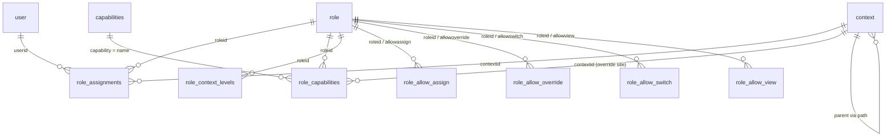
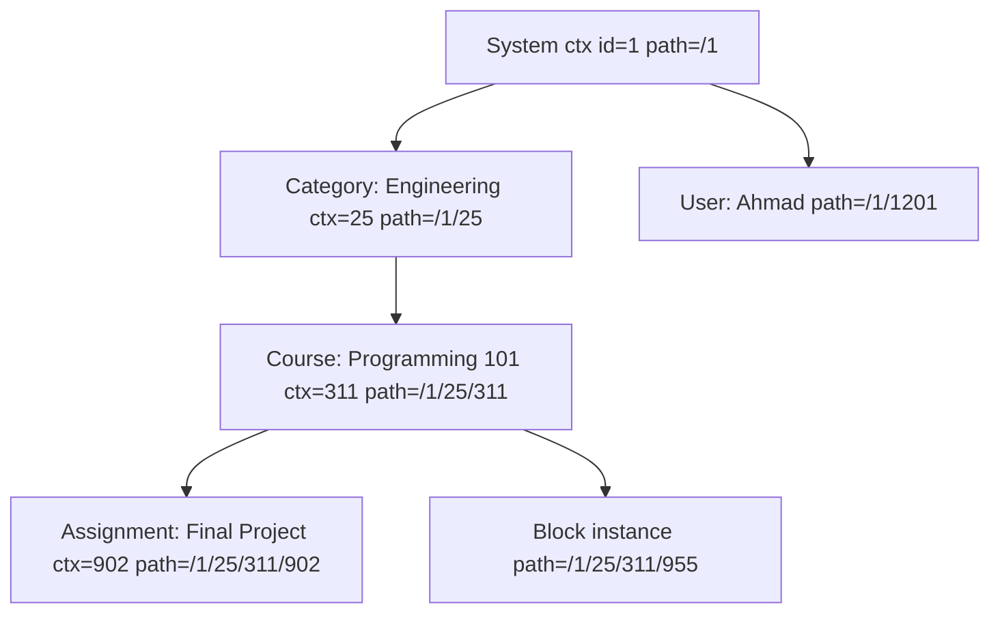
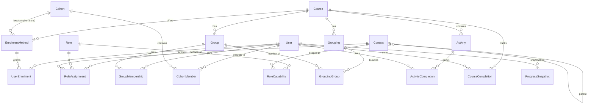

# Moodle People, Roles, Access, and Progress — Deep Dive

Second-pass source-code investigation for Team 2 (People and Enrolment domain).
Companion to, and deliberate deepening of, `docs/team-2/moodle-people-enrolment-source-analysis.md`.

All file paths are relative to the repository root. Moodle source lives under `public/`.
All line numbers were read from commit `23f47c2e4349231defd8cf56935558e41242ea8e`.

Evidence classification used throughout:

```text
CONFIRMED_FROM_SOURCE      — read directly from code/schema at the stated line numbers
STRONGLY_INFERRED          — follows from confirmed code, but the exact runtime output was not executed
PLUGIN_SPECIFIC            — true for the named plugin only; other plugins may differ
REQUIRES_LIVE_VALIDATION   — cannot be fully settled by reading source; needs a running site
UNRESOLVED                 — open question after investigation
```

---

## 1. Purpose of This Deep-Dive Report

### What the first report covered

The first report (`moodle-people-enrolment-source-analysis.md`) established the four-domain skeleton correctly:

- Enrolment: `enrol` instances, `user_enrolments` rows, multiple coexisting paths, last-path cleanup in `enrol_plugin::unenrol_user()`.
- Access: `has_capability()` → `has_capability_in_accessdata()`, prohibit short-circuit, context path traversal.
- Groups: group modes, `groups_members` provenance, enrolment-linked sync.
- Completion: activity states, plugin custom rules, deletion destroys history.

Its business-rule catalogues (ENR/ROL/GRP/PRG/INT) remain valid. This report re-verified the load-bearing ones and found **no outright errors**, but many **material omissions and oversimplifications**.

### What the first report did not fully explain

1. It analyzed essentially **one role (Student)** and treated "role" generically. Manager, Course Creator, Teacher vs Non-editing Teacher, Guest, Authenticated User, and Front-page roles were absent.
2. It mentioned the **admin bypass** in one row (ROL-002) without explaining that Administrator is *not a role at all* and when the bypass does **not** apply.
3. **Permission values** got one short section; the cross-role vs within-role semantics of Prevent vs Prohibit (numerically `-1` vs `-1000`) were not worked through with conflict examples.
4. **User account states** (suspended account vs suspended enrolment, deleted, unconfirmed, guest) were not covered at all — the `user` table appeared only as "identities".
5. **Authentication vs enrolment** was not separated; auth plugins were never inventoried.
6. **Role switching**, **role assignment provenance contexts** (user context, block context, front page), **risk bitmasks**, and the **allow_assign/override/switch/view** matrices were omitted.
7. Enrolment plugin coverage stopped at manual/self/cohort; **guest access, meta link, category, fee/paypal, database/LDAP/flat-file/IMS/LTI** were not inventoried or classified.
8. **Cohort vs Group vs Grouping** were defined but never systematically contrasted.
9. **Course completion criteria types** (8 of them) and **aggregation methods** were not enumerated; the **progress percentage formula** was not traced screen-by-screen.
10. **Events and logs** were listed by name only — no payloads, no reconstruction analysis.
11. The schema map missed several tables that exist in this version (`course_modules_viewed`, `role_allow_view`, `course_completion_aggr_methd`, `course_completion_defaults`, `role_context_levels`, `cohort`, `sessions`, `logstore_standard_log`) and missed the **absence of a unique index on `role_assignments`**.

### Why a second report is required

Team 2's core question — *"Can this user perform this exact action in this exact location against this exact target, and why?"* — cannot be answered from the first report for any actor other than an enrolled Student. Yaman must integrate the work of four specialists; each specialist's area (enrolment, roles, groups, progress) has role-archetype-specific and account-state-specific behavior the first report never touched.

### Which previous conclusions were confirmed / corrected

Confirmed (re-verified at source): multiple enrolment paths per course; last-path cleanup; prohibit short-circuit; role provenance via `component`/`itemid`; completion history destroyed on deletion; endpoint-specific decision pipelines.

Corrections and qualifications are catalogued in Section 58 (Gap Register). The most important:

| Previous Topic | Previous Coverage | Identified Gap | New Investigation | Result |
|---|---|---|---|---|
| Admin bypass | One rule row (ROL-002) | When bypass does NOT apply | `has_capability()` L432–582 | Bypass disabled while role-switched in path; disabled by context locking (configurable); not applied for risky caps as guest — Sections 8, 27 |
| Permission values | 4 one-liners | Within-role vs cross-role semantics | `has_capability_in_accessdata()` L788–849 | 8 worked conflict examples — Section 23 |
| Roles | Student only | 8 archetypes, admin, custom roles | `get_role_archetypes()` L1171, `lib/db/access.php` | Sections 7–16 |
| Account states | Not covered | suspended/deleted/unconfirmed/guest | `user` table, `authenticate_user_login()`, `delete_user()` | Sections 4, 35, 52 |
| Enrolment plugins | manual/self/cohort | 13 plugins in tree | `public/enrol/*` inventory | Section 29; guest/meta deep dives 33–34 |
| Progress formula | "some derived" | Per-screen numerator/denominator | `core_completion\progress`, report_progress | Section 43 |
| Completion criteria | Table names only | 8 criteria types + aggregation | `completion/criteria/*` | Section 41 |
| Role-without-enrolment | "possible" | What actually works, where user appears | `require_login()`, participants_search, `enrol/otherusers.php` | Sections 20, 48 |
| Schema | 17 tables | ~15 more relevant tables, uniqueness facts | `lib/db/install.xml` full pass | Sections 53–55 |
| Events/logs | Names only | Payloads, reconstruction limits | `lib/classes/event/*`, logstore_standard | Sections 56–57 |

---

## 2. Repository and Investigation Baseline

CONFIRMED_FROM_SOURCE:

- Version number: `$version = 2026071400.00` — `public/version.php:32`
- Release: `$release = '5.3dev (Build: 20260714)'` — `public/version.php:35`
- Branch designation: `$branch = '503'` — `public/version.php:36`
- Maturity: `MATURITY_ALPHA` — `public/version.php:37`
- Git branch: `main`; commit `23f47c2e4349231defd8cf56935558e41242ea8e` ("weekly release 5.3dev")
- Working tree at investigation start: clean except pre-existing untracked `TEAM2-PEOPLE-ENROLMENT-GUIDE.md` and `docs/`
- Database prefix: `config.php` uses `$CFG->prefix = 'mdl_'` (template default in `config-dist.php`)

Core plugin inventories present in this tree (directory listing, CONFIRMED_FROM_SOURCE):

- Enrolment plugins (`public/enrol/`): `category, cohort (via enrol/cohort), database, fee, flatfile, guest, imsenterprise, ldap, lti, manual, meta, paypal, self`
- Auth plugins (`public/auth/`): `email, ldap, lti, manual, nologin, none, oauth2, shibboleth, webservice`

### How version maturity affects confidence

This is a **development branch (5.3dev, MATURITY_ALPHA)**, not a stable release. Consequences:

1. Any line number cited here can move week to week; the *function names and table names* are far more stable than line positions.
2. Schema details verified here may differ from the stable Moodle 5.x a production site runs — e.g. this version has already split module "viewed" state out of `course_modules_completion` into `course_modules_viewed`. Older sites store it differently.
3. Behavior classified CONFIRMED_FROM_SOURCE is confirmed **for this commit**. Team 2's live validation plan (Section 61) must run against the same checkout (or the actual demo target version) before conclusions are treated as final.
4. Default settings (`config-dist.php`, `lib/db/install.php`) describe a *fresh install of this dev version*; an upgraded production site can carry historical defaults.

---

# Part A — Users Before Enrolment

## 3. User Identity vs Authentication vs Course Participation

### Layer 1 — Beginner explanation

Moodle keeps eight ideas separate that most people mentally merge into "having access":

```text
User account          — a row that says "Ahmad exists on this site"
Authentication        — the rule for checking "this really is Ahmad" at login
Login session         — the temporary state "Ahmad is logged in right now"
Site access           — what any logged-in person may do anywhere on the site
Course enrolment      — "Ahmad is connected to Course A as a participant"
Role assignment       — "in this place, Ahmad acts as a Student / Teacher / ..."
Group membership      — "inside the course, Ahmad belongs to Lab A"
Activity participation— "Ahmad may open/submit/attempt this specific activity"
```

Worked example:

```text
Ahmad has a Moodle account.        → row in the user table
Ahmad can log in.                  → his auth plugin accepts his password; account not suspended/deleted/unconfirmed
Ahmad is not enrolled in Course A. → no user_enrolments row reaching Course A
Ahmad has a system-level role.     → the implicit Authenticated User role (plus any explicit system role)
Ahmad belongs to no course group.  → no groups_members rows
```

What Ahmad **can** do: log in, see his dashboard and profile, browse visible course listings, use site-level tools his Authenticated User role allows (e.g. messaging, calendar), and open a course *only* if it offers guest access or self-enrolment.
What Ahmad **cannot** do: open Course A's content (`require_login($course)` rejects him with "Not enrolled" and redirects him to the enrolment page), appear in Course A's Participants list, submit anything, or be tracked for completion in Course A.

### Layer 2 — Technical explanation

- **User account**: `user` table (`public/lib/db/install.xml` ~L870–940). Identity fields `username`, `mnethostid` (unique composite index `(mnethostid, username)` — L924), `auth`, plus state flags `confirmed`, `suspended`, `deleted`, `policyagreed`. CONFIRMED_FROM_SOURCE.
- **Authentication**: `authenticate_user_login()` — `public/lib/moodlelib.php:3792`. Looks the user up, validates login token/recaptcha, runs `\core_auth\validate_user::validate_before_web_login()` (suspension + auth-disabled checks), loops enabled auth plugins calling `user_login()`, re-checks suspension post-auth, returns the user or a failure reason (`AUTH_LOGIN_SUSPENDED`, `AUTH_LOGIN_NOUSER`, `AUTH_LOGIN_LOCKOUT`, ...). CONFIRMED_FROM_SOURCE.
- **Login session**: `complete_user_login()` — `public/lib/moodlelib.php:4071` — calls `\core\session\manager::login_user()` (session-id regeneration), `update_user_login_times()` (`moodlelib.php:2993`: sets `firstaccess`, `lastlogin` = previous `currentlogin`, `currentlogin`, `lastaccess`, `lastip`), fires `\core\event\user_loggedin`. Sessions are stored in the `sessions` table when DB sessions are configured, otherwise files — handler selection in `public/lib/classes/session/manager.php:345`. CONFIRMED_FROM_SOURCE.
- **Site access**: `require_login()` without a course — `public/lib/moodlelib.php:2259` — enforces logged-in state (with optional guest autologin, L2329–2338), forced password change, complete profile, site policy (`policyagreed`, L2461–2479), maintenance mode.
- **Course participation gate**: `require_login($course)` course section (`moodlelib.php:2437–2644`), decision order (CONFIRMED_FROM_SOURCE):
  1. Site admin → immediate access (L2437–2457).
  2. Hidden course → requires `moodle/course:viewhiddencourses` (L2501–2521).
  3. Role-switched in this course → access (L2543–2545).
  4. `is_viewing()` — course-view-without-enrolment via `moodle/course:view` (L2547–2549; `is_viewing()` itself at `public/lib/accesslib.php:1948`).
  5. Session caches `$USER->enrol['enrolled'][courseid]` / `['tempguest'][courseid]` (L2552–2574).
  6. Active enrolment via `enrol_get_enrolment_end()` (L2578–2586).
  7. Enrol plugins' `try_autoenrol()` then `try_guestaccess()` loops (L2591–2621).
  8. Otherwise `require_login_exception('Not enrolled')` or redirect to `/enrol/index.php?id=<course>` (L2636–2644).
- **`is_enrolled()`** — `public/lib/enrollib.php:1385`: guest → false; front page → everyone true; `$onlyactive` path uses `enrol_get_enrolment_end()`; non-active path is a bare existence check (`user_enrolments` JOIN `enrol` JOIN `user u ... u.deleted = 0`) that counts even suspended/expired/disabled paths. CONFIRMED_FROM_SOURCE.
- **`user_lastaccess`** vs `user.lastaccess`: `user_accesstime_log()` — `public/lib/datalib.php:1588` — updates the sitewide `user.lastaccess/lastip` (throttled by `LASTACCESS_UPDATE_SECS`) and inserts/updates one `user_lastaccess` row per (userid, courseid) — unique index `(userid, courseid)`. Per-course "last access" in reports comes from this table; self-enrolment's "unenrol inactive" reads it. CONFIRMED_FROM_SOURCE.

Confidence: all CONFIRMED_FROM_SOURCE. Live validation needed only for exact UI wording of the "Not enrolled" redirect.

## 4. User Account States

### Layer 1 — Beginner explanation

Two different "suspended" concepts exist and they are **not** the same:

```text
Suspended user ACCOUNT   — Ahmad cannot log in to the site at all.
Suspended course ENROLMENT — Ahmad can log in, but Course A treats him as inactive.
```

A suspended account with an active enrolment stays "enrolled" in the database; a fully active account with a suspended enrolment can log in but is blocked from that one course.

### Layer 2 — State-by-state analysis

**1. Active account** — `user.deleted=0, suspended=0, confirmed=1`. Can log in; site and course access follow roles/enrolment. Completion/report visibility normal.

**2. Suspended account** — `user.suspended=1` (schema comment: "suspended flag prevents users to log in", install.xml L877).
- Set in `public/admin/user.php:127–138` (requires `moodle/user:update`; cannot suspend self, admins, or guest); immediately calls `\core\session\manager::destroy_user_sessions()` (L134) — active sessions are killed, not just future logins.
- Login blocked in `validate_before_web_login()` (throws `user_suspended_exception` → `AUTH_LOGIN_SUSPENDED`, `moodlelib.php:3888–3894`) and re-checked post-auth (L4027).
- **Critical finding (CONFIRMED_FROM_SOURCE):** `get_enrolled_sql()`/`get_enrolled_join()` (`enrollib.php:1536/1570`) filter *enrolment* status only — they never test `user.suspended`. An account-suspended user with an active enrolment still appears in Participants lists and completion "tracked users". Only specific queries exclude them explicitly (e.g. the enrolment-expiry notification task joins `u.suspended = 0`, `enrollib.php:3194`).
- Everything is stored; nothing is deleted. Unsuspending restores full access.

**3. Deleted account** — `delete_user()` — `public/lib/moodlelib.php:3555`. The row is **kept** but anonymized (CONFIRMED_FROM_SOURCE, ordered):
1. Plugin `pre_user_delete` callbacks + `before_user_deleted` hook (L3587–3599).
2. `grade_user_delete()` — grades removed but preserved in grade history (L3608).
3. `enrol_user_delete()` — unenrols everywhere via each plugin (L3616).
4. `role_unassign_all(['userid'=>…])` — all role assignments (L3620).
5. Bulk deletes: `cohort_members`, `groups_members`, `user_enrolments`, `user_preferences`, `user_lastaccess`, tokens, private keys, etc. (L3628–3666).
6. `destroy_user_sessions()` (L3674).
7. Anonymization: `username` → email-derived + timestamp (collision-looped), `deleted=1`, `email = md5(username)`, `idnumber=''`, `picture=0` (L3676–3713).
8. User-context content deleted but context row retained (L3716); `\core\event\user_deleted` fired with an `$olduser` snapshot (L3723–3738).
- Consequence for Team 2: after deletion, `user_enrolments`, `role_assignments`, `groups_members` rows are **gone**; `course_modules_completion` rows are *not* in the delete list (STRONGLY_INFERRED they persist as orphans; REQUIRES_LIVE_VALIDATION).
- Login: impossible (lookup requires `deleted=0`; a deleted-username match returns `AUTH_LOGIN_NOUSER`, `moodlelib.php:3905–3911`).

**4. Unconfirmed account** — `user.confirmed=0`. `authenticate_user_login()` itself does **not** block unconfirmed users; enforcement is in `public/login/index.php:190–203` for web login ("mustconfirm" page, resend link) and `validate_is_confirmed()` for external/token logins. Cron task `core\task\delete_unconfirmed_users_task` (`public/lib/classes/task/delete_unconfirmed_users_task.php:45–74`) hard-deletes accounts older than `$CFG->deleteunconfirmed` hours via `delete_user()`. CONFIRMED_FROM_SOURCE.

**5. Guest account** — a real `user` row (`username='guest'`, id 1, created at install — `public/lib/db/install.php:204–221`, id stored as `$CFG->siteguest`). Detected by `isguestuser()` (`accesslib.php:1863`). Gets the guest role *on the fly* (no `role_assignments` row): `get_user_accessdata()` maps guest to `get_role_access($guestrole->id)` (`accesslib.php:1000–1006`); the role itself is found by archetype via `get_guest_role()` (`accesslib.php:388`). Hard restriction: `has_capability()` denies guests **any write capability or any capability carrying RISK_XSS/RISK_CONFIG/RISK_DATALOSS** regardless of role configuration (`accesslib.php:481–485`). Guests never receive completion tracking or `user_enrolments` rows (Section 33).

**6. Authenticated (ordinary logged-in) user** — every non-guest logged-in user additionally holds `$CFG->defaultuserroleid` at system context, injected virtually by `get_user_roles_sitewide_accessdata()` (`accesslib.php:920–924`) — again no `role_assignments` row.

**7. Not-logged-in user** — userid 0 evaluates with `$CFG->notloggedinroleid` (`accesslib.php:992–994`); `$CFG->forcelogin` makes `has_capability()` return false outright for userid 0 (`accesslib.php:476–478`); the write/risk gate applies as for guests.

**8. Site administrator** — not a role at all; see Section 8.

**9. Active account + suspended course enrolment** — `user_enrolments.status = ENROL_USER_SUSPENDED (1)` (`enrollib.php:40`). Login unaffected. `require_login($course)` fails at the `enrol_get_enrolment_end()` step (active-only), so course access is denied unless another active path exists. The row, group memberships (usually), role assignments (policy-dependent, Section 30) and completion rows remain. Appears in Participants only to holders of `moodle/course:viewsuspendedusers` (`participants_search.php:596`; archetype defaults: editingteacher, manager — `lib/db/access.php:1216`).

Summary table:

| State | DB fields | Can log in | Site access | Course access | Roles evaluated | Visible in completion reports | Data retained |
|---|---|---|---|---|---|---|---|
| Active | deleted=0,suspended=0,confirmed=1 | Yes | Yes | Per enrolment/roles | Yes | Yes | All |
| Suspended account | suspended=1 | **No** (sessions killed) | No | N/A (cannot log in) | Rows intact | **Still listed** (no filter) — REQUIRES_LIVE_VALIDATION per report | All |
| Deleted account | deleted=1, anonymized | No | No | No | All removed | Removed from rosters | Anonymized user row; content authored remains |
| Unconfirmed | confirmed=0 | Blocked at login page | No | No | Rows possible | N/A | All until cron purge |
| Guest | id=$CFG->siteguest | Yes (guest login/auto) | Read-only-ish | Only guest-access courses | Guest role (virtual) | Never tracked | No user-specific course data |
| Suspended enrolment | ue.status=1 | Yes | Yes | Denied for that course | Assignments may remain | Filtered by viewsuspendedusers | All |

## 5. Authentication Plugins vs Enrolment Plugins

### Layer 1 — Beginner explanation

```text
Authentication answers:  Who are you, and can you log in?
Enrolment answers:       Which course are you connected to?
```

Sara can authenticate through the university's LDAP server yet be enrolled in Programming 101 manually. Ahmad can have a manual account yet self-enrol into a course with an enrolment key. The two systems never share tables: auth decides the `user` row and the login; enrolment decides `enrol`/`user_enrolments` rows.

A common confusion this report must kill: **"Email-based self-registration" is an authentication plugin (creates accounts); "Self enrolment" is an enrolment plugin (joins courses).** They are configured in different places and can be enabled independently.

### Layer 2 — Inventory (CONFIRMED_FROM_SOURCE, directory listing + auth.php inspection)

Auth plugins in this tree (`public/auth/`): 

| Plugin | Mechanism | Internal? | Team 2 relevance |
|---|---|---|---|
| `manual` | Admin-created accounts, local passwords; also the fallback when `user.auth` is empty (`moodlelib.php:3880`) | Yes | **Primary** — demo accounts |
| `email` | Self-registration + email confirmation; the default registration auth (`lib/db/install.php:121` sets `'auth' => 'email'`) | Yes | Relevant to the `confirmed` state |
| `none` | Accepts any credentials, auto-creates accounts (testing only) | Yes | Avoid |
| `nologin` | Blocks login for the account (soft-disable pattern) | — | Alternative to suspension worth knowing |
| `ldap` | External directory bind; record synced from LDAP on login (`moodlelib.php:3996–3999`) | No | Background only |
| `oauth2` | External identity providers (Google/Microsoft) | No | Background only |
| `shibboleth` | SSO via SAML environment variables | No | Background only |
| `lti` | Accounts for users arriving through LTI launches | No | Background only |
| `webservice` | Web-service-only accounts; exempt from site-policy check (`moodlelib.php:2468`) | — | Background only |

No CAS or MNet auth plugin exists in this version's tree.

**Guest login** is not an auth plugin: the guest is a fixed local account auto-logged-in by `require_login()` when `$CFG->autologinguests` (or via the login-page guest button, `guestloginbutton`, enforced in `public/login/index.php:152`).

**Ownership boundary for Team 2:** account existence, confirmation, suspension, and deletion semantics are Team 2's domain because they gate every downstream answer. The internals of LDAP/OAuth2/Shibboleth handshakes are explicitly out of scope — from Team 2's perspective every auth plugin ends at the same point: a `user` row and `AUTH_LOGIN_OK`.

---

# Part B — Complete Moodle Role Model

## 6. What a Moodle Role Really Is

### Layer 1 — Beginner explanation

A role is a **named bundle of permission defaults**, nothing more. It becomes meaningful only when *assigned to a person in a place*:

```text
Role        = "Student" (a reusable template of yes/no permissions)
Context     = "Course: Programming 101" (a place in the site tree)
Assignment  = "Ahmad is a Student in Programming 101"
Capability  = one atomic permission, e.g. mod/assign:submit
Override    = "in THIS forum, Students may not post" (a local exception)
```

Sara can be Teacher in Course A and simultaneously Student in Course B — roles are per-place, not per-person.

### Layer 2 — Technical model

Tables (all names CONFIRMED_FROM_SOURCE from `public/lib/db/install.xml`):

| Table | Purpose | Key uniqueness facts |
|---|---|---|
| `role` | role definitions: `shortname`, `name`, `description`, `sortorder`, `archetype` | UNIQUE `shortname`, UNIQUE `sortorder`; `archetype` NOT unique (L1184–1200) |
| `role_assignments` | who has which role where: `roleid, contextid, userid, component, itemid, timemodified, modifierid, sortorder` | **No unique index at all** — only non-unique composites incl. `(userid, contextid, roleid)` and `(component, itemid, userid)` (L1304–1328). Duplicate role rows differing only in provenance are legal |
| `role_capabilities` | permission values per role per context (defaults live at system context; overrides at lower contexts) | UNIQUE `(roleid, contextid, capability)` (L1347) |
| `role_context_levels` | at which context levels a role is assignable | UNIQUE `(contextlevel, roleid)` (L1374) |
| `role_allow_assign` | which roles a holder of role X may assign | UNIQUE `(roleid, allowassign)` (L1256) |
| `role_allow_override` | which roles X may override | UNIQUE `(roleid, allowoverride)` (L1271) |
| `role_allow_switch` | which roles X may switch to | UNIQUE `(roleid, allowswitch)` (L1286; index name confusingly reads `roleid-allowoverride`) |
| `role_allow_view` | which role names X may see (exists in this version) | UNIQUE `(roleid, allowview)` (L1301) |
| `capabilities` | registry of every capability: `name, captype, contextlevel, component, riskbitmask` | UNIQUE `name` (L1241) |
| `context` | the scope tree: `contextlevel, instanceid, path, depth, locked` | UNIQUE `(contextlevel, instanceid)` (L1214) |

Vocabulary mapped to storage:

- **Role definition** = `role` row. Standard roles have empty `name`/`description` (localized from lang packs — schema comments L1187–1189; UI hack in `public/admin/roles/classes/define_role_table_advanced.php:119–121`).
- **Archetype** = `role.archetype`, one of exactly eight values returned by `get_role_archetypes()` — `public/lib/accesslib.php:1171–1181`: `manager, coursecreator, editingteacher, teacher, student, guest, user, frontpage`. Used (a) at plugin installation to seed defaults, (b) on "reset role", (c) for the allow-matrices defaults. It is *not* consulted during permission evaluation.
- **Capability defaults** = `role_capabilities` rows at the **system context**; anything at a lower context is an **override**.
- **Role provenance** = `role_assignments.component` (`''` = manual; `enrol_manual`, `enrol_cohort`, ... = plugin-owned) + `itemid` (enrol instance id).
- **Assignable / overrideable / switchable / viewable** = the four `role_allow_*` matrices, resolved by `get_assignable_roles()` (`accesslib.php:3321`), `get_overridable_roles()` (`:3517`), `get_switchable_roles()` (`:3406`), `get_viewable_roles()` (`:3461`) — each additionally gated by a capability (`moodle/role:assign`, `moodle/role:override|safeoverride`, `moodle/role:switchroles`).
- **Role ordering** = `role.sortorder` (display) and `role_assignments.sortorder` (legacy; effectively unused for permission math — evaluation is order-independent except prohibit).

ER diagram:



## 7. Role Archetypes

### Layer 1 — Beginner explanation

An archetype is a **factory template**. When Moodle (or a plugin) is installed, each capability declares "by default, roles that look like a Teacher get Allow". Sites can rename, clone, and freely edit the resulting roles — so **never treat archetype defaults as guaranteed runtime permissions**. Everything below describes *fresh-install defaults*, classification CONFIRMED_FROM_SOURCE for the defaults, REQUIRES_LIVE_VALIDATION for any specific site.

The default roles created at install (`public/lib/db/install.php:256–263`) map 1:1 to archetypes: `manager, coursecreator, editingteacher, teacher, student, guest, user, frontpage`.

### Archetype-by-archetype

**Manager** — purpose: administrative delegation *inside* the permission system. Typical context: system or category. Gets nearly everything: `moodle/course:view` (the only archetype with it — `lib/db/access.php:857`), `moodle/role:manage` (:701, manager only), `moodle/role:override` (:677, manager only), `moodle/cohort:manage` (:763), plus all teacher-grade capabilities. Risk: near-admin power but *evaluated*, overridable, and context-scoped. Normally assigned manually; enrolment does not create it; not intended as a course participant.

**Course Creator** — purpose: allow trusted staff to create courses. Context: category (`moodle/course:create` — :807, archetypes coursecreator+manager, CONTEXT_COURSECAT). Also `moodle/course:viewhiddencourses` (:929). It does **not** grant editing of existing courses. See Section 10 for the post-creation role flow.

**Teacher (editingteacher)** — full course operation: see Section 11.

**Non-editing Teacher (teacher)** — grade/facilitate without structure changes: see Section 12.

**Student** — participate and be tracked: see Section 13. Notably `moodle/course:isincompletionreports` defaults to **student only** (:1152) — this capability is what makes someone *appear in* completion reports, an inversion beginners rarely expect.

**Guest** — minimal read access: see Section 14. Default allows include `moodle/user:viewdetails` (:519).

**Authenticated User (`user`)** — the implicit everyone-logged-in role: see Section 15. E.g. `enrol/self:enrolself` defaults to archetype `user` (`public/enrol/self/db/access.php:77`) — self-enrolment works because of this role, not Student.

**Authenticated User on Front Page (`frontpage`)** — applied only at the front-page course context via `$CFG->defaultfrontpageroleid`, injected virtually in `get_user_roles_sitewide_accessdata()` (`accesslib.php:927–932`). Lets sites tune what logged-in users can do on the site home without touching the system-level role.

There is no ninth default archetype in this version, and there is **no `doanything` capability and no legacy `moodle/legacy:*` capabilities** — both are gone from `lib/db/access.php` (grep confirmed). `moodle/site:config` has an **empty archetypes array** (`access.php:58`) — no role gets it by default; site administration is not archetype-based at all (Section 8).

## 8. Administrator Is Not a Normal Role

### Layer 1 — Beginner explanation

Lina the Manager has a very powerful *role*. The Site Administrator has **no role at all** — Moodle keeps a simple VIP list of user ids, and the permission engine steps aside for them. You cannot "deny" an administrator something with role overrides; the check is bypassed before roles are even read.

### Layer 2 — Source trace (CONFIRMED_FROM_SOURCE)

- **Storage**: the config setting `siteadmins`, a comma-separated list of user ids. Managed by `public/admin/roles/admins.php` (`set_config('siteadmins', implode(',', $admins))` at L116/140/165, with config-change logging). Can be pinned in `config.php` via `$CFG->config_php_settings['siteadmins']` (admins.php:42).
- **Check**: `is_siteadmin()` — `public/lib/accesslib.php:702` — `in_array($userid, explode(',', $CFG->siteadmins))` (L730–731). No `role`, `role_assignments`, or `role_capabilities` involvement.
- **Bypass** inside `has_capability()` (`accesslib.php:432`), executed only when the caller passes `$doanything = true` (the default, 4th parameter):
  - Checking *another* user who is admin → `true` immediately (L543–545).
  - Current user, admin, **no active role switch** → `true` (L547–549).
  - Current user, admin, **role switched somewhere on this context's path** → falls through to normal evaluation (L550–563, comment: "admin switched role in this context, let's use normal access control rules"). This is precisely why "Switch role to Student" works for admins.
- **Where the bypass does NOT apply** (all CONFIRMED_FROM_SOURCE):
  1. While role-switched in the context path (above).
  2. Callers passing `$doanything = false` — e.g. `is_viewing()`-style checks that intentionally test real roles.
  3. Context locking: with `$CFG->contextlocking` on and `$CFG->contextlockappliestoadmin` set, write capabilities in locked contexts return false even for admins (`accesslib.php:488–500`).
  4. Broken context (`path`/`depth` invalid) → admins get `true`, others `false` (L519–527) — bypass still applies here, listed for completeness.
  5. Anything that is not a capability check at all: enrolment-existence SQL, group filtering SQL, plugin state checks. Example: an admin is not `is_enrolled()` anywhere by default; `require_login()` handles this with its own admin fast-path (`moodlelib.php:2437–2457`), but *data queries* like Participants lists simply don't include them.
- `require_login()` admin fast-path: site admins skip policy/enrolment formalities entirely (L2437–2457).

| Question | Site Administrator | Manager |
|---|---|---|
| Normal role assignment? | No — user-id list in config `siteadmins` | Yes — `role_assignments` row |
| Capability evaluation? | Bypassed (`has_capability` L541–565) unless switched/`$doanything=false` | Fully evaluated, aggregated with other roles |
| Context-scoped? | No — global | Yes — system/category/course as assigned |
| Can be overridden? | No — Prohibit does not touch admins | Yes — overrides and Prohibit apply |
| Intended use | Platform operation, break-glass | Delegated administration within the rules |
| Security risk | Total; cannot be constrained inside Moodle | High but auditable and constrainable |

## 9. Manager Role

### Layer 1 — Beginner explanation

Lina is a Manager for the Engineering category. She can open any course in it, create courses, fix enrolments, and change roles — but she is *not on any course roster*. Teachers see her under "Other users", not "Participants". If Lina should get grades or completion tracking, someone must actually enrol her.

### Layer 2 — Source trace

- **Assignment contexts**: system or category typically; `role_context_levels` defaults for manager include these (set at install via `get_default_contextlevels()`, `install.php:281–287`).
- **Course access without enrolment**: `moodle/course:view` (manager-only default, `access.php:857`) powers `is_viewing()` (`accesslib.php:1948`) which `require_login()` consults before any enrolment check (`moodlelib.php:2547–2549`). CONFIRMED_FROM_SOURCE: a category Manager opens any course in the category without any `user_enrolments` row.
- **Not auto-enrolled**: no code path enrols managers automatically. In the enrolment UI they surface via `course_enrolment_manager::get_other_users()` (`public/enrol/locallib.php:340`) — the SQL selects `role_assignments` in the course context *or any parent* where the user has **no** `user_enrolments` row in the course (`ue.id IS NULL`). Page: `public/enrol/otherusers.php`, gated by `moodle/course:reviewotherusers` (:38).
- **Participants list**: built from `get_enrolled_sql` (`participants_search.php:369`) — enrolment-based, so an unenrolled Manager does **not** appear. CONFIRMED_FROM_SOURCE.
- **User/role/course management defaults**: `moodle/role:manage` (system-level, manager only), `moodle/role:assign`, `moodle/role:override`, `moodle/course:create`, `moodle/course:update`, `moodle/cohort:manage`, `moodle/site:viewparticipants` (system — `access.php:1143`, manager only).
- **Grading**: `moodle/grade:viewall` and `moodle/grade:edit` default Allow, and `mod/assign:grade` includes manager (`mod/assign/db/access.php:49`) — so a Manager *can* grade capability-wise. Whether specific grading UIs list students for an unenrolled manager is endpoint-specific (assignment grading tables iterate enrolled users) — REQUIRES_LIVE_VALIDATION.
- **Completion tracking**: never tracked unless enrolled — `get_tracked_users()` requires enrolment with `moodle/course:isincompletionreports` (`completionlib.php:1445–1472`), and that capability defaults to student only anyway.
- **vs Teacher**: Manager adds role management, course creation, cohort management, cross-course scope; Teacher is course-scoped and roster-based.
- **vs Administrator**: everything Lina does is evaluated and deniable; a Prohibit stops her; `moodle/site:config` is not hers by default.

## 10. Course Creator Role

### Layer 1 — Beginner explanation

A Course Creator can *make* courses in a category, like an architect who may add new rooms but not rearrange existing ones. The moment they create a course, Moodle typically enrols them into it with a configurable role (default: Teacher) so they can build it.

### Layer 2 — The full flow (CONFIRMED_FROM_SOURCE)

```text
User holds moodle/course:create at category   (access.php:807 — coursecreator, manager)
→ creates course                              (course/edit.php)
→ course + course context created
→ course/edit.php:174–179: if $CFG->creatornewroleid is set
    and user is not already "viewing" with moodle/role:assign
    and not already enrolled with moodle/role:assign
  → enrol_try_internal_enrol($courseid, $USER->id, $CFG->creatornewroleid)
→ result: a manual enrolment + role assignment (default role: editingteacher)
```

Details:
- The assignment goes through **enrolment** (`enrol_try_internal_enrol`), so the creator becomes a genuine participant of the new course — unlike Manager access.
- Site admins are subject to `$CFG->enroladminnewcourse` instead (`course/edit.php:168–169`).
- A code comment (MDL-66683 reference at L176–177) notes the role is granted without a capability check — deliberate.
- The same logic exists in the course-request approval flow (`public/course/classes/course_request.php:356–360`) and `course/pending.php:110`.
- Pre-creation permission preview: `guess_if_creator_will_have_course_capability()` — `accesslib.php:650` — simulates the future role using `$CFG->creatornewroleid` (used so the "create course" UI can predict what the creator will be able to do).
- **Course Creator cannot edit all courses**: it has no `moodle/course:update`; only courses where the post-creation role lands (or other roles exist).
- Security: `moodle/course:create` at a high category = unlimited course sprawl + the creator role in each; treat as a semi-privileged archetype.

## 11. Teacher Role (editingteacher)

### Layer 1 — Beginner explanation

Sara the Teacher owns her course: she changes its structure, adds and deletes activities, enrols students, forms groups, grades everything, and reads every report. She cannot create *new* courses, touch other courses, or manage the site.

### Layer 2 — Capabilities by business responsibility (fresh-install defaults; each line = capability, evidence in `public/lib/db/access.php` unless stated)

- **Course editing (core)**: `moodle/course:update` (:845), `moodle/course:manageactivities` (:983, CONTEXT_MODULE), `moodle/course:viewhiddencourses` (:929). Activity deletion is part of `manageactivities`.
- **People (core)**: `moodle/course:viewparticipants` (:1016), `moodle/course:enrolreview` (:867), `moodle/course:viewsuspendedusers` (:1216), `moodle/course:reviewotherusers` (:892), `moodle/user:viewdetails` (:519).
- **Enrolment (plugin-gated)**: `enrol/manual:enrol` (`enrol/manual/db/access.php:39`), `enrol/self:config` (`enrol/self/db/access.php:30`), cohort-sync configuration via `moodle/course:enrolconfig` + `enrol/cohort:config` (`enrol/cohort/lib.php:95–102`).
- **Roles**: `moodle/role:assign` (:651) — but constrained by `role_allow_assign`: an editingteacher may assign only **teacher and student** by default (`get_default_role_archetype_allows()`, `accesslib.php:2203–2211`); `moodle/role:safeoverride` (:690 — editingteacher gets *safe* override only, not `moodle/role:override`); `moodle/role:switchroles` (:712).
- **Grading**: `moodle/grade:viewall` (:1658), `moodle/grade:edit` (:1724), `mod/assign:grade`, `mod/quiz:grade` (plugin access files).
- **Groups**: `moodle/course:managegroups` (:1182), `moodle/site:accessallgroups` (:393).
- **Completion**: `moodle/course:overridecompletion` (:2040), `moodle/course:markcomplete` (:2031); completion report via `report/progress:view`.
- **Backup/restore**: `moodle/backup:backupcourse` (:151), `moodle/restore:restorecourse` (:255) — RISK-flagged operations (dataloss/XSS territory).
- **Communication**: `moodle/course:bulkmessaging` (:903), forum moderation caps (mod/forum access file).
- **Question bank / gradebook / reports**: plugin- and subsystem-specific (`moodle/question:*`, `gradereport/*:view`, `report/progress:view`) — PLUGIN_SPECIFIC; verify per feature.

Which of these should NOT be copied into Team 2's simplified app: backup/restore, question bank, safeoverride mechanics, bulk messaging — they are orthogonal to the people/enrolment domain. Core to keep: course editing flag, participant visibility, enrol/unenrol, group management, grading flag, completion override.

Everything above is a **default**; a site can strip any of it. Overrides at course/module context can remove capabilities per-place (Section 28).

## 12. Non-Editing Teacher Role (teacher)

### Layer 1 — Beginner explanation

Omar helps Sara: he grades, moderates, watches progress — but the course structure is read-only to him. He is the archetypal Teaching Assistant.

### Layer 2 — Default differences (CONFIRMED_FROM_SOURCE from archetype arrays)

| Action | Editing Teacher | Non-editing Teacher | Evidence |
|---|---|---|---|
| Edit course settings | Allow | **Not set** | `moodle/course:update` :845 |
| Create/delete activities | Allow | **Not set** | `moodle/course:manageactivities` :983 |
| Grade assignments/quizzes | Allow | Allow | `mod/assign:grade`, `mod/quiz:grade` |
| Edit gradebook grades | Allow (`moodle/grade:edit`) | **Not set** | :1724 |
| View all grades | Allow | Allow | `moodle/grade:viewall` :1658 |
| View participants | Allow | Allow | `moodle/course:viewparticipants` :1016 |
| View suspended participants | Allow | **Not set** | :1216 |
| Manage groups | Allow | **Not set** | `moodle/course:managegroups` :1182 |
| Access all groups | Allow | **Not set** | `moodle/site:accessallgroups` :393 |
| Completion reports visibility of others | via report caps | via report caps | `report/progress:view` |
| Override completion | Allow | Allow | :2040 (teacher included) |
| Mark course complete for others | Allow | Allow | `moodle/course:markcomplete` :2031 |
| Moderate forum | Allow (plugin) | Mostly allow | `mod/forum/db/access.php` |
| Assign roles | Allow (teacher+student only) | **Not set** | :651 + allow matrix `accesslib.php:2203` |
| Enrol users (manual) | Allow | **Not set** | `enrol/manual/db/access.php:39` |
| Backup/restore | Allow | **Not set** | :151/:255 |
| Switch role | Allow (to teacher/student/guest) | teacher archetype may switch to student/guest | `accesslib.php:2223–2231` |

The most consequential default for Team 2: **Non-editing Teacher has neither `accessallgroups` nor group management** — in separate-groups activities Omar sees only his own groups. That makes the archetype a natural group-scoped TA *if* he is placed in the right groups.

Options for a Teaching Assistant and their limits:

1. **Plain Non-editing Teacher**: simplest; but sees *all* participants (viewparticipants is course-wide) and can grade any group when group mode is "No groups" or "Visible groups" (visibility filtering differs per module — PLUGIN_SPECIFIC).
2. **Custom role cloned from it**: lets you strip caps (e.g. `overridecompletion`); survives archetype resets only if you avoid "reset"; maintenance cost.
3. **Activity-level (module-context) role assignment**: assign the role only in one assignment's module context — capabilities then exist only there; but Participants/roster visibility comes from course-level caps, so UX can be confusing.
4. **Group-scoped design (recommended baseline)**: Non-editing Teacher + membership in Group A + activities in separate-groups mode + **no** accessallgroups. Limits: modules enforce group filtering differently; "see but not grade other groups" needs visible-groups mode and is not a strict security boundary. REQUIRES_LIVE_VALIDATION per module.

## 13. Student Role

### Layer 1 — Beginner explanation

Ahmad the Student can enter the course he is enrolled in, do the activities, see his own grades, and appear in his teacher's progress reports. Student is a *participation* role — nothing about it manages other people.

Four statements that sound identical but are all different:

```text
User is enrolled as Student   → user_enrolments row exists AND a Student role_assignment exists
User has Student role         → role_assignments row only (could be without enrolment!)
User is an active participant → enrolment exists, status active, within time window, instance enabled
User can access activity X    → all of the above AND visibility AND availability AND group rules pass
```

### Layer 2 — What the archetype grants (defaults)

- **Do the work**: `mod/assign:submit` (`mod/assign/db/access.php:40` — student *only*), `mod/quiz:attempt` (`mod/quiz/db/access.php:57` — student only), `mod/forum:startdiscussion`/`replypost` (`mod/forum/db/access.php:66/80` — student and up).
- **Be tracked**: `moodle/course:isincompletionreports` (:1152 — student only). This is why teachers do not clutter their own completion reports: the *capability*, not the role name, selects tracked users (`get_tracked_users()` filters enrolled users having it — `completionlib.php:1445–1472`).
- **See people**: `moodle/course:viewparticipants` (:1016), `moodle/user:viewdetails` (:519).
- **What it does NOT grant**: course access by itself. Course access needs *enrolment*; the Student role assignment usually rides along with `enrol_user()` (Section 30). A Student role at course context without enrolment fails `require_login($course)` (no branch accepts it — `moodlelib.php:2541–2632`); a manual enrolment without any role gives access but almost no capabilities.
- **Grade visibility**: own grades via gradebook user report (`gradereport/user:view`, archetype default includes student); `moodle/grade:viewall` is absent → others' grades invisible.
- **Self-unenrol**: only if the enrolment plugin allows it — `enrol/self:unenrolself` (`enrol/self/db/access.php:58`); manual enrolments expose no student-side unenrol.
- **Group behavior**: membership constrains activity scope in separate-groups mode; Students have no `accessallgroups`.
- Completion: manual self-completion tick requires the activity's manual tracking; automatic rules driven by the plugin (Section 40).

## 14. Guest Role

### Layer 1 — Beginner explanation

Three different "guest" things exist, and mixing them up causes endless confusion:

```text
Guest AUTHENTICATION/session — being logged in as the shared 'guest' account
Guest ROLE                   — the permission template applied to that account (archetype 'guest')
Guest ENROLMENT METHOD       — a per-course switch "visitors may peek into this course"
```

A guest can walk through a course that enabled guest access, read pages, but cannot submit, post, attempt, or be remembered — the platform treats them as an anonymous window-shopper.

### Layer 2 — Source trace (CONFIRMED_FROM_SOURCE)

- **Account**: fixed `user` row (`username='guest'`, created at install — `lib/db/install.php:204–221`; id in `$CFG->siteguest`). Detection: `isguestuser()` (`accesslib.php:1863`).
- **Role**: found by archetype via `get_guest_role()` (`accesslib.php:388`); applied on the fly in `get_user_accessdata()` (`accesslib.php:1000–1006`) — **no `role_assignments` row exists for guests**.
- **Enrolment method** `enrol_guest`: `enrol_user()` is a stub — "no real enrolments here!" (`public/enrol/guest/lib.php:72`); **guests never get `user_enrolments` rows** and never appear in Participants. `try_guestaccess()` (`:95`) checks the instance password (empty = open; else the session-entered key in `$USER->enrol_guest_passwords`), then loads a **temporary course role** `load_temp_course_role($context, $CFG->guestroleid)` and returns `ENROL_MAX_TIMESTAMP` (:123–127). `require_login()` calls this in its plugin loop and caches the grant in `$USER->enrol['tempguest'][courseid]` (`moodlelib.php:2607–2621`).
- **Guest enrolment key**: the instance `password` field; one guest instance allowed per course (`guest/lib.php:135–144`, capability `enrol/guest:config`).
- **Why guests cannot participate**: the hard gate in `has_capability()` — guests (and userid 0) are denied every `write` capability and every capability with `RISK_XSS|RISK_CONFIG|RISK_DATALOSS`, *regardless of role configuration* (`accesslib.php:481–485`). Submitting, posting, attempting are write caps → impossible even if a site mistakenly allows them on the guest role. Additional scattered `isguestuser()` gates exist in modules (e.g. `mod/forum/lib.php:544, 3545`).
- **Completion**: not tracked — guests are never enrolled, and tracked users require enrolment (`completionlib.php:1445–1472`). Guest actions produce log rows (logstore has a `logguests` setting, default on) attributed to the shared guest user id — useless for per-person analytics.
- **Risk controls**: don't add allows to the guest role for write actions (blocked anyway); the real risk is `RISK_PERSONAL` read caps (not covered by the gate — e.g. granting guests grade-viewing would work). Section 25.

## 15. Authenticated User Role

### Layer 1 — Beginner explanation

```text
Ahmad is logged in but not enrolled anywhere.
Ahmad still has the "Authenticated user" role — automatically, everywhere on the site.
What can Ahmad do? Edit his profile, message people (if allowed), see the calendar,
browse course lists — and importantly, SELF-ENROL where a course permits it.
What can he not do? Anything inside a course that requires participation.
```

### Layer 2 — Source trace

- Role `user` created at install (`install.php:262`); its id becomes `$CFG->defaultuserroleid`.
- Injection point: `get_user_roles_sitewide_accessdata()` — `accesslib.php:920–924` — adds the role **at system context** for every non-guest user; **no `role_assignments` rows**. Companion front-page role at the site-course context (L927–932).
- Because it applies at system context, an Allow here **inherits into every course and module on the site**. This is the classic foot-gun: granting e.g. `mod/assign:grade` to Authenticated User would make every logged-in user a grader everywhere. Any risky Allow on this role deserves an immediate audit (Section 25).
- It combines with Student/Teacher by normal multi-role aggregation (Section 21): the union of Allows minus Prohibits.
- Role switching keeps it: after a switch, evaluation uses "switched role + default user role" (`has_capability_in_accessdata`, `accesslib.php:806–816`) — a switched admin still carries Authenticated User permissions.
- `enrol/self:enrolself` defaulting to this archetype is what allows any logged-in user to use self-enrolment (`enrol/self/db/access.php:77`).

## 16. Custom Roles

### Layer 1 — Beginner explanation

A custom role is a house blend: start from an archetype (or from nothing), tick the capabilities you want, say where it may be assigned, and who may hand it out. Example we design (but do not build): a **Group Teaching Assistant** who grades only their own lab group.

### Layer 2 — Lifecycle with source anchors

```text
Create role         create_role($name,$shortname,$desc,$archetype) — accesslib.php:1303
                    (archetype validated against get_role_archetypes(); role_created event)
→ choose archetype  role.archetype; '' = no archetype (define_role_table_advanced.php:84)
→ define context levels   role_context_levels rows; UI in admin/roles/define.php
→ assign capabilities     assign_capability($cap,$perm,$roleid,$contextid) — accesslib.php:1411
                          (CAP_INHERIT/empty → unassign_capability, :1425–1428)
→ allow assignment        role_allow_assign / _override / _switch / _view rows (admin/roles/allow.php,
                          requires moodle/role:manage — allow.php:43)
→ assign to user          role_assign(...) — accesslib.php:1579 → role_assigned event
→ apply overrides         role_capabilities rows at course/module contexts (admin/roles/override.php)
→ evaluate                has_capability(...) — Section 24
```

- **Cloning**: `force_duplicate($roleid, $options)` — `admin/roles/classes/define_role_table_advanced.php:194` — copies name/shortname/description/permissions/archetype selectively (archetype copy at L256–257).
- **Reset**: `reset_role_capabilities($roleid)` — `accesslib.php:2272` — wipes the role's *system-context* `role_capabilities` and re-applies `get_default_capabilities($archetype)` (`:2144`). Overrides at lower contexts are untouched. A role with no archetype resets to empty.
- **Changing archetype**: editable in the role definition (`force_archetype()`, define_role_table_advanced.php:303); affects future resets and future plugin installs, not current permissions.
- **Plugin installs**: when a new plugin is installed, its `db/access.php` archetype defaults are applied to roles **by archetype** — custom roles with an archetype inherit the new plugin's defaults for that archetype; custom roles without archetype get nothing (they use `clonepermissionsfrom` only at capability creation, e.g. `access.php:900`). STRONGLY_INFERRED from `update_capabilities()` flow; exact upgrade edge cases REQUIRES_LIVE_VALIDATION.
- **Upgrades**: role definitions persist; new capabilities arrive with archetype defaults as above.
- **Risks**: Prohibit misuse (Section 23), granting risky caps (Section 25), assignability leaks (a role that can assign Manager can escalate), and context-level sprawl (allowing assignment at CONTEXT_USER/BLOCK where nobody audits).

### Safe design sketch — "Group Teaching Assistant" (design only; final values REQUIRES_LIVE_VALIDATION)

- Base: clone of Non-editing Teacher (`teacher` archetype kept, so plugin updates track it).
- Context levels: course and module only.
- Keep: `mod/assign:grade`, `moodle/grade:viewall`, `moodle/course:viewparticipants`, forum read/reply caps.
- Ensure NOT set: `moodle/site:accessallgroups`, `moodle/course:update`, `moodle/course:manageactivities`, `moodle/course:managegroups`, `moodle/grade:edit`, all `moodle/role:*`, all enrol caps, backup/restore.
- Deployment: assign at course context; put the TA into their group; run graded activities in separate-groups mode.
- Verify live: cross-group grading attempts in assignment UI and web services; suspended-member visibility; quiz report behavior (Section 61, experiments E-16/E-17).

---

# Part C — Role Assignment and Context

## 17. All Important Role Assignment Contexts

### Layer 1 — Beginner explanation

A context is a *place* in the site tree. The same role means different things depending on where it is pinned: Student pinned at a course = a course student; Teacher pinned at a single assignment = grader for that one activity only; Manager pinned at a category = administrator of every course inside.

### Layer 2 — Context levels (constants CONFIRMED_FROM_SOURCE, `public/lib/accesslib.php:121–136`; class mirrors in `public/lib/classes/context/*.php:34`)

| Context | Constant | Value | Scope of a role assigned here | Common use | Risk | Enrolment involved? |
|---|---|---|---|---|---|---|
| System | `CONTEXT_SYSTEM` | 10 | Entire site, inherited everywhere | Manager, system TA-like roles | Extreme blast radius | Never |
| User | `CONTEXT_USER` | 30 | One user's profile subtree | "Parent/mentor" role over a child user | Personal-data exposure | Never |
| Category | `CONTEXT_COURSECAT` | 40 | Category + all child categories/courses | Manager, Course Creator | Wide, often forgotten | Never |
| Course | `CONTEXT_COURSE` | 50 | One course + its activities/blocks | Teacher, Student, TA | Standard | Usually paired with enrolment |
| Module | `CONTEXT_MODULE` | 70 | One activity | Activity-scoped grader/moderator | Confusing UX, easy to lose track | No — does not enrol |
| Block | `CONTEXT_BLOCK` | 80 | One block instance | Rare | Rare | No |
| Front page | course context of SITEID | 50 | Site home "course" | `defaultfrontpageroleid` injection | Low | Front page counts everyone as enrolled (`is_enrolled` SITEID branch, `enrollib.php:1407`) |

(Levels 20 and 60 do not exist in this version.)

Example of one user with three simultaneous assignments: Omar = `teacher` at Course "Programming 101" (grades everything there), `student` at Course "Machine Learning" (participates), plus `teacher` at one Module context "Final Project" inside a third course (can grade only that assignment; everywhere else in that course he is whatever his other roles say — possibly nothing).

Database representation is identical in all cases: one `role_assignments` row whose `contextid` points at a `context` row with the given `contextlevel` + `instanceid` (course id, cm id, user id, ...). Inheritance is downward only — an assignment is visible to the assigned context and all its descendants (via path matching, Section 24), never upward.

## 18. Context Path and Inheritance

### Layer 1 — Beginner explanation

Every place knows its full address, like a filesystem path. Moodle answers "which roles apply here?" by walking that address from the most specific place up to the root, collecting role assignments pinned at each step.

```text
System (/1)
→ Category: Engineering (/1/25)
→ Course: Programming 101 (/1/25/311)
→ Assignment: Final Project (/1/25/311/902)
```

A Student role pinned at `/1/25/311` applies at the course and inside the assignment. A Prohibit pinned at `/1` applies everywhere.

### Layer 2 — Fields and traversal (CONFIRMED_FROM_SOURCE)

`context` table fields (`install.xml` L1201–1218; class fields `public/lib/classes/context.php:55–92`):

- `id` — the contextid used by `role_assignments`/`role_capabilities`.
- `contextlevel` + `instanceid` — what kind of place and which instance (UNIQUE pair).
- `path` — materialized ancestry, e.g. `/1/25/311/902`.
- `depth` — number of path segments.
- `locked` — freeze flag: with `$CFG->contextlocking`, write capabilities are denied in a locked context and all its children (`has_capability`, `accesslib.php:488–500`; inheritance via `is_locked()` recursion, `context.php:705–711`).

Traversal helpers: `get_parent_context_ids()` (`context.php:892`), `get_parent_context_paths()` (`:912`). Capability evaluation does not query the DB per check — it string-manipulates `path` bottom-up inside `has_capability_in_accessdata()` (`accesslib.php:792–800`) and looks up preloaded role definitions keyed by path.



How a check at the assignment finds everything: paths examined = `/1/25/311/902`, `/1/25/311`, `/1/25`, `/1`. Role assignments are read from `accessdata['ra'][path]` for each; per-role permission values are read from `rdefs[roleid][path][capability]` most-specific-first (Section 24).

## 19. Role Assignment Provenance

### Layer 1 — Beginner explanation

Every role assignment remembers *who put it there*: a human (empty component) or a plugin (e.g. `enrol_cohort` + the instance id). That lets Moodle clean up exactly its own work: when the cohort sync is removed, only the cohort's role assignments disappear — a manually granted role on the same user survives.

### Layer 2 — Source trace (CONFIRMED_FROM_SOURCE)

- Fields: `role_assignments.component` ("plugin responsible... empty when manually assigned" — schema comment) and `itemid` ("Id of enrolment/auth instance..."), non-unique index `(component, itemid, userid)`.
- Writers: `role_assign($roleid, $userid, $contextid, $component = '', $itemid = 0)` — `accesslib.php:1579`. `enrol_plugin::enrol_user()` passes `component='enrol_'.$name, itemid=$instance->id` **only when the plugin's `roles_protected()` is true** (`enrollib.php:2177–2184`). Base class default `roles_protected()` = true (`enrollib.php:1993–1995`); **manual returns false** (`enrol/manual/lib.php:32–35`) — so manual enrolments create *unowned* (manual-looking) role assignments that admins may freely edit; cohort/meta create owned ones.
- Selective cleanup: `role_unassign_all(['userid'=>…, 'contextid'=>…, 'component'=>'enrol_cohort', 'itemid'=>$instanceid])` in `unenrol_user()` (`enrollib.php:2325`); `role_unassign_all()` itself at `accesslib.php:1720` (parameters allow component-filtered or blanket removal; `$includemanual` flag).
- Because `role_assignments` has **no unique index**, the same (user, role, context) can legitimately exist twice with different provenance — e.g. one manual row (`component=''`) and one `enrol_cohort` row. Removing the cohort path deletes only its row; the user keeps the role. This is the exact mechanism behind "two enrolment methods with different roles" (Section 51).
- Concrete shape (illustrative values, not runtime data):

```text
role_assignments:
  roleid=<student>, contextid=<course ctx>, userid=<ahmad>, component='',            itemid=0    ← manual
  roleid=<student>, contextid=<course ctx>, userid=<ahmad>, component='enrol_cohort', itemid=<enrol.id>
```

## 20. Role Assignment Without Enrolment

### Layer 1 — Beginner explanation

You can pin a course role on someone without putting them on the roster. They become a ghost: permissions work, but participation features ignore them.

### Layer 2 — What exactly happens (each item CONFIRMED_FROM_SOURCE unless noted)

- **Possible?** Yes — `role_assign()` has no enrolment dependency; the UI for it is "Other users" (`enrol/otherusers.php`).
- **Does `require_login($course)` require enrolment?** Not strictly — its access chain (Section 3) accepts: admin, role-switched, `is_viewing()` (needs `moodle/course:view` — Manager default, *not* Student/Teacher), active enrolment, autoenrol, guest access. A user with a course-context **Student or Teacher role but no enrolment and no `moodle/course:view` fails require_login** — capability-rich but locked out of the course UI. This nuance was absent from the first report.
- **Which actions still work?** Anything gated purely by `has_capability` in contexts the actor can reach by URL that don't call `require_login($course)` with redirect semantics — mostly web services and non-course pages. Endpoint-specific; REQUIRES_LIVE_VALIDATION for any specific action.
- **Participants list?** No — enrolment-based (`participants_search.php:369`). Appears in **Other users** (`course_enrolment_manager::get_other_users()`, `enrol/locallib.php:340`, `ue.id IS NULL` condition), visible to holders of `moodle/course:reviewotherusers`.
- **Grading lists?** Assignment grading tables iterate enrolled/participant users (`get_enrolled_sql`-based) — a role-only user is not a grade target. As a grader, capability may suffice for the UI but student lists come from enrolment SQL. STRONGLY_INFERRED; endpoint-specific details REQUIRES_LIVE_VALIDATION.
- **Completion tracked?** No — tracked users = enrolled + capability (`completionlib.php:1445–1472`).
- **"Active participant"?** No — `is_enrolled()` is false; `get_enrolled_join` excludes them.

## 21. Multiple Roles

### Layer 1 — Beginner explanation

Roles add up. If any of your roles says Allow and none says Prohibit, you can. Sara who is Teacher *and* Student in the same course can both grade and submit — which is usually a configuration smell, not a feature.

### Layer 2 — Combination analysis (aggregation semantics from `has_capability_in_accessdata`, Section 24)

| Combination | Result | Notes / risks | Live test |
|---|---|---|---|
| Teacher + Student (same course) | Union: grade + submit + tracked in completion reports (has isincompletionreports) | Confusing UI (editing controls + activity attempts); completion reports include the teacher | E-11 |
| Non-editing Teacher + Student | Grades others AND is tracked/submits | Common for lab demonstrators; group scoping still applies | E-11 |
| Manager (category) + Teacher (course) | Category-wide admin powers + roster membership in one course | Manager caps inherit into course anyway; the Teacher role mostly adds roster/participation | E-1 |
| Custom TA + Student | Depends entirely on custom caps; Prohibits in either role kill the capability everywhere on the path | Design custom roles with Prevent, not Prohibit, to keep combinations sane | E-16 |
| System role + Course role | System role's Allows inherit down into every course and aggregate with course role | System-level Allow cannot be removed by a course role's Prevent in *another* role — only Prohibit stops it (Section 23, example 7) | E-9/E-10 |
| Course role + Module role | Module-context role adds capabilities only under that activity; within one role, module value beats course value | The standard mechanism for activity-scoped TAs | E-7 |

Contexts considered are always the full path; roles considered are all assignments on any path segment (plus the virtual default/guest/frontpage roles). Group effects are orthogonal — they never change capability values, only which *targets* an action can touch (Section 38).

---

# Part D — Capability Resolution in Extreme Detail

## 22. Capability Definition

### Layer 1 — Beginner explanation

A capability is one atomic permission with a fully qualified name: `mod/assign:grade` = "component mod_assign, action grade". Plugins bring their own capabilities with them, declare how risky they are, and say which archetypes get them by default.

### Layer 2 — Registration (CONFIRMED_FROM_SOURCE)

- Declared in each component's `db/access.php` (`$capabilities` array). Loader: `load_capability_def()` — `accesslib.php:2093–2110`.
- Entry structure (observed throughout `lib/db/access.php`):
  - `captype`: `'read'` or `'write'` — feeds the guest/not-logged-in gate.
  - `contextlevel`: the *typical* level (informational; checks can run at any level at/below).
  - `riskbitmask`: OR of RISK_* flags (Section 25).
  - `archetypes`: array archetype → `CAP_ALLOW|CAP_PREVENT|CAP_PROHIBIT` applied at install/reset.
  - `clonepermissionsfrom`: seed a *new* capability from an existing one's current values when first installed (e.g. `moodle/course:reviewotherusers` clones `moodle/role:assign` — `access.php:900`).
- Registered into the `capabilities` table (UNIQUE `name`; fields `captype, contextlevel, component, riskbitmask`) during install/upgrade.
- Deprecation: handled via `deprecated` markers in access definitions / `get_deprecated_capability_info()`; not central to Team 2 (UNRESOLVED in detail — not investigated further).

## 23. Permission Values

### Layer 2 first — the numbers matter (CONFIRMED_FROM_SOURCE, `accesslib.php:112–119`)

```text
CAP_INHERIT  =     0   "Not set" in UI — no opinion; look further up the path
CAP_ALLOW    =     1   yes, from this context downward (for this role)
CAP_PREVENT  =    -1   no, from this context downward (for this role) — polite, local
CAP_PROHIBIT = -1000   NO, absolutely, for anyone holding this role anywhere at/below — a veto
```

Storage: `role_capabilities.permission` (int). Rows at the system context are the role's "definition"; rows at lower contexts are overrides. UI words "Not set / Allow / Prevent / Prohibit" map exactly onto these constants.

### The three axes of meaning

1. **Within one role, along the path**: the *most specific* context that has any value wins. A module-level Prevent beats a course-level Allow for that role. Implemented by the first-found-wins `is_null()` guard walking paths bottom-up (`accesslib.php:830–848`).
2. **Across roles**: each role resolves to its own final value; the user is allowed if **any** role resolved to Allow — Prevent in one role does *not* cancel Allow in another.
3. **Prohibit**: checked *while scanning*, before aggregation — any Prohibit on any role at any path segment returns false instantly (`accesslib.php:837–839`). It cannot be overridden at a lower context, because the scan does not stop at the first value when a deeper Prohibit exists — precisely why Prohibit is dangerous: it silently defeats every other configuration and is only appropriate for site-edge cases ("this role must never post anywhere").

**Prevent ≠ Prohibit**: Prevent is a *local default of "no"* that a more specific context or a second role can outvote. Prohibit is a *global veto* for path + descendants that nothing outvotes.

### Eight worked conflict examples

Notation: one user; roles R1/R2; contexts System ⊃ Course ⊃ Module; stored values are per (role, context).

| # | Setup | Evaluation | Result |
|---|---|---|---|
| 1 | R1: Course **Allow**, Module **Prevent** | Within R1, module value found first (bottom-up) → R1 = Prevent; no other role | **Deny** |
| 2 | R1: System **Prevent**, Course **Allow** | Within R1, course value found first → R1 = Allow | **Allow** |
| 3 | R1 = Allow (course), R2 = Prevent (course) | R1 → Allow, R2 → Prevent; aggregation: any Allow wins | **Allow** |
| 4 | R1 = Allow (course), R2 = **Prohibit** (course) | Prohibit encountered during scan → immediate false | **Deny** |
| 5 | R1: Course **Prohibit**, Module **Allow** | Scan covers all path segments; the course-level Prohibit is seen even though module has Allow | **Deny** — Prohibit cannot be overridden below |
| 6 | R1: no value anywhere; R2: System **Allow** | R1 contributes nothing; R2 = Allow | **Allow** (inherited from system) |
| 7 | R1 (system role): System **Allow**; R2 (course role): Course **Prevent** | R1 = Allow, R2 = Prevent → any-Allow | **Allow** — to actually stop a system-level Allow you need Prohibit or an override *within R1* |
| 8 | R1: System **Prohibit**, R2: Module **Allow**, user checked at Module | R1's Prohibit sits on path segment `/1` → immediate false | **Deny** everywhere on the site |

Two practical corollaries for Khaled: (a) "remove the capability from the Student role at this forum" = per-role module override (Prevent) — works; (b) "make sure suspended-role users can never do X anywhere" = Prohibit at system — works but nukes every combination that includes that role.

## 24. Exact Capability Evaluation Algorithm

### Layer 1 — Beginner pseudocode

```text
can(user, capability, place):
  if user is site admin and not role-switched here: YES
  if user is guest/not-logged-in and capability writes or is risky: NO
  collect all roles the user has at this place or any ancestor
  for each role:
      find that role's most specific value for the capability along the path
      if any value anywhere on the path is PROHIBIT: NO (stop immediately)
  if at least one role says ALLOW: YES
  otherwise: NO
```

### Layer 2 — Technical pseudocode with anchors

`has_capability($capability, $context, $user = null, $doanything = true)` — `public/lib/accesslib.php:432`:

```text
1  during_initial_install() special-case                       (L435–446)
2  capability must exist in registry (get_capability_info)     (L457–460)
3  $CFG->forcelogin && userid==0            → false            (L476–478)
4  guest/userid0 && (captype=write || risk∩(XSS|CONFIG|DATALOSS)) → false  (L481–485)
5  context locking: write cap in locked ctx → false (config-dependent)     (L488–500)
6  deleted user → false                                        (L503–516)
7  broken context path/depth: admin→true else false            (L519–527)
8  if $doanything && is_siteadmin():
       other user → true; self+no rsw on path → true;
       self+rsw on path → fall through                         (L541–565)
9  $context->reload_if_dirty()   — cache-consistency reload    (L568)
10 accessdata := USER->access (load_all_capabilities if unset)
       or get_user_accessdata(other user)                      (L570–580)
11 return has_capability_in_accessdata(cap, ctx, accessdata)   (L582)
```

`has_capability_in_accessdata()` — `accesslib.php:788`:

```text
paths := [ctx.path, each ancestor path..., '/1']  (bottom-up, string-derived) (L792–800)
if accessdata['rsw'] matches any path (most specific first):
    roles := { switchedrole, $CFG->defaultuserroleid }                        (L806–816)
else:
    roles := union of accessdata['ra'][path] over all paths                   (L818–827)
rdefs := get_role_definitions(roles)   # MUC-cached role_capabilities by path (L830; cache: :303–377)
for role in roles:
    for path in paths:                                # most specific first
        perm := rdefs[role][path][capability]?
        if perm == CAP_PROHIBIT: return false          # global short-circuit (L837–839)
        if role's value not yet fixed: fix it          # first found wins     (L840–842)
    allowed := allowed or (role value == CAP_ALLOW)                           (L846)
return allowed
```

Cache behavior (CONFIRMED_FROM_SOURCE): `USER->access` built once per session by `load_all_capabilities()` (`:1033`) from `get_user_roles_sitewide_accessdata()` (`:915` — all `role_assignments` + virtual default-user and front-page roles). Role definitions come through a three-tier cache (`static → MUC 'core/roledefs' → DB`, `:303–377`). Invalidation: writers call `mark_dirty()` on contexts (`context.php:1052`) / mark users dirty; `reload_if_dirty()` (`context.php:1000`) compares cache flags `accesslib/dirtycontexts`, `accesslib/dirtyusers` against `USER->access['time']` and rebuilds.

Entry wrapper: `require_capability()` (`accesslib.php:872`) — throws `required_capability_exception` on false.

### Capability success is NOT the final decision

Moodle has **no universal business-action decision engine**. A true `has_capability` is necessary but frequently insufficient; endpoints add, in varying order:

- authentication/session and `require_login` gates (Section 3),
- enrolment participation (`is_enrolled`, `get_enrolled_sql`),
- group scope filters (Section 38),
- availability/visibility (`course_modules.availability`, `visible`, section visibility),
- ownership/state checks (own submission? attempt open? workflow state?),
- plugin-specific rules (e.g. `mod_assign::can_view_submission()` combines several of these).

Team 2's permission checker must model this as a *pipeline of independent gates*, not a single function.

## 25. Risk Bitmasks and Security-Sensitive Capabilities

### Layer 1 — Beginner explanation

Every capability carries warning flags: "this can inject scripts", "this exposes personal data", "this can destroy data". They don't block anything by themselves (with one exception below); they exist so a human reviewing a role sees red flags.

### Layer 2 — Constants (CONFIRMED_FROM_SOURCE, `accesslib.php:138–149`)

```text
RISK_MANAGETRUST = 0x0001   (marked "NOT IMPLEMENTED YET")
RISK_CONFIG      = 0x0002   changes configuration
RISK_XSS         = 0x0004   can submit unfiltered HTML/scripts
RISK_PERSONAL    = 0x0008   accesses others' private data
RISK_SPAM        = 0x0010   can message/spam users
RISK_DATALOSS    = 0x0020   can destroy data
```

Stored per capability in `capabilities.riskbitmask`. The one *enforced* use: the guest/anonymous gate in `has_capability` denies guests any capability with `RISK_XSS|RISK_CONFIG|RISK_DATALOSS` (or captype write) — `accesslib.php:481–485`. Note **RISK_PERSONAL and RISK_SPAM are NOT in that gate**: a misconfigured guest role *could* read personal data — the flags there are advisory UI only.

Danger review for the vulnerable roles:

- **Guest**: risky-read caps (`RISK_PERSONAL`, e.g. grade viewing) are the realistic attack surface; writes are hard-blocked.
- **Authenticated User**: any Allow here is sitewide (Section 15); RISK_SPAM caps (messaging) here are the classic spam vector.
- **Student**: XSS-flagged caps (unfiltered HTML in submissions/forums) must never be allowed.
- **Teaching Assistant (custom)**: watch `RISK_DATALOSS` (backup/restore/manageactivities) and `RISK_PERSONAL` beyond the intended group.

Security-review checklist for any custom role:

1. List all caps with nonzero `riskbitmask` set to Allow (query `capabilities` JOIN `role_capabilities`).
2. Confirm no `moodle/site:*`, `moodle/role:*`, `enrol/*` caps unless explicitly intended.
3. Confirm intended context levels only (`role_context_levels`).
4. Confirm who can assign it (`role_allow_assign`) — assigners inherit its blast radius.
5. Confirm no Prohibits unless truly global policy.
6. Re-run after every plugin install (new caps arrive with archetype defaults).

## 26. Assigning and Overriding Roles

### Layer 1 — Beginner explanation

Being allowed to *hand out* a role is itself a permission — and a separate matrix says *which* roles you may hand out. Sara can make someone a Student; she cannot make anyone a Manager.

Crucial asymmetry:

```text
Having permission to assign a role
does not mean
having every capability that role grants.
```

(and vice versa — a Manager can assign Teacher without being able to, say, pass a Turnitin-style plugin check that keys off something else.)

### Layer 2 — The control capabilities and matrices (CONFIRMED_FROM_SOURCE)

- `moodle/role:assign` (defaults: editingteacher, manager — `access.php:651`) gates `get_assignable_roles()` (`accesslib.php:3321–3360`), filtered through `role_allow_assign` (+ `role_context_levels`); admins bypass the matrix (L3350–3352).
- `moodle/role:override` (manager only — :677) and `moodle/role:safeoverride` (editingteacher only — :690) gate `get_overridable_roles()` (`:3517`, `has_any_capability` at :3520), filtered through `role_allow_override`. "Safe" override restricts to non-risky caps.
- `moodle/role:switchroles` (editingteacher, manager — :712) gates `get_switchable_roles()` (`:3406`), filtered through `role_allow_switch`.
- `moodle/role:manage` (manager only — :701) gates role definition editing and the allow-matrices UI (`admin/roles/allow.php:43`, `define.php:60`, `manage.php:53`).
- `role_allow_view` / `get_viewable_roles()` (`:3461`) controls which role *names* are visible.
- Default matrices (`get_default_role_archetype_allows()` — `accesslib.php:2187–2243`):
  - assign: manager → {manager, coursecreator, editingteacher, teacher, student}; editingteacher → {teacher, student}; everyone else → nothing.
  - override: manager → all 8; editingteacher → {teacher, student, guest}; else nothing.
  - switch: manager → {editingteacher, teacher, student, guest}; editingteacher → {teacher, student, guest}; teacher → {student, guest}; else nothing.
  - view: manager → all 8; coursecreator/editingteacher/teacher/student → {coursecreator, editingteacher, teacher, student}; guest/user/frontpage → nothing.
- Hidden role assignments: legacy concept; in this version visibility is governed by `role_allow_view` + `moodle/role:review` (`admin/roles/permissions.php:58`) rather than a "hidden" flag. STRONGLY_INFERRED.
- "Assign roles in lower contexts": assignment pages exist per context (course, module via *Locally assigned roles*, category); the capability is checked *in that context*, so a course `role:assign` holder can assign in the course's modules too (inheritance).

## 27. Switch Role

### Layer 1 — Beginner explanation

"Switch role to Student…" lets Sara preview her course as a student would see it — without logging out, without any database change. It's a pair of glasses, not a body swap.

### Layer 2 — Source trace (CONFIRMED_FROM_SOURCE)

- Entry point: `public/course/switchrole.php` — validates sesskey, requires `moodle/role:switchroles` + membership of the role in `get_switchable_roles()` (:58–63), then `role_switch($roleid, $context)`; `switchrole=0` switches back (:52).
- `role_switch()` — `accesslib.php:4481` — writes **only session state**: `$USER->access['rsw'][$context->path] = $roleid` (L4499; code comment calls it a "ghost role assignment"). No `role_assignments` rows are touched. Hook `after_role_switched` dispatched (L4502–4506).
- Effect on evaluation (`has_capability_in_accessdata`, L806–816): within the switched path, the role set becomes exactly `{switched role, default user role}` — all real roles are ignored. Outside the switched path everything is normal.
- Admin while switched: the doanything bypass is explicitly disabled along the switched path (`has_capability` L550–563) — this is what makes the preview honest.
- `can_access_course()` grants course access to anyone switched in it regardless of target role (`accesslib.php` rsw shortcut in can_access_course) — you can't lock yourself out of the course by switching.
- Persistence: session-only; survives capability reloads because `reload_all_capabilities()` re-applies switches (`accesslib.php:1069–1093`, re-gated on `moodle/role:switchroles`). Logout ends it.
- Limitations vs "log in as": no user-specific data (their groups, their submissions, their dashboard), no enrolment simulation (you're not on the roster), messaging/notifications unaffected. `\core\event\user_loggedinas` exists for real login-as; logstore records `realuserid` for it — role switching is *not* logged that way. Comment at `accesslib.php:4487`: you cannot switch to roles lacking `moodle/course:view`... which by default only Manager has — in practice switch targets are still usable because course access is granted by the rsw shortcut; exact visibility quirks REQUIRES_LIVE_VALIDATION.
- Security: switching cannot escalate (target roles constrained by `role_allow_switch`); the main risk is *believing* the preview is exact — it is not (groups/ownership differ).

## 28. Override Permissions

### Layer 1 — Beginner explanation

An override is a local exception: "in this forum, Students cannot post". You pick a place, pick a role, and flip individual capabilities to Allow/Prevent/Prohibit *for that place and below*.

### Layer 2 — Mechanics (CONFIRMED_FROM_SOURCE)

- Storage: ordinary `role_capabilities` rows whose `contextid` is the course/module context (UNIQUE `(roleid, contextid, capability)`). There is no separate "override" table — an override *is* a role_capabilities row below system.
- UI: `admin/roles/override.php` / permissions page; requires `moodle/role:override` or `safeoverride` and the target role in `role_allow_override`.
- Evaluation: exactly the within-role most-specific-wins rule (Section 23, axis 1).
- Removing an override: delete the row / set back to Inherit (`assign_capability()` with `CAP_INHERIT` calls `unassign_capability` — `accesslib.php:1425–1428`).
- Resetting a role definition (Section 16) does **not** clear lower-context overrides.
- Risks: overriding standard roles fragments the mental model ("Student" stops meaning one thing); module-level overrides are invisible from course-level audits; Prohibit overrides at course level block even multi-role users.

Worked examples:

1. *Student may post in Forum A but not Forum B*: override in Forum B's module context — role Student, `mod/forum:replypost` + `mod/forum:startdiscussion` → Prevent. Forum A untouched. Works because module value beats course Allow within the Student role.
2. *TA may grade Assignment A but not Assignment B*: either (a) override Prevent `mod/assign:grade` for the TA role in Assignment B's context, or (b) don't give the TA role `mod/assign:grade` at course level at all and add a module-context *role assignment* in Assignment A (Section 17). (a) subtracts; (b) adds — prefer (b) for least privilege.
3. *Teacher may view but not modify one activity*: override in that module context — Teacher role, `moodle/course:manageactivities` → Prevent (keeps read caps). Note the teacher can revert the override if they hold override caps there — overrides do not protect against the overridden role's own admins.

---

# Part E — Enrolment Details Not Fully Covered Before

## 29. Complete Core Enrolment Plugin Inventory

CONFIRMED_FROM_SOURCE (directory listing + lib.php inspection). Default-enabled set on fresh install: `manual,guest,self,cohort` (`lib/db/install.php:122`).

| Plugin | Mechanism (one line) | Team 2 classification |
|---|---|---|
| `manual` | Teacher/admin enrols users by hand; expiry sync task | **Relevant to demo** — deep dive §30 |
| `self` | User enrols themself, optional key/group keys/cohort gate | **Relevant to demo** — §31 |
| `cohort` | Event-driven sync of a site cohort into a course with role+group | **Relevant to demo** — §32 |
| `guest` | No enrolment at all; temporary in-session course role | **Relevant to demo** — §33 |
| `meta` | Mirrors enrolments of a parent course into a child course | Useful background — §34 |
| `category` | Auto-enrols holders of a role with `enrol/category:synchronised` at category level | Useful background; observer-based (`enrol/category/db/events.php:31`) |
| `database` | Sync from an external SQL table | External-system dependent — not for 4-day scope |
| `flatfile` | Scheduled CSV file processing (add/del, role, user, course) | External-system dependent — not recommended |
| `imsenterprise` | IMS Enterprise XML import | External-system dependent — not recommended |
| `ldap` | Enrolments read from LDAP directory | External-system dependent — not recommended |
| `lti` | Publish course/activity as an LTI tool; remote learners enrolled via launches (LTI 1.1 + Advantage in one plugin) | High complexity — explicit non-goal |
| `paypal` | Legacy PayPal IPN paid enrolment (still present) | Not recommended |
| `fee` | Paid enrolment on the core payment subsystem | Not recommended |

`mnet` and `apply` do **not** exist in this tree.

Shared machinery every plugin uses: `enrol_plugin` base class in `public/lib/enrollib.php` (`enrol_user`, `update_user_enrol`, `unenrol_user` — first report's coverage confirmed, line anchors updated: enrol_user `:2112`, update `:2214`, unenrol `:2294` with lastenrol SQL at `:2332–2336` and last-path cleanup at `:2340–2353`).

Key constants (`enrollib.php`): `ENROL_INSTANCE_ENABLED=0`/`DISABLED=1` (:31/:34); `ENROL_USER_ACTIVE=0`/`SUSPENDED=1` (:37/:40); `ENROL_MAX_TIMESTAMP=2147483647` (:46); external-removal policies `ENROL_EXT_REMOVED_UNENROL=0`, `KEEP=1`, `SUSPEND=2`, `SUSPENDNOROLES=3` (:49–68).

## 30. Manual Enrolment in Detail

### Layer 1 — Beginner explanation

Sara opens Participants → Enrol users, picks Ahmad, picks a role (defaults to Student), optionally sets a start/end date, clicks Enrol. Later she can suspend him (kept on the roster, locked out), change his role, extend dates, or remove him entirely.

### Layer 2 — Source workflow (CONFIRMED_FROM_SOURCE; `public/enrol/manual/lib.php`)

- **Instance**: courses get one `enrol` row (`enrol='manual'`) by default; default role from setting `enrol_manual/roleid` (student). Config UI gated by `enrol/manual:config`.
- **Enrolling**: UI (`enrol/manual/manage.php`, link built by `get_manual_enrol_link()` :59, gated `enrol/manual:enrol` :71) → `enrol_user()`; `roles_protected()` = **false** (:32–35), so the role assignment is written *without* component ownership → admins can freely change/remove roles later (`allow_enrol/unenrol/manage` all true, :37–47).
- **Rows**: one `user_enrolments` (status 0, timestart/timeend) + optionally one `role_assignments`.
- **Suspension**: status → `ENROL_USER_SUSPENDED` via `update_user_enrol()`; UI "Edit enrolment". Roles untouched by the suspend itself.
- **Expiry**: task `\enrol_manual\task\sync_enrolments` runs `sync()` (:254) honoring `expiredaction` (default **KEEP** :276): UNENROL → `role_unassign_all` + `unenrol_user` (:278–298); SUSPEND / SUSPENDNOROLES → suspend, the latter also strips roles (:300–326). Expiry notifications via `send_expiry_notifications` task with `expirynotify/expirythreshold/expirynotifyhour` settings.
- **Bulk operations**: `get_bulk_operations()` (:376) — edit-selected / delete-selected classes in `locallib.php`, gated `enrol/manual:manage`.
- **Recover grades**: `enrol_user(..., $recovergrades)` defaults to `$CFG->recovergradesdefault`; when set, `grade_recover_history_grades()` restores previous grades on re-enrolment (`enrollib.php:2187–2190`).
- **Events**: `user_enrolment_created/updated/deleted` (objecttable `user_enrolments`; deleted carries the full old row in `other['userenrolment']` — `lib/classes/event/user_enrolment_deleted.php:35`).

## 31. Self Enrolment in Detail

### Layer 1 — Beginner explanation

The course door with a keypad. Ahmad clicks "Enrol me"; if the course demands an enrolment key he must type it; if the key he types happens to be a *group's* key, he lands directly in that group. Distinct from **email self-registration**, which creates site accounts — self-enrolment only joins existing users to courses.

### Layer 2 — Instance settings map (CONFIRMED_FROM_SOURCE; `public/enrol/self/lib.php`, defaults `:421–426`)

| Field | Meaning |
|---|---|
| `password` | enrolment key |
| `customint1` | "use group enrolment keys" flag |
| `customint2` | longtimenosee — unenrol after N seconds inactivity |
| `customint3` | max enrolled users |
| `customint4` | send course welcome message option |
| `customint5` | restrict to cohort id |
| `customint6` | new enrolments allowed flag |
| `customtext1` | welcome message body |
| `roleid` | role granted (default student) |
| `enrolperiod` | enrolment duration from the moment of enrolling |
| `enrolstartdate`/`enrolenddate` | sign-up window |

- **Gate chain**: `can_self_enrol()` (:275) — guest denied, already-enrolled denied, then `is_self_enrol_available()` (:310): instance enabled → start/end window → `customint6` new-enrols → maxenrolled (:334–341) → cohort membership (:343–353); finally capability `enrol/self:enrolself` (archetype `user`).
- **Key check**: form validation compares `password`; when `customint1`, `enrol_self_check_group_enrolment_key()` (`enrol/self/locallib.php:38`) accepts any course group's `enrolmentkey` as valid.
- **Group placement**: on enrol, if key matched a group key → `groups_add_member($group->id, $USER->id)` (`lib.php:193–207`). Note: this membership is added **without component** — it is manual-looking, not enrol-owned. STRONGLY_INFERRED consequence: unenrolling does not auto-remove it via the component branch, only via last-path cleanup. REQUIRES_LIVE_VALIDATION.
- **Duration**: `enrol_user($instance, $USER->id, $instance->roleid, $timestart, $timeend)` with timeend = now + enrolperiod (:188–189).
- **Unenrol inactive**: `sync()` (:459) unenrols users with `user.lastaccess`/`user_lastaccess.timeaccess` older than `customint2` (:484–517) and processes expirations per `expiredaction`.
- **Self-unenrol**: `enrol/self:unenrolself` (`db/access.php:58`), page `enrol/self/unenrolself.php`.
- **Re-enrolment**: allowed whenever the gate chain passes again; `enrol_user()` updates the existing row if present.
- **Security**: keys travel as shared secrets (rotate them); maxenrolled=0 means unlimited; a leaked group key silently sorts strangers into that group.

## 32. Cohort and Cohort Sync in Detail

### Layer 1 — Beginner explanation

A **cohort** is a site-wide (or category-wide) *bag of people* — "Computer Science 2026". It is not attached to any course. **Cohort sync** is a pipe you attach to a course: everyone in the bag is automatically enrolled (with a chosen role, optionally dropped into a chosen group), and people removed from the bag are automatically removed/suspended.

### Layer 2 — Source trace (CONFIRMED_FROM_SOURCE)

- **Cohort storage**: `cohort` (contextid system-or-category, `visible`, `component` for plugin-owned cohorts — install.xml L2438–2456) + `cohort_members` (UNIQUE `(cohortid, userid)`). API `cohort_add_member/remove_member` (`public/cohort/lib.php:189/218`) fire `cohort_member_added/removed` events. Capabilities: `moodle/cohort:manage` (:763, manager), `moodle/cohort:assign` (:773), `moodle/cohort:view` (:783 — editingteacher, manager, CONTEXT_COURSE).
- **Instance**: `enrol` row with `enrol='cohort'`, `customint1` = cohort id (`enrol/cohort/locallib.php:195`), `customint2` = group id for auto-membership, `roleid` = role to assign. Creation requires `moodle/course:enrolconfig` + `enrol/cohort:config` (`enrol/cohort/lib.php:95–102`) — teachers can set it up if they can see the cohort.
- **Event-driven sync**: observers on `cohort_member_added/removed` (`enrol/cohort/db/events.php:28–37` → `classes/observer.php:43/94`) react instantly; **full sync** `enrol_cohort_sync()` (`locallib.php:167`) reconciles everything (also run when instances change).
- **Member added** → `enrol_user(..., ENROL_USER_ACTIVE)`; suspended existing rows reactivated via `update_user_enrol` (:191–217); role assigned with **component `'enrol_cohort'`, itemid = instance id** (:273 and via roles_protected=true default).
- **Member removed** → per `unenrolaction` (default `ENROL_EXT_REMOVED_UNENROL`, :188): UNENROL → `unenrol_user()` (full path removal); SUSPEND → status only; SUSPENDNOROLES → suspend + `role_unassign_all(component='enrol_cohort', itemid=instance)` (:237–249).
- **Group mapping**: `groups_sync_with_enrolment('cohort', $courseid)` (:302) — adds missing members to group `customint2` with `component='enrol_cohort', itemid=enrol instance id`, removes stale enrol-owned memberships pointing at other groups (`group/lib.php:1194–1236`).
- **Plugin disabled** → `role_unassign_all(['component'=>'enrol_cohort'])` sitewide (:172–176).
- **Coexisting paths**: a user manually enrolled *and* cohort-synced has two `user_enrolments` rows (different enrolids); removing cohort membership removes/suspends only the cohort path (Section 51).
- **Re-addition**: adding the user back to the cohort re-fires the observer → re-enrol/reactivate. Group membership re-added by sync.

### Five-column comparison

| Concept | Lives at | Members added by | Grants course access? | Removed when… |
|---|---|---|---|---|
| Cohort | Site/category (`cohort`) | Admin/plugin (`cohort_members`) | Never by itself | Cohort deleted / member removed |
| Cohort Sync (enrol instance) | One course (`enrol`) | Automatic from cohort | **Yes** (creates `user_enrolments`) | Instance removed → users unenrolled per policy |
| Manual enrolment of several cohort members | One course | A human, one by one | Yes | Only by hand |
| Course Group | One course (`groups`) | Manual/enrol-component (`groups_members`) | No — requires existing enrolment (`groups_add_member` is_enrolled guard, `group/lib.php:68–71`) | Group deleted / member removed / last-path unenrol |
| Grouping | One course (`groupings`) | Contains groups, not users | No | Grouping deleted |

## 33. Guest Access in Detail

Covered from the role side in Section 14; enrolment-method specifics (all CONFIRMED_FROM_SOURCE, `public/enrol/guest/lib.php`):

- Per-course instance with `status` (enabled/disabled) and optional `password`; one instance max (:135–144); config capability `enrol/guest:config`.
- **No `user_enrolments` rows ever** (`enrol_user()` stub :72) → guests never appear in any roster, participants list, or enrolled-users SQL.
- Access grant is per-session: `try_guestaccess()` loads a temporary course role (`load_temp_course_role($context, $CFG->guestroleid)` :123) and `require_login` caches it in `$USER->enrol['tempguest']` (`moodlelib.php:2607–2621`); `can_access_course()` re-runs the same loop for navigation (`accesslib.php:2070–2087`).
- Participation blocked structurally: write/risk gate (Section 14) + module-level `isguestuser()` checks. Completion: never tracked (no enrolment). Groups: guests hold no memberships; group-restricted content behaves as for a non-member.
- Activity plugins may hide themselves from guests entirely (PLUGIN_SPECIFIC).

## 34. Meta Enrolment

### Layer 1 — Beginner explanation

A meta link says: "whoever is enrolled in Parent Course is automatically enrolled here too". Useful for umbrella courses (a 'Department Lounge' fed by all department courses).

### Layer 2 — Source trace (CONFIRMED_FROM_SOURCE, `public/enrol/meta/lib.php` + `locallib.php`)

- Instance lives in the **child** course; `customint1` = the **parent** course id (name lookup :56; sync `:97–112`), `customint2` = optional group in the child for synced users (via `groups_sync_with_enrolment`; auto-create option `ENROL_META_CREATE_GROUP`).
- Sync (`sync_with_parent_course()` :81): mirrors the parent's enrolment **status and time window** (active if any active parent path; min timestart/max timeend :145–176), assigns the parent's roles in the child (excluding `nosyncroleids` :117–128); parent meta enrolments are ignored (`e.enrol <> 'meta'` :100) preventing chains; self-link guarded (:87).
- Removal follows `unenrolaction` (UNENROL / SUSPEND / SUSPENDNOROLES), driven by observers on `user_enrolment_*`, `role_assigned/unassigned`, `course_deleted` (`db/events.php:32–52`).
- vs Cohort Sync: meta's source of truth is *another course's roster* (with roles), cohort's is a *site-level member list* (single configured role).
- Team 2 relevance: background only — but its existence proves role provenance and multi-path handling must be plugin-agnostic (`component='enrol_meta'`).

## 35. Enrolment Status Matrix

Legend: ✓ yes, ✗ no, ~ conditional. "Caps considered" = are the user's course-context roles evaluated by has_capability for this course.

| Situation | Can log in | Can open course | In Participants | Caps considered | Groups retained | Completion retained | Submissions retained | Live validation? |
|---|---|---|---|---|---|---|---|---|
| Active account + active enrolment | ✓ | ✓ | ✓ | ✓ | ✓ | ✓ | ✓ | — |
| Active account + suspended enrolment | ✓ | ✗ (fails active-only gate) | ~ only with viewsuspendedusers | ✓ (roles usually intact) | ✓ rows remain | ✓ rows remain; hidden from tracked-users (onlyactive) | ✓ | Report-level display |
| Suspended account + active enrolment | ✗ (sessions destroyed) | ✗ (cannot log in) | ✓ still listed (no user.suspended filter in enrolled SQL) | Would be, but no session | ✓ | ✓ still in tracked users | ✓ | ✓ verify roster display |
| Deleted account + remaining records | ✗ | ✗ | ✗ (enrolments deleted) | ✗ (roles removed) | ✗ (memberships deleted) | ~ completion rows not in delete list — orphaned | ✓ content remains (authored data) | ✓ orphan behavior |
| Active manual + suspended cohort path | ✓ | ✓ (manual path active) | ✓ | ✓ | ✓ | ✓ | ✓ | — |
| Suspended manual + active cohort path | ✓ | ✓ (cohort path active) | ✓ | ✓ | ✓ | ✓ | ✓ | — |
| Expired enrolment (timeend past) | ✓ | ✗ (active-only time window, `get_enrolled_join` where2) | ~ | ✓ until sync applies expiredaction | ✓ | ✓ | ✓ | ✓ sync policy per plugin |
| Disabled enrolment instance | ✓ | ✗ (e.status must be ENABLED) | ~ | ✓ | ✓ | ✓ | ✓ | ✓ |
| Guest access | ✓ (as guest) | ✓ (temp, per session) | ✗ never | Guest role only | ✗ none | ✗ never tracked | ✗ cannot submit | — |
| Role assignment without enrolment | ✓ | ✗ unless moodle/course:view | ✗ (in "Other users") | ✓ | ✗ (can't join groups — is_enrolled guard) | ✗ not tracked | n/a | ✓ endpoint specifics |

Evidence anchors: active-only conditions `enrollib.php:1596–1597`; participants forced-active filter `participants_search.php:582–600`; suspended-account non-filtering (Section 4); groups_add_member guard `group/lib.php:68–71`; tracked users `completionlib.php:1445–1472`.

---

# Part F — Groups and Cohorts: Full Distinction

## 36. Cohort vs Group vs Grouping

### Layer 1 — Beginner explanation with the worked example

```text
Cohort:   "Computer Science 2026"  — a site-level bag of people
Course:   "Programming 101"
Groups:   "Lab A", "Lab B"         — inside the course
Grouping: "Programming Labs"       — a labelled set {Lab A, Lab B} inside the course
```

One student's journey: Ahmad is put into the cohort → cohort sync enrols him into Programming 101 as Student (and, if configured, into Lab A) → the teacher creates the grouping "Programming Labs" containing Lab A and Lab B → the "Lab Report" assignment is restricted to that grouping in separate-groups mode → Ahmad submits within Lab A's bubble.

| Concept | Scope | Contains | Main purpose | Affects enrolment? | Affects activity visibility? |
|---|---|---|---|---|---|
| Cohort | Site or category | Users | Administer people in bulk across courses | Only via cohort-sync instances | Never directly |
| Group | One course | Enrolled users | Segment participants inside the course | Never (requires enrolment to join) | Yes — group mode + restrictions |
| Grouping | One course | Groups | Name a set of groups for activity scoping | Never | Yes — activity `groupingid` / restrictions |

Storage: `cohort`/`cohort_members`; `groups` (with `enrolmentkey`, `visibility`, `participation` fields)/`groups_members`; `groupings`/`groupings_groups`; activity linkage via `course_modules.groupingid` + `groupmode`; course-wide via `course.groupmode/groupmodeforce/defaultgroupingid` (install.xml L93–95).

## 37. Group Membership Provenance

CONFIRMED_FROM_SOURCE:

- `groups_members.component` + `itemid` mirror role-assignment provenance. UNIQUE `(userid, groupid)` — one membership per user per group, however created.
- `groups_add_member($group, $user, $component=null, $itemid=0)` — `group/lib.php:41`: refuses deleted users, **refuses non-enrolled users** (`is_enrolled` guard :68–71), validates component names (:85–99), fires `group_member_added` with component/itemid in payload (:116–127).
- **Removal protection**: `groups_remove_member_allowed()` (:155) — component-owned memberships ask the owning plugin via `component_callback($component, 'allow_group_member_remove', ...)` (:184–185); no component → always removable.
- Cleanup paths: per-instance on unenrol (`enrollib.php:2319–2323`, component+itemid match); whole-course on last-path unenrol (`groups_delete_group_members`, `group/lib.php:715`); total on user deletion (`moodlelib.php:3637`).
- Re-synchronization: `groups_sync_with_enrolment($enrolname, $courseid, $gidfield='customint2')` (`group/lib.php:1194`) — removes enrol-owned memberships pointing at the wrong group, adds missing ones with `component='enrol_x', itemid=enrolid`.
- Watch out: **self-enrol group-key memberships carry no component** (Section 31) — they look manual and are not protected/cleaned like cohort ones.

## 38. Group Visibility vs Permission vs Availability

### Layer 1 — Beginner explanation

Five different mechanisms are commonly mistaken for one another:

```text
Capability allows the action      — "Omar may grade" (yes/no per role+context)
Group filtering limits targets    — "…but only students he shares a group with"
Availability restriction blocks   — "this quiz is only FOR Lab A members"
Grouping selects eligible groups  — "this activity cares only about Programming Labs"
Plugin state blocks the operation — "the attempt is already closed"
```

### Layer 2 — Mechanics (CONFIRMED_FROM_SOURCE)

- Group mode constants: `NOGROUPS=0, SEPARATEGROUPS=1, VISIBLEGROUPS=2` (`grouplib.php:29–39`). Effective mode: `groups_get_activity_groupmode()` (:732) — `cm_info->effectivegroupmode`, else `groupmodeforce` logic (:743).
- Allowed groups: `groups_get_activity_allowed_groups()` (:1188) — all groups in visible mode or with `moodle/site:accessallgroups` (:1201), else only own groups (:1205). Active group per session: `groups_get_activity_group()` (:1131), stored in `$SESSION->activegroup[courseid][mode|'aag'][groupingid]` (:1166–1176).
- Person-level visibility: `groups_group_visible()` (:1219), `groups_user_groups_visible()` (:1615) — accessallgroups short-circuits (:1233/:1625).
- Membership-privacy dimension (new since the first report): `groups.visibility` ∈ `GROUPS_VISIBILITY_ALL=0 / MEMBERS=1 / OWN=2 / NONE=3` (`grouplib.php:64–79`) and `groups.participation` — who can *see* a group vs whether it participates in activity selection. Non-ALL/MEMBERS visibility forces `participation=false` (`group/lib.php:280–283`).
- Availability restrictions: `course_modules.availability` JSON evaluated by `core_availability` (`info_module::filter_user_list` also feeds completion denominators — Section 43). A group-based restriction *hides/blocks the activity*, which is different from group mode *filtering inside* it.

Decision table for "Omar (TA, in Lab A, no accessallgroups) grading Lab B's Ahmad in Assignment X":

| Gate | Question | Outcome |
|---|---|---|
| Capability | `mod/assign:grade` in Assignment X's context? | Allow (role default) |
| Availability | Is X available to Omar at all? | Yes (no restriction) |
| Group mode | X in separate groups? | Yes |
| Allowed groups | Is Lab B among Omar's allowed groups? | **No** → Ahmad filtered out of grading table |
| Plugin state | — | never reached |
| Final | | **Cannot grade Ahmad** (STRONGLY_INFERRED; exact UI/WS path REQUIRES_LIVE_VALIDATION) |

Flip any one gate (visible mode / accessallgroups / membership in Lab B) and the outcome changes — that is the essence of "group limits which subset the action applies to".

---

# Part G — Completion Details Not Fully Covered Before

## 39. Activity Completion States

### Layer 1 — Beginner explanation

Each activity remembers, per student, one of a few states: not done, done, done-and-passed, done-but-failed — plus a special "failed, but the grade is still hidden, so don't tell them yet".

### Layer 2 — Constants and storage (CONFIRMED_FROM_SOURCE, `public/lib/completionlib.php`)

| Constant | Value | Line | Meaning |
|---|---|---|---|
| `COMPLETION_INCOMPLETE` | 0 | 73 | not complete |
| `COMPLETION_COMPLETE` | 1 | 79 | complete (no pass/fail signal) |
| `COMPLETION_COMPLETE_PASS` | 2 | 84 | complete with passing grade |
| `COMPLETION_COMPLETE_FAIL` | 3 | 89 | complete with failing grade |
| `COMPLETION_COMPLETE_FAIL_HIDDEN` | 4 | 94 | failing, but grade item hidden — fail concealed |
| `COMPLETION_UNKNOWN` / `COMPLETION_GRADECHANGE` | -1 / -2 | 100/106 | transient signals, never stored |

- Row: `course_modules_completion` — `(userid, coursemoduleid)` UNIQUE; fields `completionstate`, `overrideby` (user id of overrider or NULL), `timemodified`. **The `viewed` column no longer exists in this version** — view state moved to the `course_modules_viewed` table (`install.xml` L4851–4865, UNIQUE `(userid, coursemoduleid)`). Older documentation mentioning `cmc.viewed` is stale.
- `FAIL_HIDDEN` is produced only by `internal_get_grade_state()` (`completionlib.php:1584–1618`): failing score on a **hidden grade item** → FAIL_HIDDEN (:1603–1604) so the failure is not leaked before grades are released; with a passgrade condition it is treated as INCOMPLETE for that criterion (:1164–1173).
- Transition rules in `update_state()` (:575–673): tracking must be enabled at all three layers (`is_enabled()` :296–321: site `$CFG->enablecompletion` → `course.enablecompletion` → `course_modules.completion`); manual mode accepts only COMPLETE/INCOMPLETE (:639–647); automatic mode recomputes via `internal_get_state()`; an admin override "locks" the state — automatic tracking will not downgrade an overridden COMPLETE (:633–636).
- Writes go through `internal_set_data()` (:1238–1322): upserts the row, maintains `course_modules_viewed`, updates/invalidates the `completion` cache, triggers course-completion reaggregation, fires `course_module_completion_updated` (payload includes `completionstate`, `overrideby`, `relateduserid` — :1310–1321).

## 40. Activity Completion Modes

CONFIRMED_FROM_SOURCE — `course_modules` fields (install.xml L335–347) + constants:

- `completion`: `COMPLETION_TRACKING_NONE=0 / MANUAL=1 / AUTOMATIC=2` (`completionlib.php:56–67`).
- **Manual**: student ticks the box; `update_state($cm, COMPLETION_COMPLETE|INCOMPLETE)`.
- **Automatic** — AND of every configured condition (`internal_get_state()` :685–739 reduces all states: any INCOMPLETE → INCOMPLETE; else any FAIL → FAIL; else prefer PASS — :725–734):
  - *View*: `completionview=1`; recorded by `set_module_viewed()` (:791–816) into `course_modules_viewed`, then state update.
  - *Grade*: `completiongradeitemnumber` set → any grade completes; with `completionpassgrade=1`, pass/fail variants apply (:1148–1185).
  - *Plugin rules* (`FEATURE_COMPLETION_HAS_RULES` → `mod/*/classes/completion/custom_completion.php`): assign `completionsubmit` (:41–60 of its file), quiz `completionpassorattemptsexhausted` + `completionminattempts` (:104–117), forum `completiondiscussions/replies/posts` (:41–71).
- `completionexpected`: advisory date (dashboard/timeline), stored on `course_modules`; does not change state.
- Site-wide per-module defaults: `course_completion_defaults` table managed by `core_completion\manager`.

## 41. Course Completion Criteria Types

### Layer 1 — Beginner explanation

Course completion is a *contract*: "finish these activities, reach this grade, stay enrolled this long — and the course counts as complete". Criteria are the clauses; aggregation says whether you need ALL clauses or ANY.

### Layer 2 — Inventory (CONFIRMED_FROM_SOURCE, `public/completion/criteria/completion_criteria.php:35–94`)

| Type | Value | Class | Meaning |
|---|---|---|---|
| SELF | 1 | `completion_criteria_self` | student marks the course complete themself |
| DATE | 2 | `completion_criteria_date` | complete after a fixed date |
| UNENROL | 3 | `completion_criteria_unenrol` | complete upon unenrolment |
| ACTIVITY | 4 | `completion_criteria_activity` | specified activity completions |
| DURATION | 5 | `completion_criteria_duration` | enrolled for N time |
| GRADE | 6 | `completion_criteria_grade` | course grade threshold |
| ROLE | 7 | `completion_criteria_role` | a role holder marks the user complete (`moodle/course:markcomplete`) |
| COURSE | 8 | `completion_criteria_course` | completion of another course (prerequisite) |

- Storage: `course_completion_criteria` (criteriatype, module/moduleinstance, courseinstance, enrolperiod, timeend, gradepass, role); per-user satisfaction in `course_completion_crit_compl` (UNIQUE `(userid, course, criteriaid)`; `gradefinal`, `unenroled`, `timecompleted`); aggregate result in `course_completions` (UNIQUE `(userid, course)`; `timeenrolled/timestarted/timecompleted`, `reaggregate`).
- Aggregation: `course_completion_aggr_methd` (UNIQUE `(course, criteriatype)`; `method` 1=all, 2=any, 3=fraction, 4=unit per schema comment — only ALL/ANY exposed by constants `COMPLETION_AGGREGATION_ALL=1/ANY=2`, `completionlib.php:144–148`). Overall + per-type (activity, prerequisite-course, role) methods are read in `aggregate_completions()` (:1813–1816); reducer `completion_cron_aggregate()` (:1730–1743) = logical AND/OR.
- Processing: per-user reaggregation is queued by `internal_set_data()` (sets `reaggregate`, calls `aggregate_completions($ccid)` :1298–1307); global sweeps run in scheduled tasks — `core\task\completion_regular_task` (runs criteria `cron()`s then `aggregate_completions(0, true)` — `lib/classes/task/completion_regular_task.php:53–67`) and `core\task\completion_daily_task` (marks users enrolled/started, creating `course_completions` rows — `completion_daily_task.php:46–93`). **Hence the observable delay between finishing the last activity and the course flipping to complete** — cron-bound unless triggered synchronously by the activity update path.
- Completion: `completion_completion::mark_complete()` (`completion/completion_completion.php:158–212`) sets `timecompleted`, fires `\core\event\course_completed` (:176), sends the `coursecompleted` message.

## 42. Completion Override

CONFIRMED_FROM_SOURCE:

- Capability: `moodle/course:overridecompletion` (defaults teacher, editingteacher, manager — `access.php:2040`); checked in `update_state()` via `user_can_override_completion()` (`completionlib.php:593–598, 537–539`) — a failed check throws.
- Effect: state written with `overrideby = overriding user's id` (:654–658) — full auditability at row level; the event payload also carries `overrideby`.
- Lock semantics: an overridden COMPLETE is protected from automatic downgrade (:633–636); overriding again (including back to INCOMPLETE) requires the capability.
- UI: teacher clicks the completion checkbox on the course page / completion report toggles.
- Course-completion effects: override triggers the same reaggregation path as any completion change (via `internal_set_data`) — course completion recalculates and can flip. There is also the separate ROLE criterion (`moodle/course:markcomplete`) for marking the *course* complete directly — do not confuse "override an activity's completion" with "mark course complete".

## 43. Progress Percentage

### Layer 1 — Beginner explanation

"73% complete" is **not one number in the database** — every screen computes its own fraction, with different rules about hidden activities and failures. Two screens can honestly disagree.

### Layer 2 — Screen-by-screen (CONFIRMED_FROM_SOURCE)

**A. Dashboard / course cards — `core_completion\progress::get_course_progress_percentage()`** (`public/completion/classes/progress.php:48–83`):
- Returns `null` if completion disabled, user untracked, or nothing countable; `100` immediately if the *course* is complete.
- Denominator: `get_user_activities_with_completion()` (`completionlib.php:1367–1393`) = tracking-enabled activities **minus** those failing `is_visible_on_course_page()` and **minus** those the user is excluded from by group/grouping availability (`info_module::filter_user_list`). Hidden and restricted activities are **excluded**.
- Numerator: `count_modules_completed()` (`completionlib.php:1700–1720`) — counts states `COMPLETE (1)` and `COMPLETE_PASS (2)` only, and requires `cm.visible = 1` in SQL. **`COMPLETE_FAIL` does not count.**
- Deleted activities: gone from both sides (rows deleted with the module — Section 39/55).

**B. Course completion report — `public/report/progress/index.php`**:
- Users: `get_tracked_users()`/`get_progress_all()` — active enrolled + `moodle/course:isincompletionreports` (onlyactive=true → suspended-enrolment users excluded) — `completionlib.php:1416–1472`.
- Activities: `helper::get_activities_to_show()` → `get_activities()` (`report/progress/classes/local/helper.php:41–79`) — **includes hidden activities** (no uservisible filter). So the report's columns ≠ the dashboard's denominator, by design.
- Capabilities: `report/progress:view` (:96), `moodle/site:accessallgroups` for cross-group viewing (:110).

**C. Course page per-activity indicators**: per-cm state from `completion_info::get_data()` (cache-backed); no percentage.

**D. Web services**: `core_completion_get_activities_completion_status` mirrors per-cm data; `core_completion_get_course_completion_status` mirrors criteria records. STRONGLY_INFERRED (not re-read in this pass); REQUIRES_LIVE_VALIDATION if Team 2 consumes them.

Summary for Mahdi: numerator/denominator/hidden/fail handling **must be recorded per view** in any re-implementation; a single stored percentage will contradict at least one Moodle screen.

---

# Part H — Detailed Role-by-Role Action Matrix

## 44. Role Action Matrix

Values describe **fresh-install archetype defaults** — every cell can be changed by a site (Section 7). Legend: **A** = normally allowed by archetype; **–** = normally not granted; **CD** = context-dependent; **PD** = plugin-dependent; **n/a** = not applicable; **V** = requires validation. Admin column reflects the bypass (Section 8), not role data.

| Action (capability) | Admin | Manager | Course Creator | Teacher | Non-edit Teacher | Student | Guest | Auth User |
|---|---|---|---|---|---|---|---|---|
| Log in | A | A | A | A | A | A | A (guest login) | A |
| View site frontpage | A | A | A | A | A | A | A | A |
| View course (participation) | A (bypass) | A via `moodle/course:view` unenrolled | – (until creates) | A (enrolled) | A (enrolled) | A (enrolled) | CD guest access | – (self-enrol if offered) |
| View hidden course (`moodle/course:viewhiddencourses`) | A | A | A | A | A | – | – | – |
| Create course (`moodle/course:create` @category) | A | A | A | – | – | – | – | – |
| Edit course settings (`moodle/course:update`) | A | A | – | A | – | – | – | – |
| Create/delete activity (`moodle/course:manageactivities`) | A | A | – | A | – | – | – | – |
| View participants (`moodle/course:viewparticipants`) | A | A | – | A | A | A | – | – |
| Enrol user (`enrol/manual:enrol`) | A | A | – | A | – | – | – | – |
| Unenrol user (`enrol/manual:unenrol`) | A | A | – | A | – | – | – | – |
| Assign role (`moodle/role:assign` + allow matrix) | A (all) | A (mgr,cc,t,net,s) | – | A (t, s only) | – | – | – | – |
| Override permissions (`moodle/role:override`/`safeoverride`) | A | A (all roles) | – | A (safe; t/s/guest) | – | – | – | – |
| Switch role (`moodle/role:switchroles` + switch matrix) | A | A | – | A | V (matrix: teacher→student/guest but no cap by default) | – | – | – |
| Create group (`moodle/course:managegroups`) | A | A | – | A | – | – | – | – |
| Manage group members | A | A | – | A | – | – | – | – |
| See all groups (`moodle/site:accessallgroups`) | A | A | – | A | – | – | – | – |
| Submit assignment (`mod/assign:submit`) | A* | – | – | – | – | A | – (write-gate) | – |
| Grade assignment (`mod/assign:grade`) | A | A | – | A | A | – | – | – |
| Attempt quiz (`mod/quiz:attempt`) | A* | – | – | – | – | A | – | – |
| Create quiz (via manageactivities) | A | A | – | A | – | – | – | – |
| View all grades (`moodle/grade:viewall`) | A | A | – | A | A | – | – | – |
| Edit grades (`moodle/grade:edit`) | A | A | – | A | – | – | – | – |
| Post in forum (`mod/forum:replypost`) | A | A | – | A | A | A | – (write-gate) | – |
| Moderate forum (PD caps) | A | A | – | A | PD | – | – | – |
| View completion report (`report/progress:view`) | A | A | – | A | PD/V | – | – | – |
| Appear in completion report (`moodle/course:isincompletionreports`) | – (not enrolled) | – | – | – | – | **A (only student)** | – | – |
| Override completion (`moodle/course:overridecompletion`) | A | A | – | A | A | – | – | – |
| Backup course (`moodle/backup:backupcourse`) | A | A | – | A | – | – | – | – |
| Restore course (`moodle/restore:restorecourse`) | A | A | – | A | – | – | – | – |

\* Capability bypass says yes, but the *action* still fails without enrolment/attempt state — capability ≠ business decision (Section 24). Rows sourced from the archetype tables in Sections 7–15; plugin rows from `mod/*/db/access.php`, `enrol/manual/db/access.php`.

---

# Part I — Complete Worked Scenarios

## 45. Scenario 1 — Normal Student

```text
Ahmad: active account · manual enrolment (active, in window) · Student role at course · member of Group A
```

Why each action works, gate by gate:

- **View the course**: logged in → `require_login($course)`: not admin, course visible, not switched, not viewing → `enrol_get_enrolment_end()` finds the active manual path → access cached in `$USER->enrol['enrolled']`. No capability needed for the plain course page.
- **Submit an assignment**: module uservisible (visible + availability) → `mod/assign:submit` Allow (student default) → guest gate irrelevant → assignment business checks (submission open, due-date policy, attempt limits) → write succeeds; `completionsubmit` rule may flip completion.
- **Attempt a quiz**: same shape with `mod/quiz:attempt` + quiz access rules (timing, password, attempts) — the access-rule layer is a *plugin* gate after the capability.
- **Post in a forum**: `mod/forum:replypost`/`startdiscussion` + forum type rules + group mode (in separate groups, Ahmad posts within Group A's discussions).
- **Receive completion**: tracking enabled at site+course+module → automatic rules or manual tick → `course_modules_completion` row; Ahmad is in reports because he is *actively enrolled with* `moodle/course:isincompletionreports`.

What could still block each: suspended/expired enrolment (course door shuts); module hidden or availability-restricted; group mode isolating the wrong group; a module-context override Prevent; quiz/assignment state (closed, exhausted); site/course completion disabled.

## 46. Scenario 2 — Non-Editing Teacher

```text
Omar: active account · active enrolment · Non-editing Teacher role · member of Group A
```

- **Sees**: the course, all participants (`moodle/course:viewparticipants`) — but *not* suspended-enrolment participants (`viewsuspendedusers` not granted); all grades (`moodle/grade:viewall`); completion reports if `report/progress:view` is in the role (verify per site).
- **Grades**: assignments/quizzes (`mod/assign:grade`, `mod/quiz:grade`) — **scoped by groups**: without `accessallgroups`, in separate-groups activities his grading tables list only Group A members (`groups_get_activity_allowed_groups`, `grouplib.php:1188–1205`).
- **Cannot edit**: no `moodle/course:update`, no `manageactivities`, no `managegroups`, no gradebook structure edits (`grade:edit` absent), no enrol/unenrol, no role assignment, no backup/restore.
- **What `accessallgroups` would change**: an override or role edit granting `moodle/site:accessallgroups` dissolves all group filtering for him — every group visible and gradeable ('aag' mode in `groups_get_activity_group`, `grouplib.php:1145–1147`).
- **What a module override changes**: Prevent `mod/assign:grade` on Assignment B's context removes exactly that one grading surface; everything else intact.

## 47. Scenario 3 — Editing Teacher

```text
Sara: active enrolment · Teacher (editingteacher) role at course context
```

Capabilities by area (defaults; Section 11 evidence): course management (`course:update`, `manageactivities`), enrolment (`enrol/manual:enrol/unenrol`, self-enrol config, cohort-sync config with `enrolconfig`+`cohort:config` — needs cohort visibility), roles (assign Teacher/Student only; safeoverride of teacher/student/guest; switch to teacher/student/guest), grading (viewall + edit + plugin grade caps), groups (manage + accessallgroups), completion (override, markcomplete, reports).

Important additional gates that still apply to Sara: she cannot see or assign Manager (allow matrices); she cannot create new courses; hidden-course visibility is hers but *course visibility toggling* is `moodle/course:visibility` (separate cap — verify per need); her `role:safeoverride` cannot touch risky capabilities; group tools operate within her course only; completion override is logged with her id in `overrideby`; and every action is still subject to context locking and Prohibits.

## 48. Scenario 4 — Manager Not Enrolled

```text
Lina: Manager role at category context · no user_enrolments row in Programming 101
```

- **Open the course?** Yes — `require_login` accepts her via `is_viewing()` (`moodle/course:view`). CONFIRMED_FROM_SOURCE.
- **Edit it?** Yes capability-wise — `moodle/course:update` inherits from category context. CONFIRMED_FROM_SOURCE (evaluation logic); UI completeness endpoint-specific.
- **In Participants?** No — enrolment-based query. She is in **Other users** (`enrol/otherusers.php`) with her category-inherited role listed. CONFIRMED_FROM_SOURCE.
- **Can she grade?** Capability yes (`grade:viewall/edit`, `mod/assign:grade` include manager). Whether each grading UI functions perfectly for a non-participant is endpoint-specific — grader lists come from enrolled-user SQL for *students*; the *grader* need not be enrolled. STRONGLY_INFERRED / REQUIRES_LIVE_VALIDATION per module.
- **Tracked for completion?** No — not enrolled, and lacking `isincompletionreports` anyway. CONFIRMED_FROM_SOURCE.
- **Endpoint-specific answers**: gradebook exports, forum digests, calendar subscriptions — anything that iterates "enrolled users" will skip her even where her capabilities allow the equivalent manual action.

## 49. Scenario 5 — Site Administrator Switched to Student

- **Before switch**: every `has_capability` returns true at step 8 (Section 24) — roles, overrides, Prohibits all invisible to him. Enrolment-based *data* queries still exclude him (not on rosters).
- **The switch**: `role_switch()` writes `$USER->access['rsw'][coursepath] = <studentroleid>` — session only, zero DB writes.
- **After switch, inside that course path**: the admin bypass is disabled (`has_capability` L550–563); role set = {Student, Authenticated user}; he sees the course approximately as a capability-equivalent student.
- **What does NOT change**: he is still not enrolled (no roster, no completion tracking, cannot "submit" meaningfully where submission requires participation state); his group memberships don't exist; outside the switched path he remains full admin; events/logs record him as himself (no `realuserid` — that's log-in-as).
- **Why not identical to logging in as Ahmad**: Ahmad's view = Student capabilities **+ Ahmad's enrolment status + Ahmad's groups + Ahmad's own data**. The switch replicates only the first ingredient. "Log in as" (`user_loggedinas` event, logstore `realuserid` column) replicates all four but is a different, heavier feature.

## 50. Scenario 6 — Custom Group TA

Target behavior:

```text
TA can: view course, view participants, grade Assignment, grade only Group A
TA cannot: edit course, create activities, access other groups
```

Design (source-grounded; final capability values REQUIRES_LIVE_VALIDATION):

1. **Role**: clone Non-editing Teacher → "Group TA" (`teacher` archetype retained). Strip `moodle/course:overridecompletion`/`markcomplete` if undesired. Ensure absent: `accessallgroups`, `managegroups`, `grade:edit`, all `moodle/role:*`, all `enrol/*`.
2. **Context**: assign at course context (module-context assignment is the alternative for single-activity scope).
3. **Enrolment**: enrol the TA (manual) so they are a participant — otherwise `require_login` blocks them (Section 20) and they cannot be added to groups (`groups_add_member` is_enrolled guard).
4. **Group membership**: add TA to Group A only.
5. **Activity mode**: the assignment in **separate groups** (module setting or forced course-wide).
6. **Optional override**: if some assignments must be off-limits entirely, Prevent `mod/assign:grade` in those module contexts.
7. **Limitations**: separate-groups filtering is module-implemented — verify assignment grading UI *and* web-service endpoints; visible-groups mode would let the TA see (maybe grade — module-dependent) other groups; a second TA role elsewhere may widen scope through multi-role union; "no access to Group C at all" additionally needs group-membership visibility settings (`groups.visibility`) and possibly availability restrictions.
8. **Exact live validation steps**: Section 61, experiments E-16 (in-group grade succeeds), E-17 (cross-group grade blocked in UI + WS), E-18 (accessallgroups override flips it).

## 51. Scenario 7 — Two Enrolment Methods with Different Roles

```text
Ahmad: Manual enrolment as Student + Cohort sync assigning role X
```

- **Two `user_enrolments` rows** (different `enrolid`s; UNIQUE is `(enrolid, userid)`).
- **Role provenance differs**: manual → `role_assignments.component=''` (manual plugin has `roles_protected()=false`); cohort → `component='enrol_cohort', itemid=<instance>`.
- **Effective roles**: union — Student ∪ X; capability aggregation per Section 23.
- **Removing the cohort path** (member removed / instance deleted): per `unenrolaction` — UNENROL deletes the cohort `user_enrolments` row + its owned role assignment; the lastenrol SQL still finds the manual path → **no** big cleanup; Ahmad stays enrolled as Student. SUSPENDNOROLES keeps the row suspended but strips role X.
- **Removing the manual path instead**: manual row deleted; manual role assignment removal is attempted with `component='enrol_manual'` — but manual's assignments were written without component; they survive the per-path branch and fall to the **last-path** branch only if no other path remains. With the cohort path still active, Ahmad keeps Student until the last path goes. STRONGLY_INFERRED from `unenrol_user()` ordering (`enrollib.php:2319–2353`); REQUIRES_LIVE_VALIDATION.
- **Groups**: cohort-managed membership (component `enrol_cohort`) is removed with its path; manual/self-added memberships persist until last-path cleanup.
- **Completion/report impact**: as long as one active path remains, Ahmad is tracked; suspend/remove the final one and he drops out of tracked users (rows persist).

## 52. Scenario 8 — Suspended User Account vs Suspended Enrolment

| Question | Suspended ACCOUNT (`user.suspended=1`) | Suspended ENROLMENT (`ue.status=1`) |
|---|---|---|
| Where set | Admin user list (`admin/user.php:127–138`) | Enrolment method UI / plugin sync |
| Scope | Whole site | One enrolment path in one course |
| Can log in | No — login rejected + sessions destroyed | Yes |
| Other courses | Unreachable (no login) | Unaffected |
| This course's roster | Still "enrolled" in data; visible in Participants | Visible only with `viewsuspendedusers` |
| Roles | Intact | Intact or stripped (plugin policy SUSPENDNOROLES) |
| Completion tracking | Still in tracked users (data-level) — practically frozen | Excluded (onlyactive) |
| Reversal | Unsuspend → everything resumes | Reactivate path → resumes |
| Team 2 modeling | Account-level boolean on User | Status on each UserEnrolment |

They intersect but never substitute: an account-suspended user's enrolments remain *active* rows; an enrolment-suspended user is a fully functional site citizen elsewhere.

---

# Part J — Database Deep Dive

## 53. Complete Team 2 Schema Map

All facts CONFIRMED_FROM_SOURCE from `public/lib/db/install.xml` (logstore: `public/admin/tool/log/store/standard/db/install.xml`). "State" column: C=current operational, H=historical, G=configuration, D=derived/cache, A=audit.

| Table | Purpose | PK | Key FKs | Unique constraints | Status fields | Time fields | Provenance | State | Deletion behavior | Owner | Extraction priority |
|---|---|---|---|---|---|---|---|---|---|---|---|
| `user` | identities | id | — | (mnethostid, username) | confirmed, suspended, deleted, auth, policyagreed | firstaccess, lastaccess, lastlogin, currentlogin, timecreated, timemodified | auth | C | anonymized, never removed | Users | **High** |
| `user_lastaccess` | per-course last access | id | userid, courseid | (userid, courseid) | — | timeaccess | — | C | deleted on last-path unenrol + user delete | Users | Med |
| `sessions` | DB sessions | id | userid | (sid) | state | timecreated, timemodified | — | C | destroyed on suspend/delete/pw change | Users | Low |
| `role` | role definitions | id | — | (shortname), (sortorder) | archetype | — | — | G | delete_role cascades | Roles | **High** |
| `role_assignments` | who-role-where | id | roleid, contextid, userid | **none** | — | timemodified | component, itemid | C | per-path + last-path + user-delete cleanup | Roles | **High** |
| `role_capabilities` | defaults + overrides | id | roleid, contextid, capability→capabilities.name | (roleid, contextid, capability) | permission | timemodified | modifierid | G | role/context deletion | Roles | **High** |
| `role_context_levels` | assignability levels | id | roleid | (contextlevel, roleid) | — | — | — | G | with role | Roles | Med |
| `role_allow_assign/override/switch/view` | delegation matrices | id | roleid, allow* | (roleid, allow*) | — | — | — | G | with role | Roles | Med |
| `capabilities` | capability registry | id | — | (name) | captype, riskbitmask | — | component | G | plugin uninstall | Roles | Med |
| `context` | scope tree | id | — | (contextlevel, instanceid) | locked | — | — | C | with instance (user context content-only) | Access | **High** |
| `enrol` | enrolment instances | id | courseid, roleid | none | status, enrol | enrolstartdate/enddate, timecreated/modified | plugin name in `enrol` | G | with course / instance removal | Enrolment | **High** |
| `user_enrolments` | participation rows | id | enrolid, userid | (enrolid, userid) | status | timestart, timeend, timecreated, timemodified | via enrol.enrol | C | unenrol / user delete | Enrolment | **High** |
| `cohort` | site/category bags | id | contextid | none (idnumber conventionally unique) | visible | timecreated, timemodified | component | C/G | cohort delete → sync unenrols | Enrolment | Med |
| `cohort_members` | bag membership | id | cohortid, userid | (cohortid, userid) | — | timeadded | — | C | member remove / user delete | Enrolment | Med |
| `groups` | course groups | id | courseid | none | visibility, participation | timecreated, timemodified | — | C | with course | Groups | **High** |
| `groups_members` | membership | id | groupid, userid | (userid, groupid) | — | timeadded | component, itemid | C | unenrol paths / user delete | Groups | **High** |
| `groupings` / `groupings_groups` | group sets | id | courseid / groupingid, groupid | none | — | timecreated/added | — | G | with course | Groups | Med |
| `course` | courses | id | category | none | visible, groupmode, groupmodeforce, enablecompletion | timecreated, timemodified | — | C/G | full cascade on delete | Team 1 | **High** |
| `course_modules` | activities | id | course, module, groupingid | none | visible, completion*, groupmode, deletioninprogress | added, completionexpected | — | C/G | cascade w/ completion rows | Team 1/2 | **High** |
| `course_modules_completion` | per-user activity state | id | (none declared) | (userid, coursemoduleid) | completionstate, overrideby | timemodified | overrideby | C | module/course delete | Completion | **High** |
| `course_modules_viewed` | per-user viewed flag (new table) | id | — | (userid, coursemoduleid) | — | timecreated | — | C | module/course delete | Completion | Med |
| `course_completions` | course-level state | id | — | (userid, course) | reaggregate | timeenrolled, timestarted, timecompleted | — | C | course delete / clear_criteria | Completion | **High** |
| `course_completion_criteria` | criteria defs | id | — | none | criteriatype | timeend | — | G | course delete / criteria edit | Completion | **High** |
| `course_completion_crit_compl` | per-criterion per-user | id | — | (userid, course, criteriaid) | unenroled | timecompleted | — | C | course delete | Completion | **High** |
| `course_completion_aggr_methd` | aggregation config | id | — | (course, criteriatype) | method, value | — | — | G | course delete | Completion | Med |
| `course_completion_defaults` | per-module defaults | id | course, module | (course, module) | completion* | — | — | G | course delete | Completion | Low |
| `logstore_standard_log` | event audit trail | id | contextid, userid, courseid, relateduserid, realuserid | none | crud, edulevel, anonymous | timecreated | component, eventname, origin, ip | A | loglifetime retention | Cross | **High** for history |

## 54. Important Unique Constraints

Business meaning of each (CONFIRMED_FROM_SOURCE):

1. **`user_enrolments (enrolid, userid)`** — "only one enrolment per plugin instance" (schema comment). Multiplicity of participation is per *method*, not per course: two methods = two rows; the same method cannot double-enrol.
2. **`groups_members (userid, groupid)`** — one membership per user per group; but no per-course cap — multiple groups per course allowed by construction.
3. **`role_assignments` — NO unique index** — deliberately: the same (user, role, context) may exist once per provenance (manual + each plugin instance). Any Team 2 mirror must key on (userid, roleid, contextid, component, itemid) or replicate duplicates.
4. **`role_capabilities (roleid, contextid, capability)`** — exactly one opinion per role per context per capability; overrides replace, never stack.
5. **`course_modules_completion (userid, coursemoduleid)`** and **`course_modules_viewed (userid, coursemoduleid)`** — one state per user per activity; completion is a *state machine*, not a log.
6. **`course_completions (userid, course)`**, **`course_completion_crit_compl (userid, course, criteriaid)`** — single current course status + one satisfaction record per criterion.
7. **`user (mnethostid, username)`** — usernames unique per host; explains `delete_user`'s username-mangling (frees the name for reuse).
8. **`context (contextlevel, instanceid)`** — one context per instance; contextid is the stable join key for everything access-related.
9. **`cohort_members (cohortid, userid)`**, **`role_allow_* (roleid, allow*)`**, **`role_context_levels (contextlevel, roleid)`** — simple relation dedup.
10. **`enrol` has NO unique (courseid, enrol)** — multiple instances of the same plugin per course are legal (e.g. two self-enrol instances with different keys/roles); guest is limited to one only by code (`guest/lib.php:144`), not schema.

## 55. Current State vs Historical State

Classification (see State column in §53). The decisive facts:

- **Current-state-only (history destroyed on change)**: `user_enrolments.status` (no status log), `role_assignments` (no unassignment record), `groups_members` (no leave record), `course_modules_completion` (state overwritten in place), group/grouping structures.
- **Historical by accident**: `user` rows persist after deletion (anonymized); grade history tables (Team 3 domain) retain grade changes; `logstore_standard_log` retains *events* subject to `loglifetime` (default 0 = keep forever — `logstore_standard settings.php:50–52`).
- **Missing history that Team 2 must snapshot externally if required**:
  1. Past group membership (who was in Lab A in March).
  2. Deleted-course progress (all completion tables cascade on course delete — `remove_course_contents`, `moodlelib.php:4605–4709`).
  3. Deleted-activity completion (`cmactions::delete()` removes `course_modules_completion`, `course_modules_viewed`, related criteria — `course/format/classes/local/cmactions.php:353–357`).
  4. Previous role assignments and capability overrides (only events remain).
  5. Past enrolment states (active↔suspended transitions).
- Recommendation: an append-only snapshot store keyed (user, course, activity, timestamp) fed by events + periodic reconciliation; treat `logstore_standard_log` as the recovery source of last resort, never the primary model (retention + JSON `other` parsing fragility).

---

# Part K — Events, Logs, and Audit

## 56. Events

All classes under `public/lib/classes/event/` unless noted. "Sync value" = suitability as a trigger for Team 2's external projection.

| Event | objecttable | Fired from | Payload highlights | Sync value / caveats |
|---|---|---|---|---|
| `user_created` | user | user creation APIs | relateduserid defaults to objectid | Good |
| `user_updated` | user | `\core\user::update_user` | no field diff — must re-read | Re-fetch on receipt |
| `user_deleted` | user | `delete_user` (`moodlelib.php:3723`) | other: username, email, idnumber, picture, mnethostid + full old-record snapshot | Good; snapshot not in log `other` |
| `user_loggedin` / `user_loggedout` / `user_login_failed` | user | `complete_user_login` :4087 / logout :2738 / auth loop | username in other | Presence signals only |
| `user_enrolment_created` | user_enrolments | `enrol_user` (`enrollib.php:2154`) | relateduserid, other.enrol (method) | **Primary roster trigger** |
| `user_enrolment_updated` | user_enrolments | `update_user_enrol` :2271 | same | **No previous-state in payload** — cannot tell suspend vs date change without re-read |
| `user_enrolment_deleted` | user_enrolments | `unenrol_user` :2356 | other.userenrolment = full deleted row, other.enrol | Excellent — carries prior state incl. lastenrol |
| `role_assigned` | role | `role_assign` (`accesslib.php:1658`) | objectid=roleid, relateduserid, other.id (ra id), other.component | Good; context fields tell where |
| `role_unassigned` | role | `role_unassign` :1757/1800 | same shape | Good |
| `role_capabilities_updated` | role | override/definition edits | no capability diff | Re-read role_capabilities |
| `group_member_added` | groups | `groups_add_member` (`group/lib.php:125`) | objectid=groupid, relateduserid, other.component/itemid | **Primary group trigger** |
| `group_member_removed` | groups | `groups_remove_member` :238 | same | Good |
| `cohort_member_added/removed` | cohort | `cohort/lib.php:203/224` | objectid=cohortid, relateduserid | Upstream of enrol events — prefer the enrol events |
| `course_module_completion_updated` | course_modules_completion | `internal_set_data` (`completionlib.php:1310`) | relateduserid, other.completionstate/overrideby | **Primary progress trigger**; no previous state |
| `course_completed` | course_completions | `mark_complete` (`completion_completion.php:176`) | relateduserid | Good |
| `course_deleted` | course | `delete_course` | course snapshot | **Last chance before history loss** — too late for detail capture |
| `course_module_deleted` | course_modules | `course_delete_module` | cm snapshot | Same caveat |

Ordering risks: events fire synchronously in-transaction-adjacent code; cohort observer chains (cohort_member_added → user_enrolment_created → role_assigned → group_member_added) arrive as bursts whose relative order Team 2 must not depend on. There is no global sequence number except logstore's autoincrement id (per store).

## 57. Logs and Historical Reconstruction

`logstore_standard_log` (schema §53; `other` JSON-encoded by default, legacy rows may be PHP-serialized — reader handles both, `admin/tool/log/classes/helper/reader.php:83–89`).

Answerable from the standard log (given retention and the store being enabled):

- *When was a user enrolled?* — `eventname='\core\event\user_enrolment_created'`, `relateduserid`, `courseid`, `timecreated`; method in `other.enrol`.
- *When was a role assigned?* — `role_assigned` rows; role id in `objectid`, place via `contextid/contextlevel/contextinstanceid`.
- *When did group membership change?* — `group_member_added/removed`; group in `objectid`.
- *When did completion change?* — `course_module_completion_updated` rows; the new state is in `other.completionstate` — a full state *timeline* is reconstructible if every change was logged.
- *What course was deleted?* — `course_deleted` row (name in payload); but the course's *content and per-user progress detail* are not in the log.
- *Can deleted-course progress be reconstructed?* — **Partially at best**: you can replay completion-updated events for that course if retention kept them, but hidden/derived data (percentages, criteria config at each moment, group structures) is not replayable. CONFIRMED_FROM_SOURCE for what the log contains; the practical answer for Team 2 remains: snapshot externally before deletion.

Hard limitations: `loglifetime` trimming; `logstore_standard/logguests` toggle; events added mid-history; `other` schema is per-event and unversioned; log writes can be disabled entirely; bulk operations may bypass expected event granularity (PLUGIN_SPECIFIC).

---

# Part L — What the First Report Missed

## 58. Explicit Gap Register

| Gap ID | Missing/oversimplified topic | Why it matters | New source evidence | Corrected explanation | Live test | Owner |
|---|---|---|---|---|---|---|
| G-01 | Administrator treated as a normal role | Prohibits/overrides don't touch admins; demos mislead | `has_capability` L541–565; `is_siteadmin` :702; config `siteadmins` | §8 | E-1 | Khaled |
| G-02 | Admin bypass OFF while role-switched | Testing-as-student actually works | L550–563 | §8, §27, §49 | E-12 | Khaled |
| G-03 | Manager role absent | Category managers are the main non-admin power users | course:view :857; get_other_users | §9, §48 | E-1 | Khaled |
| G-04 | Course Creator absent | Creator auto-enrolment surprises rebuilds | course/edit.php:174–179; creatornewroleid | §10 | E-5 | Issa |
| G-05 | Authenticated User role absent | System-context Allows leak everywhere | accesslib:920–924 | §15 | E-3 | Khaled |
| G-06 | Front-page role absent | Site-home behavior differs from courses | accesslib:927–932 | §15 | — | Khaled |
| G-07 | Guest triple-distinction absent | Session/role/method conflated | guest/lib.php:72,95–127 | §14, §33 | E-4 | Issa |
| G-08 | Guest write/risk hard gate not mentioned | Explains why guest misconfig is less fatal | accesslib:481–485 | §14, §25 | E-4 | Khaled |
| G-09 | Account vs enrolment suspension conflated risk | Two unrelated switches | admin/user.php:127; validate_user | §4, §52 | E-15 | Issa |
| G-10 | `user.suspended` NOT filtered by enrolled SQL | Suspended-account users still on rosters/reports | get_enrolled_join :1570 | §4, §35 | E-15 | Issa/Mahdi |
| G-11 | Deleted-user anonymization flow absent | Rebuild must model tombstones | delete_user :3555–3748 | §4 | E-20 | Issa |
| G-12 | Unconfirmed accounts + purge task absent | Demo data can vanish via cron | delete_unconfirmed_users_task | §4 | — | Issa |
| G-13 | Role switching mechanics absent | Session-only ghost role; zero DB writes | role_switch :4481–4506 | §27 | E-12 | Khaled |
| G-14 | Risk bitmasks omitted | Security review of custom roles impossible | RISK_* :138–149 | §25 | — | Khaled |
| G-15 | role_allow_assign/override/switch/view matrices omitted | Who may hand out which role | accesslib:2187–2243, 3321–3564 | §26 | E-6 | Khaled |
| G-16 | Prevent vs Prohibit numeric/cross-role semantics thin | -1 vs -1000; within-role vs across-role | :112–119, 788–849 | §23 (8 examples) | E-9, E-10 | Khaled |
| G-17 | `role_assignments` has NO unique index | Duplicate (user,role,ctx) rows legal per provenance | install.xml L1322–1326 | §6, §19, §54 | E-13 | Yaman |
| G-18 | Role-without-enrolment behavior vague | "Other users", require_login denial for non-managers | enrol/otherusers.php; participants_search:369 | §20 | E-7 | Khaled/Issa |
| G-19 | require_login decision chain not traced | The actual course-door algorithm | moodlelib:2437–2644 | §3 | E-2 | Yaman |
| G-20 | Enrolment plugin inventory incomplete | 13 plugins; defaults manual,guest,self,cohort | install.php:122 | §29 | — | Issa |
| G-21 | Self-enrol settings map (customint1..6) absent | Group keys, cohort gate, maxenrolled, inactivity | self/lib.php:421–426 | §31 | E-14 | Issa |
| G-22 | Self-enrol group-key membership has NO component | Cleanup asymmetry vs cohort groups | self/lib.php:193–207 | §31, §37 | E-14 | Mahmoud |
| G-23 | Meta enrolment absent | Roles/status mirrored from parent course | meta/locallib.php:81–176 | §34 | — | Issa |
| G-24 | Cohort vs Group vs Grouping not systematically contrasted | Constant team confusion | §32/§36 tables | §36 | — | Mahmoud |
| G-25 | groups.visibility/participation fields unmentioned | Membership privacy ≠ group mode | grouplib:64–79; group/lib:280–283 | §38 | E-17 | Mahmoud |
| G-26 | Completion criteria types + aggregation absent | Course completion is criteria-driven | completion_criteria.php:35–94 | §41 | E-19 | Mahdi |
| G-27 | `viewed` moved to `course_modules_viewed` | Stale schema knowledge breaks extraction | install.xml L365–381, L4851–4865 | §39 | — | Mahdi |
| G-28 | FAIL_HIDDEN semantics absent | Hidden-grade failures leak otherwise | completionlib:1584–1618 | §39 | E-19 | Mahdi |
| G-29 | Progress formula not screen-specific | Dashboard excludes hidden; report includes them; FAIL doesn't count | progress.php:48–83; count_modules_completed :1700–1720; report helper | §43 | E-19 | Mahdi |
| G-30 | Completion override lock + overrideby audit absent | Overridden COMPLETE resists auto-downgrade | completionlib:633–636 | §42 | E-19 | Mahdi |
| G-31 | Tracked-users = enrolled(active) + isincompletionreports(student-only) | Explains who shows in reports | completionlib:1445–1472; access.php:1152 | §13, §43 | E-19 | Mahdi |
| G-32 | Event payloads/ordering not analyzed | Sync design needs previous-state awareness | §56 table | §56 | — | Yaman |
| G-33 | Log-based reconstruction limits not catalogued | History strategy | §57 | §57 | E-21 | Yaman/Mahdi |
| G-34 | Context locking feature unmentioned | Freezing contexts blocks writes even for teachers | accesslib:488–500; context.php:705 | §18 | — | Khaled |

(The first report's core enrolment lifecycle, prohibit semantics, group-mode basics, and deletion-destroys-history findings were adequate; no gaps invented for them.)

---

# Part M — Recommended Learning Path for Yaman

## 59. Study Order

**Step 1 — User and authentication.** Understand: account states, login pipeline, guest. Files: `public/lib/moodlelib.php` (`authenticate_user_login`, `complete_user_login`, `delete_user`, `require_login`), `public/auth/*/auth.php`. Tables: `user`, `sessions`, `user_lastaccess`. Simple example: why suspended Ahmad can't log in. Advanced: why account-suspended Ahmad still appears in Participants. UI experiment: suspend a test account while it's logged in elsewhere; watch the session die. Ask: which state changes destroy sessions? Which are reversible? Understanding = you can fill §4's table from memory.

**Step 2 — Enrolment instances and user enrolments.** Files: `public/lib/enrollib.php` (constants, `enrol_user`, `update_user_enrol`, `unenrol_user`, `get_enrolled_join`), `public/enrol/{manual,self,cohort,guest}/lib.php`. Tables: `enrol`, `user_enrolments`. Simple: enrol Ahmad manually, find his two rows. Advanced: give him manual + cohort paths, delete one, explain the lastenrol SQL. UI experiment: suspend one of two paths; can he still enter? Ask: which of the four active-conditions failed when access breaks? Understanding = you can predict `is_enrolled($ctx,$u,'',true)` from raw rows.

**Step 3 — Default roles and archetypes.** Files: `public/lib/db/access.php`, `public/lib/db/install.php:256–287`, `accesslib.php:1171–1181, 2187–2243`. Tables: `role`, `role_capabilities`, `role_allow_*`. Simple: why can't a Non-editing Teacher add an activity. Advanced: why does a fresh plugin grant caps to custom roles with archetypes but not those without. UI experiment: clone Student, strip `mod/assign:submit`, assign, observe. Ask: what does "reset" actually reset? Understanding = §44's matrix makes sense line by line.

**Step 4 — Context hierarchy.** Files: `public/lib/classes/context.php`, `context/*.php`. Table: `context`. Simple: draw the path of one assignment. Advanced: explain why a category role reaches a quiz three levels down without any SQL join at check time. UI experiment: assign a role at a single activity via "Locally assigned roles". Ask: what breaks if `path` is stale? Understanding = you can hand-compute the `paths` array of §24.

**Step 5 — Capability evaluation.** File: `accesslib.php:432–582, 788–849`. Simple: Ahmad submitting. Advanced: admin + switched role + Prohibit interplay. UI experiment: use "Check permissions" (admin/roles/check.php) on the same user in course vs module. Ask: where exactly can a check be true yet the action still fail? Understanding = you can replay §23's eight examples unaided.

**Step 6 — Permission overrides.** Files: `admin/roles/override.php`, `role_capabilities` semantics. Simple: silence Students in one forum. Advanced: why the forum override can't stop a second Allow-ing role without Prohibit. UI experiment: the Forum A/B exercise of §28. Ask: who can undo my override? Understanding = you choose Prevent vs Prohibit correctly on the first try.

**Step 7 — Groups and groupings.** Files: `grouplib.php`, `group/lib.php`. Tables: `groups`, `groups_members`, `groupings`, `groupings_groups`. Simple: two labs, separate groups, what each student sees. Advanced: provenance differences between cohort-created and key-created memberships. UI experiment: the Group TA setup of §50. Ask: which gate filtered this user — mode, membership, visibility, or availability? Understanding = you can complete §38's decision table for any actor.

**Step 8 — Completion.** Files: `completionlib.php`, `completion/criteria/*`, `completion/classes/progress.php`. Tables: the five completion tables + `course_modules_viewed`. Simple: manual tick. Advanced: FAIL_HIDDEN lifecycle. UI experiment: override a completion and find `overrideby` in the DB. Ask: which screens will disagree about the percentage and why? Understanding = §43 reproducible.

**Step 9 — Activity-specific rules.** Files: `mod/assign/locallib.php` (can_view_submission area), quiz access rules, forum caps. Ask: which checks are core, which plugin? Understanding = you stop expecting one decision engine.

**Step 10 — Cross-system decisions.** Re-read §45–52; trace one scenario end-to-end in code. Understanding = you can defend each scenario's verdict with file:line evidence.

**Step 11 — Extraction and rebuild model.** §§53–57, 62–64. Understanding = you can justify every simplification in the FastAPI model to the specialists.

## 60. Questions for Each Team Member

### Issa — Enrolment (owner of methods & lifecycle)

1. A course shows a user "enrolled" — name every table/field you'd check before agreeing.
2. Why does `user_enrolments` key on (enrolid, userid) instead of (courseid, userid), and what behavior does that buy?
3. Walk through the lastenrol SQL: what exactly makes an unenrolment "the last one"?
4. Which four conditions must all hold for `onlyactive` enrolment, and which UI symptoms does each failing condition produce?
5. When does suspension remove roles, and who decides — core or plugin?
6. What's the difference between disabling an enrol instance and suspending every user in it?
7. Self-enrol: list every reason `can_self_enrol()` can say no, in order.
8. What happens when a self-enrol key matches a *group's* key — and who owns the resulting membership row?
9. Cohort member removed: enumerate the outcomes for each `unenrolaction` value.
10. Why do manual role assignments lack `component` while cohort ones carry it? Cite `roles_protected()`.
11. Guest access "enrols" nobody — prove it from the plugin code.
12. Meta link: which course holds the instance and which is `customint1`? What loops are prevented?
13. After expiry (`timeend` past) but before cron: is the user enrolled? Active? Visible?
14. `recovergrades` — when does re-enrolment resurrect grades, and where's the default set?
15. Which enrolment events carry enough payload to sync from, and which force a re-read?
16. Design: a student drops and re-joins twice in a week — what does the DB remember of that story?

### Khaled — Roles and Permissions

1. Why is Administrator not a role, and what are the three ways its bypass can be neutralized?
2. `CAP_PROHIBIT` is -1000, not -2 — why does the magnitude not matter but the semantics do?
3. Show a configuration where Role A's Prevent is powerless against Role B — then fix it two different ways.
4. Within one role, which context wins and why (mechanically, in the loop)?
5. What roles does a role-switched admin evaluate with, exactly?
6. Why can't a guest ever submit an assignment even if someone sets Allow on the guest role?
7. Which risk flags are *enforced* and which are advisory?
8. Explain `role_allow_assign` vs `moodle/role:assign` — why are both needed?
9. What can `safeoverride` not touch that `override` can?
10. What does resetting a role wipe, and what does it deliberately keep?
11. A new plugin ships capabilities — which existing roles get them and by what rule?
12. Why does `role_assignments` allow exact duplicates, and when do they naturally occur?
13. What is the Authenticated User role's context, and why is any risky Allow on it a sitewide incident?
14. Front-page role: who gets it, where, and from which config?
15. "Check permissions" says Yes but the button 404s — list five gate types after the capability.
16. Where is a role switch stored, and what single user action erases it?
17. What is context locking and who survives it?
18. How would you *prove* from DB rows that a role assignment came from cohort sync?
19. Which capability makes someone appear in completion reports, and to which archetype does it default?
20. Design a "Grader-only" role: which caps, which contexts, which allow-matrix entries?
21. Why is `moodle/course:view` special, and which archetype has it?

### Mahmoud — Groups

1. Cohort vs group vs grouping — one sentence each, plus the table that stores each.
2. Why can't you add a non-enrolled user to a group? Cite the guard.
3. What are the two *different* visibility systems for groups (mode vs `groups.visibility`)?
4. When does `groupmodeforce` matter and where is it applied in code?
5. Who may see all groups, and which single capability changes everything?
6. Where does the "current active group" live between page loads?
7. Which group memberships survive unenrolment from one of two enrolment paths?
8. Why is a self-enrol group-key membership more fragile *and* more durable than a cohort-sync one?
9. How does `groups_sync_with_enrolment` decide what to remove?
10. Student in Lab A and Lab B: what determines which group an activity shows first?
11. What does `participation=0` on a group mean for activity dropdowns?
12. Can a grouping restrict an activity by itself, or does it need group mode/availability?
13. What history exists of past memberships, and where would you look?
14. Which events fire on membership change and what do they carry?
15. Build §50's Group TA: list the exact settings in order, then name the two weakest points.
16. In visible-groups mode, what can a non-member actually *do* in another group (per module)?

### Mahdi — Progress

1. Name the five completion states and which one must never be shown to the student.
2. Where did the `viewed` flag move in this version?
3. What three switches must all be on before any completion is recorded?
4. Manual vs automatic: which transitions does each allow?
5. In automatic mode, how do multiple conditions aggregate — and where's the reducer?
6. What locks an overridden COMPLETE against recalculation?
7. Who may override completion and how is the overrider remembered?
8. List the 8 course-completion criteria types and their storage rows.
9. ALL vs ANY aggregation — which tables encode it, overall and per type?
10. Why does course completion lag activity completion, and which tasks close the gap?
11. Dashboard says 80%, report shows 8/12 — reconcile the two formulas.
12. Does a failed (COMPLETE_FAIL) activity count toward the percentage? Prove it from the SQL.
13. Which users are "tracked", and why are teachers usually absent?
14. What happens to completion rows when: activity deleted / course deleted / user deleted / user unenrolled?
15. What would you snapshot, at what grain, to answer "progress over three years including deleted courses"?
16. Which event tells you a completion changed, and what's missing from its payload for a diff?

### Yaman — Integration

1. Draw the full gate pipeline for "actor does action on target in activity" and mark which team owns each gate.
2. Which gates are pure functions of DB state and which depend on session (rsw, tempguest, active group)?
3. For each of the eight §35 rows: which single query proves the row's "can open course" cell?
4. What's the minimal set of tables to mirror for a faithful permission checker? Defend each inclusion.
5. Where must your mirror tolerate duplicate rows Moodle allows (§54)?
6. Which Moodle events suffice for incremental sync, and where do you need periodic reconciliation instead?
7. How will you represent the admin bypass in the demo without making it a role?
8. How do you encode "capability true but action fails" in the API response so Team 3 can trust it?
9. What is your tombstone model for deleted users, given Moodle's anonymize-in-place?
10. Which of Moodle's virtual roles (default user, frontpage, guest-on-the-fly) must the checker synthesize since no rows exist?
11. How does provenance (`component`/`itemid`) surface in your explanations output?
12. What timestamp semantics do you adopt for `timestart/timeend` boundaries (inclusive? rounded — note `round(time(),-2)` in `get_enrolled_join`)?
13. Which decisions must be computed at query time vs materialized (and why is progress% the former)?
14. How do you keep group scoping consistent between roster endpoints and permission endpoints?
15. What contract do you need from Team 1 about activity deletion so progress history stays coherent?
16. What contract does Team 3 need from you before any grade write?
17. How will the demo show Prevent vs Prohibit differing — which scenario visualizes it?
18. Which parts of the checker require the live-validation results before you freeze the contract?
19. What is your reconciliation story if an event was missed (idempotent rebuild from current state)?
20. Where do you draw the line: which Moodle behaviors do you *document as unsupported* rather than imitate?
21. If the specialists disagree with a source claim in this report, what's the arbitration procedure (file:line + live test)?

---

# Part N — Required Live Validation Plan

## 61. Live Experiment Catalogue

Common setup pool: users `admin1, lina(mgr), sara(teach), omar(net), ahmad(stud), badr(stud), guestv`; course `P101` in category `ENG` with assignment A1, quiz Q1, forum F1; groups `LabA(ahmad, omar)`, `LabB(badr)`; grouping `Labs`. DB snooping via read-only SELECTs on `mdl_user_enrolments, mdl_role_assignments, mdl_groups_members, mdl_course_modules_completion, mdl_logstore_standard_log`. Risk letters: L=low (read-only observation), M=medium (state changes in test course), H=high (deletions).

| ID | Question | Accounts/Setup | UI steps | Verify (tables/queries) | Expected from source | Alternative outcome | Evidence to capture | Risk | Owner |
|---|---|---|---|---|---|---|---|---|---|
| E-1 | Manager vs Admin: does Prohibit stop each? | lina mgr@ENG; admin1; Prohibit `mod/forum:replypost` on Manager role | Both try posting in F1 | role_capabilities row; UI result | lina blocked; admin1 unaffected | admin blocked → doc error | screenshots + rows | M | Khaled |
| E-2 | require_login chain order | ahmad w/ suspended enrolment | open course URL | ue.status; redirect target | redirect to enrol page | error page | URL + row | L | Issa |
| E-3 | Authenticated user, not enrolled | fresh user | browse course list, open P101, profile, messaging | — | can browse; cannot enter P101 | — | screenshots | L | Khaled |
| E-4 | Guest access with password | guest instance w/ key on P101 | guest opens course; tries wrong key; posts in F1 | user_enrolments (none); participants | enters with key; never in roster; cannot post | — | roster query result | L | Issa |
| E-5 | Course Creator creates course | user w/ coursecreator@ENG; check `creatornewroleid` | create course | new user_enrolments + role_assignments | auto-enrolled as editingteacher | role assigned w/o enrolment | rows | M | Issa |
| E-6 | Teacher assignable roles limited | sara in P101 | Participants→Enrol users role dropdown | role_allow_assign | only Teacher/Student/NET options | more roles → site customized | screenshot | L | Khaled |
| E-7 | Module-level role assignment | badr gets teacher role ONLY in A1 context | badr opens course, A1, gradebook | role_assignments contextlevel=70 | course view blocked (no enrolment) unless also enrolled; grading only in A1 | — | rows + behavior | M | Khaled |
| E-8 | Course override | Prevent forum:replypost for Student @F1 only | ahmad posts in F1 and another forum | role_capabilities @module ctx | blocked in F1 only | — | rows | M | Khaled |
| E-9 | Prevent vs second role Allow | ahmad = Student(Prevent X @course) + CustomRole(Allow X @course) | attempt X | — | allowed (any-Allow) | denied → doc error | check.php output | M | Khaled |
| E-10 | Prohibit beats module Allow | Prohibit X @course for Student; Allow X @module | attempt X in module | — | denied | allowed → doc error | check.php output | M | Khaled |
| E-11 | Teacher+Student dual role | sara also Student in P101 | completion report; submit A1 | tracked users list | sara appears in completion report; can submit | — | report screenshot | M | Mahdi |
| E-12 | Admin switch-role honesty | admin1 switch→Student in P101 | try editing; try hidden activity | — | edit gone; hidden invisible | residual powers | screenshots | L | Khaled |
| E-13 | Duplicate role_assignments rows | ahmad manual+cohort same role | inspect table | role_assignments by userid | 1–2 rows depending on provenance | — | rows | L | Yaman |
| E-14 | Self-enrol: key, group key, re-enrol | key on instance; LabA key set; ahmad unenrols, re-joins | self-enrol flows | user_enrolments, groups_members.component | group-key → LabA membership, component='' | component set → doc error | rows | M | Issa |
| E-15 | Suspended account vs suspended enrolment | suspend badr's account; suspend ahmad's enrolment | login attempts; participants list; completion report | user.suspended; ue.status | badr: no login but still listed; ahmad: logs in, filtered per capability | — | both lists | M | Issa |
| E-16 | TA grades own group | omar (NET, LabA) grades ahmad in A1 (separate groups) | grading UI | — | succeeds | — | screenshot | M | Mahmoud |
| E-17 | TA cross-group grading blocked | omar grades badr (LabB) via UI and WS `mod_assign_save_grade` | grading UI + WS call | — | badr absent from table; WS denied | WS accepts → boundary hole (critical) | WS response | M | Mahmoud |
| E-18 | accessallgroups flips scope | grant override accessallgroups to omar @A1 | repeat E-17 | role_capabilities | badr now gradeable | — | before/after | M | Mahmoud |
| E-19 | Completion: override, FAIL, hidden, % | grade ahmad below passgrade w/ hidden grade item; override badr complete; hide one activity | dashboard % vs report | cmc.completionstate, overrideby | FAIL_HIDDEN state; overrideby set; dashboard excludes hidden, report shows it; FAIL not counted in % | — | rows + both screens | M | Mahdi |
| E-20 | Deleted activity/user completion orphans | delete A1; delete a test user | inspect cmc rows | course_modules_completion | A1 rows gone; user rows orphaned(?) | user rows deleted too | row counts | **H** — last, on snapshot | Mahdi |
| E-21 | Deleted course history via log | snapshot P101-clone, delete it | query logstore | logstore rows | events remain; detail lost | — | log extract | **H** | Yaman |
| E-22 | Two groups, one student | ahmad in LabA+LabB | open A1/F1, switch active group | SESSION behavior | dropdown persists per session | — | notes | L | Mahmoud |
| E-23 | Cohort removal w/ manual path | E-13 setup; remove ahmad from cohort | access + roles after | ue rows; role_assignments | manual path survives; cohort role gone | — | rows | M | Issa |
| E-24 | Manual-path removal w/ cohort active | remove manual path instead | roles after | role_assignments | Student role survives (manual RA unowned) | role removed → doc §51 correction | rows | M | Issa |

Do **not** run these now — they require a provisioned live site and are Team 2 exercise material. H-risk experiments run last, against disposable clones, after snapshots.

---

# Part O — Team 2 Rebuild Guidance

## 62. What Team 2 Must Implement

| Feature | Classification | Rationale |
|---|---|---|
| Manual + self + cohort enrolment methods | **Required for demo** | Cover the three provenance patterns (unowned, self-service, plugin-owned) |
| Guest access (session-only, no roster) | Useful but optional | Cheap to fake; high explanatory value |
| Meta/category/database/... methods | Explicit non-goal | Document as unsupported |
| Active/suspended/removed enrolment status + time windows | **Required for correctness** | The four active-conditions are the heart of `is_enrolled` |
| Account suspended/deleted states distinct from enrolment | **Required for correctness** | §52 confusion is the #1 domain bug risk |
| Default roles (8 archetypes) | **Required for demo** (at least Manager, Teacher, NET, Student, Guest, AuthUser) | Role matrix drives every demo scenario |
| Custom roles | Useful but optional | One "Group TA" custom role is enough to demonstrate |
| Full Moodle context tree (user/block ctx) | Too complex for 4 days | — |
| Simplified context tree (system→category→course→activity) | **Required for demo** | Inheritance is non-negotiable |
| Allow/Prevent/Prohibit + Inherit | **Required for correctness** | Including cross-role any-Allow and Prohibit veto |
| Permission explanations (evidence output) | **Required for demo** | The differentiator of the whole project |
| Group modes (none/separate/visible) | **Required for demo** | TA scenario depends on it |
| Groupings | Useful but optional | Model as activity→group-set filter |
| Access-all-groups | **Required for demo** | The single most instructive flip |
| Activity completion (manual + auto with 2–3 rules) | **Required for demo** | |
| Course completion criteria + ALL/ANY | Useful but optional | One criteria type (activities) suffices |
| Progress snapshots (append-only) | **Required for correctness** | Only answer to deleted-history |
| Course Creator flow | Useful but optional | One config value + auto-enrol |
| Administrator simulation | **Required for demo** — as a bypass flag, never a role | §8 |
| Deleted-course history | Via snapshots only | Live-table reconstruction is impossible by design |
| Prevent-vs-Prohibit visualizer | Useful but optional | Directly demonstrates §23 |

## 63. Improved Simplified Domain Model

Improvements over the first report's model: (a) account state split from enrolment state; (b) provenance made first-class; (c) virtual roles synthesized; (d) permission values four-valued; (e) snapshots append-only; (f) context table with materialized path exactly like Moodle.

Entities (fields → Moodle mapping):

- **User**: id, username, state(active|suspended|deleted|unconfirmed), auth_method, created_at, deleted_at → `user` (+ tombstone semantics of `delete_user`). Index: username unique-while-active.
- **Context**: id, level(system|category|course|activity), instance_id, path, depth → `context`. Unique (level, instance_id); index on path prefix.
- **Role**: id, shortname unique, archetype nullable, is_virtual(bool for authuser/guest/frontpage) → `role` + §15's virtual injection.
- **RoleCapability**: role_id, context_id, capability, value(inherit|allow|prevent|prohibit) → `role_capabilities`. Unique (role_id, context_id, capability).
- **RoleAssignment**: id, user_id, role_id, context_id, component, item_id, assigned_at → `role_assignments`. **No uniqueness** across (user, role, context) — mirror Moodle. Index (user_id, context_id).
- **EnrolmentMethod**: id, course_id, type(manual|self|cohort|guest), enabled, default_role_id, config(json: key, group_key_flag, cohort_id, group_id, max, window) → `enrol` incl. customint mapping §31.
- **UserEnrolment**: id, method_id, user_id, status(active|suspended), time_start, time_end, created_at, modified_at → `user_enrolments`. Unique (method_id, user_id).
- **Cohort / CohortMember** → `cohort`, `cohort_members`. Unique (cohort_id, user_id).
- **Group**: id, course_id, name, enrolment_key, visibility, participation → `groups`.
- **GroupMembership**: group_id, user_id, component, item_id, added_at → `groups_members`. Unique (user_id, group_id).
- **Grouping / GroupingGroup** → `groupings`, `groupings_groups`.
- **Activity**: id, course_id, type, visible, group_mode, grouping_id, availability(json), completion_mode, completion_rules(json) → `course_modules` (Team 1 interface).
- **ActivityCompletion**: activity_id, user_id, state(0..4), overridden_by, viewed_at, modified_at → `course_modules_completion` + `course_modules_viewed`. Unique (user_id, activity_id).
- **CourseCompletion**: course_id, user_id, time_enrolled, time_started, time_completed, reaggregate → `course_completions`. Unique (user_id, course_id).
- **ProgressSnapshot** (append-only): id, user_id, course_id, activity_id nullable, state, percent_by_view(json), taken_at, reason(event|scheduled|pre_delete) → **no Moodle source; Team 2 addition**. Historical field by design.
- **DecisionLog** (optional audit): request, verdict, evidence(json), at → mirrors `logstore` philosophy.

Known mismatches (accepted): no block/user contexts; no role_allow_* matrices (hardcode assigner rules); single-site (no mnethostid); completion criteria limited; session-state features (active group, tempguest, rsw) modeled as request parameters, not server session.



## 64. Improved Permission Checker

Contract (source-grounded; gates ordered exactly as §24/§31 of the pipeline):

**Input**

```json
{
  "actor_user_id": 17, "target_user_id": 42,
  "action": "grade_assignment", "capability": "mod/assign:grade",
  "course_id": 3, "activity_id": 9, "context": "activity:9",
  "timestamp": "2026-07-21T10:00:00Z",
  "require_active_enrolment": true,
  "require_shared_group": "activity_mode",
  "resource_state": {"submission_exists": true, "attempt_open": null}
}
```

**Output**

```json
{
  "allowed": false, "decision": "DENY",
  "reasons": ["..."], "blocking_reasons": ["..."], "supporting_reasons": ["..."],
  "enrolment_paths": [{"method": "manual", "status": "active", "window_ok": true}],
  "roles_considered": [{"role": "group_ta", "context": "course:3", "provenance": ""}],
  "contexts_considered": ["activity:9", "course:3", "category:1", "system"],
  "capability_values": {"group_ta": {"value": "allow", "decided_at": "course:3"}},
  "prohibits_found": [],
  "group_scope": {"mode": "separate", "actor_groups": [1], "target_groups": [2], "shared": false, "access_all_groups": false},
  "activity_specific_checks": [{"check": "target_in_allowed_groups", "passed": false}],
  "confidence": "CONFIRMED_FROM_SOURCE",
  "source_evidence": ["accesslib.php:788 has_capability_in_accessdata", "grouplib.php:1188 allowed groups"],
  "live_validation_flag": false
}
```

Gate order the engine must implement: (1) actor account state → (2) admin-bypass flag (with switched-role suppression) → (3) guest write/risk gate → (4) course door (visibility, enrolment/viewing/guest) → (5) capability resolution over context path (prohibit veto → per-role most-specific → any-allow) → (6) target participation (if target present) → (7) group scope → (8) availability/visibility of activity → (9) resource state. Every gate appends evidence whether passed or failed.

Six example responses (abbreviated to the decisive fields):

1. **Student submits own assignment** → ALLOW. Roles [student@course]; cap `mod/assign:submit` allow@system(default); enrolment active; group gate n/a (own submission); resource state open. Confidence CONFIRMED.
2. **Student attempts quiz** → ALLOW with `activity_specific_checks: [{"check":"attempts_remaining","passed":true}]`; note in reasons: "quiz access rules are plugin gates" (PLUGIN_SPECIFIC).
3. **TA grades same-group student** → ALLOW. group_scope.shared=true; cap allow@course; both enrolled active.
4. **TA grades cross-group student** → DENY. blocking: `target_in_allowed_groups=false` (separate mode, no accessallgroups); capability_values still show allow — demonstrating capability ≠ decision. live_validation_flag=true (module-specific boundary, E-17).
5. **Teacher edits course** → ALLOW. cap `moodle/course:update` allow@course via editingteacher; no target/group gates; context locking checked (gate 5.5) if modeled.
6. **Manager accesses non-enrolled course** → ALLOW for open/view (`moodle/course:view` @category, decided_at category, inheritance shown in contexts_considered); enrolment_paths=[] with supporting reason "viewing access without participation"; flags: not in participants, not tracked — surfaced as `supporting_reasons`.

---

# Closing: Confidence Summary and Final Quality Notes

- Everything cited with file:line above was read at commit `23f47c2e434` — CONFIRMED_FROM_SOURCE *for this commit*; line numbers drift weekly on `main`.
- The recurring STRONGLY_INFERRED items (grading-UI behavior for unenrolled managers, cross-group WS enforcement, orphaned completion rows after user deletion, manual-role survival in §51) are exactly the ones the live plan (§61) prioritizes.
- No universal decision engine exists in Moodle; Team 2's checker (§64) is a *reconstruction* of distributed behavior and must carry `live_validation_flag` until E-16/E-17/E-19 pass.
- This report supersedes the first report's role/permission sections and extends (does not replace) its enrolment/groups/completion lifecycle catalogues.

