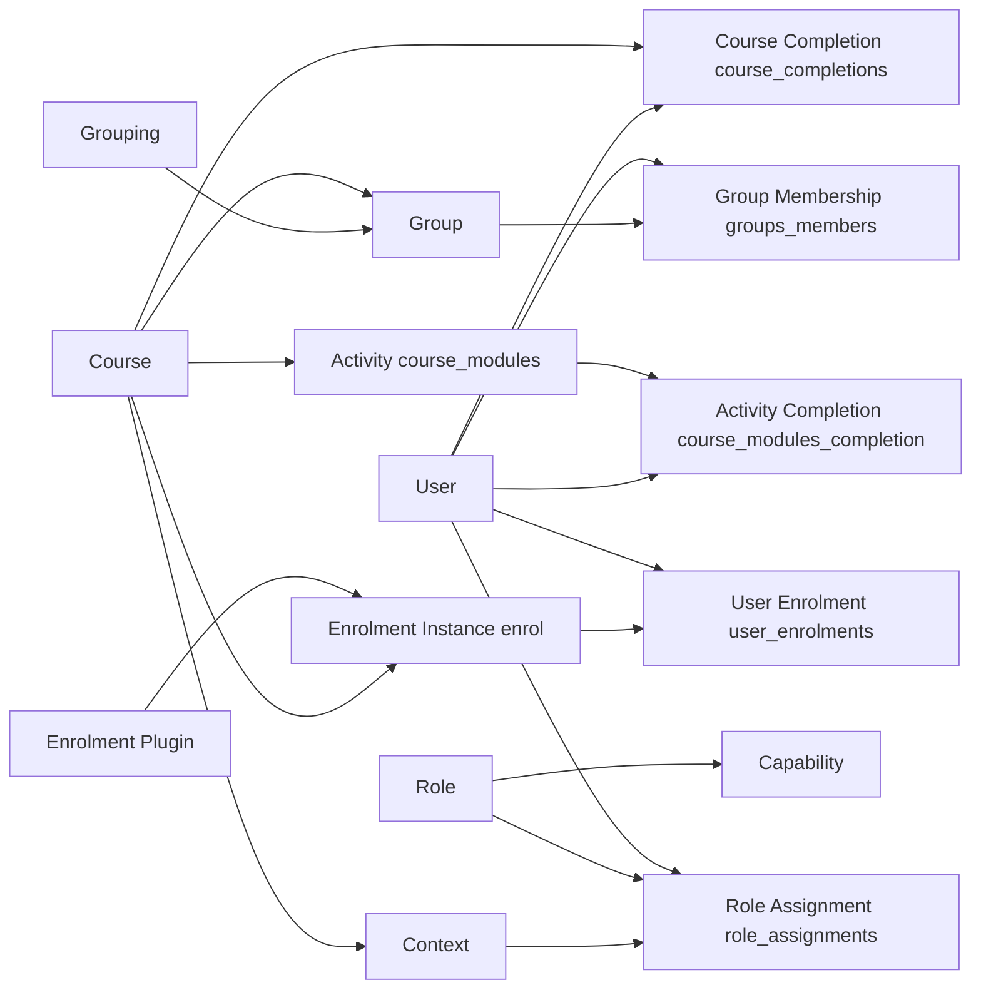
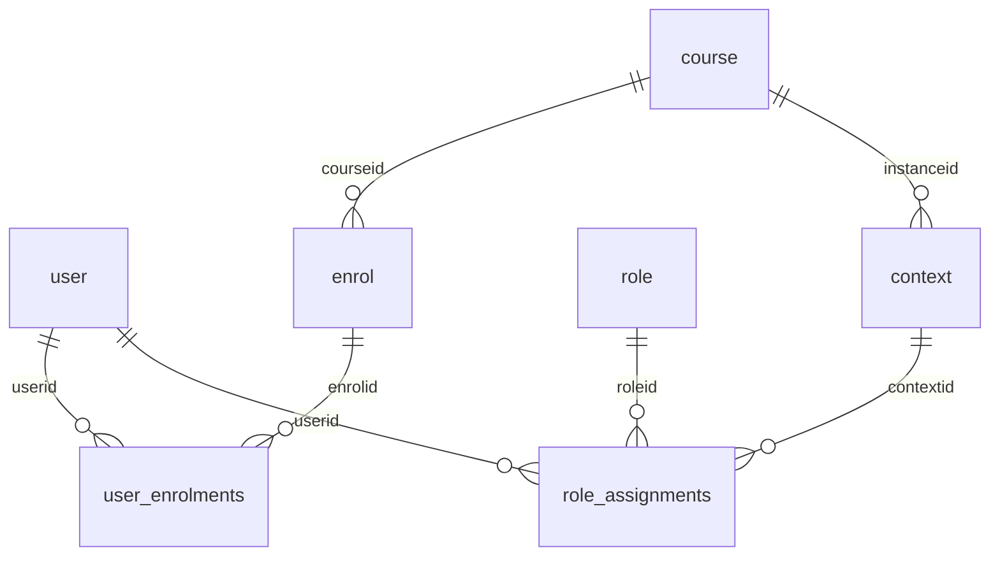
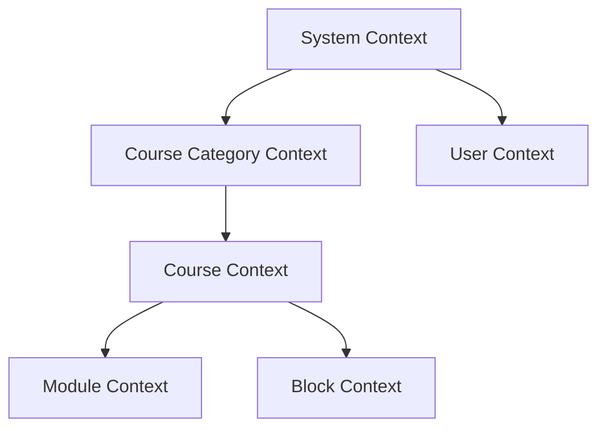
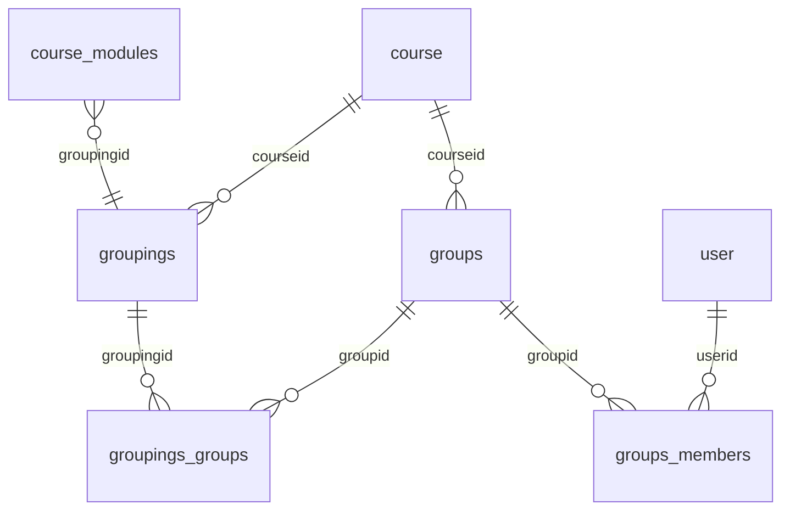
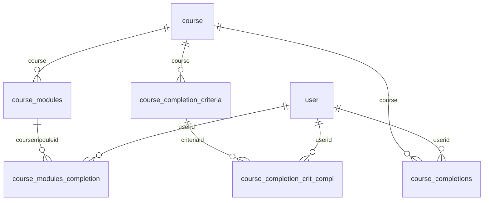
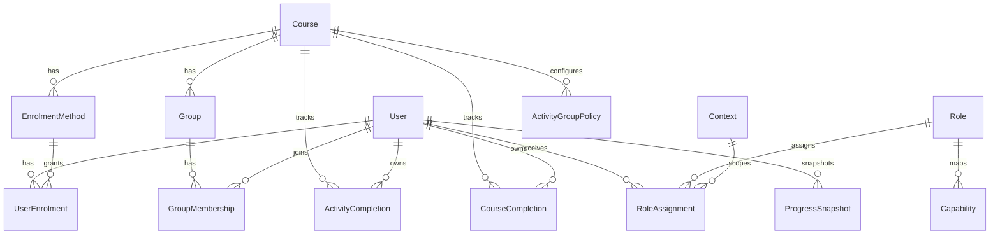

# Moodle People and Enrolment — Source-Code Investigation

## 1. Executive Summary
Team 2 owns the People and Enrolment domain boundary: enrolment state, roles/capabilities/context, groups/groupings, and completion/progress. These are separate subsystems in Moodle because they solve different concerns:
- Enrolment answers who is participating and under which enrolment method.
- Roles and capabilities answer who is allowed to do what.
- Groups and groupings answer participant segmentation and scope.
- Completion answers what learning state has been achieved.

The overlap is difficult because final behavior is an intersection of all four systems, not any one table or one API. For example, a user can hold a role assignment and still fail action checks because enrolment is suspended, group constraints block target visibility, or module-specific completion logic differs from core defaults.

Most important architectural findings:
- Enrolment paths are separate rows in user_enrolments and can coexist per user/course.
- Role assignments carry provenance through component and itemid; enrolment-managed roles can be removed selectively.
- Capability resolution is role-aggregate with hard-stop prohibit semantics.
- Group mode is context/module-derived and then plugin behavior applies extra filtering.
- Completion is a core engine with plugin-defined custom rules.

Most important unresolved questions:
- Exact user-visible behavior after re-enrolment for every activity plugin (some effects are plugin-specific and require runtime validation).
- Historical progress after deletions is not reconstructable from live course tables alone without an external snapshot.

Investigated source revision:
- Release: 5.3dev (Build: 20260714)
- Commit: 23f47c2e4349231defd8cf56935558e41242ea8e
- Branch: main

Final decision pipeline summary:

```text
User
→ Enrolment
→ Role assignment
→ Capability resolution
→ Context
→ Group restriction
→ Effective action
→ Progress/completion impact
```

## 2. Repository and Version Information
Moodle version and maturity were confirmed from source, not memory:
- public/version.php:32 defines $version = 2026071400.00
- public/version.php:35 defines $release = '5.3dev (Build: 20260714)'
- public/version.php:36 defines $branch = '503'
- public/version.php:37 defines MATURITY_ALPHA

Repository state at investigation start:
- Branch: main
- Commit: 23f47c2e4349231defd8cf56935558e41242ea8e
- Working tree: dirty (pre-existing untracked TEAM2-PEOPLE-ENROLMENT-GUIDE.md)

Relevant top-level directories for Team 2:
- public/enrol, public/lib/enrollib.php
- public/lib/accesslib.php, public/admin/roles
- public/group, public/lib/grouplib.php
- public/completion, public/lib/completionlib.php
- public/mod/assign, public/mod/forum, public/mod/quiz, public/mod/page

Plugin architecture relevant to Team 2:
- Enrolment plugins: public/enrol/* implementing class ... extends enrol_plugin
- Capability definitions: db/access.php files in core and plugins
- Activity completion custom rules: mod/*/classes/completion/custom_completion.php

Database abstraction approach:
- Logical table names in SQL use {table} placeholders (for example in accesslib and enrol APIs).
- Prefix expansion is centralized in public/lib/dml/moodle_database.php: fix_table_names and fix_table_name.

Table prefix behavior:
- Default template: config-dist.php:47 uses mdl_.
- Runtime local config: config.php:13 uses $CFG->prefix = 'mdl_'.

Database systems supported by this version:
- install CLI enumerates mysqli, auroramysql, mariadb, pgsql, sqlsrv (admin/cli/install.php around database driver setup).
- config template declares pgsql, mariadb, mysqli, auroramysql, sqlsrv (config-dist.php:41 comment).

## 3. Terminology
User: identity in user table.
Course: learning container represented by course.
Enrolment plugin: method provider (manual, self, cohort, etc.).
Enrolment instance: one configured plugin instance row in enrol for a course.
User enrolment: relationship row in user_enrolments linking user and enrol instance.
Active enrolment: user_enrolments.status = ENROL_USER_ACTIVE.
Suspended enrolment: user_enrolments.status = ENROL_USER_SUSPENDED.
Expired enrolment: time-window condition (timeend reached) that plugin sync may suspend or unenrol.
Unenrolment: removal of user_enrolments row for an enrol instance; may trigger broader cleanup when last path ends.
Re-enrolment: new or reactivated user_enrolments relation for same course.
Role: named profile of permissions (role table, archetype).
Role assignment: row in role_assignments binding role/user/context (+ component/itemid provenance).
Capability: permission key (for example mod/assign:grade).
Permission: resolved value for a capability in context after role evaluation.
Context: scope node (system, category, course, module, etc.).
Context hierarchy: parent-child chain encoded in context.path and context.depth.
Allow: CAP_ALLOW.
Prevent: CAP_PREVENT.
Prohibit: CAP_PROHIBIT (hard deny).
Group: participant subset inside one course.
Group membership: groups_members row.
Grouping: collection of groups (groupings + groupings_groups).
Group mode: none/separate/visible effective mode.
Separate groups: members see/use only allowed groups unless access-all-groups.
Visible groups: can see others, participation still may differ per plugin.
Access all groups: capability moodle/site:accessallgroups bypassing some limits.
Activity completion: per-activity completion state in course_modules_completion.
Course completion: aggregated course-level completion state in course_completions.
Completion criteria: rules in course_completion_criteria and plugin rule definitions.
Completion state: incomplete/complete/pass/fail variants.

Important distinctions:
- Enrolment is not a role.
- Role is not a capability.
- Group is not permission.
- Activity completion is not course completion.

## 4. High-Level Architecture

Core systems:
- Enrolment core APIs: public/lib/enrollib.php
- Access control core APIs: public/lib/accesslib.php
- Groups core APIs: public/lib/grouplib.php and public/group/lib.php
- Completion core APIs: public/lib/completionlib.php

Plugin-specific layers:
- enrol/manual, enrol/self, enrol/cohort
- activity-specific completion and authorization behavior in mod/*

---

# Part A — Enrolment and User Lifecycle

## 5. Enrolment Architecture
Core APIs and base class:
- ENROL_USER_ACTIVE and ENROL_USER_SUSPENDED constants: public/lib/enrollib.php:37,40.
- enrol_plugin::enrol_user: inserts/updates user_enrolments and optional role assignment.
- enrol_plugin::update_user_enrol: changes status/time window and triggers update event.
- enrol_plugin::unenrol_user: removes enrol-instance role assignments, removes user_enrolments row, and if last enrolment path in course then removes remaining roles/groups/grades/lastaccess.
- is_enrolled and get_enrolled_sql provide active/non-active interpretation.

Plugin architecture and examples:
- Manual plugin: public/enrol/manual/lib.php, roles_protected=false, allow_enrol/manage/unenrol true.
- Self plugin: public/enrol/self/lib.php sync handles inactivity and expiry unenrolment.
- Cohort plugin: public/enrol/cohort/lib.php and enrol/cohort/locallib.php event-driven sync + full sync.

How instances attach to courses:
- enrol table has courseid and plugin name enrol.

How users attach to instances:
- user_enrolments.enrolid references enrol.id.

How roles are assigned through enrolment:
- enrol_plugin::enrol_user assigns roles, optionally tracked with component enrol_<plugin> and itemid instance id when roles_protected is true.

Status and dates:
- user_enrolments.status, timestart, timeend.

Suspension vs unenrolment:
- Suspension updates status to suspended, keeps row.
- Unenrolment deletes the row for that path; if it was last path in course, extra cleanup is executed.

Re-enrolment:
- existing row can be updated/reactivated via enrol_user/update_user_enrol; otherwise new row inserted.

Generated events:
- user_enrolment_created, user_enrolment_updated, user_enrolment_deleted.

## 6. Enrolment Database Model
Core tables and purpose:
- user: principal identity.
- course: course container.
- enrol: enrolment instance configuration.
- user_enrolments: user-to-instance participation row.
- role_assignments: role-user-context mapping, with component/itemid provenance.
- context: permission scope tree metadata (path, depth).

Field-level notes:
- enrol.status is instance enabled/disabled state.
- user_enrolments.status indicates active/suspended.
- user_enrolments.timestart/timeend carry validity window.
- role_assignments.component/itemid identify managing plugin instance.



Deletion behavior:
- unenrol_user deletes one user_enrolments row.
- if last enrolment path in course, role_unassign_all + groups_delete_group_members + grade_user_unenrol + delete user_lastaccess.

Row semantic categories:
- Configuration: enrol.
- Relationship: user_enrolments, role_assignments.
- Structural scope metadata: context.

## 7. Multiple Enrolment Methods
Can one user have multiple enrolment paths in one course?
- Yes. user_enrolments uniqueness is enrolid+userid, not courseid+userid.

Are they stored separately?
- Yes, one row per enrol instance.

How does Moodle determine if user remains enrolled?
- get_enrolled_sql and is_enrolled rely on existence of active path(s) when onlyactive=true.

What happens when one path is removed?
- user remains enrolled if another path for that course exists; unenrol_user computes lastenrol false in that case.

What happens when final active path is removed?
- last-enrol cleanup triggers role and group and grade cleanup in course.

Can different paths assign different roles?
- Yes, role_assignments include component+itemid and can be plugin-path specific.

How are enrolment-created role assignments tracked?
- component='enrol_pluginname', itemid=enrol instance id.

Can one path be suspended while another is active?
- Yes. status is per user_enrolments row.

## 8. Suspension, Unenrolment, and Re-enrolment
### Suspension
Which fields change?
- user_enrolments.status to ENROL_USER_SUSPENDED.

Does row remain?
- Yes.

Do role assignments remain?
- Depends on plugin action. Some plugin sync modes unassign roles when suspending (for example cohort/manual options).

Is course access removed?
- Active-enrolment checks fail where onlyactive logic is used.

Are groups affected?
- Not always by suspend itself; plugin sync may remove enrol-managed group links.

Are completion records affected?
- No direct completion-row deletion on suspend in core suspend update path.

### Unenrolment
Which rows are deleted?
- user_enrolments row for that instance.

Which callbacks run?
- before_user_enrolment_removed hook and event dispatch.

Which role assignments are removed?
- Enrolment-owned assignments for that path always.
- If final enrolment path, all remaining roles in course context are unassigned.

Which user-created content remains?
- Submissions/posts are not directly deleted in enrol_plugin::unenrol_user.

Which related records are cleaned up?
- groups (group memberships), grade enrollment-facing state, user_lastaccess when last enrolment.

Which behavior is plugin-specific?
- suspend-vs-unenrol policy, role retention policy, and sync timing.

### Re-enrolment
Old row restored or replaced?
- If same enrolid+userid exists, row is updated; otherwise inserted.

Can old submissions/posts/grades/completion become visible again?
- Source analysis suggests yes for persisted content unless removed by specific cleanup path or plugin callback; visibility depends on enrolment and permissions.

Requires live testing:
- module-by-module visibility after re-enrolment
- gradebook recalculation details
- cohort/manual policy variants

## 9. Enrolment Business Rules Catalogue
| Rule ID | Rule | Code Evidence | Database Evidence | Confidence | Live Validation Needed | Related Domain |
|---|---|---|---|---|---|---|
| ENR-001 | Active and suspended are distinct per user enrolment row. | enrollib constants and update_user_enrol | user_enrolments.status | High | No | Enrolment |
| ENR-002 | Multiple enrolment paths per course are possible. | unenrol_user lastenrol SQL and enrolid+userid logic | unique index enrolid,userid | High | No | Enrolment |
| ENR-003 | One path removal does not imply full course unenrolment. | unenrol_user lastenrol false branch | user_enrolments by course join | High | No | Enrolment |
| ENR-004 | Last path removal triggers broader cleanup. | unenrol_user lastenrol true branch | role_assignments, groups_members, user_lastaccess | High | No | Integration |
| ENR-005 | Enrolment can create role assignments. | enrol_user role_assign call | role_assignments component/itemid | High | No | Roles |
| ENR-006 | Enrolment-owned roles can be removed by component/itemid. | role_unassign_all usage in unenrol | role_assignments.component,itemid | High | No | Roles |
| ENR-007 | Suspension can be configured to keep or remove roles depending on plugin/action. | manual/cohort sync branches | role_assignments rows vary | High | Yes | Roles |
| ENR-008 | Cohort member add event can enrol and add to group automatically. | enrol/cohort/locallib member_added | user_enrolments + groups_members | High | No | Groups |
| ENR-009 | Cohort member removal can suspend or unenrol based on config. | enrol/cohort/locallib member_removed | user_enrolments.status or deletion | High | Yes | Enrolment |
| ENR-010 | Self enrolment sync can auto-unenrol inactive users. | enrol/self/lib.php sync | user_lastaccess + user_enrolments | High | Yes | Lifecycle |
| ENR-011 | is_enrolled with onlyactive=true enforces enabled instance and time windows. | get_enrolled_join active conditions | enrol.status, ue.status,timestart,timeend | High | No | Access |
| ENR-012 | is_enrolled with onlyactive=false accepts outdated/inactive paths for presence checks. | is_enrolled else branch | user_enrolments + enrol join | High | No | Access |
| ENR-013 | Group memberships linked to enrol path are removed on that path unenrolment. | unenrol_user groups_members component/itemid branch | groups_members.component,itemid | High | No | Groups |
| ENR-014 | Grades can be recovered during enrol_user depending on recovergrades. | enrol_user grade_recover_history_grades | grade history tables | Medium | Yes | Grades |
| ENR-015 | User dirty/access caches are invalidated after enrol updates and deletes. | mark_user_dirty + cache invalidation calls | n/a | High | No | Performance |

---

# Part B — Roles, Permissions, and Contexts

## 10. Roles and Capabilities Architecture
Role definitions and archetypes:
- role table includes archetype.
- core and plugin db/access.php define capability defaults by archetype.

Capability definitions:
- capabilities table + db/access.php registration during install/upgrade.

Role assignments:
- role_assign inserts role_assignments, emits role_assigned event.
- role_unassign/role_unassign_all remove assignments and emit role_unassigned.

Capability overrides:
- role_capabilities table stores context-specific permission entries.

Effective permission calculation:
- has_capability delegates to has_capability_in_accessdata.
- Aggregation is role-wise along context path; any CAP_PROHIBIT returns false immediately; otherwise any CAP_ALLOW across roles grants true.

Caches:
- access data loaded into USER.access and refreshed when context is dirty.

Entry points:
- require_capability wraps has_capability and throws required_capability_exception.

## 11. Context Hierarchy
Context levels are constants in accesslib:
- CONTEXT_SYSTEM 10
- CONTEXT_COURSECAT 40
- CONTEXT_COURSE 50
- CONTEXT_MODULE 70

Hierarchy and inheritance use context.path and context.depth.
Parent chain APIs:
- context::get_parent_context_ids
- context::get_parent_context_paths
- context::get_course_context



Why permissions differ by course/activity:
- Different context ids and path chains imply different role assignment sets and role_capabilities visibility.

How path/depth are used:
- has_capability_in_accessdata iterates bottom-to-top over context path segments.

## 12. Allow, Prevent, and Prohibit
Definitions:
- Not set: no explicit value for that role/context/capability.
- Allow: CAP_ALLOW.
- Prevent: CAP_PREVENT.
- Prohibit: CAP_PROHIBIT.

Resolution behavior:
- Lower context can override higher values for that role because path is evaluated from specific context upward and first found value for role is retained.
- Prohibit cannot be overridden by another role allow in aggregate resolution; any prohibit causes immediate false.
- Multiple roles: any allow can grant if no prohibit appears in any role.
- Allow + prevent in different roles generally results in allow unless a prohibit exists.
- Allow + prohibit results in deny.

## 13. Role Assignment and Enrolment Interaction
Does every enrolment create a role assignment?
- Not always. enrol_user only assigns when roleid parameter is supplied (or plugin path config causes it).

Can role assignment exist without enrolment?
- Yes, manual or system/category assignments exist independently.

Can user have access through role only?
- For some checks yes (capability checks), but many course participation checks require enrolment (is_enrolled/get_enrolled_sql usage).

During suspension:
- Role assignments may remain or be removed depending on plugin action mode.

During unenrolment:
- Enrolment-owned role assignments removed; potentially all roles in course if final enrolment path is removed.

Separate control by enrolment method:
- Yes via role_assignments.component and itemid per enrol instance.

## 14. Permission Decision Trace
Example 1: View a course
- Entry point: course/view.php.
- Login gate: require_login(course).
- Context: context_course::instance(courseid).
- Resolver: require_login and subsequent capability checks for hidden sections and editing switches.
- Additional restrictions: section uservisible/availability checks.
- Final result: allowed/denied by authentication, enrolment/role, and section visibility logic.

Example 2: Update a course
- Entry point: course/edit.php.
- Required capability: moodle/course:update.
- Context: context_course::instance(courseid).
- Resolver: require_capability('moodle/course:update', context).
- Final result: direct capability gate.

Example 3: Grade an assignment
- Entry points: mod/assign/locallib operations and web service endpoints.
- Required capability: mod/assign:grade.
- Context: assignment module context.
- Resolver: require_capability('mod/assign:grade', context) plus assignment-specific checks.
- Additional restrictions: can_view_submission checks active/suspended and is_enrolled for target user; group mode filtering in grading table flow.
- Final result: capability alone is insufficient for all target-user operations.

## 15. Roles and Permissions Business Rules Catalogue
| Rule ID | Rule | Code Evidence | DB Evidence | Confidence | Live Validation Needed |
|---|---|---|---|---|---|
| ROL-001 | Capability checks require a valid context path/depth. | has_capability prechecks | context.path,depth | High | No |
| ROL-002 | Site admin bypass applies unless switched role context affects flow. | has_capability doanything branch | config siteadmins | High | No |
| ROL-003 | Guest/not-logged-in cannot obtain risky write caps. | has_capability riskbitmask gate | user id/guest | High | No |
| ROL-004 | Any CAP_PROHIBIT in evaluated roles denies access. | has_capability_in_accessdata | role_capabilities.permission | High | No |
| ROL-005 | Any CAP_ALLOW without prohibit grants access. | has_capability_in_accessdata | role_capabilities.permission | High | No |
| ROL-006 | Role assignments are context-scoped. | role_assign contextid parameter | role_assignments.contextid | High | No |
| ROL-007 | Role assignment provenance supports plugin ownership. | role_assign component/itemid | role_assignments.component,itemid | High | No |
| ROL-008 | role_unassign_all can target component-owned assignments. | role_unassign_all params | role_assignments filtered delete | High | No |
| ROL-009 | Context hierarchy is parent-chain based via path. | context methods | context.path | High | No |
| ROL-010 | Course and module contexts are distinct permission scopes. | CONTEXT_COURSE/MODULE constants | context.contextlevel | High | No |
| ROL-011 | Access data is cached and may need dirty reload. | has_capability + reload_if_dirty | n/a | High | No |
| ROL-012 | require_capability throws on failure (hard gate). | require_capability | n/a | High | No |
| ROL-013 | Role can exist independently of enrolment. | role_assign API independent | role_assignments no enrol FK | High | No |
| ROL-014 | Enrolment-managed roles can be selectively removed without touching manual roles. | unenrol_user + component filters | role_assignments | High | No |
| ROL-015 | Permission decision may still fail after allow due to later module/group/business checks. | assign can_view_submission etc | mixed tables | High | Yes |

---

# Part C — Groups and Groupings

## 16. Groups Architecture
Core constants and mode:
- NOGROUPS, SEPARATEGROUPS, VISIBLEGROUPS in grouplib.

Effective group mode:
- groups_get_activity_groupmode uses course groupmodeforce override.

Active group selection:
- groups_get_activity_group computes allowed groups, applies capability moodle/site:accessallgroups, updates session activegroup.

Visibility check:
- groups_group_visible decides if a specific group is visible in context.

Membership lifecycle:
- groups_add_member checks enrolment before adding.
- groups_remove_member removes membership and emits event.
- groups_sync_with_enrolment reconciles enrol-linked memberships.

Activity behavior:
- Assignment extensively calls groups_get_activity_group and applies filtering per operation.
- Forum and other modules use common helpers plus plugin logic.

## 17. Groups Database Model
Core tables:
- groups: group identity inside course.
- groups_members: user-group relation with component/itemid provenance.
- groupings: grouping identity inside course.
- groupings_groups: grouping-to-group relation.
- course_modules: activity-level groupmode/groupingid.



Multiple group membership:
- Allowed by design (unique userid+groupid only, not userid+courseid).

Historical membership:
- No built-in temporal history table for joins/leaves; only current membership persists.

## 18. Group Mode Resolution
How effective mode is determined:
- groups_get_activity_groupmode returns module mode unless course groupmodeforce overrides.

Mode semantics:
- No groups: group filtering off.
- Separate groups: user usually restricted to own groups unless access-all-groups.
- Visible groups: wider visibility of other groups, participation details may still be plugin-specific.

Does mode deny access or filter records?
- Core group mode mostly drives filtering and active-group visibility helpers.
- Final deny/allow can still be plugin-specific (for example assignment grading views).

Assignment vs forum identical?
- Not identical in details. Core helpers are shared, but module code applies distinct behavior and UI constraints.

## 19. Teaching Assistant Scope
Target scenario:
- TA can grade Group A, cannot grade Group B, cannot see Group C.

Mechanisms required:
- Role capabilities: mod/assign:grade and related permissions.
- Group membership and activity group mode.
- Access-all-groups must be absent for strict separation.
- Assignment workflow applies target-user checks and group filters.

Limitation:
- Achieving three distinct states (grade one group, visible-not-grade second, invisible third) often needs combined configuration (capabilities, group mode, possibly different activities/groupings). Exact behavior can differ by module and requires live validation.

## 20. Multiple Group Membership
Can user belong to two groups?
- Yes.

How active group chosen?
- groups_get_activity_group uses session activegroup per course/grouping/mode.

Assignment vs forum differences:
- Both use common group utilities, but operation-specific checks differ.

Submission group identity stored or derived?
- Assignment has team/group submission mechanics; visibility checks use current group constraints and enrolment state.

Membership changes after submission:
- Source suggests visibility and operation checks use current access state; historical group-at-submit is not a universal cross-module primitive.

Requires live testing:
- per-activity edge behavior after membership change.

## 21. Enrolment and Group Membership Lifecycle
Suspension impact:
- Depends on plugin action; suspend alone does not always delete groups.

Unenrolment impact:
- unenrol_user removes enrol-linked group memberships for that instance.
- On last enrolment path, groups_delete_group_members removes all course group memberships for user.

Re-enrolment impact:
- Plugin sync (cohort/meta style) can re-add group memberships via groups_sync_with_enrolment.

## 22. Groups Business Rules Catalogue
| Rule ID | Rule | Code Evidence | DB Evidence | Confidence | Live Validation Needed |
|---|---|---|---|---|---|
| GRP-001 | Activity group mode may be forced by course setting. | groups_get_activity_groupmode | course.groupmodeforce | High | No |
| GRP-002 | Separate groups require allowed-group resolution. | groups_get_activity_group | groups_members | High | No |
| GRP-003 | Access-all-groups capability widens visibility. | groups_get_activity_allowed_groups | capability + memberships | High | No |
| GRP-004 | Group membership add requires enrolment in course. | groups_add_member is_enrolled check | groups_members insert gate | High | No |
| GRP-005 | Group membership rows can be plugin-owned. | groups_members.component,itemid | groups_members fields | High | No |
| GRP-006 | Plugin-owned group memberships may be non-removable from normal UI. | groups_remove_member_allowed callback logic | groups_members.component | Medium | Yes |
| GRP-007 | Unenrolment removes enrol-instance-linked memberships. | enrol_plugin::unenrol_user | groups_members component/itemid | High | No |
| GRP-008 | Last enrolment removal removes all memberships in course. | groups_delete_group_members call | groups_members by course | High | No |
| GRP-009 | Cohort sync can add/remove memberships in bulk. | groups_sync_with_enrolment + cohort sync | groups_members | High | No |
| GRP-010 | User can belong to multiple groups concurrently. | schema uniqueness userid+groupid only | groups_members unique key | High | No |
| GRP-011 | Grouping links many groups. | groupings_groups | groupings_groups rows | High | No |
| GRP-012 | Activity group filtering may still allow all participants in visible mode. | grouplib visible logic branches | n/a | High | No |
| GRP-013 | Assignment applies additional group-target restrictions beyond raw capability checks. | assign locallib group calls | n/a | High | Yes |
| GRP-014 | Group mode no-groups bypasses group restriction checks. | groups_group_visible early return | n/a | High | No |
| GRP-015 | Group membership history is not persisted as a temporal log in core group tables. | table design inspection | groups_members current-state only | Medium | Yes |

---

# Part D — Progress and Completion

## 23. Completion Architecture
Core:
- completion state constants in completionlib.
- completion_info::update_state and set_module_viewed are central state transition APIs.

Enablement layers:
- Site/course/activity completion config gates behavior.

Manual vs automatic:
- Manual tracking sets explicit completion state.
- Automatic tracking computes from core + plugin custom rules.

Plugin-specific rules:
- Assignment custom completion: submission status submitted.
- Quiz custom completion: pass-grade and/or attempts-exhausted and min attempts logic.
- Forum custom completion: discussions/replies/posts thresholds.

Course completion:
- Criteria tables and aggregation logic (course_completion_* tables and completion criteria APIs).

Processing and reporting:
- completion_info::get_tracked_users/get_progress_all use enrolled users and capability moodle/course:isincompletionreports.

## 24. Completion Database Model
Required tables:
- course_modules (completion settings fields)
- course_modules_completion (per-user activity completion state)
- course_completions (course-level completion status)
- course_completion_criteria (course criteria definitions)
- course_completion_crit_compl (user criterion completion records)



Completion states:
- Incomplete, complete, complete pass, complete fail, complete fail hidden.

Stored vs derived:
- per-activity and per-course completion rows stored.
- some progress percentages and report views are derived.

## 25. Activity Completion
1) Page viewed
- Trigger: page_view.
- Logic: completion_info->set_module_viewed.
- Store: course_modules_completion row update_state path.
- UI: completion indicator updates.

2) Quiz pass/fail
- Trigger: quiz custom completion rule evaluation.
- Logic: pass-grade/attempts rules in mod_quiz custom_completion.
- Store: completion state via completion_info update path.
- UI: pass/fail completion state.

3) Assignment submission
- Trigger: assignment custom completion rule evaluation.
- Logic: submission status submitted.
- Store: completion state updated.
- UI: completion shown complete/incomplete.

4) Forum posting
- Trigger: forum custom completion rule evaluation.
- Logic: counts discussions/replies/posts against configured thresholds.
- Store: completion state updated.
- UI: completion rule indicators.

5) Manual completion
- Trigger: manual toggle endpoint.
- Logic: completion_info->update_state with manual mode.
- Store: completionstate update + override metadata when applicable.

## 26. Completion Rule Changes
When conditions change:
- Existing completion records may become stale relative to new rules.
- Core APIs include locking/validation around existing completion data and state updates.

Automatic recalculation:
- Not all scenarios are eagerly recalculated for all users instantly.
- Recalculation depends on trigger paths, report access, and background processing.

Warnings/manual steps:
- Source indicates admin/course edit flows are completion-aware; full historical recalc strategy should be validated in runtime.

Cron role:
- Scheduled processing participates in wider completion/course state maintenance.

Migration risks:
- Rule changes after long-running courses can produce expectation mismatches unless explicitly reprocessed.

## 27. Hidden, Restricted, and Deleted Activities
Hidden/restricted:
- Course section and availability/uservisible checks gate page visibility.
- Completion reporting queries are based on tracked users and module completion data; denominator effects for hidden/restricted combinations can vary by report/view configuration.

Deleted activities:
- Course/module deletion code removes course_modules_completion and related completion criteria for activity.
- Deleted module context and rows are removed, so activity-level completion history is not retained in live core tables.

Recycle bin/backup:
- restore/backup paths may preserve recoverable artifacts operationally, but live reporting from removed rows is not available without restore/external snapshot.

## 28. Enrolment Lifecycle and Progress
Suspension:
- Completion rows are not directly deleted by suspension update path.
- UI/report access may change due to enrolment filters and capabilities.

Unenrolment:
- Core unenrol_user cleans groups/grades/roles/lastaccess for last enrolment path but does not directly purge all completion rows in same function.
- Course/module deletion paths do delete completion rows.

Re-enrolment:
- Completion rows may still exist and become visible depending on report filters and enrolment state.

Cleanup callbacks:
- plugin hooks and grade/course cleanup functions influence final observable state.

## 29. Historical Progress Across Deleted Courses
Hard case conclusion:
- Live Moodle operational tables do not provide guaranteed full historical progress for deleted courses.
- delete_course/remove_course_contents remove modules, contexts, and completion/module records.
- Therefore, a three-year cross-course progress report including deleted courses requires external immutable snapshots or audit warehouse extraction.

Team 2 implication:
- Preserve periodic progress snapshots externally if deleted-course history is a product requirement.

## 30. Progress Business Rules Catalogue
| Rule ID | Rule | Code Evidence | DB Evidence | Confidence | Live Validation Needed |
|---|---|---|---|---|---|
| PRG-001 | Completion states include pass/fail variants. | completionlib constants | course_modules_completion.completionstate | High | No |
| PRG-002 | set_module_viewed updates completion when view rule enabled. | completionlib set_module_viewed | course_modules_completion | High | No |
| PRG-003 | Manual tracking accepts explicit complete/incomplete states only. | completionlib update_state switch | course_modules_completion | High | No |
| PRG-004 | Automatic tracking computes from core + plugin custom rules. | completionlib internal_get_state | mod custom_completion classes | High | No |
| PRG-005 | Assignment completion submit rule depends on submission status. | assign custom_completion | assign_submission + completion row | High | No |
| PRG-006 | Forum completion rules use posts/replies/discussions counters. | forum custom_completion | forum_posts/forum_discussions | High | No |
| PRG-007 | Quiz completion pass/attempt logic may require grade and attempts. | quiz custom_completion | quiz_attempts/grades + completion | High | No |
| PRG-008 | Tracked users for completion reports are enrolled users with capability filter. | completionlib get_tracked_users | get_enrolled_sql output | High | No |
| PRG-009 | Completion rows can remain while user visibility changes. | enrolment/report filter interaction | completion rows + enrolment status | Medium | Yes |
| PRG-010 | Module deletion removes activity completion rows. | remove_course_contents/cmactions delete_records | course_modules_completion | High | No |
| PRG-011 | Course deletion removes broad course content and completion-related module rows. | delete_course/remove_course_contents | multiple tables | High | No |
| PRG-012 | Completion expected date updates create/update events. | module add/update calls api update_completion_date_event | event/calendar data | Medium | Yes |
| PRG-013 | Override completion requires override capability. | completionlib update_state override guard | n/a | High | No |
| PRG-014 | Completion cache is invalidated/updated for user-course key. | completionlib cache logic | cache entries | High | No |
| PRG-015 | Historical progress for deleted courses is not guaranteed in live core course tables. | delete paths | absent rows after delete | High | No |

---

# Part E — Cross-System Integration

## 31. Final Effective-Action Decision
Actual conceptual order in code is not one fixed global function, but common paths are:
1. Target context resolved.
2. Authentication/session checks (require_login or equivalent).
3. Enrolment participation checks where required by feature (is_enrolled/get_enrolled_sql usage).
4. Capability resolution (has_capability/require_capability).
5. Group visibility/active-group restrictions.
6. Activity-specific business checks (for target user, submission state, workflow state, etc.).
7. Final allow/deny or filtered result set.

The often-mentioned order is broadly correct, but implementation is distributed and endpoint-specific.

## 32. Full Worked Example
Scenario:
- Actor ta.a in Group A with grading capability, no access-all-groups.
- Target student.b in Group B.
- Activity assignment in separate groups.

Source-grounded evaluation:
- Enrolment: both users need course participation for visibility-sensitive operations.
- Capability: mod/assign:grade may be true for actor.
- Context: assignment module context.
- Grouping/mode: assignment uses groups_get_activity_group and related filtering.
- Target check: can_view_submission checks enrolment/activity-user visibility gates; grading views apply group restrictions.

Expected result:
- Source analysis suggests ta.a cannot grade student.b in separate groups without access-all-groups when target is outside allowed groups.

Human explanation:
- Capability says TA can grade assignments generally, but group partitioning limits which student records are reachable in this activity context.

Remaining live validation:
- Verify exact grader UI/API response for cross-group target in current plugin version/config.

## 33. Stored State vs Effective State
| Case | Stored State | Effective State |
|---|---|---|
| Suspended enrolment | user_enrolments row remains | often excluded by active-only checks |
| Enrolment-owned role assignment removed | role_assignments may be removed on policy | capability may disappear even if user still exists |
| Group membership remains after suspend | groups_members row may remain depending policy | activity access may still be blocked by enrolment or capability |
| Completion rows remain | course_modules_completion can persist | report visibility can change by enrolment/capability filters |
| Submission remains after unenrol | module submission rows generally not deleted in core unenrol function | may be hidden if user no longer accessible in context |
| Configured capability allow exists | role_capabilities says allow | final operation may still fail due to group/plugin checks |
| Deleted course | historical rows may be removed | no live UI/report reconstruction without external snapshots |

## 34. Cross-System Business Rules
| Rule ID | Rule | Evidence | Confidence |
|---|---|---|---|
| INT-001 | Capability allow is necessary but not always sufficient for action. | assign can_view_submission + group checks | High |
| INT-002 | Enrolment participation and capability checks are jointly used in many flows. | is_enrolled + require_capability patterns | High |
| INT-003 | Enrolment-owned role provenance enables targeted cleanup. | role_assignments component/itemid | High |
| INT-004 | Last-enrolment removal triggers cross-domain cleanup (roles/groups/grades). | unenrol_user last path branch | High |
| INT-005 | Group add enforces course participation. | groups_add_member is_enrolled guard | High |
| INT-006 | Completion reports use enrolled-user SQL + capability filter. | completion get_tracked_users/get_enrolled_sql | High |
| INT-007 | Activity completion rules are plugin-specific over core framework. | mod/*/custom_completion + completionlib | High |
| INT-008 | Deleting activities or courses removes completion-related records. | cmactions/remove_course_contents | High |
| INT-009 | Multiple enrolment methods can coexist and independently affect roles and groups. | user_enrolments uniqueness + cohort sync | High |
| INT-010 | Final decision path is endpoint-specific, not one monolithic engine call. | distributed entry points | High |

---

# Part F — Hard Cases

## 35. Hard Case 1 — Multiple Enrolment Methods
Question: manual + cohort, cohort removed.
- Relevant paths: enrollib unenrol_user, enrol/cohort/locallib sync.
- Relevant rows: user_enrolments (per enrolid), enrol (instance), role_assignments (component/itemid).
- Expected: user stays enrolled if another active path remains.
- Edge: role sets may change if removed path owned distinct role assignments.
- Live validation: create dual-path user, remove one cohort membership, inspect get_enrolled_sql and role_assignments.

## 36. Hard Case 2 — Dropout and Re-enrolment
Submissions:
- Generally not deleted by core enrol_plugin::unenrol_user.
Grades:
- grade_user_unenrol called on last path cleanup; grade visibility/recovery needs runtime verification.
Forum posts:
- Not explicitly deleted in core unenrol path.
Groups:
- Enrol-linked memberships removed; full course memberships removed if last enrolment path removed.
Roles:
- Enrol-owned roles removed; potentially all course roles on last path cleanup.
Progress:
- Completion rows not directly purged in unenrol function; visibility/reporting depends on enrolment filters.
Re-enrolment:
- Row updated/inserted and access can return according to current permissions.

## 37. Hard Case 3 — TA with Three Different Group Outcomes
Likely requires combined mechanisms:
- Role capabilities for grading/viewing
- Separate groups mode
- TA group membership
- No access-all-groups capability
- Possibly activity-level or grouping-specific design
- Potentially separate activities for strict triple-state UX

## 38. Hard Case 4 — Student in Two Groups
- Allowed by schema.
- Active group chosen per session and context helpers.
- Plugin behavior may differ on whether operations use current selected group, allowed-groups union, or target-user checks.
- Requires activity-specific runtime validation (assignment, forum, quiz reports).

## 39. Hard Case 5 — Three-Year Progress Including Deleted Courses
- Core live tables cannot reliably provide full deleted-course history.
- Course deletion removes course content and related completion/module data.
- Recommendation: external snapshot store with immutable per-user, per-course, per-activity progress states.

---

# Part G — Database and Code Maps

## 40. Consolidated Database Table Map
| Logical Table | Purpose | Primary Key | Important Foreign Keys | Important State Fields | Important Time Fields | Owner Domain | Deletion Risk | Extraction Priority |
|---|---|---|---|---|---|---|---|---|
| user | identities | id | - | deleted,suspended,auth | timecreated,timemodified,lastaccess | People | Medium | High |
| course | course root | id | - | visible,format | timecreated,timemodified | Courses | High | High |
| enrol | enrolment instance config | id | courseid, roleid | status,enrol,custom* | timecreated,timemodified | Enrolment | Medium | High |
| user_enrolments | user-instance relation | id | enrolid,userid,modifierid | status | timestart,timeend,timecreated,timemodified | Enrolment | Medium | High |
| context | scope tree | id | - | contextlevel,path,depth,locked | - | Access | Medium | High |
| role | role definitions | id | - | archetype,shortname | - | Access | Low | Medium |
| role_assignments | role bindings | id | roleid,contextid,userid | component,itemid | timemodified | Access | Medium | High |
| role_capabilities | overrides | id | roleid,contextid,capability | permission | timemodified | Access | Medium | Medium |
| groups | groups | id | courseid | participation,visibility | timecreated,timemodified | Groups | High | High |
| groups_members | membership | id | groupid,userid | component,itemid | timeadded | Groups | High | High |
| groupings | grouping container | id | courseid | - | timecreated,timemodified | Groups | High | Medium |
| groupings_groups | grouping links | id | groupingid,groupid | - | timeadded | Groups | High | Medium |
| course_modules | activity metadata | id | course,module,groupingid | groupmode,completion,completionview,availability,deletioninprogress | added,completionexpected | Completion/Groups | High | High |
| course_modules_completion | activity completion state | id | coursemoduleid,userid | completionstate,overrideby | timemodified | Completion | High | High |
| course_completion_criteria | course criteria defs | id | course | criteriatype,moduleinstance,etc | timecreated,timemodified | Completion | High | High |
| course_completion_crit_compl | per-criterion user status | id | userid,course,criteriaid | gradefinal | timecompleted | Completion | High | High |
| course_completions | course completion state | id | userid,course | reaggregate | timeenrolled,timestarted,timecompleted | Completion | High | High |

## 41. Consolidated Source-Code Map
| Domain | File Path | Class or Function | Responsibility | Important Called Functions | Database Tables | Confidence |
|---|---|---|---|---|---|---|
| Enrolment | public/lib/enrollib.php | is_enrolled | course participation check | enrol_get_enrolment_end, has_capability | enrol,user_enrolments,user | High |
| Enrolment | public/lib/enrollib.php | get_enrolled_sql/get_enrolled_join | active/suspended enrolled-user SQL | get_with_capability_join | enrol,user_enrolments,user | High |
| Enrolment | public/lib/enrollib.php | enrol_plugin::enrol_user | attach user to instance and optional role | role_assign, grade_recover_history_grades | user_enrolments,role_assignments | High |
| Enrolment | public/lib/enrollib.php | enrol_plugin::update_user_enrol | change status/time and emit event | mark_user_dirty | user_enrolments | High |
| Enrolment | public/lib/enrollib.php | enrol_plugin::unenrol_user | remove path and cleanup | role_unassign_all, groups_delete_group_members, grade_user_unenrol | user_enrolments,role_assignments,groups_members,user_lastaccess | High |
| Enrolment Plugin | public/enrol/manual/lib.php | sync | expiry policy suspend/unenrol | update_user_enrol, unenrol_user | user_enrolments,enrol | High |
| Enrolment Plugin | public/enrol/self/lib.php | sync | inactivity/expiry unenrol | unenrol_user | user_enrolments,user_lastaccess | High |
| Enrolment Plugin | public/enrol/cohort/locallib.php | enrol_cohort_sync | cohort-user-course sync | enrol_user,update_user_enrol,role_assign,groups_sync_with_enrolment | cohort_members,enrol,user_enrolments,role_assignments,groups_members | High |
| Access | public/lib/accesslib.php | has_capability | effective capability check | has_capability_in_accessdata | context,role_assignments,role_capabilities | High |
| Access | public/lib/accesslib.php | has_capability_in_accessdata | role/path aggregation with prohibit semantics | get_role_definitions | role_capabilities | High |
| Access | public/lib/accesslib.php | role_assign/role_unassign | role binding lifecycle | mark_user_dirty | role_assignments | High |
| Context | public/lib/classes/context.php | get_parent_context_ids/get_parent_context_paths | path-depth inheritance traversal | context_helper | context | High |
| Groups | public/lib/grouplib.php | groups_get_activity_groupmode | effective mode resolution | get_course | course,course_modules | High |
| Groups | public/lib/grouplib.php | groups_get_activity_group | active group selection and allowed groups | groups_get_all_groups | groups,groups_members,groupings_groups | High |
| Groups | public/group/lib.php | groups_add_member/remove_member | membership lifecycle | is_enrolled | groups_members | High |
| Groups | public/group/lib.php | groups_sync_with_enrolment | enrol-linked group reconciliation | groups_add_member/remove_member | groups_members,enrol,user_enrolments | High |
| Completion | public/lib/completionlib.php | update_state | central completion state transitions | internal_get_state, internal_set_data | course_modules_completion | High |
| Completion | public/lib/completionlib.php | set_module_viewed | view-based completion update | update_state | course_modules_completion | High |
| Completion | public/lib/completionlib.php | get_tracked_users | completion report participant set | get_enrolled_sql | user,enrol,user_enrolments | High |
| Activity | public/mod/assign/locallib.php | can_grade/can_view_submission | assignment authorization checks | has_capability,is_enrolled,is_active_user | user_enrolments | High |
| Activity | public/mod/assign/classes/completion/custom_completion.php | get_state | assignment submit completion rule | assign get_user_submission/get_group_submission | assign_submission | High |
| Activity | public/mod/forum/classes/completion/custom_completion.php | get_state | forum posts/replies/discussions completion | count_records/get_field_sql | forum_posts,forum_discussions | High |
| Activity | public/mod/quiz/classes/completion/custom_completion.php | get_state | quiz pass/attempt completion | quiz_get_user_attempts, access_manager | quiz_attempts,grade | High |
| Course | public/lib/moodlelib.php | delete_course/remove_course_contents | course deletion and cleanup | enrol_course_delete,groups_delete_groups | many including completion/group/role tables | High |

## 42. Important Events and Hooks
Relevant events:
- user_enrolment_created, user_enrolment_updated, user_enrolment_deleted
- role_assigned, role_unassigned
- group_member_added, group_member_removed
- course_module_completion_updated
- course_completed

Synchronization value for Team 2 extraction:
- Enrolment events are primary triggers for roster and participation updates.
- Role events support permissions cache or denormalized projections.
- Group events support roster segmentation updates.
- Completion events support incremental progress snapshot updates.

---

# Part H — Team 2 Rebuild Model

## 43. Essential, Accidental, and Obsolete Rules
Essential:
- Context-scoped authorization with explicit capability keys.
- Enrolment status lifecycle (active/suspended/removed).
- Group segmentation with optional activity-level restrictions.
- Separate activity and course completion models.

Accidental:
- Specific component/itemid conventions and some plugin sync internals.
- Some mixed responsibility between enrolment and role cleanup routines.

Obsolete or historically constrained (source-indicated, but cautious):
- Legacy compatibility branches and broad cleanup patterns likely influenced by long-term backward compatibility.

## 44. Proposed Simplified Domain Model
Proposed entities:
- User
- Course
- EnrolmentMethod
- UserEnrolment
- Role
- Capability
- RoleAssignment
- Context
- PermissionDecision
- Group
- GroupMembership
- Grouping
- ActivityGroupPolicy
- ActivityCompletionRule
- ActivityCompletion
- CourseCompletion
- ProgressSnapshot

Rationale:
- Preserve the four-domain core while flattening plugin internals where not needed for demo fidelity.
- Keep provenance fields for explainability (source method, role assignment origin, decision evidence).

Precision loss risks:
- Full context inheritance fidelity and plugin-specific exception behavior.
- Fine-grained module-specific side effects.
- Historical deleted-course reconstruction unless snapshots are externalized.



## 45. Permission Checker Design
Endpoint proposal:
- POST /permissions/check

Essential input fields:
- actor_user_id
- target_user_id (optional but required for grading-like actions)
- course_id
- activity_id (optional for course-level actions)
- action
- timestamp (optional for temporal replay)

Essential output fields:
- allowed boolean
- decision enum ALLOW/DENY
- reasons array (human-readable)
- enrolment_evidence (active/suspended/path count)
- role_evidence (resolved roles and source)
- capability_evidence (required cap and resolved value)
- context_evidence (resolved context)
- group_evidence (mode, active group, access-all-groups)
- source_references array (file/function anchors)

## 46. Roster and Progress API Design
Minimal endpoints:
- GET /courses/{course_id}/roster
- GET /users/{user_id}/enrolments
- GET /courses/{course_id}/roles
- GET /courses/{course_id}/groups
- POST /permissions/check
- GET /users/{user_id}/progress
- GET /courses/{course_id}/progress
- GET /users/{user_id}/progress/history

## 47. Interface Requirements for Team 1
Needed from Courses and Content:
- course identity and lifecycle status
- activity identities and types
- activity group mode and grouping restriction
- completion settings (view, grade, custom rules)
- activity deletion status

Team 2 provides to Team 1:
- roster projections
- permission check explanations
- group-scoped participant visibility data
- progress states per activity/course

## 48. Interface Requirements for Team 3
Needed from Assessment and Grades:
- assessment identity mapped to activity/module
- submission existence and status
- grade existence/status/pass-fail semantics
- target student identity
- grading action context

Team 2 provides to Team 3:
- permission decisions for grading actions
- group-scope restrictions for grader-to-target operations
- enrolment and role evidence for auditability

---

# Part I — Extraction

## 49. Extraction Strategy
Option A: Direct database read
- Benefits: complete structural coverage, fast for hackathon.
- Risks: plugin semantics and caches not fully represented; schema coupling.
- Suitability: high for a 4-day prototype if read-only and scoped.

Option B: Moodle Web Services
- Benefits: stable API contracts, permission-aware responses.
- Risks: incomplete coverage for deep provenance and internal state.
- Suitability: medium.

Option C: Backup/export
- Benefits: portable snapshots.
- Risks: heavy and indirect for real-time decisions.
- Suitability: low for short hackathon decision APIs.

Option D: Custom read-only extraction script
- Benefits: targeted and explainable mappings.
- Risks: maintenance burden; must avoid writes.
- Suitability: high.

Option E: Event-based sync
- Benefits: incremental near-real-time updates.
- Risks: ordering/replay complexity, missed events recovery path needed.
- Suitability: medium-high if combined with periodic reconciliation.

Recommendation for 4-day hackathon:
- Start with read-only direct DB extraction + explicit decision service.
- Add event-driven incremental updates only for key tables if time permits.

## 50. What Will Not Survive
| Loss | Why | User Impact | Preserve? | Hard-case blocker? |
|---|---|---|---|---|
| Full context inheritance edge semantics | complex, role-switch/admin nuances | occasional mismatch in rare paths | Preserve partially with explainability | Medium |
| Plugin-specific side effects | distributed callbacks and hooks | differences in lifecycle edge cases | Preserve for core plugins only | Medium |
| Historical group membership timeline | no native temporal history | cannot answer past-group attribution precisely | Add external audit table | Medium |
| Deleted-course detailed progress | source rows removed on deletion | cannot provide long-term deleted-course history | Must snapshot externally | High |
| Cache-derived transient states | runtime-only caches | minor decision latency drift | Recompute from source of truth | Low |
| Some module-specific grading filters | plugin-specific complexity | action mismatch in corner cases | Prioritize assign/forum/quiz | Medium |
| Manual UI-only constraints | not always represented in DB | UX mismatch | optional | Low |
| Component callback extensibility breadth | too broad for short rebuild | unsupported plugin behavior | explicit non-goal | Medium |

---

# Part J — Action Plan

## 51. What Yaman Must Learn First
Phase 1 — Core concepts
- Source files: public/lib/db/install.xml, public/lib/classes/context.php, public/lib/dml/moodle_database.php
- Concepts: logical vs physical tables, context path/depth
- Questions: what is stored vs derived?
- Expected result: schema mental map
- Complexity: Medium

Phase 2 — Enrolment
- Source files: public/lib/enrollib.php, public/enrol/manual/lib.php, public/enrol/self/lib.php, public/enrol/cohort/locallib.php
- Concepts: enrol instance, user enrolment, status transitions
- Questions: last-path cleanup and policy differences
- Expected result: lifecycle clarity
- Complexity: High

Phase 3 — Roles and contexts
- Source files: public/lib/accesslib.php, public/lib/classes/context.php, db/access.php files
- Concepts: role assignment, capability resolution, prohibit semantics
- Questions: conflict rules and explainability
- Expected result: deterministic permission mental model
- Complexity: High

Phase 4 — Groups
- Source files: public/lib/grouplib.php, public/group/lib.php, mod/assign/locallib.php
- Concepts: effective group mode, allowed groups, active group
- Questions: plugin-specific filtering differences
- Expected result: TA scope model
- Complexity: Medium

Phase 5 — Progress
- Source files: public/lib/completionlib.php, mod/*/classes/completion/custom_completion.php
- Concepts: automatic/manual completion, tracked users, criteria
- Questions: recalculation and deletion effects
- Expected result: progress model boundaries
- Complexity: High

Phase 6 — Cross-system integration
- Source files: course/view.php, course/edit.php, assign flows, enrol + access + groups combined
- Concepts: endpoint-specific decision ordering
- Questions: where to attach explainability evidence
- Expected result: permission checker flow
- Complexity: High

Phase 7 — Rebuild model
- Source files: this report sections 44-50
- Concepts: essential vs optional fidelity
- Questions: what to intentionally drop
- Expected result: implementable FastAPI contract
- Complexity: Medium

## 52. Questions to Discuss with the Team
With Issa:
- Which hard cases are mandatory for demo parity vs acceptable simplification?
- Should suspended users remain visible in analytics/progress views?

With Khaled:
- How strict must permission explanations be (human-readable vs machine-debug only)?
- Which capability conflicts must be surfaced in UI?

With Mahmoud:
- Which grade states and submission states from Team 3 are authoritative?
- How to model reassessment/regrade in permission explanations?

With Mahdi:
- How should historical snapshots be stored and queried for deleted courses?
- What retention policy is acceptable for audit snapshots?

With Team 1:
- How will activity identity/versioning be exposed after edits/deletions?
- Who owns activity group policy and completion config projection?

With Team 3:
- Which grading actions require target-user permission checks before write attempts?
- What minimum evidence must be attached to denied grading actions?

## 53. Open Questions and Live Validation Plan
| Question | Why source analysis was insufficient | Required setup | Exact validation steps | Expected tables | Risk | Owner |
|---|---|---|---|---|---|---|
| Re-enrolment visibility of old submissions per plugin | core unenrol does not delete all content, but UI paths differ | test course + users + assign/forum/quiz | unenrol, re-enrol, compare teacher/student views and API output | user_enrolments, assign_submission, forum_posts, quiz_attempts | High | Team 2 |
| Suspend with different plugin policies role retention | policy branches vary by plugin config | manual/self/cohort instances | toggle expired/unenrolaction and inspect role_assignments | user_enrolments, role_assignments | High | Team 2 |
| Cross-group grading denial messaging exact path | assign has multiple entry points | separate-groups assignment with TA/student in different groups | attempt grading via UI and WS with/without accessallgroups | groups_members, role_assignments, logs | High | Team 2 + Team 3 |
| Completion recalculation after rule edits | distributed triggers and caches | activity with existing completion data | modify completion rules, run cron, compare before/after states | course_modules_completion, course_completion_* | Medium | Team 2 |
| Hidden/restricted denominator effect per progress view | report implementations vary | hidden/restricted activities in one course | compare course progress report outputs before/after visibility changes | course_modules, course_modules_completion | Medium | Team 2 |
| Historical progress including deleted courses | deletion routines remove records | snapshot pipeline + delete course | capture pre-delete snapshot, delete course, attempt reconstruction | course, course_modules_completion, snapshots | High | Team 2 + data owner |
| Multi-group student behavior per module | helper shared, plugin semantics differ | student in two groups in same activity | compare assignment/forum behavior and selected active group outcomes | groups_members, forum/assign rows | Medium | Team 2 |
| Cohort removal with additional manual path | coexisting path interactions need runtime confirmation | user manually + cohort enrolled | remove cohort membership and inspect effective enrolment/access | user_enrolments, role_assignments | Medium | Team 2 |
